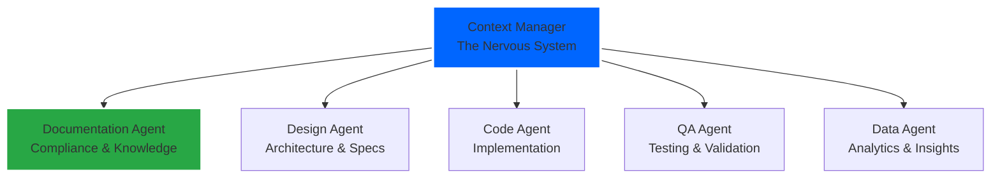

# Agent Documentation

This directory contains detailed specifications and documentation for all agents in the agent-workflow system.

## Agent Hierarchy

## Documentation Structure

Each agent has:
1. **Main Specification** - Complete agent documentation following our standard
2. **Supporting Docs** - Implementation guides, examples, patterns

## Core Agents

### 1. [Context Manager](context-manager/) ⭐
**Status**: In Development  
**Priority**: Highest  
**Documentation Level**: 2 (Enhanced)

The foundational agent that orchestrates all context flow in the system. Built using bootstrap methodology where it helps document its own development.

**Documentation**:
- [Agent Specification](context-manager/AGENT_SPECIFICATION.md) - Complete API and behavior
- [Bootstrap Guide](context-manager/BOOTSTRAP_GUIDE.md) - How it builds itself
- [Implementation Notes](context-manager/IMPLEMENTATION_NOTES.md) - Real-time learnings
- [README](context-manager/README.md) - Overview and quick start

### 2. Documentation Agent
**Status**: Design Phase  
**Priority**: High (FDA Compliance)  
**Documentation Level**: 1 (Standard)

Manages all documentation, ensuring compliance with medical device regulations and maintaining system knowledge.

### 3. Design Agent
**Status**: Planned  
**Priority**: Medium  
**Documentation Level**: 1 (Standard)

Creates system architectures, API specifications, and technical designs.

### 4. Code Agent  
**Status**: Planned  
**Priority**: Medium  
**Documentation Level**: 1 (Standard)

Implements features based on specifications, writes tests, and refactors code.

### 5. QA Agent
**Status**: Planned  
**Priority**: Medium  
**Documentation Level**: 1 (Standard)

Ensures quality through comprehensive testing and validation.

### 6. Data Agent
**Status**: Planned  
**Priority**: Low  
**Documentation Level**: 1 (Standard)

Provides analytics, insights, and performance monitoring.

## Documentation Standards

All agent documentation follows the [Agent Documentation Standard](../project-evolution-guide/07_AGENT_DOCUMENTATION_STANDARD.md):

### Documentation Levels
- **Level 0**: Minimal Viable - Basic API and purpose
- **Level 1**: Standard - Architecture and integration guides  
- **Level 2**: Enhanced - Formal specs and safety analysis
- **Level 3**: Comprehensive - Mathematical proofs and full traceability

### Required Sections
1. Overview & Purpose
2. API Specification  
3. Behavioral Characteristics
4. Integration Guide
5. Safety & Security
6. Testing Strategy
7. Monitoring & Metrics

## Implementation Timeline

### Phase 1: Foundation (Current)
- **Week 1**: Context Manager implementation
- **Week 2-3**: Documentation Agent
- **Week 4**: Design Agent

### Phase 2: Core Development
- **Week 4-5**: Code Agent
- **Week 5-6**: QA Agent
- **Week 7-8**: Integration testing

### Phase 3: Enhancement
- **Month 2**: Data Agent
- **Month 2-3**: System optimization
- **Month 3**: Production readiness

## Contributing

When adding new agent documentation:

1. **Follow the Template**: Use existing agents as examples
2. **Start at Level 0**: Build up documentation as agent develops
3. **Include Examples**: Real code snippets and use cases
4. **Document Decisions**: Use Context Manager to track why choices were made
5. **Test Everything**: Documentation should include test strategies

## Quick Links

- [Context Manager Spec](CONTEXT_MANAGER_AGENT.md) - Start here
- [Documentation Standard](../project-evolution-guide/07_AGENT_DOCUMENTATION_STANDARD.md) - Documentation guide
- [Agent Specifications Overview](../project-evolution-guide/05_AGENT_SPECIFICATIONS_EXPANDED.md) - All agents
- [Implementation Roadmap](../project-evolution-guide/02_IMPLEMENTATION_ROADMAP.md) - Development plan