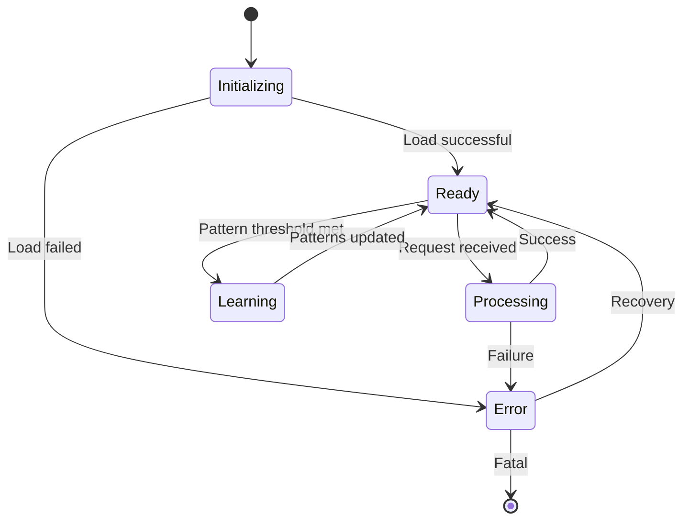
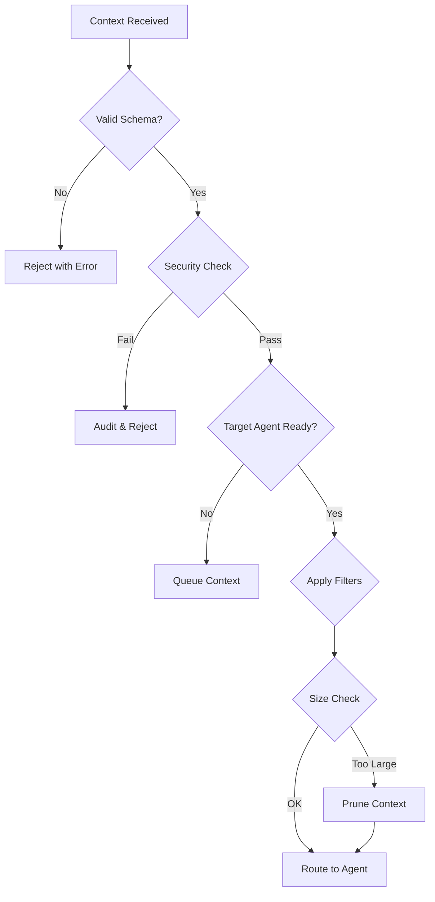

# Context Manager Agent Specification

## Overview

The Context Manager serves as the central nervous system of the agent-workflow system, orchestrating all context flow between agents, managing memory, and learning from patterns. It is the first agent built using a bootstrap approach where it helps document and improve its own development.

**Version**: 1.0  
**Status**: In Development  
**Documentation Level**: 2 (Enhanced)  
**Safety Classification**: Class B (Moderate - affects system coordination)

## Purpose & Capabilities

### Primary Purpose
Manage all context flow in the system, ensuring the right information reaches the right agent at the right time while maintaining security boundaries and optimizing token usage.

### Key Capabilities
1. **Context Routing**: Direct context between agents based on rules and patterns
2. **Memory Management**: Store, retrieve, and prune context across multiple time horizons
3. **Pattern Recognition**: Identify recurring patterns and suggest optimizations
4. **Audit Trail**: Maintain complete record for compliance and debugging
5. **Bootstrap Learning**: Improve itself by analyzing its own development

### Constraints
- Must process requests in <100ms for real-time responsiveness
- Context storage must not exceed token limits (100k tokens active)
- All operations must be auditable for FDA compliance
- Cannot modify agent code directly (only suggest improvements)

## API Specification

### Core Methods

```python
class ContextManager:
    """Central context orchestration for agent-workflow system."""
    
    def add_context(self, context: Context) -> str:
        """
        Add new context to the system.
        
        Args:
            context: Context object with required fields
            
        Returns:
            str: Unique context ID
            
        Raises:
            ValidationError: If context doesn't match schema
            StorageError: If storage fails
        """
        
    def get_context(self, context_id: str) -> Optional[Context]:
        """Retrieve context by ID."""
        
    def query_context(self, 
                     query: str, 
                     filters: Dict[str, Any] = None,
                     limit: int = 10) -> List[Context]:
        """Search contexts using natural language query."""
        
    def route_context(self, 
                     context: Context, 
                     target_agent: str) -> RouteResult:
        """Route context to specific agent with filtering."""
        
    def suggest_next_action(self) -> List[Suggestion]:
        """Generate suggestions based on patterns."""
        
    def log_decision(self, decision: str, reasoning: str) -> str:
        """Log development decision (bootstrap feature)."""
```

### Context Schema

```python
@dataclass
class Context:
    """Core context structure for all system interactions."""
    
    # Required fields
    id: str                    # UUID
    type: ContextType          # Enum: development|planning|execution|documentation
    source: str                # Agent or human identifier
    timestamp: datetime        # Creation time
    data: Dict[str, Any]      # Actual content
    
    # Optional metadata
    metadata: Dict[str, Any] = field(default_factory=dict)
    relationships: List[str] = field(default_factory=list)  # Related context IDs
    tags: List[str] = field(default_factory=list)          # Searchable tags
    ttl: Optional[int] = None                               # Time-to-live in seconds
    
    # Compliance fields
    requires_audit: bool = True
    sensitivity_level: str = "internal"  # internal|confidential|public
    
    def validate(self) -> bool:
        """Validate context against schema rules."""
```

### Error Handling

```python
class ContextError(Exception):
    """Base exception for context operations."""

class ValidationError(ContextError):
    """Context failed schema validation."""

class StorageError(ContextError):
    """Storage operation failed."""

class RoutingError(ContextError):
    """Context routing failed."""

class PatternError(ContextError):
    """Pattern detection/application failed."""
```

## Behavioral Characteristics

### State Management



### Decision Trees

**Context Routing Decision Tree**:


### Performance Characteristics

| Operation | Target Latency | Max Latency | Throughput |
|-----------|---------------|-------------|------------|
| add_context | 10ms | 50ms | 1000/sec |
| get_context | 5ms | 20ms | 5000/sec |
| query_context | 50ms | 200ms | 100/sec |
| route_context | 20ms | 100ms | 500/sec |
| pattern_detection | 100ms | 500ms | 10/sec |

## Integration Guide

### Connecting to State Machines

```python
# Integration with existing state machine
@app.route('/api/transition', methods=['POST'])
def handle_transition():
    # Extract transition data
    from_state = request.json['from_state']
    to_state = request.json['to_state']
    transition_data = request.json['data']
    
    # Create context for transition
    context = Context(
        id=str(uuid.uuid4()),
        type=ContextType.EXECUTION,
        source='state_machine',
        timestamp=datetime.now(),
        data={
            'transition': f"{from_state} → {to_state}",
            'details': transition_data
        }
    )
    
    # Add to Context Manager
    context_id = cm.add_context(context)
    
    # Route to appropriate agent based on state
    if to_state == 'PLANNING':
        cm.route_context(context, 'DesignAgent')
    elif to_state == 'SPRINT_ACTIVE':
        cm.route_context(context, 'CodeAgent')
```

### Bootstrap Integration

```python
# Context Manager documenting its own development
def implement_new_feature(feature_name: str):
    # Log the decision to implement
    cm.log_decision(
        f"Implementing {feature_name}",
        "Suggested by pattern analysis with 85% confidence"
    )
    
    # Implement feature
    # ... code ...
    
    # Log outcome
    cm.log_pattern(
        "feature_implementation",
        feature_name,
        "success" if tests_pass else "failure"
    )
    
    # Get suggestions for next feature
    suggestions = cm.suggest_next_action()
```

## Storage & Persistence

### Storage Hierarchy

```
contexts/
├── active/              # Hot contexts (in-memory + file backup)
│   └── {date}/
│       └── {context_id}.json
├── archive/             # Cold storage (compressed)
│   └── {year-month}/
│       └── {date}/
└── indices/             # Search indices
    ├── by_type.json
    ├── by_source.json
    └── patterns.json
```

### Backup Strategy

- **Continuous**: Every context write triggers backup
- **Hourly**: Full state snapshot
- **Daily**: Compressed archive with indices
- **Weekly**: Pattern analysis and cleanup

## Pattern Detection

### V1 Patterns Tracked

1. **Decision Patterns**
   - Recurring decision types
   - Decision → Outcome correlations
   - Time-based patterns

2. **Error Patterns**
   - Common error sequences
   - Error → Resolution paths
   - Prevention suggestions

3. **Workflow Patterns**
   - State transition sequences
   - Agent interaction patterns
   - Bottleneck identification

4. **Development Patterns**
   - Feature implementation success/failure
   - Code pattern effectiveness
   - Documentation gaps

### Pattern Learning Algorithm

```python
def detect_patterns(self, time_window: timedelta = timedelta(hours=24)):
    """Simple pattern detection for v1."""
    recent_contexts = self.get_contexts_since(datetime.now() - time_window)
    
    # Extract features
    features = self.extract_features(recent_contexts)
    
    # Count frequencies
    pattern_counts = Counter(features)
    
    # Identify significant patterns (>3 occurrences)
    significant_patterns = {
        pattern: count 
        for pattern, count in pattern_counts.items() 
        if count >= 3
    }
    
    # Generate suggestions
    return self.patterns_to_suggestions(significant_patterns)
```

## Monitoring & Metrics

### Key Metrics

```python
@dataclass
class ContextMetrics:
    # Performance
    avg_response_time: float
    p95_response_time: float
    throughput: float
    
    # Storage
    total_contexts: int
    active_contexts: int
    storage_size_mb: float
    
    # Patterns
    patterns_detected: int
    suggestions_generated: int
    suggestion_acceptance_rate: float
    
    # Health
    error_rate: float
    last_error: Optional[str]
    uptime_seconds: float
```

### Monitoring Endpoints

```python
@app.route('/api/context/metrics')
def get_metrics():
    """Real-time metrics endpoint."""
    return jsonify(cm.get_metrics())

@app.route('/api/context/health')
def health_check():
    """Health check for monitoring."""
    return jsonify({
        'status': 'healthy' if cm.is_healthy() else 'unhealthy',
        'checks': cm.run_health_checks()
    })
```

## Safety & Security

### Access Control

```python
class ContextSecurity:
    """Security boundaries for context access."""
    
    AGENT_PERMISSIONS = {
        'DesignAgent': ['read_all', 'write_design'],
        'CodeAgent': ['read_design', 'read_test', 'write_code'],
        'QAAgent': ['read_all', 'write_test'],
        'DocumentationAgent': ['read_all', 'write_docs'],
        'DataAgent': ['read_all']  # No write
    }
    
    def can_access(self, agent: str, context: Context, operation: str) -> bool:
        """Check if agent can perform operation on context."""
```

### Audit Requirements

Every context operation generates an audit entry:

```json
{
    "timestamp": "2024-01-20T10:30:00Z",
    "operation": "route_context",
    "source": "ContextManager",
    "target": "CodeAgent",
    "context_id": "123e4567-e89b-12d3-a456-426614174000",
    "success": true,
    "duration_ms": 15
}
```

## Testing Strategy

### Unit Tests

```python
# tests/test_context_manager.py
class TestContextManager:
    def test_add_context_valid(self):
        """Test adding valid context."""
        
    def test_add_context_invalid_schema(self):
        """Test schema validation."""
        
    def test_pattern_detection_minimum_threshold(self):
        """Test pattern detection requires minimum occurrences."""
        
    def test_bootstrap_decision_logging(self):
        """Test self-documentation features."""
```

### Integration Tests

```python
# tests/test_context_integration.py
class TestContextIntegration:
    def test_state_machine_integration(self):
        """Test context flows with state transitions."""
        
    def test_multi_agent_routing(self):
        """Test routing between multiple agents."""
        
    def test_storage_persistence(self):
        """Test contexts persist across restarts."""
```

### Performance Tests

```python
# tests/test_context_performance.py
class TestContextPerformance:
    def test_throughput_1000_per_second(self):
        """Verify system handles 1000 contexts/second."""
        
    def test_query_latency_under_200ms(self):
        """Verify query response time."""
        
    def test_memory_usage_under_512mb(self):
        """Verify memory constraints."""
```

## Development Roadmap

### Week 1 (Current)
- [x] Design document
- [ ] Schema implementation
- [ ] Basic storage
- [ ] Simple patterns
- [ ] API integration

### Week 2
- [ ] Advanced patterns
- [ ] WebSocket support
- [ ] Performance optimization
- [ ] Enhanced monitoring

### Week 3
- [ ] Redis integration
- [ ] Distributed support
- [ ] Advanced security
- [ ] Production hardening

### Future Enhancements
- Vector similarity search
- ML-based pattern detection
- Predictive routing
- Cross-project learning

## Change Log

### Version 1.0 (In Development)
- Initial implementation
- Bootstrap features
- Basic pattern detection
- JSON storage backend
- Flask integration

## Dependencies

### Required
- Python 3.9+
- Flask 2.0+
- dataclasses
- typing_extensions

### Optional (Future)
- Redis 6.0+ (Week 2)
- NumPy (Advanced patterns)
- PostgreSQL (Historical storage)

## References

- [Context Engineering Principles](../research/simple/docs/CONTEXT_ENGINEERING_INSIGHTS.md)
- [Agent Communication Protocol](../research/simple/docs/CONTEXT_DEPENDENCY_MAP.md)
- [Bootstrap Methodology](../research/simple/architecture/bootstrapping_analysis.md)
- [Documentation Standard](../project-evolution-guide/07_AGENT_DOCUMENTATION_STANDARD.md)