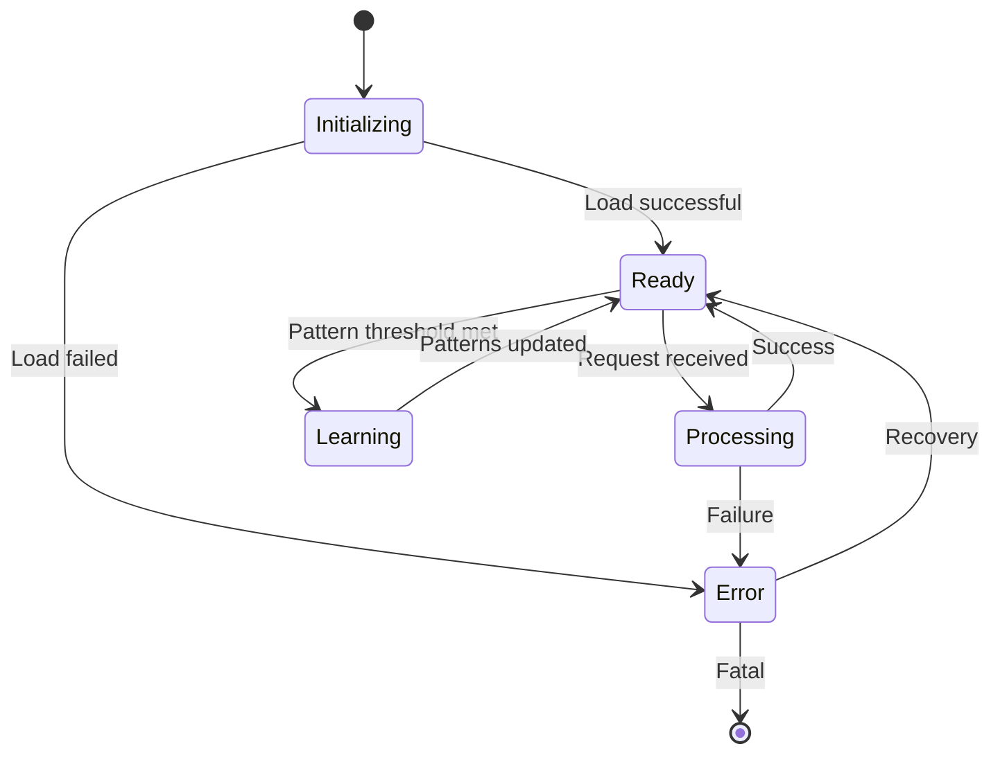
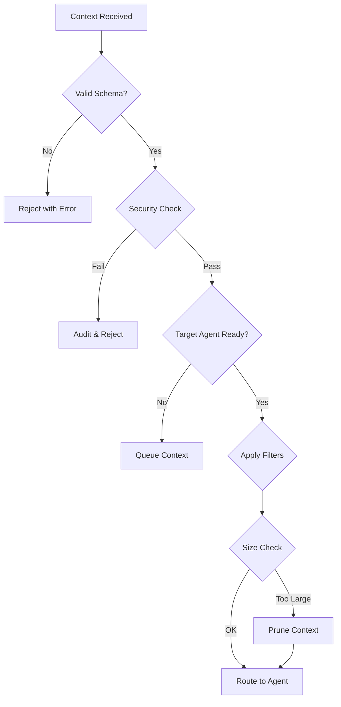
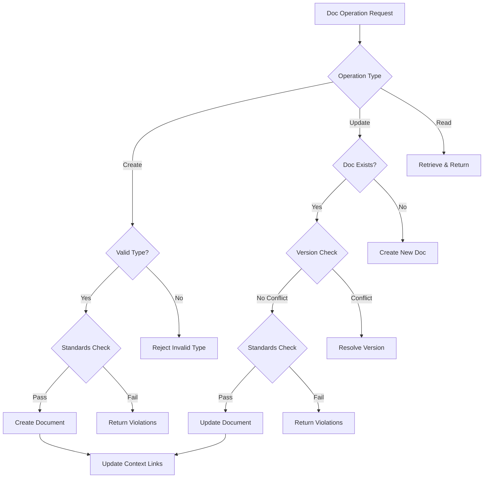

# Context Manager Agent Specification

## Overview

The Context Manager serves as the central nervous system of the agent-workflow system, orchestrating all context flow between agents, managing memory, and learning from patterns. It is the first agent built using a bootstrap approach where it helps document and improve its own development.

**Version**: 1.0  
**Status**: In Development  
**Documentation Level**: 2 (Enhanced)  
**Safety Classification**: Class B (Moderate - affects system coordination)

## Purpose & Capabilities

### Primary Purpose
Serve as the central nervous system for context flow and documentation gateway, ensuring the right information reaches the right agent at the right time, while maintaining consistency across all documentation through intelligent management and pattern-based updates.

### Key Capabilities
1. **Context Routing**: Direct context between agents based on rules and patterns
2. **Memory Management**: Store, retrieve, and prune context across multiple time horizons
3. **Pattern Recognition**: Identify recurring patterns and suggest optimizations
4. **Audit Trail**: Maintain complete record for compliance and debugging
5. **Bootstrap Learning**: Improve itself by analyzing its own development
6. **Documentation Gateway**: Sole manager of all documentation operations, ensuring consistency

### Constraints
- Must process simple requests within 2 seconds for interactive use
- Complex operations (pattern detection, bulk updates) may take up to 10 minutes
- Context storage must not exceed token limits (1k contexts active initially)
- All operations must be auditable for FDA compliance
- Cannot modify agent code directly (only suggest improvements)

## API Specification

### Core Methods

```python
class ContextManager:
    """Central context orchestration for agent-workflow system."""
    
    def add_context(self, context: Context) -> str:
        """
        Add new context to the system.
        
        Args:
            context: Context object with required fields
            
        Returns:
            str: Unique context ID
            
        Raises:
            ValidationError: If context doesn't match schema
            StorageError: If storage fails
        """
        
    def get_context(self, context_id: str) -> Optional[Context]:
        """Retrieve context by ID."""
        
    def query_context(self, 
                     query: str, 
                     filters: Dict[str, Any] = None,
                     limit: int = 10) -> List[Context]:
        """Search contexts using natural language query."""
        
    def route_context(self, 
                     context: Context, 
                     target_agent: str) -> RouteResult:
        """Route context to specific agent with filtering."""
        
    def suggest_next_action(self) -> List[Suggestion]:
        """Generate suggestions based on patterns."""
        
    def log_decision(self, decision: str, reasoning: str) -> str:
        """Log development decision (bootstrap feature)."""
    
    # Documentation Gateway Methods
    def create_doc(self, doc_type: DocumentType, content: str, 
                  metadata: Dict[str, Any]) -> str:
        """
        Create new documentation with proper structure.
        
        Args:
            doc_type: Type of documentation (README, API_SPEC, etc.)
            content: Initial document content
            metadata: Additional metadata (author, tags, etc.)
            
        Returns:
            str: Document ID/path
        """
    
    def update_doc(self, doc_path: str, updates: Dict[str, str]) -> bool:
        """
        Update documentation sections intelligently.
        
        Args:
            doc_path: Path to document
            updates: Dict of section -> new content
            
        Returns:
            bool: Success status
        """
    
    def read_doc(self, doc_path: str) -> Document:
        """Read documentation with enhanced metadata."""
    
    def search_docs(self, query: str, doc_types: List[DocumentType] = None) -> List[Document]:
        """Search across all documentation."""
    
    def link_docs(self, doc1: str, doc2: str, relationship: str) -> bool:
        """Create relationships between documents."""
    
    def suggest_doc_updates(self, code_changes: List[Dict[str, Any]]) -> List[Suggestion]:
        """Suggest documentation updates based on code changes."""
    
    def ensure_doc_standards(self, doc_content: str, doc_type: DocumentType) -> ValidationResult:
        """Validate documentation meets standards."""
```

### Context Schema

```python
@dataclass
class Context:
    """Core context structure for all system interactions."""
    
    # Required fields
    id: str                    # UUID
    type: ContextType          # Enum: development|planning|execution|documentation
    source: str                # Agent or human identifier
    timestamp: datetime        # Creation time
    data: Dict[str, Any]      # Actual content
    
    # Optional metadata
    metadata: Dict[str, Any] = field(default_factory=dict)
    relationships: List[str] = field(default_factory=list)  # Related context IDs
    tags: List[str] = field(default_factory=list)          # Searchable tags
    ttl: Optional[int] = None                               # Time-to-live in seconds
    
    # Compliance fields
    requires_audit: bool = True
    sensitivity_level: str = "internal"  # internal|confidential|public
    
    def validate(self) -> bool:
        """Validate context against schema rules."""
```

### Document Schema

```python
from enum import Enum

class DocumentType(Enum):
    """Types of documentation managed by Context Manager."""
    README = "readme"
    API_SPEC = "api_spec"
    ARCHITECTURE = "architecture"
    DECISION_RECORD = "decision_record"
    WORKFLOW = "workflow"
    AGENT_SPEC = "agent_spec"
    USER_GUIDE = "user_guide"
    CHANGELOG = "changelog"
    MEETING_NOTES = "meeting_notes"
    TEST_PLAN = "test_plan"

@dataclass
class Document:
    """Mutable documentation artifact managed by Context Manager."""
    
    # Required fields
    path: str                    # File path (e.g., "docs/README.md")
    doc_type: DocumentType       # Type of documentation
    content: str                 # Current content
    version: int                 # Version number
    last_modified: datetime      # Last update timestamp
    modified_by: str             # Agent/human identifier
    
    # Relationships
    linked_contexts: List[str] = field(default_factory=list)   # Related context IDs
    linked_docs: List[str] = field(default_factory=list)       # Related document paths
    
    # Metadata
    metadata: Dict[str, Any] = field(default_factory=dict)
    sections: Dict[str, str] = field(default_factory=dict)     # Section mapping
    tags: List[str] = field(default_factory=list)
    
    # Quality metrics
    completeness_score: float = 0.0  # 0-1 score
    consistency_score: float = 0.0    # 0-1 score
    last_validated: Optional[datetime] = None
```

### Error Handling

```python
class ContextError(Exception):
    """Base exception for context operations."""

class ValidationError(ContextError):
    """Context failed schema validation."""

class StorageError(ContextError):
    """Storage operation failed."""

class RoutingError(ContextError):
    """Context routing failed."""

class PatternError(ContextError):
    """Pattern detection/application failed."""

class DocumentError(ContextError):
    """Document operation failed."""

class DocumentValidationError(DocumentError):
    """Document failed standards validation."""

class DocumentVersionError(DocumentError):
    """Document version conflict."""
```

## Behavioral Characteristics

### State Management



### Decision Trees

**Context Routing Decision Tree**:


**Documentation Gateway Decision Tree**:


### Performance Characteristics

| Operation | Target Latency | Max Latency | Throughput |
|-----------|---------------|-------------|------------|
| add_context | 100ms | 2s | 10/sec |
| get_context | 50ms | 1s | 20/sec |
| query_context | 500ms | 2s | 5/sec |
| create_doc | 200ms | 3s | 5/sec |
| update_doc | 300ms | 3s | 5/sec |
| search_docs | 500ms | 2s | 5/sec |
| route_context | 20ms | 100ms | 500/sec |
| pattern_detection | 100ms | 500ms | 10/sec |

## Integration Guide

### Connecting to State Machines

```python
# Integration with existing state machine
@app.route('/api/transition', methods=['POST'])
def handle_transition():
    # Extract transition data
    from_state = request.json['from_state']
    to_state = request.json['to_state']
    transition_data = request.json['data']
    
    # Create context for transition
    context = Context(
        id=str(uuid.uuid4()),
        type=ContextType.EXECUTION,
        source='state_machine',
        timestamp=datetime.now(),
        data={
            'transition': f"{from_state} → {to_state}",
            'details': transition_data
        }
    )
    
    # Add to Context Manager
    context_id = cm.add_context(context)
    
    # Route to appropriate agent based on state
    if to_state == 'PLANNING':
        cm.route_context(context, 'DesignAgent')
    elif to_state == 'SPRINT_ACTIVE':
        cm.route_context(context, 'CodeAgent')
```

### Bootstrap Integration

```python
# Context Manager documenting its own development
def implement_new_feature(feature_name: str):
    # Log the decision to implement
    cm.log_decision(
        f"Implementing {feature_name}",
        "Suggested by pattern analysis with 85% confidence"
    )
    
    # Implement feature
    # ... code ...
    
    # Log outcome
    cm.log_pattern(
        "feature_implementation",
        feature_name,
        "success" if tests_pass else "failure"
    )
    
    # Get suggestions for next feature
    suggestions = cm.suggest_next_action()
```

## Storage & Persistence

### Storage Hierarchy

```
contexts/                   # Immutable event records
├── active/                 # Hot contexts (in-memory + file backup)
│   └── {date}/
│       └── {context_id}.json
├── archive/                # Cold storage (compressed)
│   └── {year-month}/
│       └── {date}/
└── indices/                # Search indices
    ├── by_type.json
    ├── by_source.json
    └── patterns.json

documents/                  # Mutable documentation
├── current/                # Current versions
│   ├── README.md.json
│   ├── CHANGELOG.md.json
│   ├── api/
│   │   └── openapi.json
│   └── guides/
│       └── user-guide.json
├── versions/               # Version history
│   └── {doc_path}/
│       └── v{version}.json
└── indices/                # Document search indices
    ├── by_type.json
    ├── by_tag.json
    └── relationships.json
```

### Backup Strategy

- **Continuous**: Every context write triggers backup
- **Hourly**: Full state snapshot
- **Daily**: Compressed archive with indices
- **Weekly**: Pattern analysis and cleanup

## Pattern Detection

### V1 Patterns Tracked

1. **Decision Patterns**
   - Recurring decision types
   - Decision → Outcome correlations
   - Time-based patterns

2. **Error Patterns**
   - Common error sequences
   - Error → Resolution paths
   - Prevention suggestions

3. **Workflow Patterns**
   - State transition sequences
   - Agent interaction patterns
   - Bottleneck identification

4. **Development Patterns**
   - Feature implementation success/failure
   - Code pattern effectiveness
   - Documentation gaps

### Pattern Learning Algorithm

```python
def detect_patterns(self, time_window: timedelta = timedelta(hours=24)):
    """Simple pattern detection for v1."""
    recent_contexts = self.get_contexts_since(datetime.now() - time_window)
    
    # Extract features
    features = self.extract_features(recent_contexts)
    
    # Count frequencies
    pattern_counts = Counter(features)
    
    # Identify significant patterns (>3 occurrences)
    significant_patterns = {
        pattern: count 
        for pattern, count in pattern_counts.items() 
        if count >= 3
    }
    
    # Generate suggestions
    return self.patterns_to_suggestions(significant_patterns)
```

## Monitoring & Metrics

### Key Metrics

```python
@dataclass
class ContextMetrics:
    # Performance
    avg_response_time: float
    p95_response_time: float
    throughput: float
    
    # Storage
    total_contexts: int
    active_contexts: int
    storage_size_mb: float
    
    # Patterns
    patterns_detected: int
    suggestions_generated: int
    suggestion_acceptance_rate: float
    
    # Documentation
    total_documents: int
    doc_versions_tracked: int
    avg_doc_consistency_score: float
    doc_update_frequency: float
    
    # Health
    error_rate: float
    last_error: Optional[str]
    uptime_seconds: float
```

### Monitoring Endpoints

```python
@app.route('/api/context/metrics')
def get_metrics():
    """Real-time metrics endpoint."""
    return jsonify(cm.get_metrics())

@app.route('/api/context/health')
def health_check():
    """Health check for monitoring."""
    return jsonify({
        'status': 'healthy' if cm.is_healthy() else 'unhealthy',
        'checks': cm.run_health_checks()
    })
```

## Safety & Security

### Access Control

```python
class ContextSecurity:
    """Security boundaries for context access."""
    
    AGENT_PERMISSIONS = {
        'DesignAgent': ['read_all', 'write_design', 'read_docs'],
        'CodeAgent': ['read_design', 'read_test', 'write_code', 'read_docs'],
        'QAAgent': ['read_all', 'write_test', 'read_docs'],
        'DocumentationAgent': ['read_all', 'write_docs', 'manage_docs'],
        'DataAgent': ['read_all', 'read_docs'],  # No write
        'SwissArmyAgent': ['read_all', 'write_code', 'request_doc_update']
    }
    
    # Documentation permissions (only through Context Manager)
    DOC_PERMISSIONS = {
        'create': ['DocumentationAgent', 'ContextManager'],
        'update': ['DocumentationAgent', 'ContextManager'],
        'delete': ['ContextManager'],  # Only CM can delete
        'version': ['ContextManager'],  # Only CM manages versions
    }
    
    def can_access(self, agent: str, context: Context, operation: str) -> bool:
        """Check if agent can perform operation on context."""
```

### Audit Requirements

Every operation generates an audit entry:

**Context Operations:**
```json
{
    "timestamp": "2024-01-20T10:30:00Z",
    "operation": "route_context",
    "source": "ContextManager",
    "target": "CodeAgent",
    "context_id": "123e4567-e89b-12d3-a456-426614174000",
    "success": true,
    "duration_ms": 15
}
```

**Documentation Operations:**
```json
{
    "timestamp": "2024-01-20T10:30:15Z",
    "operation": "update_doc",
    "source": "SwissArmyAgent",
    "document": "docs/README.md",
    "version": 12,
    "changes": {
        "sections_modified": ["installation", "usage"],
        "lines_changed": 45
    },
    "validation_passed": true,
    "success": true,
    "duration_ms": 320
}
```

## Testing Strategy

### Unit Tests

```python
# tests/test_context_manager.py
class TestContextManager:
    def test_add_context_valid(self):
        """Test adding valid context."""
        
    def test_add_context_invalid_schema(self):
        """Test schema validation."""
        
    def test_pattern_detection_minimum_threshold(self):
        """Test pattern detection requires minimum occurrences."""
        
    def test_bootstrap_decision_logging(self):
        """Test self-documentation features."""

# tests/test_document_manager.py
class TestDocumentManager:
    def test_create_doc_with_validation(self):
        """Test document creation with standards validation."""
        
    def test_update_doc_version_control(self):
        """Test document updates create proper versions."""
        
    def test_doc_context_linking(self):
        """Test bidirectional linking between docs and contexts."""
        
    def test_suggest_doc_updates_from_code_changes(self):
        """Test intelligent documentation suggestions."""
        
    def test_concurrent_doc_updates(self):
        """Test handling concurrent documentation updates."""
```

### Integration Tests

```python
# tests/test_context_integration.py
class TestContextIntegration:
    def test_state_machine_integration(self):
        """Test context flows with state transitions."""
        
    def test_multi_agent_routing(self):
        """Test routing between multiple agents."""
        
    def test_storage_persistence(self):
        """Test contexts persist across restarts."""
        
    def test_doc_gateway_enforcement(self):
        """Test all doc operations go through Context Manager."""
```

### Performance Tests

```python
# tests/test_context_performance.py
class TestContextPerformance:
    def test_throughput_10_per_second(self):
        """Verify system handles 10 contexts/second sustainably."""
        
    def test_query_latency_under_2_seconds(self):
        """Verify query response time for simple searches."""
        
    def test_complex_operations_timeout(self):
        """Verify complex operations complete within 10 minutes."""
        
    def test_memory_usage_under_512mb(self):
        """Verify memory constraints."""
        
    def test_doc_operations_performance(self):
        """Verify documentation operations meet SLA."""
```

## Development Roadmap

### Week 1 (Current)
- [x] Design document
- [ ] Schema implementation (Context + Document)
- [ ] Basic storage (dual structure)
- [ ] Simple patterns
- [ ] API integration
- [ ] Documentation gateway foundation

### Week 2
- [ ] Advanced patterns
- [ ] WebSocket support
- [ ] Document versioning system
- [ ] Documentation standards validation
- [ ] Performance optimization
- [ ] Enhanced monitoring

### Week 3
- [ ] Redis integration
- [ ] Documentation search & linking
- [ ] Intelligent suggestion engine
- [ ] Advanced security
- [ ] Production hardening

### Future Enhancements
- Vector similarity search
- ML-based pattern detection
- Predictive routing
- Cross-project learning

## Change Log

### Version 1.0 (In Development)
- Initial implementation
- Bootstrap features
- Basic pattern detection
- JSON storage backend
- Flask integration
- Documentation gateway capabilities
- Document versioning and standards

## Dependencies

### Required
- Python 3.9+
- Flask 2.0+
- dataclasses
- typing_extensions

### Optional (Future)
- Redis 6.0+ (Week 2)
- NumPy (Advanced patterns)
- PostgreSQL (Historical storage)

## References

- [Context Engineering Principles](../research/simple/docs/CONTEXT_ENGINEERING_INSIGHTS.md)
- [Agent Communication Protocol](../research/simple/docs/CONTEXT_DEPENDENCY_MAP.md)
- [Bootstrap Methodology](../research/simple/architecture/bootstrapping_analysis.md)
- [Documentation Standard](../project-evolution-guide/07_AGENT_DOCUMENTATION_STANDARD.md)