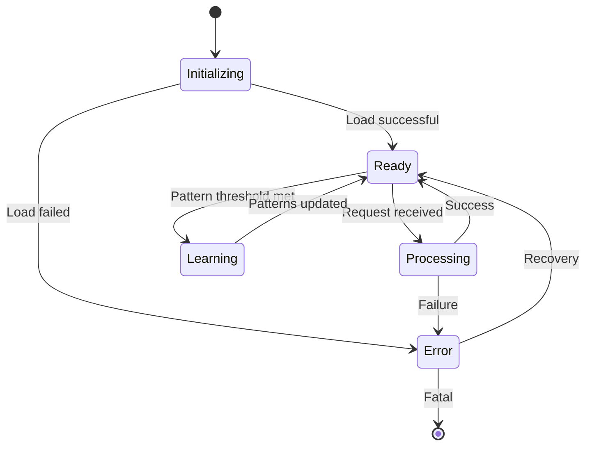
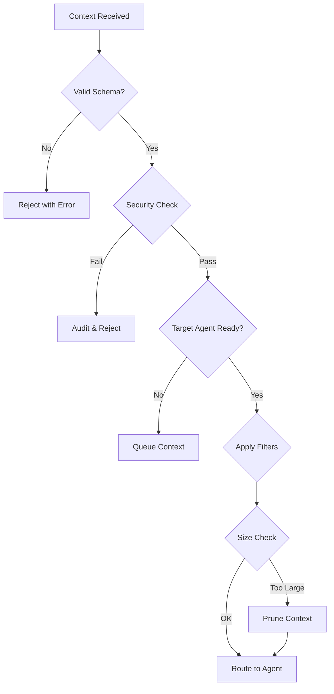
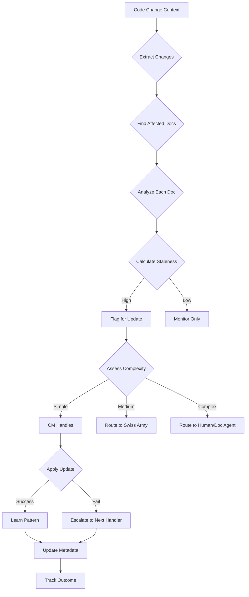

# Context Manager Agent Specification

## Overview

The Context Manager serves as the central nervous system of the agent-workflow system, orchestrating all context flow between agents, managing memory, and learning from patterns. It is the first agent built using a bootstrap approach where it helps document and improve its own development.

**Version**: 1.0  
**Status**: In Development  
**Documentation Level**: 2 (Enhanced)  
**Safety Classification**: Class B (Moderate - affects system coordination)

## Purpose & Capabilities

### Primary Purpose
Serve as the central nervous system for context flow and documentation intelligence hub, ensuring the right information reaches the right agent at the right time, while learning from existing documentation patterns to suggest and coordinate updates intelligently.

### Key Capabilities
1. **Context Routing**: Direct context between agents based on rules and patterns
2. **Memory Management**: Store, retrieve, and prune context across multiple time horizons
3. **Pattern Recognition**: Identify recurring patterns and suggest optimizations
4. **Audit Trail**: Maintain complete record for compliance and debugging
5. **Bootstrap Learning**: Improve itself by analyzing its own development
6. **Documentation Intelligence**: Learn patterns, detect staleness, and coordinate documentation updates

### Constraints
- Must process simple requests within 2 seconds for interactive use
- Complex operations (pattern detection, bulk updates) may take up to 10 minutes
- Context storage must not exceed token limits (1k contexts active initially)
- All operations must be auditable for FDA compliance
- Cannot modify agent code directly (only suggest improvements)

## API Specification

### Core Methods

```python
class ContextManager:
    """Central context orchestration for agent-workflow system."""
    
    def add_context(self, context: Context) -> str:
        """
        Add new context to the system.
        
        Args:
            context: Context object with required fields
            
        Returns:
            str: Unique context ID
            
        Raises:
            ValidationError: If context doesn't match schema
            StorageError: If storage fails
        """
        
    def get_context(self, context_id: str) -> Optional[Context]:
        """Retrieve context by ID."""
        
    def query_context(self, 
                     query: str, 
                     filters: Dict[str, Any] = None,
                     limit: int = 10) -> List[Context]:
        """Search contexts using natural language query."""
        
    def route_context(self, 
                     context: Context, 
                     target_agent: str) -> RouteResult:
        """Route context to specific agent with filtering."""
        
    def suggest_next_action(self) -> List[Suggestion]:
        """Generate suggestions based on patterns."""
        
    def log_decision(self, decision: str, reasoning: str) -> str:
        """Log development decision (bootstrap feature)."""
    
    # Documentation Intelligence Methods
    def analyze_doc(self, doc_path: str) -> DocMetadata:
        """
        Analyze existing documentation and extract patterns.
        
        Args:
            doc_path: Path to markdown file
            
        Returns:
            DocMetadata: Metadata with patterns, quality scores, etc.
        """
    
    def learn_doc_patterns(self, doc_paths: List[str] = None) -> DocPattern:
        """
        Learn documentation patterns from existing files.
        
        Args:
            doc_paths: Specific docs to learn from (None = all docs)
            
        Returns:
            DocPattern: Learned patterns for the project
        """
    
    def suggest_doc_updates(self, context: Context) -> List[SuggestedUpdate]:
        """
        Suggest documentation updates based on code changes.
        
        Args:
            context: Context containing code change information
            
        Returns:
            List[SuggestedUpdate]: Prioritized update suggestions
        """
    
    def apply_simple_update(self, doc_path: str, update: SuggestedUpdate) -> bool:
        """
        Apply simple documentation updates directly.
        
        Args:
            doc_path: Path to document
            update: Update to apply (must be simple type)
            
        Returns:
            bool: Success status
        """
    
    def calculate_doc_quality(self, doc_path: str) -> Dict[str, float]:
        """
        Calculate documentation quality metrics.
        
        Returns:
            Dict with scores: completeness, consistency, staleness, clarity
        """
    
    def route_doc_task(self, task: DocTask) -> str:
        """
        Route documentation task to appropriate handler.
        
        Returns:
            str: Handler ID ('context_manager', 'swiss_army_agent', 'human', etc.)
        """
```

### Context Schema

```python
@dataclass
class Context:
    """Core context structure for all system interactions."""
    
    # Required fields
    id: str                    # UUID
    type: ContextType          # Enum: development|planning|execution|documentation
    source: str                # Agent or human identifier
    timestamp: datetime        # Creation time
    data: Dict[str, Any]      # Actual content
    
    # Optional metadata
    metadata: Dict[str, Any] = field(default_factory=dict)
    relationships: List[str] = field(default_factory=list)  # Related context IDs
    tags: List[str] = field(default_factory=list)          # Searchable tags
    ttl: Optional[int] = None                               # Time-to-live in seconds
    
    # Compliance fields
    requires_audit: bool = True
    sensitivity_level: str = "internal"  # internal|confidential|public
    
    def validate(self) -> bool:
        """Validate context against schema rules."""
```

### Documentation Intelligence Schema

```python
@dataclass
class DocMetadata:
    """Lightweight metadata for existing documentation files."""
    
    # File reference
    path: str                       # Path to actual .md file
    doc_type: str                   # Inferred type (readme, api_spec, etc.)
    last_analyzed: datetime         # When we last analyzed this doc
    
    # Intelligence data
    patterns_detected: 'DocPattern' # Learned patterns from this doc
    quality_scores: Dict[str, float] = field(default_factory=dict)
    staleness_indicators: List[str] = field(default_factory=list)
    
    # Relationships
    linked_contexts: List[str] = field(default_factory=list)    # Related events
    linked_docs: List[str] = field(default_factory=list)        # Related docs
    dependencies: Dict[str, List[str]] = field(default_factory=dict)  # Code dependencies
    
    # Update tracking
    update_history: List['DocUpdate'] = field(default_factory=list)
    pending_updates: List['SuggestedUpdate'] = field(default_factory=list)

@dataclass
class SuggestedUpdate:
    """Pending documentation update suggestion."""
    suggested_at: datetime
    trigger_contexts: List[str]         # Contexts suggesting this update
    section: str                        # Section to update
    update_type: str                    # 'addition', 'modification', 'deletion'
    confidence: float                   # 0.0-1.0
    suggested_content: Optional[str]    # For simple updates
    complexity: str                     # 'simple', 'medium', 'complex'
    suggested_handler: str              # Who should handle this
```

### Error Handling

```python
class ContextError(Exception):
    """Base exception for context operations."""

class ValidationError(ContextError):
    """Context failed schema validation."""

class StorageError(ContextError):
    """Storage operation failed."""

class RoutingError(ContextError):
    """Context routing failed."""

class PatternError(ContextError):
    """Pattern detection/application failed."""

class DocIntelligenceError(ContextError):
    """Documentation intelligence operation failed."""

class PatternLearningError(DocIntelligenceError):
    """Failed to learn documentation patterns."""

class UpdateRoutingError(DocIntelligenceError):
    """Failed to route documentation update."""
```

## Behavioral Characteristics

### State Management



### Decision Trees

**Context Routing Decision Tree**:


**Documentation Intelligence Decision Tree**:


### Performance Characteristics

| Operation | Target Latency | Max Latency | Throughput |
|-----------|---------------|-------------|------------|
| add_context | 100ms | 2s | 10/sec |
| get_context | 50ms | 1s | 20/sec |
| query_context | 500ms | 2s | 5/sec |
| analyze_doc | 200ms | 3s | 5/sec |
| learn_patterns | 2s | 30s | 1/sec |
| suggest_updates | 500ms | 5s | 5/sec |
| apply_simple_update | 300ms | 2s | 5/sec |
| route_context | 20ms | 100ms | 500/sec |
| pattern_detection | 100ms | 500ms | 10/sec |

## Integration Guide

### Connecting to State Machines

```python
# Integration with existing state machine
@app.route('/api/transition', methods=['POST'])
def handle_transition():
    # Extract transition data
    from_state = request.json['from_state']
    to_state = request.json['to_state']
    transition_data = request.json['data']
    
    # Create context for transition
    context = Context(
        id=str(uuid.uuid4()),
        type=ContextType.EXECUTION,
        source='state_machine',
        timestamp=datetime.now(),
        data={
            'transition': f"{from_state} → {to_state}",
            'details': transition_data
        }
    )
    
    # Add to Context Manager
    context_id = cm.add_context(context)
    
    # Route to appropriate agent based on state
    if to_state == 'PLANNING':
        cm.route_context(context, 'DesignAgent')
    elif to_state == 'SPRINT_ACTIVE':
        cm.route_context(context, 'CodeAgent')
```

### Bootstrap Integration

```python
# Context Manager documenting its own development
def implement_new_feature(feature_name: str):
    # Log the decision to implement
    cm.log_decision(
        f"Implementing {feature_name}",
        "Suggested by pattern analysis with 85% confidence"
    )
    
    # Implement feature
    # ... code ...
    
    # Log outcome
    cm.log_pattern(
        "feature_implementation",
        feature_name,
        "success" if tests_pass else "failure"
    )
    
    # Get suggestions for next feature
    suggestions = cm.suggest_next_action()
```

## Storage & Persistence

### Storage Hierarchy

```
contexts/                   # Immutable event records
├── active/                 # Hot contexts (in-memory + file backup)
│   └── {date}/
│       └── {context_id}.json
├── archive/                # Cold storage (compressed)
│   └── {year-month}/
│       └── {date}/
└── indices/                # Search indices
    ├── by_type.json
    ├── by_source.json
    └── patterns.json

documents/                  # Mutable documentation
├── current/                # Current versions
│   ├── README.md.json
│   ├── CHANGELOG.md.json
│   ├── api/
│   │   └── openapi.json
│   └── guides/
│       └── user-guide.json
├── versions/               # Version history
│   └── {doc_path}/
│       └── v{version}.json
└── indices/                # Document search indices
    ├── by_type.json
    ├── by_tag.json
    └── relationships.json
```

### Backup Strategy

- **Continuous**: Every context write triggers backup
- **Hourly**: Full state snapshot
- **Daily**: Compressed archive with indices
- **Weekly**: Pattern analysis and cleanup

## Pattern Detection

### V1 Patterns Tracked

1. **Decision Patterns**
   - Recurring decision types
   - Decision → Outcome correlations
   - Time-based patterns

2. **Error Patterns**
   - Common error sequences
   - Error → Resolution paths
   - Prevention suggestions

3. **Workflow Patterns**
   - State transition sequences
   - Agent interaction patterns
   - Bottleneck identification

4. **Development Patterns**
   - Feature implementation success/failure
   - Code pattern effectiveness
   - Documentation gaps

### Pattern Learning Algorithm

```python
def detect_patterns(self, time_window: timedelta = timedelta(hours=24)):
    """Simple pattern detection for v1."""
    recent_contexts = self.get_contexts_since(datetime.now() - time_window)
    
    # Extract features
    features = self.extract_features(recent_contexts)
    
    # Count frequencies
    pattern_counts = Counter(features)
    
    # Identify significant patterns (>3 occurrences)
    significant_patterns = {
        pattern: count 
        for pattern, count in pattern_counts.items() 
        if count >= 3
    }
    
    # Generate suggestions
    return self.patterns_to_suggestions(significant_patterns)
```

## Monitoring & Metrics

### Key Metrics

```python
@dataclass
class ContextMetrics:
    # Performance
    avg_response_time: float
    p95_response_time: float
    throughput: float
    
    # Storage
    total_contexts: int
    active_contexts: int
    storage_size_mb: float
    
    # Patterns
    patterns_detected: int
    suggestions_generated: int
    suggestion_acceptance_rate: float
    
    # Documentation
    total_documents: int
    doc_versions_tracked: int
    avg_doc_consistency_score: float
    doc_update_frequency: float
    
    # Health
    error_rate: float
    last_error: Optional[str]
    uptime_seconds: float
```

### Monitoring Endpoints

```python
@app.route('/api/context/metrics')
def get_metrics():
    """Real-time metrics endpoint."""
    return jsonify(cm.get_metrics())

@app.route('/api/context/health')
def health_check():
    """Health check for monitoring."""
    return jsonify({
        'status': 'healthy' if cm.is_healthy() else 'unhealthy',
        'checks': cm.run_health_checks()
    })
```

## Safety & Security

### Access Control

```python
class ContextSecurity:
    """Security boundaries for context access."""
    
    AGENT_PERMISSIONS = {
        'DesignAgent': ['read_all', 'write_design', 'read_docs'],
        'CodeAgent': ['read_design', 'read_test', 'write_code', 'read_docs'],
        'QAAgent': ['read_all', 'write_test', 'read_docs'],
        'DocumentationAgent': ['read_all', 'write_docs', 'manage_docs'],
        'DataAgent': ['read_all', 'read_docs'],  # No write
        'SwissArmyAgent': ['read_all', 'write_code', 'request_doc_update']
    }
    
    # Documentation intelligence permissions
    DOC_PERMISSIONS = {
        'analyze': ['all'],  # Any agent can request analysis
        'suggest_updates': ['all'],  # Any agent can get suggestions
        'apply_simple_update': ['ContextManager'],  # Only CM for simple updates
        'request_complex_update': ['all'],  # Any agent can request
        'learn_patterns': ['ContextManager'],  # Only CM learns patterns
        'override_routing': ['human'],  # Only humans can override routing
    }
    
    def can_access(self, agent: str, context: Context, operation: str) -> bool:
        """Check if agent can perform operation on context."""
```

### Audit Requirements

Every operation generates an audit entry:

**Context Operations:**
```json
{
    "timestamp": "2024-01-20T10:30:00Z",
    "operation": "route_context",
    "source": "ContextManager",
    "target": "CodeAgent",
    "context_id": "123e4567-e89b-12d3-a456-426614174000",
    "success": true,
    "duration_ms": 15
}
```

**Documentation Intelligence Operations:**
```json
{
    "timestamp": "2024-01-20T10:30:15Z",
    "operation": "suggest_doc_update",
    "source": "ContextManager",
    "trigger_context": "123e4567-e89b-12d3-a456-426614174000",
    "document": "docs/README.md",
    "update_type": "api_addition",
    "complexity": "medium",
    "confidence": 0.85,
    "suggested_handler": "swiss_army_agent",
    "suggestion": {
        "section": "## API",
        "reason": "New endpoint added in api/endpoints.py"
    },
    "success": true,
    "duration_ms": 145
}
```

## Testing Strategy

### Unit Tests

```python
# tests/test_context_manager.py
class TestContextManager:
    def test_add_context_valid(self):
        """Test adding valid context."""
        
    def test_add_context_invalid_schema(self):
        """Test schema validation."""
        
    def test_pattern_detection_minimum_threshold(self):
        """Test pattern detection requires minimum occurrences."""
        
    def test_bootstrap_decision_logging(self):
        """Test self-documentation features."""

# tests/test_doc_intelligence.py
class TestDocumentIntelligence:
    def test_learn_doc_patterns(self):
        """Test pattern extraction from existing documentation."""
        
    def test_suggest_updates_from_code_changes(self):
        """Test intelligent documentation update suggestions."""
        
    def test_route_update_by_complexity(self):
        """Test routing updates to appropriate handlers."""
        
    def test_apply_simple_updates(self):
        """Test Context Manager can apply simple doc updates."""
        
    def test_quality_metric_calculation(self):
        """Test documentation quality scoring."""
        
    def test_learn_from_manual_updates(self):
        """Test pattern learning from human doc changes."""
```

### Integration Tests

```python
# tests/test_context_integration.py
class TestContextIntegration:
    def test_state_machine_integration(self):
        """Test context flows with state transitions."""
        
    def test_multi_agent_routing(self):
        """Test routing between multiple agents."""
        
    def test_storage_persistence(self):
        """Test contexts persist across restarts."""
        
    def test_doc_intelligence_flow(self):
        """Test documentation intelligence workflow end-to-end."""
```

### Performance Tests

```python
# tests/test_context_performance.py
class TestContextPerformance:
    def test_throughput_10_per_second(self):
        """Verify system handles 10 contexts/second sustainably."""
        
    def test_query_latency_under_2_seconds(self):
        """Verify query response time for simple searches."""
        
    def test_complex_operations_timeout(self):
        """Verify complex operations complete within 10 minutes."""
        
    def test_memory_usage_under_512mb(self):
        """Verify memory constraints."""
        
    def test_doc_intelligence_performance(self):
        """Verify documentation analysis and pattern learning meet SLA."""
```

## Development Roadmap

### Week 1 (Current)
- [x] Design document
- [ ] Schema implementation (Context + DocMetadata)
- [ ] Basic storage (contexts + metadata)
- [ ] Simple patterns
- [ ] API integration
- [ ] Documentation intelligence foundation

### Week 2
- [ ] Advanced patterns
- [ ] WebSocket support
- [ ] Pattern learning system
- [ ] Documentation quality metrics
- [ ] Performance optimization
- [ ] Enhanced monitoring

### Week 3
- [ ] Redis integration
- [ ] Documentation intelligence search
- [ ] Update routing engine
- [ ] Advanced security
- [ ] Production hardening

### Future Enhancements
- Vector similarity search
- ML-based pattern detection
- Predictive routing
- Cross-project learning

## Change Log

### Version 1.0 (In Development)
- Initial implementation
- Bootstrap features
- Basic pattern detection
- JSON storage backend
- Flask integration
- Documentation intelligence capabilities
- Pattern learning and routing

## Dependencies

### Required
- Python 3.9+
- Flask 2.0+
- dataclasses
- typing_extensions

### Optional (Future)
- Redis 6.0+ (Week 2)
- NumPy (Advanced patterns)
- PostgreSQL (Historical storage)

## References

- [Context Engineering Principles](../research/simple/docs/CONTEXT_ENGINEERING_INSIGHTS.md)
- [Agent Communication Protocol](../research/simple/docs/CONTEXT_DEPENDENCY_MAP.md)
- [Bootstrap Methodology](../research/simple/architecture/bootstrapping_analysis.md)
- [Documentation Standard](../project-evolution-guide/07_AGENT_DOCUMENTATION_STANDARD.md)