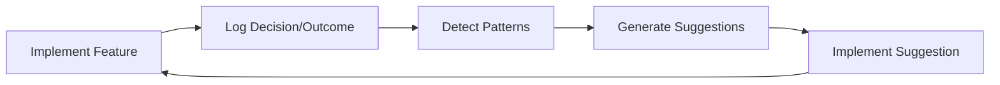

# Context Manager Bootstrap Guide

## Overview

This guide documents how the Context Manager helps build itself - a practical implementation of the bootstrap principle where a system uses its initial capabilities to enhance itself.

## Bootstrap Philosophy

> "The Context Manager isn't just infrastructure—it's the first 'agent' that helps build everything else."

### Why Bootstrap?

1. **Capture Patterns**: Development patterns that would otherwise be lost
2. **Accelerate Development**: Learn from what works and what doesn't
3. **Dogfood Quality**: If it can't help build itself, how can it help build other agents?
4. **Create Foundation**: Establish patterns that other agents will follow

## Bootstrap Features

### 1. Decision Logging

Every significant decision during Context Manager development is logged:

```python
# When choosing storage format
cm.log_decision(
    decision="Use JSON instead of SQLite for v1",
    reasoning="Prioritizing human readability and debugging ease over performance"
)

# When implementing a feature
cm.log_decision(
    decision="Implement simple keyword pattern detection first",
    reasoning="ML-based patterns premature; need data to train on"
)
```

### 2. Problem Tracking

Track issues encountered and solutions attempted:

```python
# When hitting an issue
cm.log_problem(
    problem="Context objects not serializing to JSON",
    attempted_solution="Add custom encoder for datetime objects"
)

# After resolution
cm.log_pattern(
    pattern_name="datetime_serialization",
    where_applied="JSON storage layer",
    outcome="success - using ISO format"
)
```

### 3. Pattern Learning

The Context Manager identifies patterns in its own development:

```python
# After multiple similar decisions
patterns = cm.analyze_patterns()
# Returns: ["storage_decisions", "error_handling", "api_design"]

suggestions = cm.suggest_next_action()
# Returns: ["Based on 3 storage-related decisions, consider documenting storage strategy"]
```

### 4. Self-Improvement Cycle



## Practical Bootstrap Examples

### Week 1: Foundation Bootstrap

**Day 1: Schema Design**
```python
# First decision logged
cm = ContextManager()  # Minimal version
cm.log_decision(
    "Start with dataclasses for schema",
    "Type hints help development, IDE support, no external dependencies"
)
```

**Day 2: Storage Implementation**
```python
# Pattern emerges
cm.log_decision(
    "Use JSON for storage",
    "Consistent with schema decision - prioritizing simplicity"
)

# Context Manager suggests
suggestions = cm.suggest_next_action()
# "Pattern detected: preferring built-in Python over external dependencies"
# "Consider: Use unittest instead of pytest for consistency"
```

**Day 3: Pattern Detection**
```python
# Meta-pattern detection
cm.log_decision(
    "Simple Counter-based patterns for v1",
    "Following established pattern of built-in solutions first"
)

# Context Manager recognizes its own pattern
cm.log_pattern(
    "incremental_complexity",
    "All features start simple, enhance later",
    "success - faster delivery, easier debugging"
)
```

### Bootstrapping Other Agents

The patterns learned building Context Manager inform other agents:

```python
# When starting Documentation Agent
patterns = cm.get_patterns_for("agent_development")

# Context Manager suggests:
# 1. Start with minimal schema (worked for Context Manager)
# 2. Use JSON storage initially (proven pattern)
# 3. Implement decision logging first (high value)
# 4. TDD approach (caught issues early)
```

## Bootstrap Metrics

Track the effectiveness of bootstrapping:

```python
@dataclass
class BootstrapMetrics:
    decisions_logged: int = 0
    patterns_detected: int = 0
    suggestions_generated: int = 0
    suggestions_accepted: int = 0
    development_velocity: float = 0.0  # Features per day
    
    @property
    def suggestion_acceptance_rate(self) -> float:
        if self.suggestions_generated == 0:
            return 0.0
        return self.suggestions_accepted / self.suggestions_generated
```

## Bootstrap Anti-Patterns

### ❌ Don't Over-Engineer Early
```python
# Bad: Complex ML pattern detection on day 1
cm.implement_neural_pattern_detector()  # No data to train on!

# Good: Simple counting and correlation
cm.count_keyword_frequency()  # Immediate value
```

### ❌ Don't Ignore Bootstrap Data
```python
# Bad: Implement features without logging decisions
def add_storage():
    # Just implement without documentation
    pass

# Good: Always log why
def add_storage():
    cm.log_decision("Adding Redis", "Need persistence between restarts")
    # Then implement
```

### ❌ Don't Bootstrap Everything
```python
# Bad: Try to make every function self-improving
def add(a, b):
    cm.log_decision(f"Adding {a} + {b}", "Math required")  # Too much!
    
# Good: Bootstrap significant architectural decisions
def choose_storage_backend():
    cm.log_decision("PostgreSQL for history", "Need ACID compliance for audit")
```

## Bootstrap Checklist

### Daily Development
- [ ] Log at least one significant decision
- [ ] Check suggestions before starting new features
- [ ] Document successful patterns
- [ ] Review bootstrap metrics

### Weekly Review
- [ ] Analyze all patterns detected
- [ ] Calculate suggestion acceptance rate
- [ ] Identify most valuable patterns
- [ ] Plan improvements based on patterns

### Per Feature
- [ ] Log initial decision and reasoning
- [ ] Track problems encountered
- [ ] Document solution patterns
- [ ] Update suggestions for similar features

## Success Indicators

You know bootstrapping is working when:

1. **Suggestions Become Valuable**: You check suggestions before implementing
2. **Patterns Guide Decisions**: "We've seen this pattern before..."
3. **Development Accelerates**: Each feature builds on learned patterns
4. **Quality Improves**: Fewer repeated mistakes
5. **Documentation Writes Itself**: Decisions are already logged

## Bootstrap Outputs

The Context Manager produces these artifacts through bootstrapping:

### 1. Decision Log
```json
{
    "timestamp": "2024-01-20T10:00:00Z",
    "decision": "Use JSON storage",
    "reasoning": "Human readable, debuggable, simple",
    "outcome": "success",
    "patterns": ["simplicity_first", "debugging_priority"]
}
```

### 2. Pattern Library
```json
{
    "pattern": "incremental_complexity",
    "description": "Start simple, enhance based on real needs",
    "occurrences": 12,
    "success_rate": 0.92,
    "applications": ["storage", "api", "patterns", "schema"]
}
```

### 3. Architecture Decision Records (ADRs)
Generated automatically from decision logs:
- ADR-001: Context Schema Design
- ADR-002: Storage Backend Selection
- ADR-003: Pattern Detection Algorithm

### 4. Feature Suggestions
```json
{
    "suggestion": "Add batch context operations",
    "confidence": 0.85,
    "based_on_patterns": ["api_usage", "performance_bottlenecks"],
    "priority": "medium"
}
```

## Conclusion

The bootstrap approach transforms Context Manager development from a linear process into a self-improving cycle. Each decision made and pattern learned makes the next feature easier to implement and more likely to succeed.

Remember: **The Context Manager's first job is to help build a better Context Manager.**