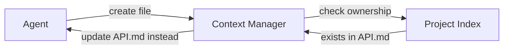

# Context Manager Documentation

> **v2.0 - From Passive Store to Active Project Consciousness**

This directory contains all documentation for the Context Manager - the cognitive system that prevents documentation redundancy and maintains project coherence.

## 📁 Documentation Structure

### Core Documentation (Canonical Locations)
- **[TECHNICAL_DESIGN.md](TECHNICAL_DESIGN.md)** - v2.0 design with Project Consciousness Model ⭐
- **[IMPLEMENTATION_PLAN.md](IMPLEMENTATION_PLAN.md)** - v2.0 implementation with anti-redundancy features ⭐
- **[AGENT_SPECIFICATION.md](AGENT_SPECIFICATION.md)** - Complete API reference and behaviors
- **[BOOTSTRAP_GUIDE.md](BOOTSTRAP_GUIDE.md)** - How Context Manager builds itself
- **[IMPLEMENTATION_NOTES.md](IMPLEMENTATION_NOTES.md)** - Lessons learned and cleanup insights

### Specialized Documentation
- **[INITIALIZE_PROJECT_DESIGN.md](INITIALIZE_PROJECT_DESIGN.md)** - Project initialization algorithms
- **[CONTEXT_COLLECTION_SYSTEM_DESIGN.md](CONTEXT_COLLECTION_SYSTEM_DESIGN.md)** - Collection system details
- **[METADATA_VISUALIZATION_DESIGN.md](METADATA_VISUALIZATION_DESIGN.md)** - Visualization approaches

### Project Evolution Documents
These documents in the project-evolution-guide show how we arrived at the current design:
- **[03_CONTEXT_MANAGER_DEVELOPMENT_GUIDE.md](../../project-evolution-guide/03_CONTEXT_MANAGER_DEVELOPMENT_GUIDE.md)** - Where to stop development (neural fields analysis)
- **[04_CONTEXT_MANAGER_V1_PLAN.md](../../project-evolution-guide/04_CONTEXT_MANAGER_V1_PLAN.md)** - Original planning phase
- **[06_CONTEXT_MANAGER_V1_DESIGN.md](../../project-evolution-guide/06_CONTEXT_MANAGER_V1_DESIGN.md)** - Original design exploration

## 🎯 Quick Start for v2.0

1. **Understand the Problem**: We created 3 redundant files instead of updating existing docs
2. **Read the Solution**: [TECHNICAL_DESIGN.md](TECHNICAL_DESIGN.md) - Project Consciousness Model
3. **Implement Anti-Redundancy**: [IMPLEMENTATION_PLAN.md](IMPLEMENTATION_PLAN.md) - Immediate actions
4. **Use the Gateway**: All documentation operations must go through Context Manager

## 🔑 Key v2.0 Innovations

### 1. Project Consciousness Model
```python
# Context Manager actively prevents redundancy
operation = FileOperation(type='create', path='NEW_FEATURE.md')
guidance = cm.check_file_operation(operation)
# Returns: "Update docs/FEATURES.md instead"
```

### 2. Semantic Understanding
```python
# Beyond keywords to concepts
results = cm.search("authentication problems", intent="debug")
# Finds: auth code, error logs, troubleshooting docs
```

### 3. Hierarchical Context
```python
context = cm.collect_context_for_task("Fix auth bug")
# Returns:
# - project_overview (always)
# - task_focus (relevant files)
# - guidance (prevent mistakes)
```

### 4. Documentation Gateway


## 📊 Current Status (v2.0)

### What's New
- ✅ **Unified Design**: Consolidated all redundant documentation
- ✅ **Anti-Redundancy System**: Prevents creating duplicate files
- ✅ **Semantic Understanding**: Concepts, not just keywords
- ✅ **Active Guidance**: Tells agents where information belongs

### Implementation Phases
- **Phase 1** (Current): Core v2 engine with anti-redundancy
- **Phase 2** (Next): Intelligence layer with semantic search
- **Phase 3** (Future): Predictive guidance and multi-agent coordination

### Immediate Actions
1. Remove redundant CONTEXT_*.md files
2. Implement semantic task analysis
3. Create project index with ownership mappings
4. Add documentation gateway hooks

## 🚨 Important: Information Ownership

To prevent redundancy, Context Manager v2 maintains clear ownership mappings:

| Information Type | Canonical Location |
|-----------------|-------------------|
| Context Manager Design | `docs/agents/context-manager/TECHNICAL_DESIGN.md` |
| Implementation Plans | `docs/agents/context-manager/IMPLEMENTATION_PLAN.md` |
| API Reference | `docs/agents/context-manager/AGENT_SPECIFICATION.md` |
| Code Cleanup | `docs/agents/context-manager/IMPLEMENTATION_NOTES.md` |
| Project Status | `CLAUDE.md` |

**Before creating any new documentation file**, check with:
```bash
cm where-belongs "your information type"
```

## 🔗 Related Documentation

- [Project Evolution Guide](../../project-evolution-guide/) - How we got here
- [Context Engineering Research](../../research/simple/docs/CONTEXT_ENGINEERING_INSIGHTS.md)
- [Agent Documentation Standard](../../project-evolution-guide/07_AGENT_DOCUMENTATION_STANDARD.md)