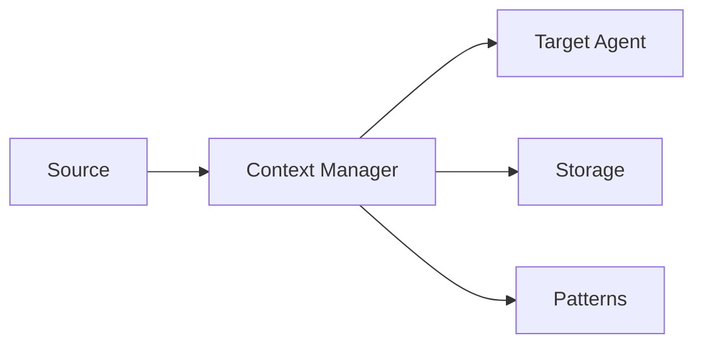

# Context Manager Documentation

This directory contains all documentation specific to the Context Manager agent - the foundational "nervous system" of the agent-workflow project.

## 📁 Documentation Structure

### Core Documentation (This Directory)
- **[AGENT_SPECIFICATION.md](AGENT_SPECIFICATION.md)** - Complete Context Manager specification (Level 2)
- **[TECHNICAL_DESIGN.md](TECHNICAL_DESIGN.md)** - Technical design with schema, storage, and API details
- **[IMPLEMENTATION_PLAN.md](IMPLEMENTATION_PLAN.md)** - Week-by-week implementation guide
- **[BOOTSTRAP_GUIDE.md](BOOTSTRAP_GUIDE.md)** - How the Context Manager builds itself
- **[IMPLEMENTATION_NOTES.md](IMPLEMENTATION_NOTES.md)** - Real-time learnings and patterns

### Project Evolution Documents
These documents in the project-evolution-guide show how we arrived at the current design:
- **[03_CONTEXT_MANAGER_DEVELOPMENT_GUIDE.md](../../project-evolution-guide/03_CONTEXT_MANAGER_DEVELOPMENT_GUIDE.md)** - Where to stop development (neural fields analysis)
- **[04_CONTEXT_MANAGER_V1_PLAN.md](../../project-evolution-guide/04_CONTEXT_MANAGER_V1_PLAN.md)** - Original planning phase
- **[06_CONTEXT_MANAGER_V1_DESIGN.md](../../project-evolution-guide/06_CONTEXT_MANAGER_V1_DESIGN.md)** - Original design exploration

## 🎯 Quick Start

1. **Understanding the Design**: Read [TECHNICAL_DESIGN.md](TECHNICAL_DESIGN.md) for complete technical details
2. **API Reference**: See [AGENT_SPECIFICATION.md](AGENT_SPECIFICATION.md) for complete API
3. **Implementation**: Follow [IMPLEMENTATION_PLAN.md](IMPLEMENTATION_PLAN.md) for week-by-week guide
4. **Bootstrap**: Use [BOOTSTRAP_GUIDE.md](BOOTSTRAP_GUIDE.md) to understand self-improvement

## 🔑 Key Concepts

### Bootstrap Methodology
The Context Manager documents its own development:
```python
cm.log_decision("Using JSON storage", "Human-readable for debugging")
suggestions = cm.suggest_next_action()
```

### Context Flow


## 📊 Current Status

- ✅ Design completed (TDD approach)
- ✅ Documentation structure established
- 🔄 Implementation starting (Week 1)
- ⏳ Bootstrap features in development

## 🔗 Related Documentation

- [Context Engineering Research](../../research/simple/docs/CONTEXT_ENGINEERING_INSIGHTS.md)
- [Dependency Map](../../research/simple/docs/CONTEXT_DEPENDENCY_MAP.md)
- [Agent Documentation Standard](../../project-evolution-guide/07_AGENT_DOCUMENTATION_STANDARD.md)