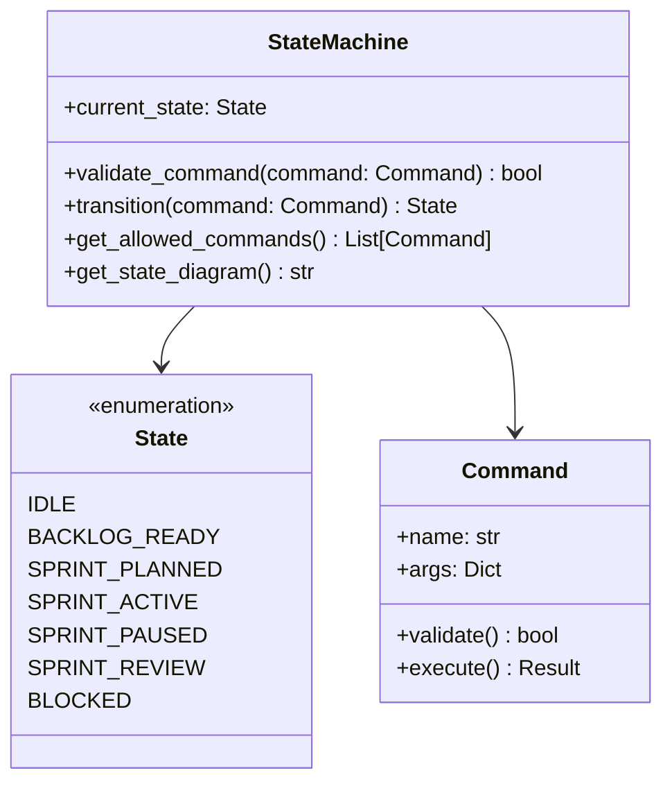
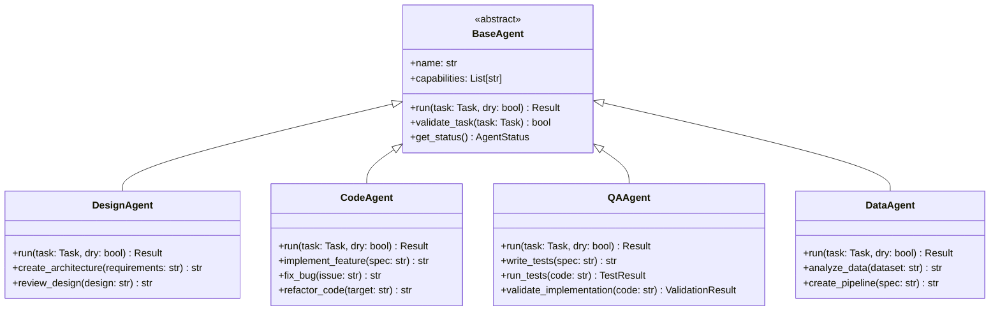
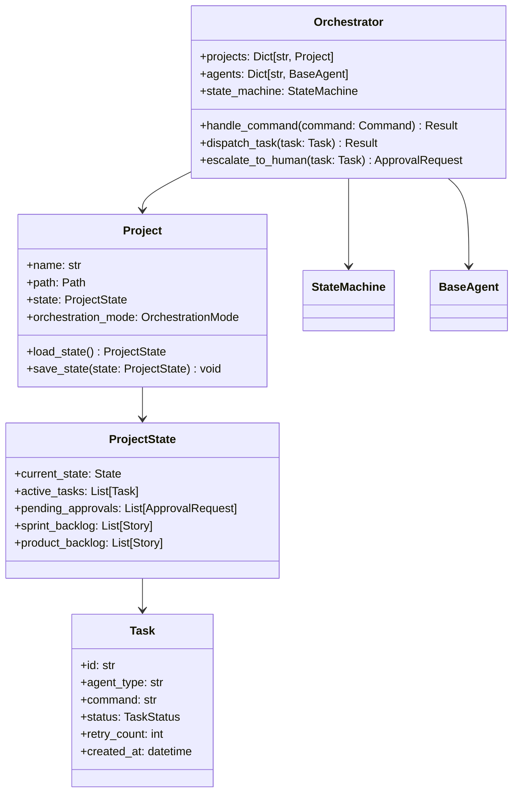
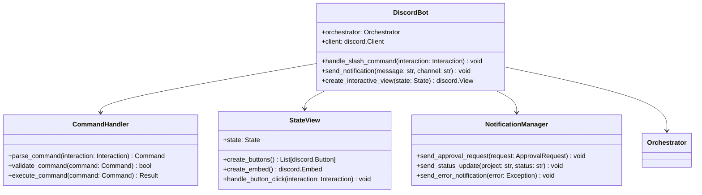

# C4 Code Diagram - AI Agent TDD-Scrum Workflow

## State Machine Class Structure

```mermaid
classDiagram
    class StateMachine {
        +current_state: State
        +validate_command(command: Command) bool
        +transition(command: Command) State
        +get_allowed_commands() List[Command]
        +get_state_diagram() str
    }
    
    class State {
        <<enumeration>>
        IDLE
        BACKLOG_READY
        SPRINT_PLANNED
        SPRINT_ACTIVE
        SPRINT_PAUSED
        SPRINT_REVIEW
        BLOCKED
    }
    
    class Command {
        +name: str
        +args: Dict
        +validate() bool
        +execute() Result
    }
    
    StateMachine --> State
    StateMachine --> Command
```

## Agent Class Hierarchy

```mermaid
classDiagram
    class BaseAgent {
        <<abstract>>
        +name: str
        +capabilities: List[str]
        +run(task: Task, dry: bool) Result
        +validate_task(task: Task) bool
        +get_status() AgentStatus
    }
    
    class DesignAgent {
        +run(task: Task, dry: bool) Result
        +create_architecture(requirements: str) str
        +review_design(design: str) str
    }
    
    class CodeAgent {
        +run(task: Task, dry: bool) Result
        +implement_feature(spec: str) str
        +fix_bug(issue: str) str
        +refactor_code(target: str) str
    }
    
    class QAAgent {
        +run(task: Task, dry: bool) Result
        +write_tests(spec: str) str
        +run_tests(code: str) TestResult
        +validate_implementation(code: str) ValidationResult
    }
    
    class DataAgent {
        +run(task: Task, dry: bool) Result
        +analyze_data(dataset: str) str
        +create_pipeline(spec: str) str
    }
    
    BaseAgent <|-- DesignAgent
    BaseAgent <|-- CodeAgent
    BaseAgent <|-- QAAgent
    BaseAgent <|-- DataAgent
```

## Orchestrator Core Classes

```mermaid
classDiagram
    class Orchestrator {
        +projects: Dict[str, Project]
        +agents: Dict[str, BaseAgent]
        +state_machine: StateMachine
        +handle_command(command: Command) Result
        +dispatch_task(task: Task) Result
        +escalate_to_human(task: Task) ApprovalRequest
    }
    
    class Project {
        +name: str
        +path: Path
        +state: ProjectState
        +orchestration_mode: OrchestrationMode
        +load_state() ProjectState
        +save_state(state: ProjectState) void
    }
    
    class ProjectState {
        +current_state: State
        +active_tasks: List[Task]
        +pending_approvals: List[ApprovalRequest]
        +sprint_backlog: List[Story]
        +product_backlog: List[Story]
    }
    
    class Task {
        +id: str
        +agent_type: str
        +command: str
        +status: TaskStatus
        +retry_count: int
        +created_at: datetime
    }
    
    Orchestrator --> Project
    Project --> ProjectState
    ProjectState --> Task
    Orchestrator --> StateMachine
    Orchestrator --> BaseAgent
```

## Discord Bot Classes

```mermaid
classDiagram
    class DiscordBot {
        +orchestrator: Orchestrator
        +client: discord.Client
        +handle_slash_command(interaction: Interaction) void
        +send_notification(message: str, channel: str) void
        +create_interactive_view(state: State) discord.View
    }
    
    class CommandHandler {
        +parse_command(interaction: Interaction) Command
        +validate_command(command: Command) bool
        +execute_command(command: Command) Result
    }
    
    class StateView {
        +state: State
        +create_buttons() List[discord.Button]
        +create_embed() discord.Embed
        +handle_button_click(interaction: Interaction) void
    }
    
    class NotificationManager {
        +send_approval_request(request: ApprovalRequest) void
        +send_status_update(project: str, status: str) void
        +send_error_notification(error: Exception) void
    }
    
    DiscordBot --> CommandHandler
    DiscordBot --> StateView
    DiscordBot --> NotificationManager
    DiscordBot --> Orchestrator
```