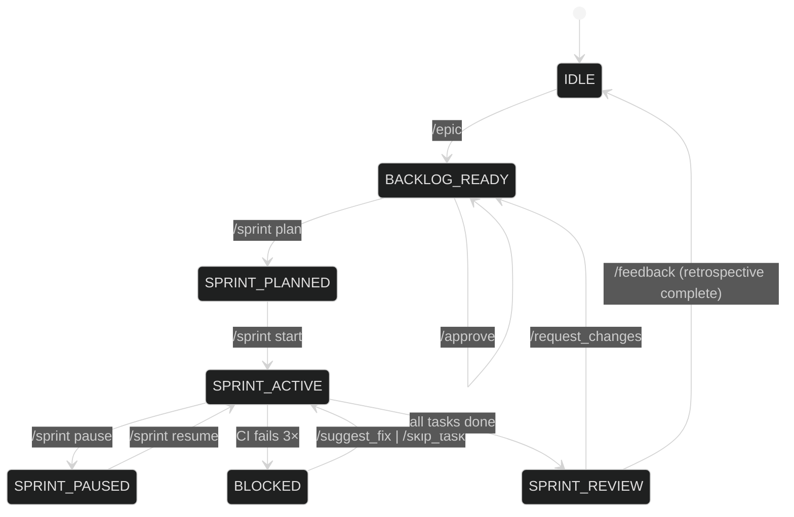

# Orchestrator Command State Machine

_This document formalises when each slash-command is legal, how it changes the orchestrator's state, and the feedback pattern when a command is issued in an improper state._

---

## 1. Top-Level States
| Key | State Name | Description |
| --- | ----------- | ----------- |
| **IDLE** | Idle / Awaiting Vision | No epic defined; waiting for `/epic` or backlog grooming. |
| **BACKLOG_READY** | Backlog Ready | Stories exist in the product backlog, none selected for sprint. |
| **SPRINT_PLANNED** | Sprint Planned | A sprint backlog has been drafted but not started. |
| **SPRINT_ACTIVE** | Sprint Active | Agents are working on tasks. |
| **SPRINT_PAUSED** | Sprint Paused | Active sprint is temporarily halted. |
| **SPRINT_REVIEW** | Sprint Review | Sprint tasks done; PR awaiting user review. |
| **BLOCKED** | Blocked Task | Sprint task failed CI 3× and awaits user input. (_Sub-state of `SPRINT_ACTIVE`_.)|

---

## 2. Command → State Matrix

| Command | Allowed in States | Resulting State |
|---------|-------------------|-----------------|
| `/epic` | IDLE, BACKLOG_READY | BACKLOG_READY |
| `/approve` | BACKLOG_READY | BACKLOG_READY |
| `/backlog *` | Any (except SPRINT_REVIEW locked) | (no change) |
| `/sprint plan` | BACKLOG_READY | SPRINT_PLANNED |
| `/sprint start` | SPRINT_PLANNED | SPRINT_ACTIVE |
| `/sprint status` | SPRINT_ACTIVE, SPRINT_PAUSED, BLOCKED | (no change) |
| `/sprint pause` | SPRINT_ACTIVE | SPRINT_PAUSED |
| `/sprint resume` | SPRINT_PAUSED | SPRINT_ACTIVE |
| `/request_changes` | SPRINT_REVIEW | BACKLOG_READY |
| `/suggest_fix` | BLOCKED | SPRINT_ACTIVE |
| `/skip_task` | BLOCKED | SPRINT_ACTIVE (next task) |
| `/feedback` | SPRINT_REVIEW | IDLE |

*Commands issued outside their **Allowed States** trigger an error response (see §4).*  
*`/backlog` commands are always safe but may show different context (product vs sprint).*  
*`BLOCKED` is transient: once the user responds the orchestrator returns to `SPRINT_ACTIVE` or skips forward.*

---

## 3. Mermaid State Diagram



---

## 4. Standardised Error & Hint Response
When a user issues an invalid command for the current state, the orchestrator must reply with:

```json
{
  "type": "error",
  "code": "INVALID_STATE",
  "current_state": "SPRINT_ACTIVE",
  "command": "/sprint plan",
  "allowed_in": ["BACKLOG_READY"],
  "hint": "Sprint already active. Use /sprint status or /sprint pause instead."
}
```

In Discord this is rendered as:
> ⚠️ Command `/sprint plan` is not allowed now (state: **SPRINT_ACTIVE**). Try `/sprint status` or `/sprint pause`.

---

## 5. Implementation Notes
1. Maintain state in orchestrator memory / lightweight DB keyed by guild or workspace.
2. Expose a `/state` debug command (admin-only) to dump current finite-state and backlog summary.
3. Unit-test the state machine with a table-driven test: `(state, command) → expected`.
4. Extend easily: add columns/rows to matrix and diagram.

_This state machine keeps user interactions predictable and provides immediate, actionable feedback when mis-ordered commands occur._ 