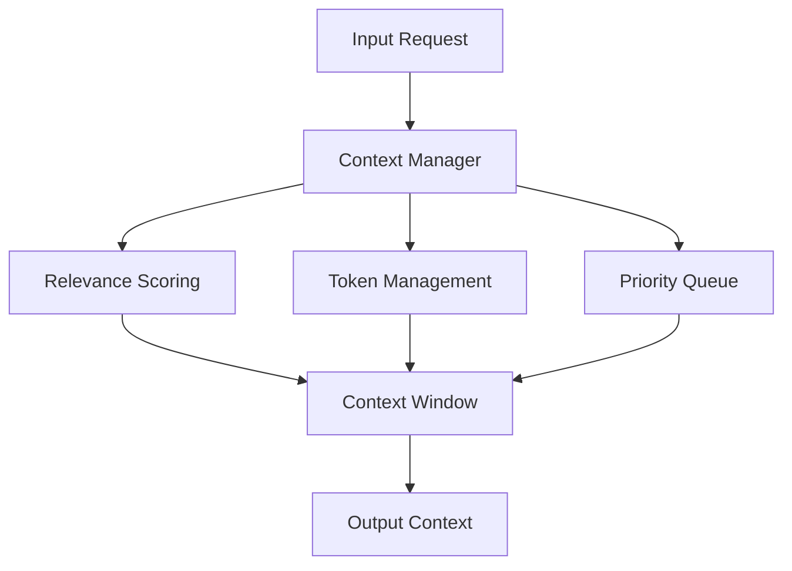

# Agent Documentation Standard: A Unified Framework

## Executive Summary

This document synthesizes five expert perspectives on AI agent documentation to create a unified framework that balances completeness with maintainability, compliance with agility, and formal rigor with practical use. It provides a progressive documentation approach suitable for a project that will build medical devices but needs to start lean and iterate quickly.

## 1. Common Themes Across All Perspectives

### 1.1 Universal Principles

All perspectives converge on these core principles:

1. **Progressive Documentation**: Start minimal, add detail as needed
2. **Living Documentation**: Documents must evolve with the system
3. **Audience-Aware Content**: Different stakeholders need different levels
4. **Automation First**: Generate documentation from code where possible
5. **Risk-Based Approach**: Focus detail on high-risk/critical components
6. **Behavior Over Implementation**: Document what agents do, not just how

### 1.2 Essential Documentation Elements

Consensus across all perspectives identifies these as non-negotiable:

- **Purpose and Value**: Clear statement of why the agent exists
- **API Contracts**: Input/output specifications with examples
- **Error Handling**: Failure modes and recovery strategies
- **Security Boundaries**: Authentication, authorization, data handling
- **Integration Points**: How the agent connects with other systems

## 2. Reconciling Conflicts Between Approaches

### 2.1 Formality vs Agility

**Conflict**: Medical regulatory requires extensive documentation; startup approach emphasizes speed

**Resolution**: Implement a **"Progressive Compliance"** model:
```
Pre-PMF → Post-PMF → Pre-Clinical → Clinical → FDA Submission
Minimal → Standard → Enhanced → Comprehensive → Complete
```

### 2.2 Completeness vs Maintainability

**Conflict**: Academic/regulatory want comprehensive docs; practical perspectives warn against documentation debt

**Resolution**: Use **"Core + Extensions"** pattern:
- Core: Always up-to-date, minimal viable documentation
- Extensions: Add-on modules for specific needs (compliance, research, etc.)

### 2.3 Deterministic vs Probabilistic Documentation

**Conflict**: Traditional specs assume deterministic behavior; AI systems are probabilistic

**Resolution**: Adopt **"Behavioral Bounds"** documentation:
- Document expected behavior ranges, not exact outputs
- Include confidence intervals and uncertainty measures
- Specify acceptable variance thresholds

## 3. Unified Documentation Framework

### 3.1 Documentation Levels

#### Level 0: Minimal Viable (Must Exist)

**Purpose**: Enable basic understanding and use
**Audience**: Developers, immediate team
**Maintenance**: Weekly updates

```markdown
# Agent Name

## Purpose (1 sentence)
[What problem does this solve?]

## Quick Start
```bash
docker run agent-name
```

## API
- Input: `{type: "request", data: {...}}`
- Output: `{type: "response", data: {...}}`

## Errors
- `ERROR_001`: Invalid input format
- `ERROR_002`: Timeout exceeded

## Dependencies
- Python 3.11+
- LangChain 0.1.x
```

#### Level 1: Standard (Good for Most Cases)

**Purpose**: Enable integration and basic troubleshooting
**Audience**: Extended team, early adopters
**Maintenance**: Bi-weekly updates

Includes Level 0 plus:
- Architecture diagram (Mermaid)
- State machine specification
- Performance characteristics
- Basic security documentation
- Integration examples

#### Level 2: Enhanced (Complex/Critical Components)

**Purpose**: Enable deep understanding and modification
**Audience**: Senior engineers, security auditors
**Maintenance**: Monthly updates

Includes Level 1 plus:
- Formal specifications for critical paths
- Detailed error recovery procedures
- Performance benchmarks and limits
- Security threat model
- Behavioral boundaries documentation

#### Level 3: Comprehensive (Regulatory/Research)

**Purpose**: Meet compliance and enable research
**Audience**: Regulators, researchers, auditors
**Maintenance**: Quarterly updates with change tracking

Includes Level 2 plus:
- Complete traceability matrix
- Risk analysis documentation
- Validation and verification records
- Emergent behavior catalog
- Uncertainty quantification

### 3.2 Documentation by Component Type

| Component Type | Minimum Level | Recommended Level | When to Enhance |
|----------------|---------------|-------------------|-----------------|
| Utility Agents | Level 0 | Level 1 | High usage |
| Core Business Logic | Level 1 | Level 2 | Always |
| Medical/Safety Critical | Level 2 | Level 3 | Before clinical use |
| External APIs | Level 1 | Level 2 | >10 consumers |
| Research/Experimental | Level 0 | Level 1 | Promising results |

## 4. Agent Documentation Template

### 4.1 Essential Sections

```markdown
# [Agent Name]

## Overview
- **Purpose**: [One sentence describing the agent's role]
- **Category**: [Utility|Core|Safety-Critical|Experimental]
- **Owner**: [Team/Person responsible]
- **Version**: [Semantic version]
- **Status**: [Development|Testing|Production|Deprecated]

## Capabilities
### What This Agent Can Do
- [Capability 1 with example]
- [Capability 2 with example]

### What This Agent Cannot Do
- [Limitation 1]
- [Limitation 2]

## API Specification
### Input Contract
```yaml
type: object
properties:
  action:
    type: string
    enum: [analyze, generate, validate]
  data:
    type: object
required: [action, data]
```

### Output Contract
```yaml
type: object
properties:
  status:
    type: string
    enum: [success, error, partial]
  result:
    type: object
  confidence:
    type: number
    minimum: 0
    maximum: 1
```

## Behavioral Characteristics
### Expected Behaviors
- Response time: 50-200ms (p95)
- Success rate: >95% for valid inputs
- Confidence threshold: 0.7 for automated actions

### Edge Cases
| Scenario | Behavior | Mitigation |
|----------|----------|------------|
| Malformed input | Returns error with guidance | Input validation |
| Timeout | Partial results with warning | Configurable timeout |

## Integration Guide
### Quick Start
```python
from agents import AnalysisAgent

agent = AnalysisAgent()
result = agent.analyze({
    "action": "analyze",
    "data": {"content": "..."}
})
```

### Error Handling
```python
try:
    result = agent.analyze(data)
except AgentTimeout:
    # Handle timeout
except AgentError as e:
    # Handle specific errors
```

## Monitoring and Metrics
- **Key Metrics**: latency, error_rate, confidence_scores
- **Dashboards**: [Link to Grafana]
- **Alerts**: [Link to alert configuration]

## Safety and Security
- **Data Handling**: [Encryption, retention policies]
- **Access Control**: [Authentication requirements]
- **Audit Logging**: [What is logged and where]

## Dependencies
- Runtime: Python 3.11+
- Libraries: [List with versions]
- Services: [External services required]

## Change Log
- v1.0.0 (2024-07-04): Initial release
- v1.0.1 (2024-07-05): Fixed timeout handling
```

### 4.2 When to Use Diagrams

| Diagram Type | When to Use | Tool Recommendation |
|--------------|-------------|---------------------|
| Architecture | >3 components interacting | Mermaid |
| Sequence | Complex multi-step flows | Mermaid |
| State Machine | >3 states or complex transitions | Mermaid/PlantUML |
| Data Flow | Security boundaries crossed | Mermaid |
| Class/Component | Stable, core components only | PlantUML |

### 4.3 Code vs Specification Balance

**Rule of Thumb**: 
- 80% code speaks for itself (with good naming and structure)
- 15% needs inline comments (the "why")
- 5% needs external documentation (complex algorithms, critical paths)

### 4.4 Update and Maintenance Strategy

1. **Automated Updates**
   - API docs from OpenAPI specs
   - Metrics from monitoring systems
   - Version info from git tags

2. **Manual Updates**
   - Triggered by significant changes
   - Part of PR review process
   - Quarterly documentation sprints

3. **Documentation Debt Tracking**
   ```python
   @doc_debt(reason="MVP rush", priority="high", due="2024-Q3")
   def complex_algorithm():
       """TODO: Document the mathematical basis"""
       pass
   ```

## 5. Specific Recommendations

### 5.1 Context Manager Documentation

Given its critical role, the Context Manager should maintain **Level 2** documentation:

```markdown
# Context Manager Agent

## Overview
[Level 2 Enhanced Documentation]

## Architecture


## Formal Specification
```python
class ContextWindow:
    """
    Maintains agent context within token limits.
    
    Invariants:
        - token_count ≤ max_tokens
        - ∀ item ∈ items: item.relevance ≥ min_relevance
        - items are sorted by (priority, relevance, recency)
    
    Behavioral Bounds:
        - Pruning removes ≤ 30% of context per operation
        - Relevance scores are stable within ±0.1 between calls
    """
```

## Performance Characteristics
- Latency: p50=5ms, p95=15ms, p99=25ms
- Memory: O(n) where n = number of context items
- Token efficiency: >85% useful context retention
```

### 5.2 Documentation Agent Specifications

The Documentation Agent should maintain **Level 1** documentation initially:

```markdown
# Documentation Agent

## Purpose
Automatically generates and updates agent documentation based on code analysis and runtime behavior.

## Capabilities
- Extract docstrings and type hints
- Generate API documentation
- Track behavioral patterns
- Identify documentation gaps
- Suggest documentation improvements

## Integration
- Triggered on: Code commits, PR creation, weekly schedule
- Outputs: Markdown files, documentation coverage reports
- Updates: Existing documentation with @auto-generated sections
```

### 5.3 Future Agent Documentation Guidelines

As new agents are added:

1. **Start at Level 0** for all new agents
2. **Promote to Level 1** when:
   - Used by >2 other agents
   - In production for >30 days
   - Part of critical path
3. **Promote to Level 2** when:
   - Handles medical data
   - Makes autonomous decisions
   - Interfaces with external systems
4. **Promote to Level 3** when:
   - Required for regulatory submission
   - Part of safety-critical path
   - Undergoing formal verification

## 6. Implementation Roadmap

### Phase 1: Foundation (Weeks 1-2)
- [ ] Create documentation templates
- [ ] Set up documentation automation tools
- [ ] Document existing Context Manager (Level 2)
- [ ] Create README-driven development guide

### Phase 2: Culture (Weeks 3-4)
- [ ] Add documentation to Definition of Done
- [ ] Implement documentation coverage checks
- [ ] Create "Documentation Champion" role
- [ ] First documentation sprint

### Phase 3: Automation (Weeks 5-6)
- [ ] Deploy Documentation Agent (Level 1)
- [ ] Set up monitoring dashboards
- [ ] Implement auto-generated sections
- [ ] Create documentation analytics

### Phase 4: Maturation (Months 2-3)
- [ ] First comprehensive documentation review
- [ ] Promote critical agents to Level 2
- [ ] Begin regulatory preparation docs
- [ ] Establish documentation metrics

### Phase 5: Compliance Preparation (Months 4-6)
- [ ] Identify FDA documentation requirements
- [ ] Create traceability matrices
- [ ] Begin formal specifications
- [ ] Conduct documentation audit

## 7. Success Metrics

### Documentation Health Metrics
- **Coverage**: >80% of public APIs documented
- **Freshness**: <30 days since last update
- **Accuracy**: <5% reported documentation errors
- **Usability**: <30 minutes to first successful integration

### Team Adoption Metrics
- **Compliance**: >95% of PRs include doc updates
- **Quality**: >4.0/5.0 developer satisfaction
- **Efficiency**: <10% of dev time on documentation
- **Automation**: >60% of docs auto-generated

## 8. Living Documentation Principles

1. **Version Everything**: Documentation versions tied to code versions
2. **Automate Ruthlessly**: If it can be generated, don't write it
3. **Test Documentation**: Include doc examples in test suites
4. **Monitor Usage**: Track which docs are accessed and searched
5. **Iterate Frequently**: Documentation sprints every 6 weeks
6. **Embrace Incompleteness**: Better to have accurate partial docs than stale complete docs

## Conclusion

This unified framework provides a path from minimal viable documentation to comprehensive regulatory-ready documentation. By starting lean and progressively adding detail based on actual needs, teams can maintain high velocity while building the documentation foundation necessary for medical device development.

The key is to treat documentation as a first-class product feature, not an afterthought. With proper tooling, automation, and cultural practices, good documentation becomes a natural byproduct of good development practices rather than a burden.

Remember: The best documentation is the one that gets used, stays current, and enables both human and AI agents to work effectively with your system.