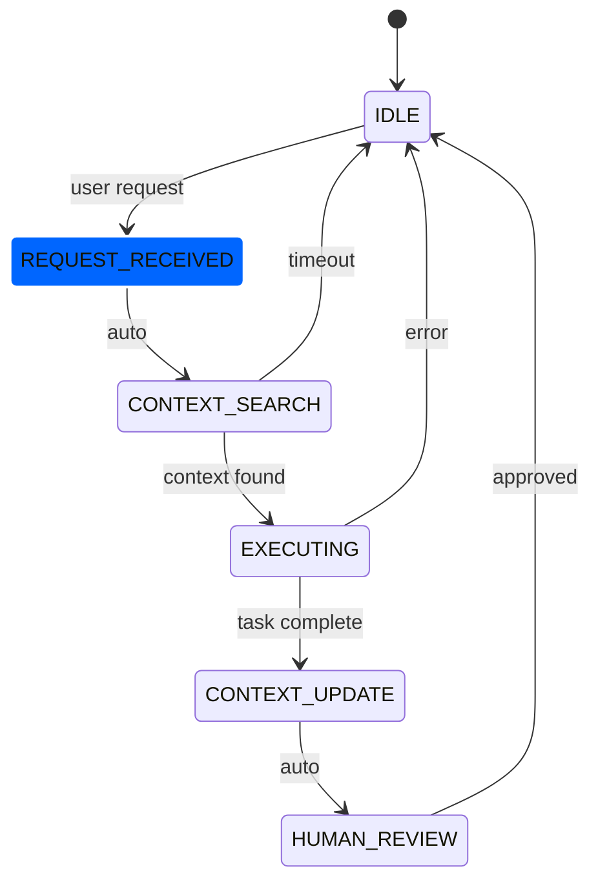

# Workflow Documentation Standard

This document defines how to document workflows in the agent-workflow system. Following this standard ensures consistency and completeness across all workflow patterns.

## Directory Structure

Each workflow should have its own directory under the appropriate lifecycle folder:

```
workflows/
├── active/             # Production-ready workflows
├── experimental/       # Workflows under development
└── archived/          # Historical versions
```

## Required Files

Every workflow directory must contain these files:

### 1. SPECIFICATION.md
The main workflow documentation containing:
- Overview and purpose
- Philosophy and principles
- When to use (and when not to use)
- Agent roles and responsibilities
- Success criteria
- Compliance considerations

### 2. STATE_MACHINE.md
Detailed state machine definition:
- State definitions and descriptions
- Transition rules and conditions
- Error states and recovery
- State timing expectations
- Mermaid diagram

### 3. AGENT_INTERACTIONS.md
How agents communicate:
- Message formats
- Context flow between agents
- Synchronization points
- Failure handling

### 4. EXAMPLES.md
Real-world usage examples:
- Sample requests and responses
- Step-by-step walkthroughs
- Common variations
- Troubleshooting guide

### 5. METRICS.md
Performance and quality metrics:
- Target success rates
- Timing benchmarks
- Quality indicators
- Measurement methods

## Workflow Metadata Format

Each SPECIFICATION.md should begin with a metadata block:

```yaml
---
workflow:
  name: "Workflow Name"
  version: "1.0"
  status: "active|experimental|archived"
  complexity: "simple|medium|complex|critical"
  agents_required: 
    - AgentName1
    - AgentName2
  typical_duration: "5-30 minutes"
  max_duration: "2 hours"
  success_rate_target: "80%"
  compliance_level: "basic|enhanced|medical|critical"
  created_date: "2024-01-20"
  last_updated: "2024-01-20"
  authors:
    - "Author Name"
---
```

## State Machine Documentation

### State Definition Template

```markdown
## State: STATE_NAME

**Purpose**: Brief description of what happens in this state

**Entry Conditions**:
- Condition 1
- Condition 2

**Activities**:
1. First activity
2. Second activity

**Exit Conditions**:
- Success: Criteria for successful completion
- Failure: What constitutes failure

**Transitions**:
- Success → NEXT_STATE
- Failure → ERROR_STATE
- Timeout → IDLE

**Timing**:
- Typical: X seconds/minutes
- Maximum: Y minutes

**Context Updates**:
- What gets logged to Context Manager
- Patterns to detect
```

### Mermaid Diagram Requirements

Every STATE_MACHINE.md must include a Mermaid diagram:



## Agent Interaction Patterns

### Message Format Template

```python
{
    "type": "workflow_message",
    "workflow": "workflow_name",
    "state": "current_state",
    "agent": "sender_agent",
    "target": "target_agent",
    "action": "requested_action",
    "payload": {
        # Action-specific data
    },
    "context_refs": ["context_id_1", "context_id_2"],
    "timestamp": "ISO-8601 timestamp"
}
```

## Example Documentation

### Good Example Entry (EXAMPLES.md)

```markdown
## Example: Generate Fibonacci Function

### Request
"Create a Python function to calculate Fibonacci numbers"

### Execution Flow

1. **IDLE → REQUEST_RECEIVED** (0.1s)
   - User submits request via UI
   - Request logged to Context Manager

2. **REQUEST_RECEIVED → CONTEXT_SEARCH** (2.3s)
   - Swiss Army queries: "fibonacci implementation patterns"
   - Context Manager returns 3 relevant patterns
   - Previous implementations analyzed

3. **CONTEXT_SEARCH → EXECUTING** (5.2s)
   - Swiss Army generates optimized implementation
   - Incorporates memoization pattern from context
   - Adds comprehensive docstring

4. **EXECUTING → CONTEXT_UPDATE** (0.8s)
   - Implementation stored with tags: ["fibonacci", "memoization", "recursive"]
   - Success pattern logged
   - Performance metrics recorded

5. **CONTEXT_UPDATE → HUMAN_REVIEW** (0.1s)
   - Code presented to user
   - Syntax highlighting applied
   - Test cases included

6. **HUMAN_REVIEW → IDLE** (user dependent)
   - User approves implementation
   - Positive feedback logged

### Total Time: 8.5 seconds (plus review time)

### Generated Code:
```python
def fibonacci(n: int, memo: dict = None) -> int:
    """Calculate nth Fibonacci number with memoization."""
    if memo is None:
        memo = {}
    # ... implementation details ...
```"

## Quality Checklist

Before marking a workflow as "active", ensure:

- [ ] All required files are present
- [ ] Metadata block is complete
- [ ] State machine diagram is accurate
- [ ] At least 3 examples provided
- [ ] Success criteria are measurable
- [ ] Error handling is documented
- [ ] Performance targets are realistic
- [ ] Context Manager integration is clear
- [ ] Agent interactions are specified
- [ ] Compliance requirements noted

## Evolution Process

### Version Incrementing

- **Patch (1.0.1)**: Documentation fixes, clarifications
- **Minor (1.1.0)**: New states, improved transitions
- **Major (2.0.0)**: Fundamental workflow changes

### Archival Process

When creating a new major version:
1. Copy entire workflow directory to `archived/vX/`
2. Update original with new version
3. Add migration notes
4. Update all references

## Best Practices

1. **Be Specific**: Vague descriptions lead to implementation confusion
2. **Show, Don't Tell**: Examples are worth 1000 words of description
3. **Measure Everything**: If you can't measure it, you can't improve it
4. **Plan for Failure**: Document error cases as thoroughly as success cases
5. **Keep it Current**: Update documentation immediately when workflow changes

## Review Requirements

New workflows must be reviewed for:
- Technical accuracy
- Completeness
- Consistency with standards
- Realistic performance targets
- Clear examples

---

*Following this standard ensures our workflow library remains a valuable, trustworthy resource for the entire team.*