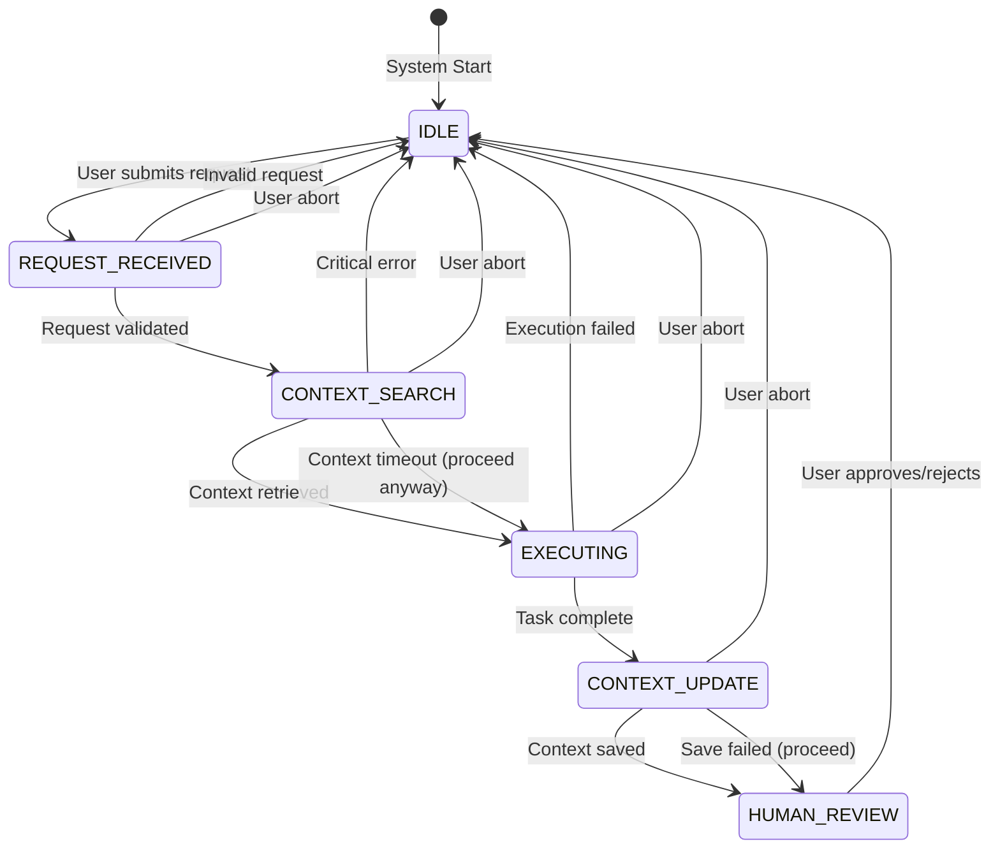

# Swiss Army Knife State Machine

This document defines the complete state machine for the Swiss Army Knife workflow, including all states, transitions, and timing requirements.

## State Diagram



## State Definitions

### State: IDLE

**Purpose**: System is waiting for a new request. This is the default state and the state returned to after task completion or error.

**Entry Conditions**:
- System startup
- Task completed (approved/rejected)
- Error recovery
- User abort

**Activities**:
1. Monitor for incoming requests
2. Perform background maintenance
3. Update pattern analysis (async)
4. Clean up temporary resources

**Exit Conditions**:
- Success: Valid user request received
- Failure: N/A (stable state)

**Transitions**:
- User request → REQUEST_RECEIVED

**Timing**:
- Typical: Indefinite
- Maximum: Indefinite

**Context Updates**:
- Log idle time for utilization metrics
- Run pattern analysis if idle >5 minutes

---

### State: REQUEST_RECEIVED

**Purpose**: A new request has been submitted and needs validation and initial processing.

**Entry Conditions**:
- User submitted request via UI/API
- Request passed basic format validation

**Activities**:
1. Parse request for intent and parameters
2. Validate request completeness
3. Estimate complexity and duration
4. Assign request ID and timestamp
5. Initial Context Manager logging

**Exit Conditions**:
- Success: Request is valid and clear
- Failure: Request is ambiguous or invalid

**Transitions**:
- Success → CONTEXT_SEARCH
- Invalid request → IDLE
- User abort → IDLE

**Timing**:
- Typical: <1 second
- Maximum: 5 seconds

**Context Updates**:
```python
{
    "type": "request",
    "request_id": "uuid",
    "content": "user request text",
    "metadata": {
        "estimated_complexity": "simple|medium|complex",
        "request_type": "code|docs|refactor|query",
        "timestamp": "ISO-8601"
    }
}
```

---

### State: CONTEXT_SEARCH

**Purpose**: Query the Context Manager for relevant patterns, previous solutions, and best practices.

**Entry Conditions**:
- Valid request parsed and logged
- Context Manager connection available

**Activities**:
1. Generate search queries from request
2. Query Context Manager for:
   - Similar previous requests
   - Successful solution patterns
   - Relevant code examples
   - Known pitfalls
3. Rank results by relevance
4. Prepare context summary for execution

**Exit Conditions**:
- Success: Relevant context found or timeout
- Failure: Context Manager error (recoverable)

**Transitions**:
- Context found → EXECUTING
- Timeout (5s) → EXECUTING (proceed without context)
- Critical error → IDLE
- User abort → IDLE

**Timing**:
- Typical: 1-3 seconds
- Maximum: 5 seconds (hard timeout)

**Context Updates**:
```python
{
    "type": "context_search",
    "request_id": "uuid",
    "queries": ["query1", "query2"],
    "results_count": 5,
    "relevance_scores": [0.95, 0.87, ...],
    "search_duration_ms": 2340
}
```

---

### State: EXECUTING

**Purpose**: The Swiss Army Agent performs the requested task using retrieved context.

**Entry Conditions**:
- Context search completed (with or without results)
- Execution plan generated

**Activities**:
1. Apply relevant patterns from context
2. Generate solution incrementally
3. Validate output against requirements
4. Format results for presentation
5. Stream progress updates

**Exit Conditions**:
- Success: Task completed successfully
- Failure: Execution error or timeout

**Transitions**:
- Success → CONTEXT_UPDATE
- Failure → IDLE (with error report)
- Timeout (10 min) → CONTEXT_UPDATE (partial results)
- User abort → IDLE

**Timing**:
- Typical: 5-30 seconds
- Maximum: 10 minutes (configurable)

**Context Updates**:
```python
{
    "type": "execution",
    "request_id": "uuid",
    "status": "in_progress|completed|failed",
    "progress_updates": [...],
    "patterns_applied": ["pattern1", "pattern2"],
    "execution_duration_ms": 15000,
    "result_preview": "first 500 chars..."
}
```

---

### State: CONTEXT_UPDATE

**Purpose**: Store execution results, patterns learned, and performance metrics in Context Manager.

**Entry Conditions**:
- Execution completed (success or partial)
- Results available for storage

**Activities**:
1. Package complete execution context
2. Extract new patterns discovered
3. Update pattern confidence scores
4. Store result with proper indexing
5. Link to related contexts

**Exit Conditions**:
- Success: Context stored successfully
- Failure: Storage failed (non-critical)

**Transitions**:
- Success → HUMAN_REVIEW
- Storage failed → HUMAN_REVIEW (with warning)
- Critical error → IDLE
- User abort → IDLE

**Timing**:
- Typical: 1-2 seconds
- Maximum: 10 seconds

**Context Updates**:
```python
{
    "type": "execution_result",
    "request_id": "uuid",
    "result": {
        "output": "generated content",
        "success": true,
        "patterns_discovered": [...],
        "metrics": {
            "tokens_used": 1500,
            "execution_time_ms": 15000,
            "context_relevance": 0.85
        }
    },
    "storage_status": "success|failed",
    "context_links": ["related_id_1", "related_id_2"]
}
```

---

### State: HUMAN_REVIEW

**Purpose**: Present results to human for review and approval.

**Entry Conditions**:
- Execution results available
- UI ready for presentation

**Activities**:
1. Format results for display
2. Highlight key sections
3. Show confidence indicators
4. Enable approve/reject/modify actions
5. Collect feedback

**Exit Conditions**:
- Success: Human provides decision
- Failure: N/A (waits indefinitely)

**Transitions**:
- Approved → IDLE (log success)
- Rejected → IDLE (log failure)
- Modify requested → REQUEST_RECEIVED (new cycle)

**Timing**:
- Typical: User dependent
- Maximum: None (can wait indefinitely)

**Context Updates**:
```python
{
    "type": "review_result",
    "request_id": "uuid",
    "decision": "approved|rejected|modify",
    "feedback": "user feedback text",
    "review_duration_ms": 45000,
    "modifications_requested": [...]
}
```

## Transition Rules

### Valid Transitions

| From State | To State | Condition | Action |
|------------|----------|-----------|---------|
| IDLE | REQUEST_RECEIVED | User request | Validate and log |
| REQUEST_RECEIVED | CONTEXT_SEARCH | Valid request | Begin search |
| REQUEST_RECEIVED | IDLE | Invalid request | Return error |
| CONTEXT_SEARCH | EXECUTING | Context found | Provide context |
| CONTEXT_SEARCH | EXECUTING | Timeout | Proceed without context |
| CONTEXT_SEARCH | IDLE | Critical error | Abort with error |
| EXECUTING | CONTEXT_UPDATE | Complete | Store results |
| EXECUTING | IDLE | Failed | Report error |
| CONTEXT_UPDATE | HUMAN_REVIEW | Stored | Present results |
| CONTEXT_UPDATE | HUMAN_REVIEW | Store failed | Present with warning |
| HUMAN_REVIEW | IDLE | Decision made | Log outcome |

### Global Abort

From any state except IDLE, the user can issue an abort command:
- Current state → IDLE
- Log abort reason and state
- Clean up resources
- Store partial results if valuable

## Error Handling

### Error Categories

1. **Recoverable Errors**:
   - Context search timeout → Proceed without context
   - Context storage failure → Continue to review
   - Pattern detection failure → Log and continue

2. **Critical Errors**:
   - Request parsing failure → Return to IDLE
   - Execution crash → Return to IDLE with error
   - System resource exhaustion → Emergency abort

3. **User Errors**:
   - Ambiguous request → Ask for clarification
   - Invalid request format → Provide examples
   - Unrealistic expectations → Suggest alternatives

### Error State Behavior

When an error occurs:
1. Log complete error context
2. Attempt graceful degradation
3. Preserve any partial results
4. Notify user with clear message
5. Suggest corrective actions
6. Return to safe state (usually IDLE)

## Performance Monitoring

### Key Metrics Per State

| State | Metric | Target | Alert Threshold |
|-------|--------|--------|-----------------|
| REQUEST_RECEIVED | Parse time | <1s | >5s |
| CONTEXT_SEARCH | Search time | <3s | >5s |
| CONTEXT_SEARCH | Result count | >0 | 0 for >50% requests |
| EXECUTING | Success rate | >80% | <60% |
| EXECUTING | Completion time | <30s | >5min |
| CONTEXT_UPDATE | Store success | >95% | <80% |
| HUMAN_REVIEW | Approval rate | >75% | <50% |

### State Duration Tracking

All state transitions are logged with:
- Entry timestamp
- Exit timestamp
- Duration in milliseconds
- Transition reason
- Any error conditions

This data feeds into pattern analysis for workflow optimization.

## Context Manager Interactions

### Information Flow

1. **REQUEST_RECEIVED** → CM: Log new request
2. **CONTEXT_SEARCH** ← CM: Retrieve relevant patterns
3. **EXECUTING** → CM: Stream progress updates
4. **CONTEXT_UPDATE** → CM: Store complete results
5. **HUMAN_REVIEW** → CM: Log final decision

### Context Manager Failures

If Context Manager is unavailable:
- CONTEXT_SEARCH: Skip to EXECUTING with warning
- CONTEXT_UPDATE: Queue for later storage
- Progress updates: Buffer locally
- Pattern detection: Defer to background job

The workflow continues but with degraded learning capability.

---

*This state machine is designed for reliability and observability. Every transition is logged, every error is handled, and every execution contributes to future improvements.*