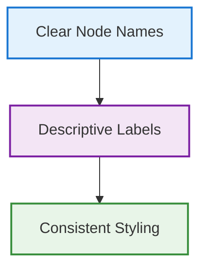

# Documentation Style Guide

This style guide ensures consistent, professional, and visually appealing documentation across the AI Agent TDD-Scrum Workflow system while maintaining maximum information density.

## Visual Hierarchy Principles

### 1. Heading Structure
Use consistent heading levels to create clear information hierarchy:

```markdown
# Page Title (H1) - Only one per page
## Major Section (H2) - Primary content divisions
### Subsection (H3) - Secondary divisions
#### Detail Section (H4) - Specific topics
##### Minor Detail (H5) - Rarely used
```

**Best Practices:**
- Skip heading levels sparingly (H1 → H3 is acceptable if logical)
- Use descriptive, action-oriented headings
- Keep headings concise but informative
- Add emoji strategically for visual scanning (🎯 for objectives, 🔧 for technical details, ⚠️ for warnings)

### 2. Content Organization Patterns

#### Command Reference Pattern
```markdown
**`/command syntax`**
Brief description in sentence case.

**Example:**
```bash
/example usage
```

**Use case:** When to use this command.
```

#### Feature Overview Pattern
```markdown
### 🎯 Feature Name
Brief introduction paragraph explaining the feature's purpose and value.

#### How It Works
Technical explanation with visual aids.

#### Key Benefits
- Benefit 1 with specific value
- Benefit 2 with measurable impact
- Benefit 3 with user advantage

#### Quick Start
```bash
# Minimal example
command --option value
```

[**→ Detailed Guide**](link-to-detailed-guide.md)
```

#### Process Flow Pattern
```markdown
### Step-by-Step Process

#### Phase 1: Setup
**What happens automatically:**
- System behavior 1
- System behavior 2

**Human interaction:**
```bash
/command example
# Expected output or behavior
```

**Artifacts created:**
- File 1: Purpose and location
- File 2: Purpose and location
```

## Visual Elements and Formatting

### 1. Emphasis and Highlighting

#### Text Emphasis
- **Bold** for commands, file names, important concepts
- *Italic* for emphasis, first use of technical terms
- `Inline code` for code snippets, variables, file paths
- **`Combined bold + code`** for command names in text

#### Callout Boxes
Use MkDocs admonitions for important information:

```markdown
!!! tip "Pro Tip"
    Use this pattern for helpful hints and best practices.

!!! warning "Important"
    Critical information that prevents errors or problems.

!!! danger "Security Alert"
    Security-related warnings and requirements.

!!! info "Technical Detail"
    Additional context for advanced users.

!!! success "Best Practice"
    Recommended approaches and patterns.

!!! example "Real-World Example"
    Practical examples and use cases.
```

### 2. Code and Commands

#### Code Block Standards
```markdown
```bash
# Use bash for shell commands with helpful comments
/command --option value  # What this does
```

```python
# Use proper language highlighting
def example_function():
    """Clear docstring."""
    return "formatted_code"
```

```yaml
# Configuration examples with comments
key: value  # Purpose of this setting
```
```

#### Command Documentation Format
```markdown
**`/command <required> [optional]`**
Clear description of what the command does.

**Parameters:**
- `required`: Description and constraints
- `optional`: Description and default value

**Example:**
```bash
/command auth-system --priority high
```

**Output:**
```
Expected response format
```

**Use Cases:**
- When to use this command
- Common scenarios and workflows
```

### 3. Visual Aids and Diagrams

#### Mermaid Diagram Standards
```markdown

```

**Diagram Best Practices:**
- Use consistent color schemes for similar concepts
- Keep node labels concise but descriptive
- Add styling for visual distinction
- Include legend when helpful
- Ensure diagrams scale well on mobile

#### Table Formatting
```markdown
| Command | Purpose | Example |
|---------|---------|---------|
| `/epic` | Define initiatives | `/epic "Build auth system"` |
| `/sprint` | Manage sprints | `/sprint start` |

**Table Guidelines:**
- Keep columns balanced in width
- Use consistent formatting within columns
- Add examples for clarity
- Break large tables into focused sections
```

## Content Structure Patterns

### 1. Landing Page Structure
```markdown
# Page Title
Compelling one-sentence description of value proposition.

## Overview
Brief explanation of what this covers and why it matters.

## Quick Start
Immediate actionable content:
```bash
# Minimal working example
command to get started
```

## Key Concepts
### Concept 1
Brief explanation with example.

### Concept 2  
Brief explanation with example.

## Detailed Sections
[Link structure for deeper content]

## Related Resources
- [Link 1](url): What you'll find there
- [Link 2](url): What you'll find there
```

### 2. Reference Page Structure
```markdown
# Reference Title
Brief description of scope and audience.

## Quick Reference
Essential information in scannable format.

## Detailed Reference
### Category 1
Detailed information organized logically.

### Category 2
Detailed information organized logically.

## Examples
Real-world usage scenarios.

## Troubleshooting
Common issues and solutions.
```

### 3. Tutorial Page Structure
```markdown
# Tutorial Title
What you'll accomplish and prerequisites.

## Prerequisites
- Requirement 1
- Requirement 2

## Step 1: Setup
Clear instructions with expected outcomes.

## Step 2: Implementation
Detailed steps with verification points.

## Step 3: Validation
How to confirm success.

## Next Steps
Where to go from here.

## Troubleshooting
Common issues specific to this tutorial.
```

## Cross-References and Navigation

### 1. Link Patterns
```markdown
# Internal Links
[**→ Detailed Guide**](relative/path.md)
[**Complete Reference**](../reference/commands.md)

# External Links
[External Resource](https://example.com) (opens in new tab)

# Section Links
[Jump to Configuration](#configuration)
```

### 2. Navigation Aids
```markdown
## Quick Navigation
| Section | Description |
|---------|-------------|
| [Getting Started](#getting-started) | Setup and first steps |
| [Advanced Usage](#advanced-usage) | Power user features |
| [Troubleshooting](#troubleshooting) | Common issues |

---

!!! tip "Navigation Helper"
    Use the table of contents in the right sidebar to jump between sections.
    Press `s` to open the search dialog.
```

## Icon and Emoji Usage

### 1. Strategic Icon Usage
Use icons to enhance scanning and navigation, not for decoration:

```markdown
### 🎯 Objectives (goals and targets)
### 🔧 Technical Details (implementation)
### 🚀 Quick Start (getting started)
### 📊 Metrics (data and analytics)
### ⚠️ Important (warnings and cautions)
### 💡 Tips (helpful hints)
### 🔍 Examples (demonstrations)
### 🏗️ Architecture (system design)
### 🔒 Security (security-related content)
### 🔄 Process (workflows and procedures)
```

### 2. Functional Icons
```markdown
**Status Indicators:**
- ✅ Completed/Working
- ⏳ In Progress
- ❌ Failed/Broken
- 🔄 Processing
- ⏸️ Paused

**Action Indicators:**
- ▶️ Start/Play
- ⏸️ Pause
- ⏹️ Stop
- 🔄 Restart/Refresh
- ⚡ Quick Action
```

## Accessibility and Mobile Considerations

### 1. Mobile-Friendly Formatting
- Keep tables narrow or use responsive design
- Break long code blocks into smaller sections
- Use collapsible sections for lengthy content
- Ensure diagrams scale appropriately

### 2. Accessibility Standards
- Use descriptive link text
- Provide alt text for images
- Ensure sufficient color contrast
- Use semantic HTML structure
- Test with screen readers

## Quality Checklist

Before publishing any documentation page, verify:

### Content Quality
- [ ] Clear, concise page title
- [ ] One-sentence value proposition
- [ ] Logical information hierarchy
- [ ] Working code examples
- [ ] Up-to-date information
- [ ] Proper spelling and grammar

### Visual Quality
- [ ] Consistent heading structure
- [ ] Appropriate use of emphasis
- [ ] Well-formatted code blocks
- [ ] Clear diagrams with consistent styling
- [ ] Strategic use of icons/emojis
- [ ] Proper table formatting

### User Experience
- [ ] Clear navigation paths
- [ ] Quick reference sections
- [ ] Real-world examples
- [ ] Troubleshooting guidance
- [ ] Cross-references to related content
- [ ] Mobile-friendly formatting

### Technical Quality
- [ ] Valid Markdown syntax
- [ ] Working internal links
- [ ] Proper file naming conventions
- [ ] Consistent file structure
- [ ] MkDocs compatibility

## Templates and Patterns

This style guide should be used with the following templates:
- Command Reference Template
- Feature Overview Template
- Tutorial Template
- Architecture Documentation Template
- Troubleshooting Template

Each template implements these style guidelines for specific content types, ensuring consistency across all documentation.