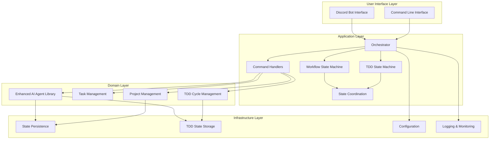
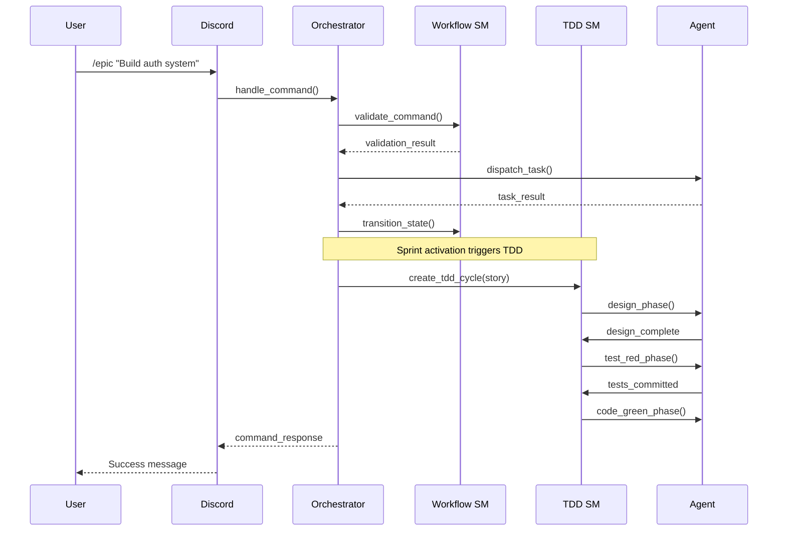
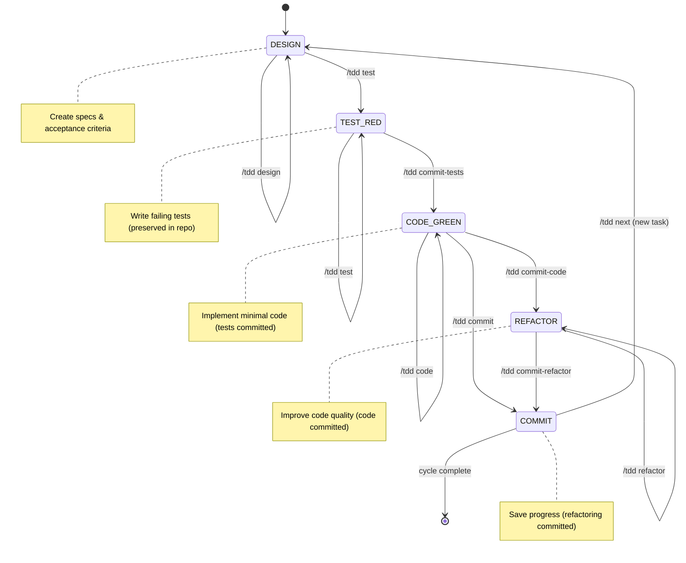

# Architecture Overview

The AI Agent TDD-Scrum Workflow system follows a clean, layered architecture designed for scalability, maintainability, and extensibility.

## Two-Repository Model

The system operates on a clear separation between orchestration and project concerns:

### Orchestration Repository (this repo)
- **Purpose**: Central framework for AI agent coordination
- **Contents**: Agent definitions, workflow engine, Discord bot, security policies
- **Scope**: Global across all managed projects
- **Lifecycle**: Long-lived, evolves with framework capabilities

### Project Repositories (1 to n)
- **Purpose**: Individual codebases being developed with AI assistance
- **Contents**: Project code + embedded workflow data in `.orch-state/`
- **Scope**: Project-specific data and state
- **Lifecycle**: Tied to project development lifecycle

This separation ensures:
- **Data Ownership**: Project data stays with the project code
- **Version Control**: Project management data versioned with code changes
- **Portability**: Projects can move between orchestration instances
- **Security**: Clear boundaries between global and project-specific access

## System Architecture

The system implements a dual state machine architecture that coordinates workflow management with Test-Driven Development cycles:



## Core Principles

### 1. **Separation of Concerns**
Each layer has distinct responsibilities:
- **Interface Layer**: User interaction and external communication
- **Application Layer**: Workflow orchestration and business logic
- **Domain Layer**: Core business entities and AI agent coordination
- **Infrastructure Layer**: Data persistence, configuration, and cross-cutting concerns

### 2. **Dual State Machine Architecture**
The system enforces dual state machines for comprehensive workflow management:

**Workflow State Machine:**
- Manages project lifecycle (IDLE → BACKLOG_READY → SPRINT_PLANNED → SPRINT_ACTIVE → SPRINT_REVIEW)
- Controls high-level workflow transitions
- Coordinates multi-project orchestration

**TDD State Machine:**
- Manages story-level development cycles (DESIGN → TEST_RED → CODE_GREEN → REFACTOR → COMMIT)
- Enforces Test-Driven Development best practices
- Coordinates agent handoffs between TDD phases
- Preserves test artifacts through the development cycle

**State Coordination:**
- Dual state machines operate in parallel
- TDD cycles activate automatically when sprints start
- Workflow states gate TDD progression
- Cross-state validation ensures consistency

### 3. **Event-Driven Architecture**
Components communicate through well-defined events:
- Command execution triggers state transitions
- Agent completion events update project status
- Human approval events unblock workflows

### 4. **Plugin Architecture**
Agents are designed as pluggable components:
- Common base interface for all agents
- Easy to add new specialized agents
- Configurable agent behavior per project

## Directory Structure

```
agent-workflow/
├── docs_src/           # MkDocs documentation source
├── docs/              # Original documentation files
├── scripts/           # Executable entry points
│   └── orchestrator.py
├── lib/               # Core library code
│   ├── agents/        # Enhanced AI agent implementations
│   ├── state_machine.py      # Workflow state machine
│   ├── tdd_state_machine.py  # TDD state machine
│   ├── tdd_models.py         # TDD data models
│   └── discord_bot.py
├── tests/             # Test suite
│   ├── unit/         # Unit tests
│   │   ├── test_tdd_models.py
│   │   └── test_tdd_state_machine.py
│   ├── integration/  # Integration tests
│   └── conftest.py   # Test configuration
├── requirements.txt   # Dependencies
├── mkdocs.yml        # Documentation configuration
├── Makefile          # Build automation
└── README.md         # Project overview
```

## Component Interaction

### 1. **Dual State Machine Command Flow**


### 2. **Dual State Management**
- **Workflow State**: Project-level state in `.orch-state/status.json`
- **TDD State**: Story-level state in `.orch-state/tdd/`
- **State Coordination**: Orchestrator coordinates both state machines
- **State Recovery**: Both systems recover state on restart
- **Multi-Project**: Independent dual state machines per project
- **Test Preservation**: TDD state preserves test artifacts through cycles

### 3. **Enhanced Agent Coordination**
- **Dual Task Queues**: Workflow tasks and TDD tasks managed separately
- **Phase-Specific Agents**: Agents specialized for TDD phases (Design, QA, Code)
- **TDD Agent Handoffs**: Coordinated transitions between TDD phases
- **Test Preservation**: QA Agent preserves tests through code and refactor phases
- **Retry Logic**: TDD-aware retry with phase-specific backoff
- **Human Escalation**: HITL approval for both workflow and TDD decisions
- **Parallel TDD Cycles**: Multiple stories can run TDD cycles simultaneously

## Design Patterns

### 1. **Command Pattern**
Each user command is encapsulated as a command object:
- Enables undo/redo functionality
- Facilitates command logging and auditing
- Allows command queuing and batch processing

### 2. **State Pattern**
Workflow states encapsulate behavior:
- Each state defines allowed commands
- State transitions are explicit and validated
- Easy to add new states and transitions

### 3. **Strategy Pattern**
Agent implementations use strategy pattern:
- Agents can be swapped at runtime
- Different strategies for different project types
- Easy A/B testing of agent behaviors

### 4. **Observer Pattern**
Event-driven communication between components:
- Loose coupling between layers
- Easy to add new event handlers
- Supports monitoring and debugging

## Scalability Considerations

### 1. **Horizontal Scaling**
- Multiple orchestrator instances can run simultaneously
- Discord bot can be load-balanced
- Agent execution can be distributed

### 2. **Performance Optimization**
- Async/await throughout for I/O operations
- Caching of frequently accessed data
- Batch processing of similar tasks

### 3. **Resource Management**
- Connection pooling for external services
- Rate limiting for API calls
- Memory-efficient state storage

## Security Architecture

The system implements comprehensive security through multiple layers of protection. See [Security Implementation](security-implementation.md) for detailed information.

### 1. **Agent Security Model**
- **Command Access Control**: Each agent type has restricted tool access
- **Principle of Least Privilege**: Agents can only access necessary tools
- **Automatic Enforcement**: Security boundaries applied via Claude Code CLI flags

### 2. **Authentication & Authorization**
- Discord bot token authentication
- Role-based access control in Discord
- Project-level permission isolation
- Agent-specific security profiles

### 3. **Data Protection**
- No sensitive data stored in state files
- Environment variables for secrets
- Audit logging of all commands and agent tool usage
- State file access controls

## TDD Architecture Components

### TDD State Machine

The TDD State Machine manages the Test-Driven Development cycle for individual stories:



### TDD Data Models

Comprehensive data models support the TDD workflow:

- **TDDCycle**: Links to story, manages tasks and overall progress
- **TDDTask**: Individual task within cycle, tracks test files and results
- **TestFile**: Manages test file lifecycle and CI integration
- **TestResult**: Captures test execution outcomes and metrics

### Test Preservation Workflow

The system preserves test artifacts through the entire development cycle:

1. **TEST_RED Phase**: Tests created in `tests/tdd/{story_id}/`
2. **CODE_GREEN Phase**: Tests committed to repository
3. **REFACTOR Phase**: Tests remain unchanged, validate refactoring
4. **COMMIT Phase**: Tests promoted to permanent test locations
5. **Integration**: Tests integrated into CI/CD pipeline

### Enhanced Agent Capabilities

**Design Agent (TDD-Enhanced):**
- Creates technical specifications for TDD cycles
- Defines acceptance criteria and test strategies
- Generates design artifacts for test creation

**QA Agent (TDD-Enhanced):**
- Writes comprehensive failing tests (RED phase)
- Manages test file lifecycle and preservation
- Validates test coverage and quality
- Ensures tests remain green through refactoring

**Code Agent (TDD-Enhanced):**
- Implements minimal code to make tests pass (GREEN phase)
- Refactors code while preserving test success
- Commits code with proper test integration
- Maintains TDD discipline throughout development

## Extensibility Points

### 1. **Custom Agents**
```python
class CustomAgent(BaseAgent):
    def __init__(self):
        super().__init__(
            name="CustomAgent",
            capabilities=["custom_capability"]
        )
    
    async def run(self, task, dry_run=False):
        # Custom implementation
        pass
```

### 2. **Custom Commands**
Add new slash commands by extending the Discord bot:
```python
@app_commands.command(name="custom", description="Custom command")
async def custom_command(self, interaction, param: str):
    # Custom command implementation
    pass
```

### 3. **Custom Workflow States**
Extend the workflow state machine with new states:
```python
class CustomWorkflowState(Enum):
    CUSTOM_STATE = "CUSTOM_STATE"
```

### 4. **Custom TDD States**
Extend the TDD state machine with new phases:
```python
class CustomTDDState(Enum):
    SECURITY_REVIEW = "SECURITY_REVIEW"
    PERFORMANCE_TEST = "PERFORMANCE_TEST"
```

### 5. **TDD Cycle Customization**
Customize TDD cycles for specific story types:
```python
class CustomTDDCycle(TDDCycle):
    def __init__(self, story_type: str):
        super().__init__()
        if story_type == "api":
            self.add_integration_tests = True
        elif story_type == "ui":
            self.add_e2e_tests = True
```

## Monitoring & Observability

### 1. **Logging Strategy**
- Structured logging with JSON format
- Different log levels per component
- Centralized log aggregation ready

### 2. **Metrics Collection**
- Command execution metrics
- Agent performance metrics
- State transition tracking

### 3. **Health Checks**
- Discord bot connectivity
- Agent responsiveness
- State persistence availability

---

!!! info "Architecture Evolution"
    This architecture is designed to evolve with the system's needs. New patterns and components can be added while maintaining backward compatibility.