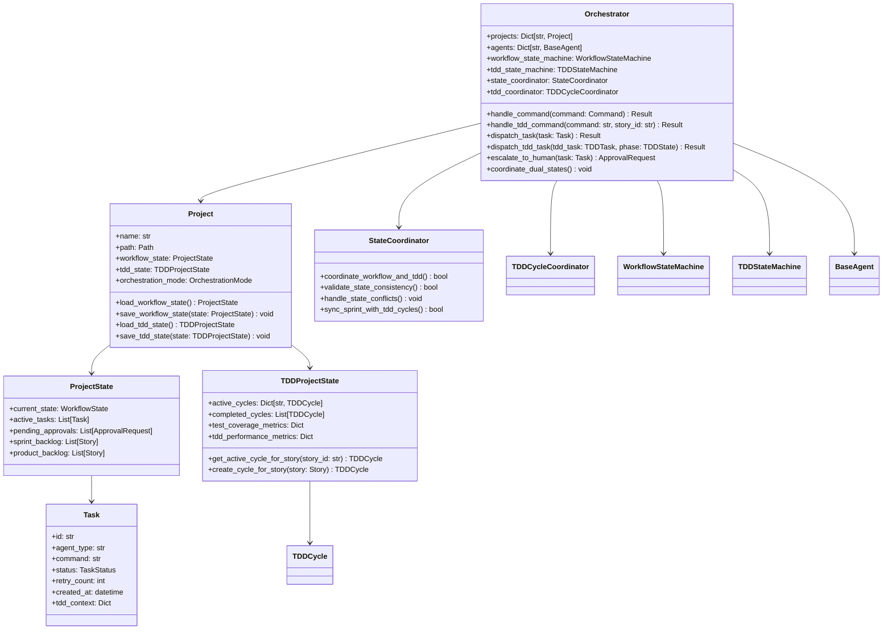

# C4 Code Diagram - AI Agent TDD-Scrum Workflow

## Dual State Machine Class Structure

The system implements dual state machines that work in coordination to manage both workflow progression and Test-Driven Development cycles.

### Workflow State Machine

### TDD State Machine

## TDD Data Models

## Enhanced Agent Class Hierarchy

## TDD Phase Management Classes

## Enhanced Orchestrator Core Classes

## Discord Bot Classes

