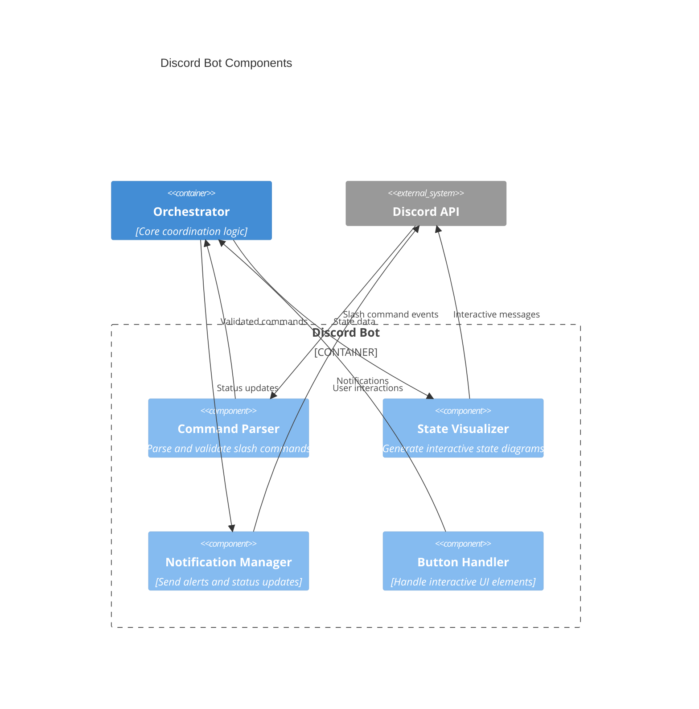
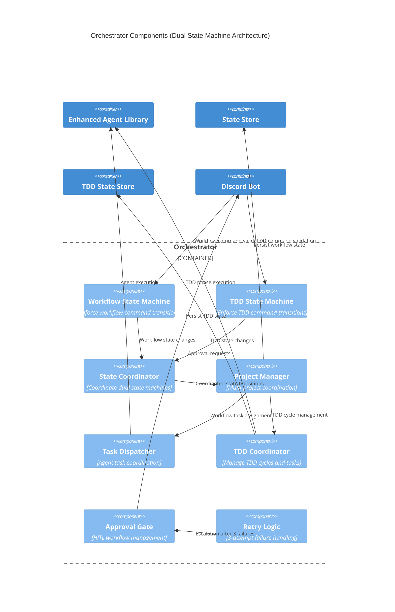
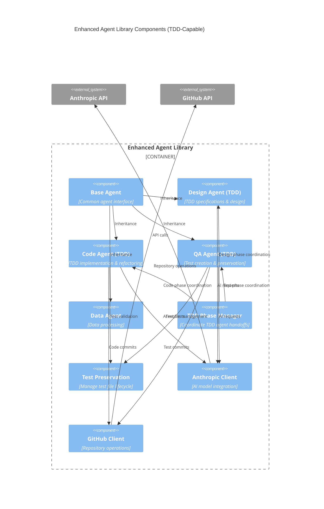
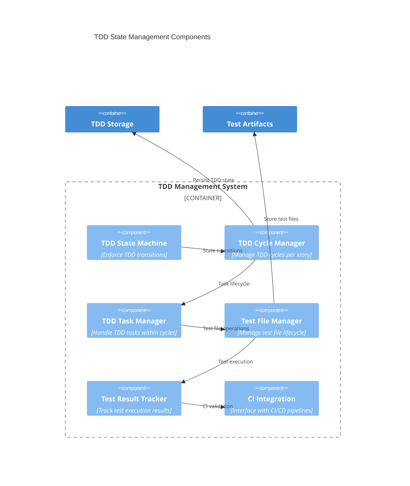
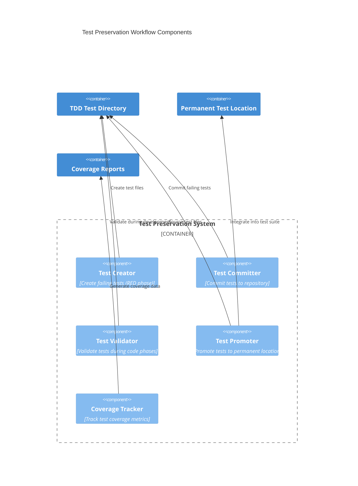

# C4 Component Diagram - AI Agent TDD-Scrum Workflow

## Component Architecture

The system implements a dual state machine architecture with TDD-enhanced agents that coordinate workflow management and Test-Driven Development cycles.

### Discord Bot Components

### Orchestrator Components

### Enhanced Agent Library Components

### TDD State Management Components

### Test Preservation Workflow Components

