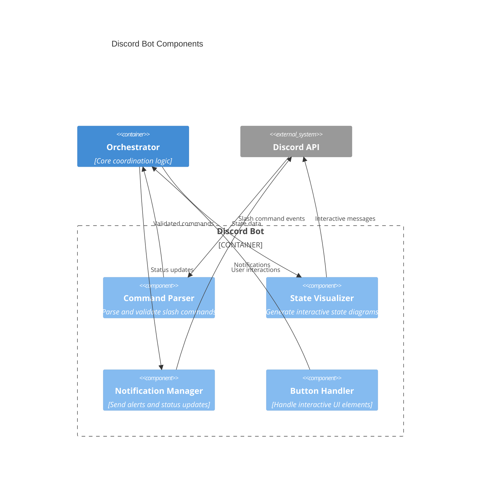
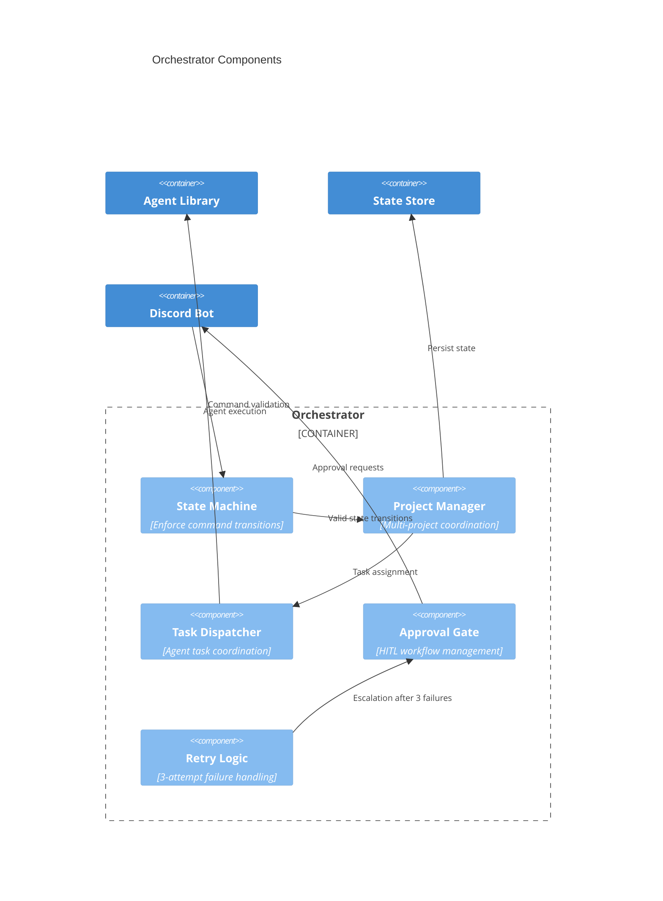
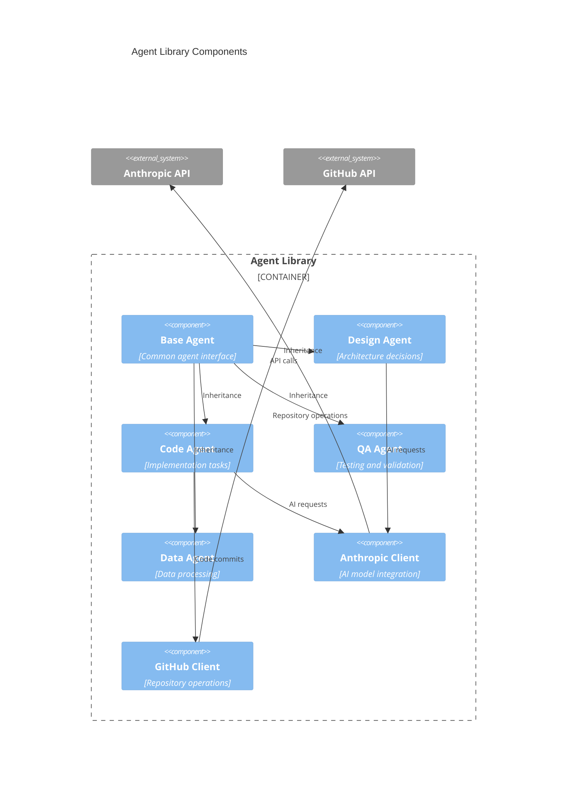

# C4 Component Diagram - AI Agent TDD-Scrum Workflow

## Component Architecture

### Discord Bot Components

```mermaid
C4Component
    title Discord Bot Components

    Container_Boundary(discord_bot, "Discord Bot") {
        Component(command_parser, "Command Parser", "Parse and validate slash commands")
        Component(state_visualizer, "State Visualizer", "Generate interactive state diagrams")
        Component(notification_manager, "Notification Manager", "Send alerts and status updates")
        Component(button_handler, "Button Handler", "Handle interactive UI elements")
    }
    
    Container(orchestrator, "Orchestrator", "Core coordination logic")
    System_Ext(discord_api, "Discord API")
    
    Rel(discord_api, command_parser, "Slash command events")
    Rel(command_parser, orchestrator, "Validated commands")
    Rel(orchestrator, state_visualizer, "State data")
    Rel(state_visualizer, discord_api, "Interactive messages")
    Rel(orchestrator, notification_manager, "Status updates")
    Rel(notification_manager, discord_api, "Notifications")
    Rel(button_handler, orchestrator, "User interactions")
```

### Orchestrator Components

```mermaid
C4Component
    title Orchestrator Components

    Container_Boundary(orchestrator, "Orchestrator") {
        Component(state_machine, "State Machine", "Enforce command transitions")
        Component(project_manager, "Project Manager", "Multi-project coordination")
        Component(task_dispatcher, "Task Dispatcher", "Agent task coordination")
        Component(approval_gate, "Approval Gate", "HITL workflow management")
        Component(retry_logic, "Retry Logic", "3-attempt failure handling")
    }
    
    Container(agent_lib, "Agent Library")
    Container(state_store, "State Store")
    Container(discord_bot, "Discord Bot")
    
    Rel(discord_bot, state_machine, "Command validation")
    Rel(state_machine, project_manager, "Valid state transitions")
    Rel(project_manager, task_dispatcher, "Task assignment")
    Rel(task_dispatcher, agent_lib, "Agent execution")
    Rel(approval_gate, discord_bot, "Approval requests")
    Rel(retry_logic, approval_gate, "Escalation after 3 failures")
    Rel(project_manager, state_store, "Persist state")
```

### Agent Library Components

```mermaid
C4Component
    title Agent Library Components

    Container_Boundary(agent_lib, "Agent Library") {
        Component(base_agent, "Base Agent", "Common agent interface")
        Component(design_agent, "Design Agent", "Architecture decisions")
        Component(code_agent, "Code Agent", "Implementation tasks")
        Component(qa_agent, "QA Agent", "Testing and validation")
        Component(data_agent, "Data Agent", "Data processing")
        Component(anthropic_client, "Anthropic Client", "AI model integration")
        Component(github_client, "GitHub Client", "Repository operations")
    }
    
    System_Ext(anthropic_api, "Anthropic API")
    System_Ext(github_api, "GitHub API")
    
    Rel(base_agent, design_agent, "Inheritance")
    Rel(base_agent, code_agent, "Inheritance")
    Rel(base_agent, qa_agent, "Inheritance")
    Rel(base_agent, data_agent, "Inheritance")
    Rel(design_agent, anthropic_client, "AI requests")
    Rel(code_agent, anthropic_client, "AI requests")
    Rel(code_agent, github_client, "Code commits")
    Rel(anthropic_client, anthropic_api, "API calls")
    Rel(github_client, github_api, "Repository operations")
```