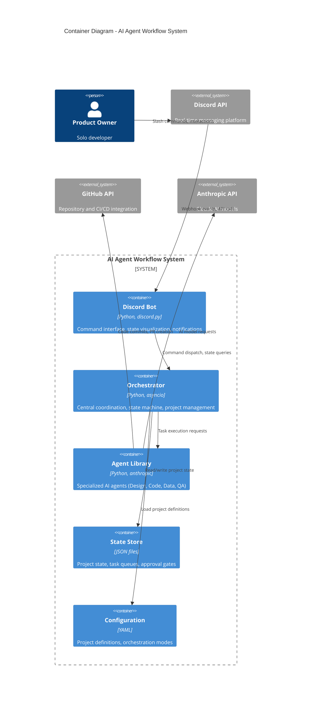

# C4 Container Diagram - AI Agent TDD-Scrum Workflow

## Container Architecture

## Container Responsibilities

### Discord Bot
- Parse and validate slash commands
- Implement interactive state visualization
- Send notifications and approval requests
- Handle user interactions and buttons

### Orchestrator
- Enforce state machine transitions
- Coordinate multi-agent workflows
- Implement HITL approval gates
- Manage project lifecycle

### Agent Library
- Specialized agent implementations
- Anthropic API integration
- Code generation and testing
- GitHub operations

### State Store
- Persist workflow state across restarts
- Track task queues and approvals
- Maintain project status

### Configuration
- Define project orchestration modes
- Configure agent behaviors
- Set approval thresholds