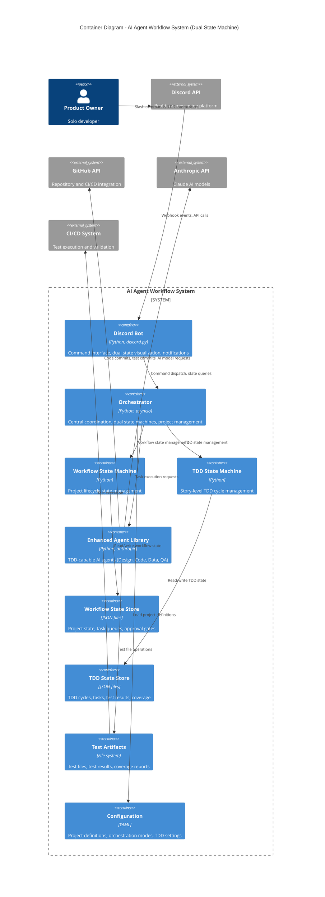

# C4 Container Diagram - AI Agent TDD-Scrum Workflow

## Container Architecture

The system implements a dual state machine architecture that coordinates workflow management with Test-Driven Development cycles through specialized containers.

## Container Responsibilities

### Discord Bot
- Parse and validate workflow and TDD slash commands
- Implement dual state visualization (workflow + TDD)
- Send notifications for both workflow and TDD events
- Handle user interactions and approval buttons
- Display TDD cycle progress and test results

### Orchestrator
- Coordinate dual state machines (workflow + TDD)
- Enforce state machine transitions for both systems
- Coordinate multi-agent workflows with TDD integration
- Implement HITL approval gates for workflow and TDD decisions
- Manage project lifecycle with TDD cycle coordination

### Workflow State Machine
- Manage project-level states (IDLE → BACKLOG_READY → SPRINT_PLANNED → SPRINT_ACTIVE → SPRINT_REVIEW)
- Validate workflow command sequences
- Trigger TDD cycle creation during sprint activation
- Coordinate with TDD state machine for sprint completion

### TDD State Machine
- Manage story-level TDD cycles (DESIGN → TEST_RED → CODE_GREEN → REFACTOR → COMMIT)
- Enforce TDD command sequences and best practices
- Coordinate agent handoffs between TDD phases
- Validate TDD transition conditions (test status, code quality)

### Enhanced Agent Library
- TDD-capable agent implementations with phase specialization
- Design Agent: Creates TDD specifications and acceptance criteria
- QA Agent: Manages test creation, preservation, and validation
- Code Agent: Implements TDD discipline (minimal code, refactoring)
- Anthropic API integration with TDD context
- GitHub operations including test commits and CI integration

### Workflow State Store
- Persist workflow state across restarts
- Track task queues and approvals
- Maintain project status and sprint progress
- Coordinate with TDD state for completion tracking

### TDD State Store
- Persist TDD cycle state and progress
- Track test results and coverage metrics
- Maintain test file lifecycle information
- Store TDD task progress and agent handoff data

### Test Artifacts
- Store test files in TDD directory structure
- Maintain test results and execution history
- Preserve test coverage reports and metrics
- Support test file promotion to permanent locations

### Configuration
- Define project orchestration modes (including TDD settings)
- Configure agent behaviors for TDD phases
- Set approval thresholds for both workflow and TDD decisions
- Define TDD quality gates and coverage requirements