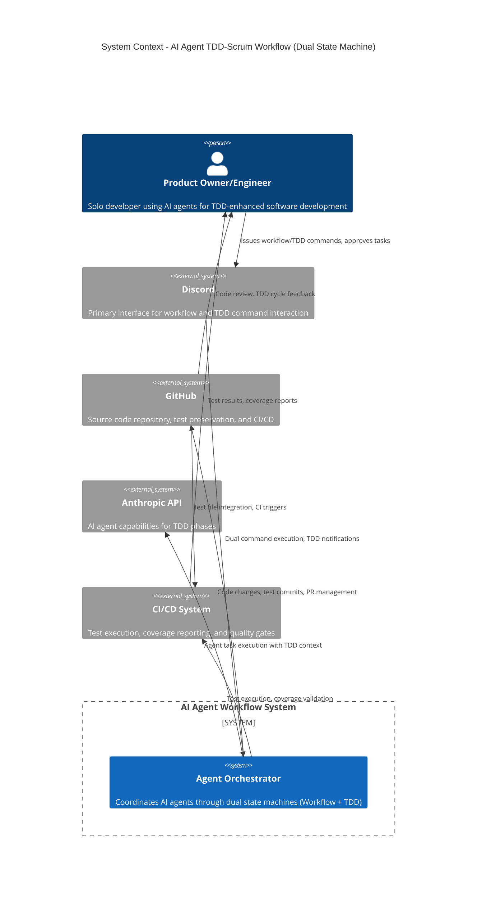

# C4 Context Diagram - AI Agent TDD-Scrum Workflow

## System Context

The system context shows how the dual state machine architecture integrates with external systems to support both workflow management and Test-Driven Development cycles.

## Key Interactions

1. **User → Discord**: Issues workflow and TDD slash commands (`/epic`, `/sprint`, `/tdd test`, `/tdd code`, `/approve`)
2. **Discord → Orchestrator**: Dual command parsing and state transitions (workflow + TDD)
3. **Orchestrator → Agents**: Task dispatch with TDD phase coordination
4. **Agents → GitHub**: Code implementation, test preservation, and PR creation
5. **Agents → CI System**: Test execution, coverage validation, and quality gates
6. **GitHub → User**: CI results, TDD cycle progress, and code review
7. **CI System → User**: Test results, coverage reports, and TDD metrics
8. **User Approval Loop**: HITL gates for strategic workflow and TDD decisions
9. **Test Preservation Flow**: TDD test files committed and preserved through development cycle
10. **Dual State Coordination**: Workflow and TDD state machines synchronized for sprint completion