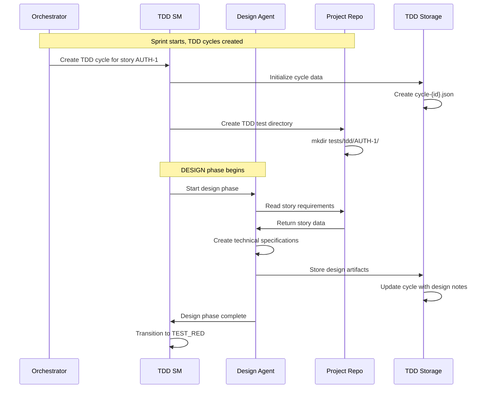
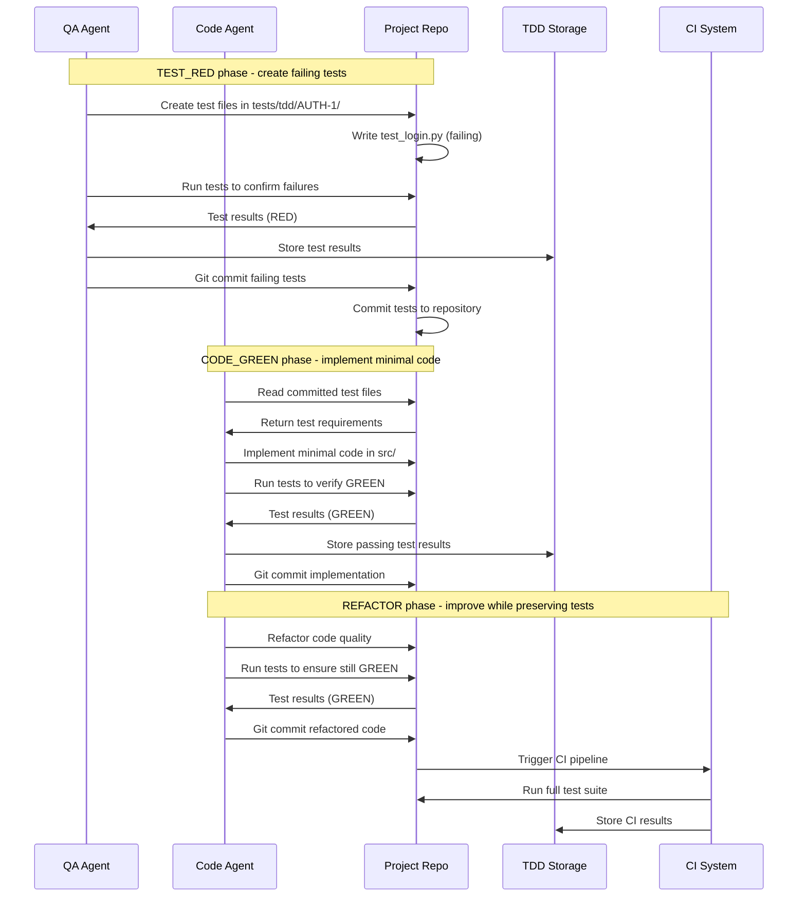
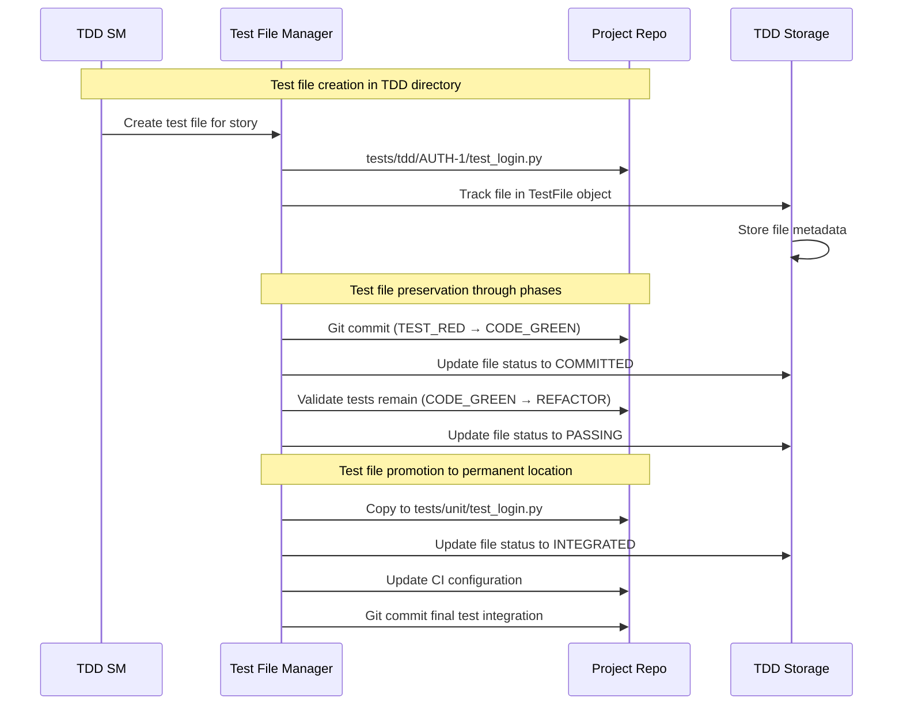
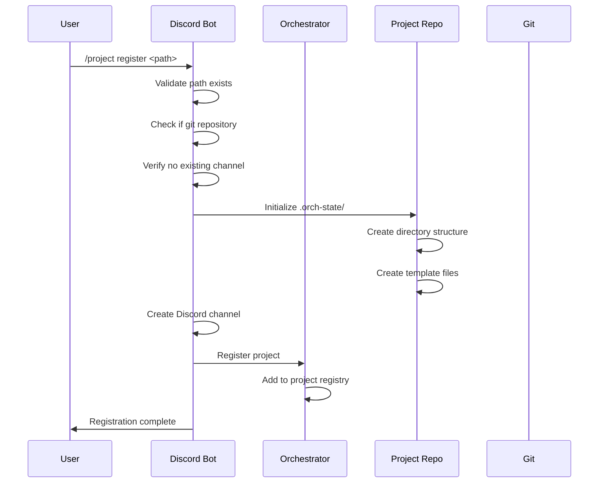
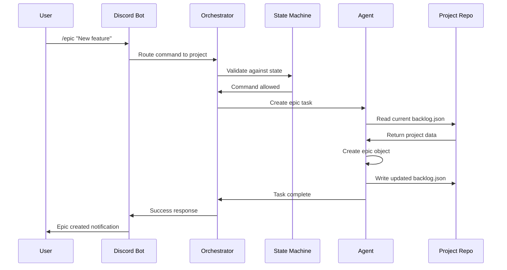
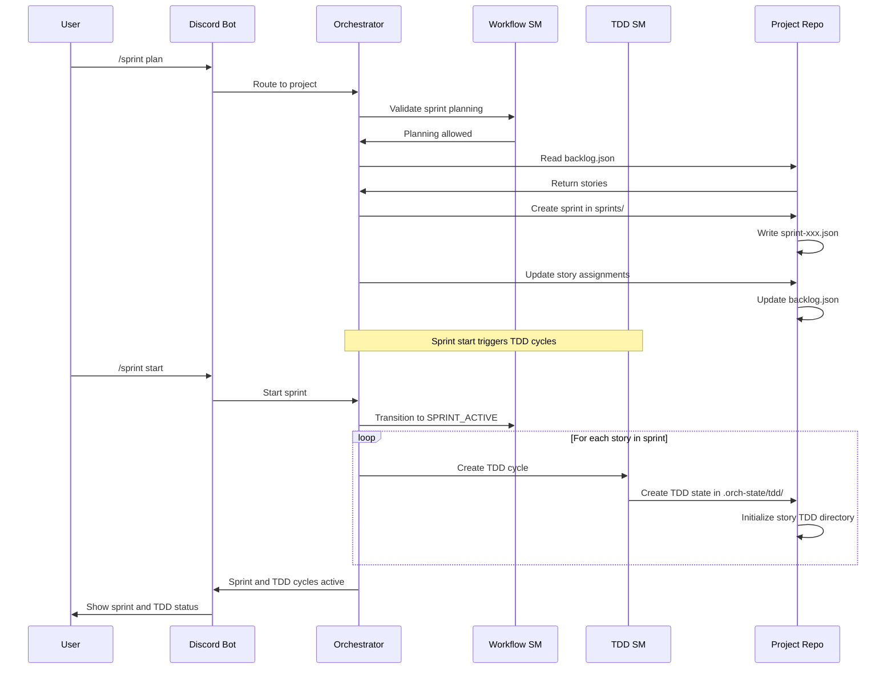
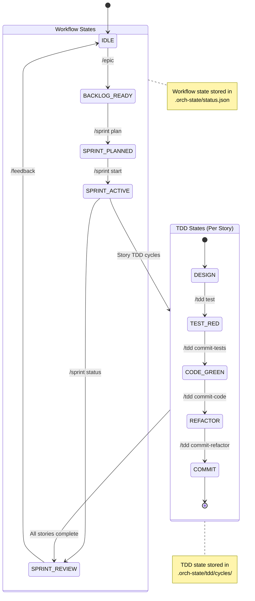

# Data Flow Architecture

This document describes how data flows between the orchestration repository and project repositories in the two-repository model, including the Test-Driven Development workflow and test preservation patterns.

## Overview

The AI Agent TDD-Scrum workflow system operates on a clear separation between:
- **Orchestration Repository**: Central framework, coordination, and dual state machine management
- **Project Repositories**: Individual codebases with embedded project management data and TDD state

The system implements dual data flows:
- **Workflow Data Flow**: Project-level state and management data
- **TDD Data Flow**: Story-level TDD cycles, test files, and test preservation

## Data Flow Patterns

### 4. TDD Cycle Initialization Flow



### 5. Test Preservation Workflow



### 6. Test File Lifecycle Management



### 1. Project Registration Flow



### 2. Command Execution Flow



### 3. Sprint Management with TDD Integration Flow



## Data Storage Patterns

### Orchestration Repository
```
agent-workflow/
├── lib/
│   ├── agents/              # Agent definitions (global)
│   ├── state_machine.py     # Workflow states (global)
│   ├── discord_bot.py       # Interface (global)
│   └── agent_tool_config.py # Security policies (global)
├── scripts/
│   └── orchestrator.py      # Coordination engine (global)
└── docs_src/               # Framework documentation (global)
```

### Project Repository
```
project-repo/
├── src/                    # Project code (project-specific)
├── tests/                  # Project tests (project-specific)
│   ├── unit/              # Permanent unit tests
│   ├── integration/       # Permanent integration tests
│   └── tdd/               # TDD working directory
│       └── {story-id}/    # Per-story TDD tests
├── .orch-state/           # Workflow data (project-specific)
│   ├── backlog.json       # Project management data
│   ├── sprints/           # Sprint history
│   ├── tdd/               # TDD state storage
│   │   ├── cycles/        # TDD cycle data
│   │   └── test-results/  # Test execution results
│   ├── architecture.md    # Project architecture decisions
│   ├── best-practices.md  # Project conventions
│   └── status.json        # Current workflow state
└── .git/                  # Version control (project-specific)
```

## Read/Write Access Patterns

### Read Operations
- **Orchestrator → Project**: Reads workflow state, backlog, and configuration
- **TDD State Machine → Project**: Reads TDD cycles, test results, and coverage
- **Discord Bot → Project**: Displays current workflow and TDD status
- **Agents → Project**: Access context for both workflow and TDD decision making
- **Test File Manager → Project**: Reads test files and execution results

### Write Operations
- **Orchestrator → Project**: Updates workflow state and project data
- **TDD State Machine → Project**: Updates TDD cycle state and test data
- **Agents → Project**: Persist workflow task results and TDD artifacts
- **Discord Commands → Project**: Modify backlogs, sprints, and TDD cycles
- **Test Preservation → Project**: Commit and promote test files

### Security Boundaries
- **No Cross-Project Access**: Agents cannot read other project data or TDD cycles
- **Limited Write Scope**: Only `.orch-state/` and `tests/tdd/` directories writable
- **TDD Isolation**: TDD cycles isolated per story to prevent test contamination
- **Git Permissions**: Standard repository access controls apply to both workflow and test data

## State Synchronization

### Dual State Machine Coordination



### Multi-Project Coordination
- **Independent Dual States**: Each project has own workflow and TDD state machines
- **Parallel Execution**: Multiple projects and TDD cycles can be active simultaneously
- **Resource Sharing**: Agents allocated per project and TDD phase needs
- **Conflict Prevention**: Discord channels provide isolation for both workflow and TDD commands
- **TDD Isolation**: TDD cycles per story prevent cross-story test contamination

## Data Consistency

### Eventual Consistency Model
- **Local Consistency**: Each project maintains internal consistency for both workflow and TDD data
- **Dual State Consistency**: Workflow and TDD state machines maintain synchronized state
- **Global Coordination**: Orchestrator ensures cross-project resource allocation and TDD cycle coordination
- **Conflict Resolution**: Manual intervention for complex workflow and TDD scenarios

### Transaction Boundaries
- **Single Project**: ACID properties maintained within project for both workflow and TDD data
- **Cross Project**: No transactions spanning projects or TDD cycles
- **TDD Atomicity**: TDD phase transitions are atomic within a story
- **Rollback Strategy**: Git provides rollback capabilities for both code and test artifacts

### Backup and Recovery
- **Git History**: Complete audit trail of all workflow and TDD changes
- **State Recovery**: Projects can be restored from any git commit including TDD state
- **Test Preservation**: TDD test artifacts preserved through git history
- **Disaster Recovery**: Projects portable between orchestration instances with full TDD history

## Performance Considerations

### Read Performance
- **Local Access**: Project and TDD data accessed directly from filesystem
- **Caching Strategy**: Orchestrator caches frequently accessed workflow and TDD state
- **Lazy Loading**: Project and TDD data loaded on-demand
- **TDD State Optimization**: TDD cycles loaded only when stories are active

### Write Performance
- **Batched Writes**: Multiple workflow and TDD changes combined into single commits
- **Asynchronous Operations**: Non-blocking writes to project repositories and TDD storage
- **Conflict Avoidance**: Structured data minimizes merge conflicts for both workflow and TDD data
- **Test File Efficiency**: Test files written incrementally during TDD phases

### Scalability
- **Horizontal Scaling**: Add projects and TDD cycles without affecting others
- **Resource Isolation**: Per-project and per-story resource allocation
- **Network Efficiency**: Local filesystem access minimizes I/O for both workflow and test data
- **TDD Parallelization**: Multiple TDD cycles can run simultaneously across stories

## Monitoring and Observability

### Data Flow Metrics
- **Command Latency**: Time from Discord to project and TDD updates
- **State Transition Frequency**: Workflow and TDD progression rates
- **Error Rates**: Failed operations per project and TDD cycle
- **TDD Cycle Metrics**: Time spent in each TDD phase, test coverage progression
- **Test Preservation Success**: Rate of successful test file lifecycle management

### Audit Trail
- **Git History**: All workflow and TDD changes tracked in version control
- **Discord Logs**: Command execution history for both workflow and TDD commands
- **Agent Logs**: Detailed task execution traces including TDD phase transitions
- **TDD Logs**: Test creation, execution, and preservation activities
- **Test Result History**: Complete test execution timeline and results

### Health Checks
- **Project Repository**: Git status and filesystem health for both workflow and test data
- **Data Integrity**: JSON schema validation for workflow and TDD state
- **State Consistency**: Dual state machine validation and synchronization
- **Test File Integrity**: Verification of test file preservation and promotion
- **TDD Cycle Health**: Detection of stuck TDD cycles and automated recovery