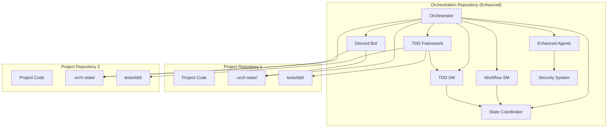

# Orchestration Repository Architecture

The orchestration repository (this repository) contains the AI agent framework, dual state machine architecture, and multi-project coordination logic. It serves as the centralized system that manages multiple project repositories with integrated Test-Driven Development workflows.

## Responsibilities

### Core Framework
- **Enhanced Agent Definitions**: TDD-capable AI agent types (CodeAgent, DesignAgent, QAAgent, DataAgent)
- **Dual State Machines**: Workflow and TDD state management with validation
- **Discord Bot**: Human-In-The-Loop interface for workflow and TDD commands
- **Enhanced Security System**: Agent tool access control with TDD phase restrictions
- **Orchestrator**: Central coordination engine with dual state machine support
- **TDD Framework**: Complete TDD cycle management and test preservation system

### Multi-Project Management
- **Project Registry**: Configuration and discovery of project repositories with TDD support
- **Channel Management**: Automatic Discord channel creation per project with TDD command support
- **Dual State Coordination**: Cross-project workflow and TDD cycle management
- **Resource Allocation**: Agent assignment and task distribution across workflow and TDD phases
- **TDD Orchestration**: Parallel TDD cycle management across multiple stories and projects

### Global Configuration
- **Enhanced Agent Security Profiles**: Tool access restrictions per agent type with TDD phase controls
- **Workflow Templates**: Reusable workflow definitions with TDD integration
- **TDD Templates**: Reusable TDD cycle configurations and quality gates
- **Discord Bot Configuration**: Global bot settings for workflow and TDD commands
- **Logging and Monitoring**: Centralized logging across all projects including TDD activities

## Architecture Components

## Data Flow

### Project Registration
1. User runs `/project register <path>` in Discord
2. Discord Bot validates project path and git repository
3. Orchestrator creates project instance with storage
4. Discord channel created with naming convention `{hostname}-{projectname}`
5. Project structure initialized in target repository

### Enhanced Command Execution (with TDD Support)
1. User issues workflow or TDD command in project-specific Discord channel
2. Discord Bot routes command to Orchestrator with project and TDD context
3. Orchestrator validates command against appropriate state machine (workflow or TDD)
4. State Coordinator ensures dual state machine consistency
5. Appropriate agent executes command with enhanced security restrictions
6. Results stored in project repository's `.orch-state/` directory (workflow or TDD)
7. TDD-specific results also stored in `tests/tdd/` directory structure

### Enhanced State Management (Dual State Architecture)
- **Global State**: Orchestrator maintains registry of all projects with dual state tracking
- **Project Workflow State**: Each project has independent workflow state machine
- **Project TDD State**: Each project has independent TDD state machines per story
- **Dual Persistence**: 
  - Workflow state persisted in `.orch-state/status.json`
  - TDD state persisted in `.orch-state/tdd/` directory
- **State Coordination**: State Coordinator ensures workflow and TDD state consistency
- **Synchronization**: Discord Bot keeps channel mappings current for both workflow and TDD

## Security Architecture

### Enhanced Agent Isolation (with TDD Controls)
- Each project has isolated agent instances with TDD capabilities
- Agents cannot access data from other projects or TDD cycles
- Story-level TDD isolation prevents cross-story contamination
- Tool access restricted based on agent type, project context, and TDD phase
- TDD phase-specific restrictions ensure proper test preservation

### Enhanced Repository Boundaries (with TDD Support)
- Orchestration repo has read-only access to project repos
- Write access limited to `.orch-state/` and `tests/tdd/` directories only
- No cross-project or cross-story TDD data access without explicit permission
- Test file preservation workflow enforces proper access controls

### Enhanced Discord Security (with TDD Commands)
- Project-specific channels provide access control for workflow and TDD commands
- Commands validated against project membership and TDD cycle permissions
- Audit trail maintained in project repositories for both workflow and TDD activities
- TDD command permissions integrated with Discord role-based access control

## Deployment Model

### Single Instance
- One orchestration instance manages multiple projects
- Scales horizontally by project distribution
- Discord Bot provides unified interface

### Enhanced Configuration (with TDD Support)
- Projects registered via Discord commands with TDD capabilities enabled
- TDD templates and quality gates configured automatically
- No manual configuration files required for workflow or TDD setup
- Self-discovering and self-healing for both workflow and TDD state

### Enhanced Monitoring (with TDD Metrics)
- Centralized logging from all projects including TDD activities
- Health checks per project covering workflow and TDD state
- Performance metrics aggregated across projects including TDD cycle times
- TDD-specific metrics: cycle completion rates, test coverage trends, quality gate pass rates
- Real-time TDD cycle monitoring and stuck cycle detection