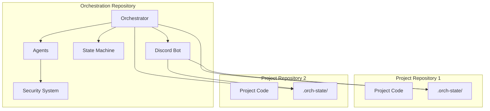

# Orchestration Repository Architecture

The orchestration repository (this repository) contains the AI agent framework and multi-project coordination logic. It serves as the centralized system that manages multiple project repositories.

## Responsibilities

### Core Framework
- **Agent Definitions**: All AI agent types (CodeAgent, DesignAgent, QAAgent, DataAgent)
- **State Machine**: Workflow state management and validation
- **Discord Bot**: Human-In-The-Loop interface for all projects
- **Security System**: Agent tool access control and restrictions
- **Orchestrator**: Central coordination engine

### Multi-Project Management
- **Project Registry**: Configuration and discovery of project repositories
- **Channel Management**: Automatic Discord channel creation per project
- **State Coordination**: Cross-project workflow management
- **Resource Allocation**: Agent assignment and task distribution

### Global Configuration
- **Agent Security Profiles**: Tool access restrictions per agent type
- **Workflow Templates**: Reusable workflow definitions
- **Discord Bot Configuration**: Global bot settings and commands
- **Logging and Monitoring**: Centralized logging across all projects

## Architecture Components

## Data Flow

### Project Registration
1. User runs `/project register <path>` in Discord
2. Discord Bot validates project path and git repository
3. Orchestrator creates project instance with storage
4. Discord channel created with naming convention `{hostname}-{projectname}`
5. Project structure initialized in target repository

### Command Execution
1. User issues command in project-specific Discord channel
2. Discord Bot routes command to Orchestrator with project context
3. Orchestrator validates command against project state machine
4. Appropriate agent executes command with security restrictions
5. Results stored in project repository's `.orch-state/` directory

### State Management
- **Global State**: Orchestrator maintains registry of all projects
- **Project State**: Each project has independent state machine
- **Persistence**: Project state persisted in project repository
- **Synchronization**: Discord Bot keeps channel mappings current

## Security Architecture

### Agent Isolation
- Each project has isolated agent instances
- Agents cannot access data from other projects
- Tool access restricted based on agent type and project context

### Repository Boundaries
- Orchestration repo has read-only access to project repos
- Write access limited to `.orch-state/` directory only
- No cross-project data access without explicit permission

### Discord Security
- Project-specific channels provide access control
- Commands validated against project membership
- Audit trail maintained in project repositories

## Deployment Model

### Single Instance
- One orchestration instance manages multiple projects
- Scales horizontally by project distribution
- Discord Bot provides unified interface

### Configuration
- Projects registered via Discord commands
- No manual configuration files required
- Self-discovering and self-healing

### Monitoring
- Centralized logging from all projects
- Health checks per project
- Performance metrics aggregated across projects