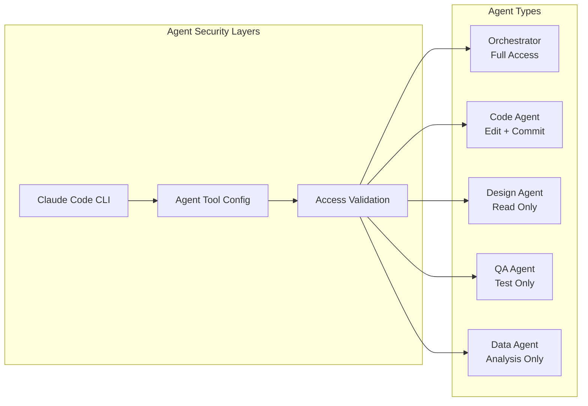

# Security Architecture

## Overview

The AI Agent TDD-Scrum Workflow system implements comprehensive security measures to ensure safe operation of AI agents with appropriate access controls and data protection. This includes enhanced security boundaries for Test-Driven Development workflows, test file access controls, and TDD-specific agent restrictions.

## Agent Security Model

### Command Access Control

Each agent type operates under the **Principle of Least Privilege**, with access restricted to only the tools necessary for their specific function.



### Enhanced Agent Access Matrix (with TDD Capabilities)

| Tool Category | Orchestrator | Code Agent (TDD) | Design Agent (TDD) | QA Agent (TDD) | Data Agent |
|---------------|-------------|------------------|-------------------|---------------|------------|
| **File Operations** |
| Read files | ✅ | ✅ | ✅ | ✅ | ✅ |
| Write new files | ✅ | ✅ | ✅ | ✅ | ✅ |
| Edit existing code | ✅ | ✅ | ❌ | ❌ | ❌ |
| Delete files | ✅ | ❌ | ❌ | ❌ | ❌ |
| **TDD-Specific File Operations** |
| Create test files | ✅ | ✅ | ❌ | ✅ | ❌ |
| Edit test files | ✅ | ✅ (during CODE_GREEN) | ❌ | ✅ (during TEST_RED) | ❌ |
| Preserve test files | ✅ | ✅ | ❌ | ✅ | ❌ |
| Promote test files | ✅ | ✅ | ❌ | ✅ | ❌ |
| Delete test files | ✅ | ❌ | ❌ | ❌ | ❌ |
| **Version Control** |
| Git status/diff | ✅ | ✅ | ✅ | ✅ | ❌ |
| Git add/commit | ✅ | ✅ | ❌ | ✅ (tests only) | ❌ |
| Git push | ✅ | ❌ | ❌ | ❌ | ❌ |
| **TDD-Specific Version Control** |
| Commit failing tests | ✅ | ❌ | ❌ | ✅ | ❌ |
| Commit code with tests | ✅ | ✅ | ❌ | ❌ | ❌ |
| Commit refactored code | ✅ | ✅ | ❌ | ❌ | ❌ |
| **Testing & Analysis** |
| Run tests | ✅ | ✅ | ❌ | ✅ | ❌ |
| Code quality tools | ✅ | ✅ | ❌ | ✅ | ❌ |
| **TDD-Specific Testing** |
| Create failing tests | ✅ | ❌ | ❌ | ✅ | ❌ |
| Validate test failures | ✅ | ✅ | ❌ | ✅ | ❌ |
| Test coverage analysis | ✅ | ✅ | ❌ | ✅ | ✅ |
| **System Operations** |
| Package management | ✅ | ✅ (limited) | ❌ | ❌ | ❌ |
| Process management | ✅ | ❌ | ❌ | ❌ | ❌ |
| Network access | ✅ | ❌ | ✅ (research) | ❌ | ❌ |

## Security Implementation

### 1. Tool Restriction Enforcement

The system leverages Claude Code's built-in security flags:

```bash
claude --allowedTools "Read Write Glob" --disallowedTools "Bash(rm) Edit"
```

**Architecture Components:**

- **`agent_tool_config.py`**: Centralized security configuration
- **Enhanced Claude Client**: Automatic tool restriction application
- **Agent Integration**: Transparent security enforcement

### 2. Command Categories

#### Restricted Commands (Blocked for Most Agents)
- `sudo`, `su` - Privilege escalation
- `chmod`, `chown` - Permission changes
- `kill`, `killall` - Process termination
- `curl`, `wget` - Network downloads
- `ssh`, `scp` - Remote access
- `docker run` - Container operations

#### Elevated Commands (Orchestrator Only)
- `rm`, `rmdir` - File deletion
- `git push` - Publishing changes

#### Code Management Commands (Orchestrator + Code Agent)
- `git commit` - Version control commits
- `git add` - Stage changes
- `git reset` - Reset changes

### 3. Security Validation

```python
from lib.agent_tool_config import validate_agent_access, AgentType

# Runtime validation
can_commit = validate_agent_access(AgentType.CODE, "Bash(git commit)")  # ✅ True
can_delete = validate_agent_access(AgentType.CODE, "Bash(rm)")          # ❌ False
```

## Data Protection

### 1. Enhanced State Management Security

- **No Sensitive Data**: State files contain only workflow and TDD metadata
- **Dual State Storage**: 
  - Workflow state persisted in `.orch-state/status.json`
  - TDD state persisted in `.orch-state/tdd/`
- **Project Isolation**: Independent workflow and TDD state per project
- **Story-Level TDD Isolation**: TDD cycles isolated per story to prevent cross-contamination
- **Access Control**: File system permissions protect both workflow and TDD state
- **Test File Protection**: Test files in `tests/tdd/` protected from unauthorized modification

### 2. Environment Security

```bash
# Required environment variables
export DISCORD_BOT_TOKEN="your_token_here"

# Optional: Restrict Claude Code directory access
claude --add-dir ./project-dir
```

### 3. Secret Management

- **Environment Variables**: All secrets stored as env vars
- **No Hardcoded Secrets**: Code contains no embedded credentials
- **Token Rotation**: Support for rotating API tokens
- **Audit Logging**: All credential usage logged

## Authentication & Authorization

### 1. Discord Bot Security

```python
# Role-based access control
@app_commands.command()
@requires_role("developer")
async def sensitive_command(self, interaction):
    # Only users with 'developer' role can execute
    pass
```

### 2. Project-Level Permissions

- **Channel Isolation**: Each project has dedicated Discord channel
- **User Permissions**: Discord role-based access control
- **Command Restrictions**: Sensitive commands require elevated roles

## Input Validation & Sanitization

### 1. Enhanced Command Validation

```python
def validate_epic_command(description: str) -> bool:
    """Validate epic description input"""
    if len(description) > 500:
        raise ValueError("Epic description too long")
    
    # Prevent command injection
    dangerous_chars = [';', '&&', '||', '`', '$']
    if any(char in description for char in dangerous_chars):
        raise ValueError("Invalid characters in description")
    
    return True

def validate_tdd_command(command: str, story_id: str, cycle: TDDCycle) -> bool:
    """Validate TDD command input with cycle context"""
    # Validate story ID format
    if not re.match(r'^[A-Z0-9-]+$', story_id):
        raise ValueError("Invalid story ID format")
    
    # Validate TDD command format
    valid_tdd_commands = ['/tdd test', '/tdd code', '/tdd refactor', '/tdd commit']
    if command not in valid_tdd_commands:
        raise ValueError(f"Invalid TDD command: {command}")
    
    # Validate against TDD state machine
    if not cycle or not cycle.current_state:
        raise ValueError("Invalid TDD cycle state")
    
    return True
```

### 2. Dual State Machine Validation

- **Workflow Command Sequencing**: Only valid workflow commands allowed per state
- **TDD Command Sequencing**: TDD commands validated against TDD state and conditions
- **Cross-State Validation**: Workflow and TDD states validated for consistency
- **Parameter Validation**: All inputs validated before processing (workflow + TDD)
- **Error Handling**: Graceful failure with helpful error messages for both systems
- **Test File Validation**: Test file paths and contents validated for security

## Audit & Monitoring

### 1. Security Logging

```python
# Security-relevant events logged
logger.security("Agent access granted", extra={
    "agent_type": "CodeAgent",
    "tool": "git commit",
    "user": interaction.user.id,
    "project": project_name
})
```

### 2. Access Monitoring

- **Tool Usage Tracking**: All agent tool usage logged
- **Failed Access Attempts**: Blocked commands logged
- **User Activity**: Discord command usage tracked
- **Anomaly Detection**: Unusual usage patterns flagged

## Threat Model & Mitigations

### 1. Enhanced Threat Model (with TDD Considerations)

| Threat | Impact | Likelihood | Mitigation |
|--------|--------|------------|------------|
| **Malicious Agent Commands** | High | Medium | Enhanced tool access restrictions + TDD phase controls |
| **TDD Test Tampering** | High | Medium | Test file access controls + preservation workflow |
| **Privilege Escalation** | High | Low | Command filtering + TDD phase validation |
| **Code Injection via Tests** | Medium | Medium | Test content validation + sandboxed execution |
| **Cross-Story Test Contamination** | Medium | Medium | Story-level TDD isolation |
| **Test File Exfiltration** | Medium | Low | Network restrictions + test file access controls |
| **Unauthorized TDD State Access** | Medium | Low | TDD state access controls + Discord role permissions |
| **TDD Cycle Disruption** | Low | Medium | TDD state validation + recovery mechanisms |

### 2. Security Controls

#### Preventive Controls
- Enhanced agent tool restrictions (including TDD-specific controls)
- Input validation (workflow + TDD commands)
- Role-based access control (including TDD command permissions)
- Environment isolation (including TDD workspace isolation)
- **TDD-Specific Controls**:
  - Test file access restrictions per TDD phase
  - Story-level TDD cycle isolation
  - Test preservation workflow validation
  - TDD state transition controls

#### Detective Controls
- Comprehensive audit logging (workflow + TDD activities)
- Access monitoring (including test file access)
- Anomaly detection (including TDD cycle anomalies)
- Failed attempt tracking (workflow + TDD command failures)
- **TDD-Specific Detection**:
  - Test file modification monitoring
  - TDD phase transition tracking
  - Test preservation validation logging
  - Cross-story contamination detection

#### Corrective Controls
- Automatic command blocking (workflow + TDD commands)
- Error recovery procedures (including TDD cycle recovery)
- State rollback capabilities (dual state machine rollback)
- Alert escalation (workflow + TDD security events)
- **TDD-Specific Corrections**:
  - Test file restoration from git history
  - TDD cycle state recovery
  - Test preservation workflow repair
  - Cross-story isolation enforcement

## Security Testing

### 1. Enhanced Automated Security Tests

```python
# Example security test for TDD workflow
def test_code_agent_cannot_delete_files(self):
    """Verify code agent cannot use rm command"""
    access_granted = validate_agent_access(AgentType.CODE, "Bash(rm)")
    self.assertFalse(access_granted)

def test_qa_agent_cannot_edit_code_during_test_red(self):
    """Verify QA agent cannot edit source code during TEST_RED phase"""
    cycle = create_test_tdd_cycle(state=TDDState.TEST_RED)
    access_granted = validate_tdd_phase_access(
        AgentType.QA, "Edit(src/main.py)", cycle
    )
    self.assertFalse(access_granted)

def test_code_agent_cannot_modify_tests_during_refactor(self):
    """Verify code agent cannot modify test files during REFACTOR phase"""
    cycle = create_test_tdd_cycle(state=TDDState.REFACTOR)
    access_granted = validate_tdd_phase_access(
        AgentType.CODE, "Edit(tests/tdd/story-1/test_feature.py)", cycle
    )
    self.assertFalse(access_granted)

def test_cross_story_tdd_isolation(self):
    """Verify agents cannot access other story's TDD cycles"""
    story1_cycle = create_test_tdd_cycle(story_id="STORY-1")
    story2_cycle = create_test_tdd_cycle(story_id="STORY-2")
    
    access_granted = validate_cross_story_access(
        AgentType.QA, story1_cycle, story2_cycle
    )
    self.assertFalse(access_granted)
```

### 2. Enhanced Security Test Categories

- **Access Control Tests**: Verify agent restrictions work (including TDD phase restrictions)
- **Input Validation Tests**: Test command injection prevention (workflow + TDD commands)
- **Authentication Tests**: Verify Discord role enforcement (including TDD command permissions)
- **State Security Tests**: Ensure state tampering protection (dual state machine)
- **TDD-Specific Security Tests**:
  - TDD phase access control validation
  - Test file modification restrictions
  - Story-level TDD isolation verification
  - Test preservation workflow security
  - Cross-phase contamination prevention

## Security Configuration

### 1. Enhanced Agent Security Profiles (with TDD Support)

Create custom security profiles by modifying `AGENT_TOOL_CONFIG` with TDD phase awareness:

```python
TDD_ENHANCED_AGENT_CONFIG = {
    AgentType.QA_TDD: {
        "allowed_tools": {
            TDDState.TEST_RED: [
                "Read", "Write", "Bash(pytest)",
                "TestFileCreate", "TestFileEdit"
            ],
            TDDState.CODE_GREEN: [
                "Read", "Bash(pytest)",
                "TestFileValidate"
            ],
            TDDState.REFACTOR: [
                "Read", "Bash(pytest)",
                "TestFileValidate"
            ]
        },
        "disallowed_tools": {
            "*": [
                "Edit(src/*)", "Bash(rm)", "TestFileDelete"
            ],
            TDDState.CODE_GREEN: [
                "TestFileEdit", "TestFileCreate"
            ]
        },
        "tdd_restrictions": {
            "story_isolation": True,
            "test_preservation": True,
            "cross_phase_validation": True
        }
    },
    AgentType.CODE_TDD: {
        "allowed_tools": {
            TDDState.CODE_GREEN: [
                "Read", "Edit(src/*)", "Write(src/*)",
                "Bash(pytest)", "TestFileValidate"
            ],
            TDDState.REFACTOR: [
                "Read", "Edit(src/*)", "Refactor",
                "Bash(pytest)", "TestFileValidate"
            ]
        },
        "disallowed_tools": {
            "*": [
                "TestFileEdit", "TestFileCreate", "Bash(rm)"
            ],
            TDDState.TEST_RED: [
                "Edit(src/*)", "Write(src/*)"
            ]
        }
    }
}
```

### 2. Enhanced Environment Security Settings (with TDD Support)

```bash
# Restrict Claude Code to specific directories
export CLAUDE_ALLOWED_DIRS="/workspace/safe-dir"

# Enable additional security logging
export SECURITY_LOG_LEVEL="DEBUG"

# Require explicit permission for network access
export REQUIRE_NETWORK_APPROVAL="true"

# TDD-specific security settings
export TDD_ISOLATION_ENABLED="true"
export TDD_TEST_FILE_VALIDATION="strict"
export TDD_CROSS_STORY_ACCESS="deny"
export TDD_PHASE_ENFORCEMENT="strict"

# Test file security settings
export TEST_FILE_BACKUP_ENABLED="true"
export TEST_PRESERVATION_VALIDATION="enabled"
export TEST_FILE_PROMOTION_APPROVAL="required"
```

## Best Practices

### 1. Development Security

- **Code Review**: All security-related changes require review
- **Principle of Least Privilege**: Grant minimal necessary permissions
- **Defense in Depth**: Multiple security layers
- **Fail Secure**: Default to deny for unknown operations

### 2. Operational Security

- **Regular Audits**: Periodic review of agent permissions
- **Security Updates**: Keep dependencies updated
- **Incident Response**: Clear procedures for security events
- **Backup & Recovery**: Secure backup of critical data

### 3. Monitoring & Alerting

```python
# Security alert example
if failed_access_attempts > 5:
    alert_security_team(
        "Multiple failed access attempts",
        agent_type=agent.name,
        user=user_id,
        timestamp=datetime.now()
    )
```

## Compliance Considerations

### 1. Data Privacy

- **No PII Storage**: System avoids storing personal information
- **Data Minimization**: Only necessary data collected
- **Retention Policies**: Automatic log rotation and cleanup

### 2. Access Controls

- **Role Separation**: Clear separation of duties
- **Audit Trail**: Complete audit trail of all actions
- **Access Reviews**: Regular review of user permissions

---

!!! warning "Security Updates"
    Security configurations should be reviewed regularly and updated as new threats emerge. Monitor security advisories for all dependencies.

!!! info "Incident Response"
    In case of suspected security incident, immediately disable affected agents and review audit logs. Contact security team for investigation procedures.