# Component Architecture

This document provides detailed technical architecture for each major component in the AI Agent TDD-Scrum Workflow system, including class diagrams, sequence diagrams, and implementation patterns.

## State Machine Components

### Workflow State Machine Architecture

The workflow state machine manages the high-level Scrum process with sophisticated state management:

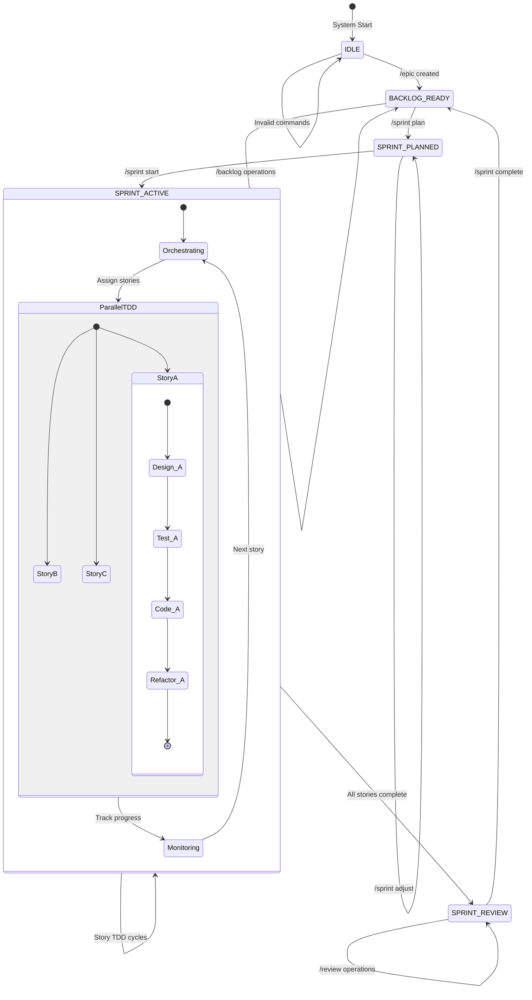

### TDD State Machine Implementation

Detailed implementation of the TDD state machine with error handling:

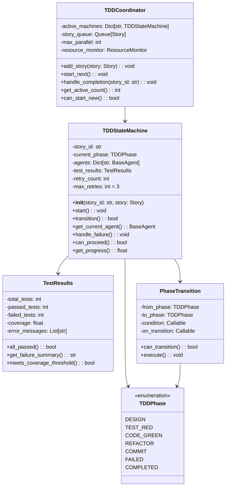

## Agent System Architecture

### Agent Hierarchy and Specialization

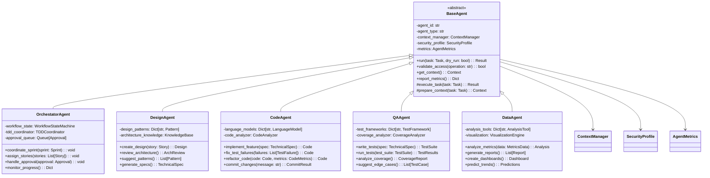

### Agent Lifecycle Sequence

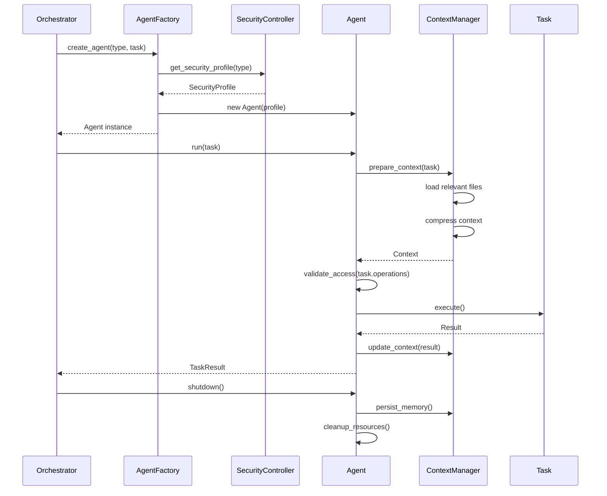

## Context Management System

### Context Architecture

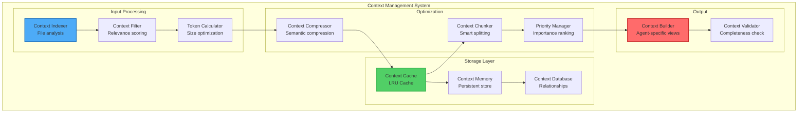

### Context Flow Implementation

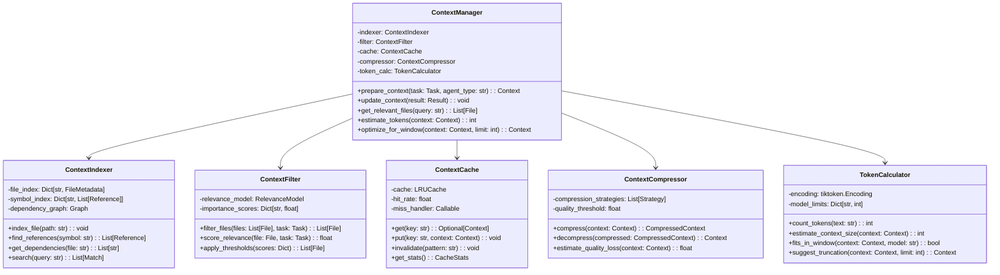

## Resource Management Architecture

### Resource Scheduler Design

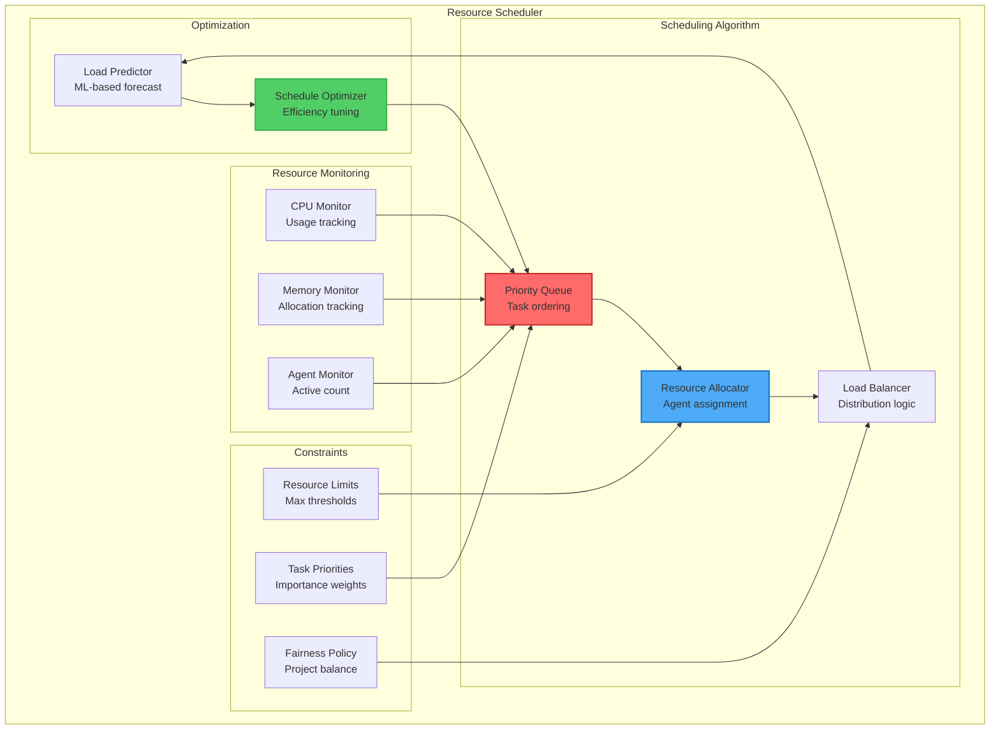

### Resource Allocation Algorithm

```python
class ResourceScheduler:
    def __init__(self):
        self.resource_pool = ResourcePool()
        self.task_queue = PriorityQueue()
        self.allocation_policy = AllocationPolicy()
        
    def schedule_task(self, task: Task) -> Optional[Allocation]:
        """Main scheduling algorithm"""
        # 1. Check resource availability
        available = self.resource_pool.get_available_resources()
        required = self.estimate_resources(task)
        
        if not self.can_allocate(available, required):
            # 2. Try to preempt lower priority tasks
            if self.allocation_policy.allows_preemption:
                freed = self.preempt_tasks(required, task.priority)
                if freed >= required:
                    return self.allocate(task, required)
            
            # 3. Queue the task
            self.task_queue.put(task, priority=task.priority)
            return None
            
        # 4. Direct allocation
        return self.allocate(task, required)
        
    def allocate(self, task: Task, resources: Resources) -> Allocation:
        """Allocate resources to task"""
        allocation = Allocation(
            task_id=task.id,
            cpu_cores=resources.cpu,
            memory_mb=resources.memory,
            agent_slots=resources.agents
        )
        
        self.resource_pool.reserve(allocation)
        self.start_monitoring(allocation)
        
        return allocation
```

## Security Architecture Components

### Security Layer Implementation

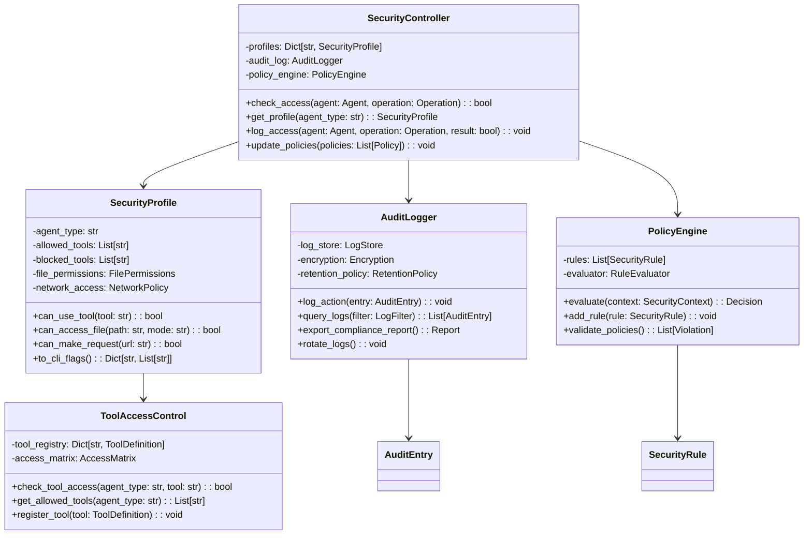

### Security Enforcement Flow

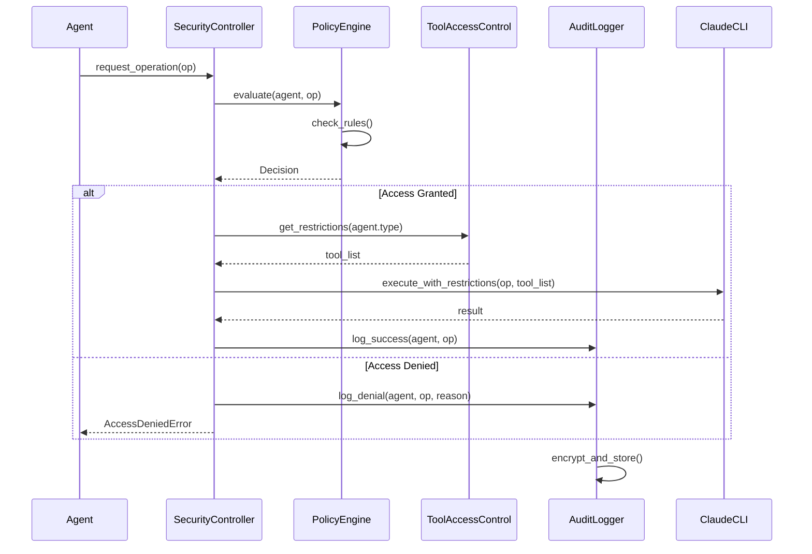

## Data Flow Architecture

### Complete System Data Flow

```mermaid
graph TB
    subgraph "User Input"
        Discord[Discord Commands]
        API[REST API]
    end
    
    subgraph "Command Processing"
        CmdParser[Command Parser<br/>Validation]
        Router[Request Router<br/>Project routing]
        Queue[Command Queue<br/>Priority handling]
    end
    
    subgraph "State Management"
        WSM[Workflow State Machine]
        TSM[TDD State Machines]
        StateStore[State Storage]
    end
    
    subgraph "Agent Orchestration"
        Orchestrator[Main Orchestrator]
        AgentFactory[Agent Factory]
        AgentPool[Agent Pool]
    end
    
    subgraph "Execution"
        Agents[Specialized Agents]
        Context[Context System]
        Security[Security Layer]
    end
    
    subgraph "Results"
        Results[Task Results]
        Metrics[Metrics Collection]
        Notifications[User Notifications]
    end
    
    subgraph "Storage"
        ProjectFiles[Project Files]
        StateFiles[State Files]
        Logs[Audit Logs]
    end
    
    Discord --> CmdParser
    API --> CmdParser
    CmdParser --> Router
    Router --> Queue
    
    Queue --> WSM
    WSM --> TSM
    WSM --> StateStore
    TSM --> StateStore
    
    WSM --> Orchestrator
    Orchestrator --> AgentFactory
    AgentFactory --> AgentPool
    AgentPool --> Agents
    
    Agents --> Context
    Agents --> Security
    Security --> Agents
    
    Agents --> Results
    Results --> Metrics
    Results --> Notifications
    
    Results --> ProjectFiles
    StateStore --> StateFiles
    Security --> Logs
    
    Notifications --> Discord
    
    style Discord fill:#7b68ee,stroke:#483d8b,stroke-width:2px
    style WSM fill:#ff6b6b,stroke:#c92a2a,stroke-width:2px
    style Agents fill:#4dabf7,stroke:#1971c2,stroke-width:2px
    style Results fill:#51cf66,stroke:#37b24d,stroke-width:2px
```

### Data Model Relationships

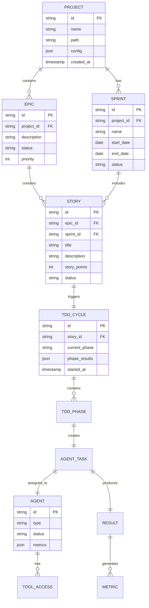

## Performance Optimization Architecture

### Caching Strategy

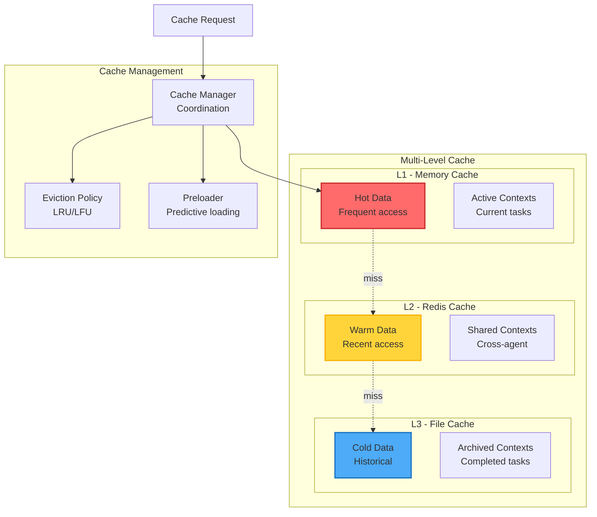

### Performance Monitoring

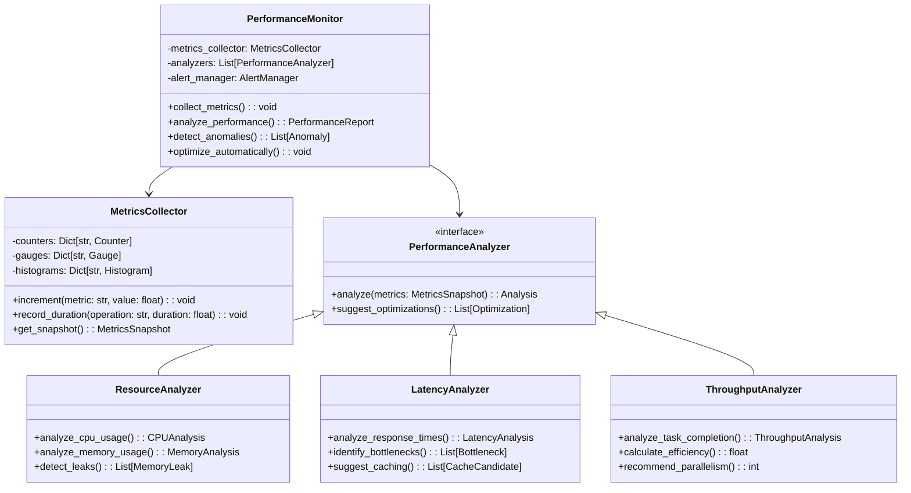

## Error Handling and Recovery

### Error Handling Architecture

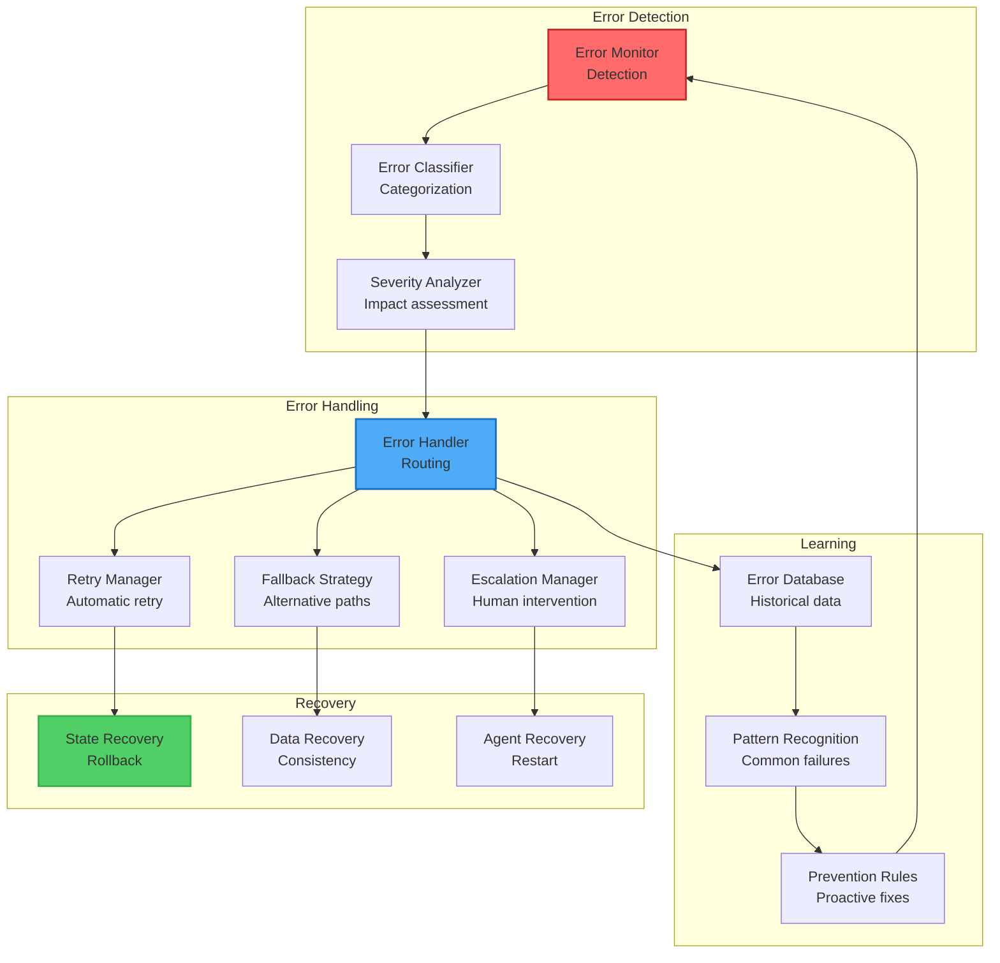

### Recovery Sequence

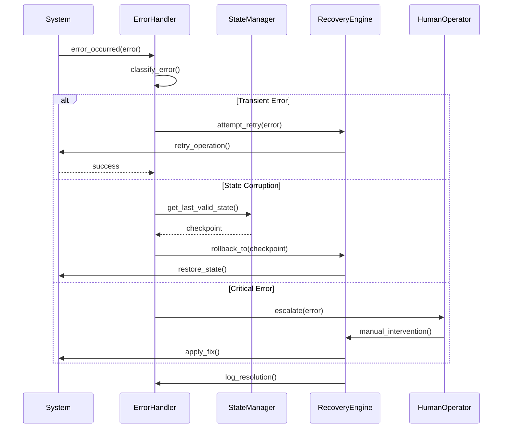

## Summary

This component architecture document details:

1. **State Machines**: Dual state machine implementation with comprehensive state management
2. **Agent System**: Hierarchical agent architecture with specialized capabilities
3. **Context Management**: Sophisticated context optimization and caching
4. **Resource Scheduling**: Intelligent resource allocation and optimization
5. **Security Layers**: Multi-level security enforcement and audit
6. **Data Flow**: Complete system data flow and relationships
7. **Performance**: Caching strategies and monitoring systems
8. **Error Handling**: Comprehensive error detection and recovery

Each component is designed for:
- **Modularity**: Clear interfaces and separation of concerns
- **Scalability**: Horizontal and vertical scaling capabilities
- **Reliability**: Error handling and recovery mechanisms
- **Security**: Defense in depth with audit trails
- **Performance**: Optimization at every layer