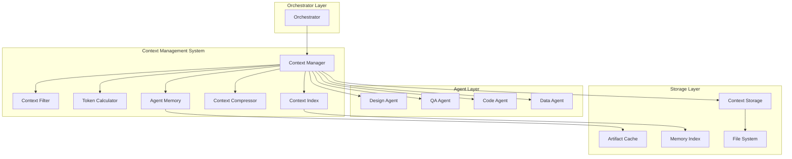
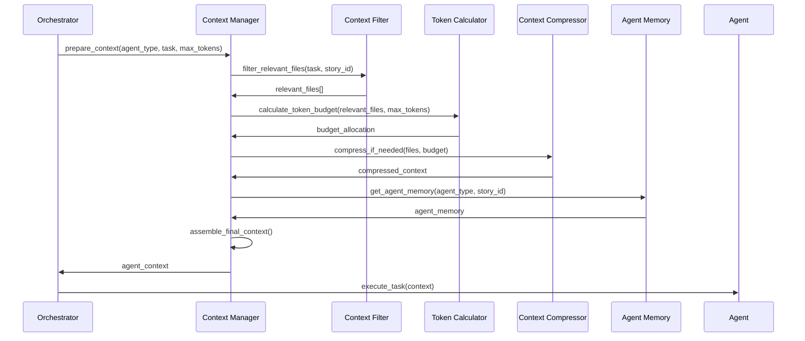
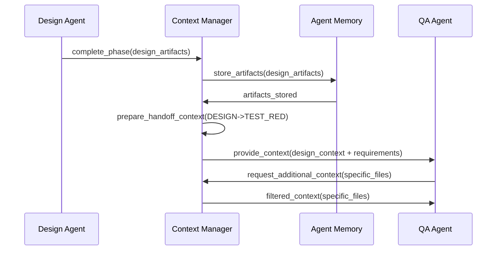

# Context Management System Design

## Executive Summary

The Context Management System (CMS) is a foundational component that enables intelligent agent communication, manages Claude Code token limits, and optimizes information flow between agents and the orchestrator. This system addresses the critical challenge of efficiently sharing context across TDD phases while respecting Claude Code's ~200k token limitations.

## System Overview

The CMS acts as an intelligent middleware layer between the orchestrator and individual agents, providing:

- **Context Filtering**: Intelligent selection of relevant files based on current task
- **Token Budget Management**: Optimal allocation of context within Claude Code limits  
- **Agent Memory**: Persistent storage of agent decisions and artifacts
- **Content Piping**: Efficient handoff of work products between TDD phases
- **Context Compression**: Intelligent summarization of large codebases

## Architecture Design

### High-Level Architecture



### Core Components

#### 1. Context Manager (Central Coordinator)
**Responsibilities:**
- Orchestrate context preparation for agent tasks
- Coordinate between filtering, compression, and caching components
- Manage context lifecycle and invalidation
- Interface with agents and orchestrator

**Key Methods:**
```python
async def prepare_context(agent_type: str, task: TDDTask, max_tokens: int) -> AgentContext
async def update_context(context_id: str, changes: Dict[str, Any]) -> None  
async def invalidate_context(context_id: str) -> None
async def get_agent_memory(agent_type: str, story_id: str) -> AgentMemory
```

#### 2. Context Filter (Relevance Engine)
**Responsibilities:**
- Analyze task requirements to determine relevant files
- Apply relevance scoring algorithms
- Filter out noise while preserving critical dependencies
- Handle cross-story context isolation

**Filtering Strategies:**
- **Direct Relevance**: Files explicitly mentioned in task or tests
- **Dependency Analysis**: Static analysis of imports and references
- **Historical Relevance**: Files frequently accessed in similar tasks
- **Semantic Similarity**: Content similarity to current task description
- **TDD Phase Relevance**: Phase-specific context requirements

#### 3. Token Calculator (Budget Manager)
**Responsibilities:**
- Calculate token usage for context components
- Optimize context selection within budget constraints
- Provide token usage analytics and warnings
- Handle budget allocation across context types

**Budget Allocation Strategy:**
```
Total Budget: ~200k tokens
- Core Task Context: 40% (80k tokens)
- Historical Context: 25% (50k tokens)  
- Dependency Context: 20% (40k tokens)
- Agent Memory: 10% (20k tokens)
- Buffer/Metadata: 5% (10k tokens)
```

#### 4. Agent Memory (Persistent Context)
**Responsibilities:**
- Store agent decisions, rationale, and learned patterns
- Maintain context across TDD phases and sessions
- Track evolution of understanding over time
- Provide context inheritance between phases

**Memory Structure:**
```python
@dataclass
class AgentMemory:
    agent_type: str
    story_id: str
    decisions: List[Decision]
    artifacts: Dict[str, str]
    learned_patterns: List[Pattern]
    context_history: List[ContextSnapshot]
    phase_handoffs: List[PhaseHandoff]
```

#### 5. Context Compressor (Intelligent Summarization)
**Responsibilities:**
- Compress large files into relevant summaries
- Maintain semantic meaning while reducing token count
- Apply compression strategies based on content type
- Preserve critical information for agent tasks

**Compression Techniques:**
- **Code Summarization**: Extract signatures, docstrings, key logic
- **Test Summarization**: Preserve test intent and assertions
- **Documentation Compression**: Extract key requirements and specs
- **Git History Compression**: Relevant commits and change patterns

#### 6. Context Index (Search and Discovery)
**Responsibilities:**
- Build searchable indexes of codebase content
- Enable fast lookup of relevant code sections
- Track file relationships and dependencies
- Support semantic search for context discovery

## Data Flow Diagrams

### Context Preparation Flow



### Agent Handoff Flow



## Implementation Strategy

### Phase 1: Core Infrastructure (Weeks 1-2)
1. **Context Manager**: Central coordination component
2. **Basic Token Calculator**: Simple token counting and budget allocation
3. **File System Interface**: Direct file access and basic caching
4. **Agent Memory Storage**: Simple JSON-based persistence

### Phase 2: Intelligence Layer (Weeks 3-4)
1. **Context Filter**: Relevance scoring and file filtering
2. **Context Compressor**: Basic summarization for code and docs
3. **Context Index**: File relationship mapping and search
4. **Agent Memory Intelligence**: Pattern recognition and learning

### Phase 3: Optimization (Weeks 5-6)
1. **Advanced Compression**: ML-based summarization
2. **Predictive Caching**: Anticipate context needs
3. **Performance Optimization**: Caching strategies and performance tuning
4. **Cross-Story Context**: Handle multiple concurrent stories

### Phase 4: Advanced Features (Weeks 7-8)
1. **Semantic Search**: Content-based context discovery
2. **Auto-tuning**: Dynamic optimization based on usage patterns
3. **Integration Testing**: End-to-end TDD workflow validation
4. **Documentation and Training**: Complete system documentation

## Algorithm Designs

### Relevance Scoring Algorithm

```python
def calculate_relevance_score(file_path: str, task: TDDTask, story_context: Dict) -> float:
    """Calculate relevance score (0-1) for a file given current task"""
    score = 0.0
    
    # Direct mention in task (40% weight)
    if file_mentioned_in_task(file_path, task):
        score += 0.4
    
    # Dependency analysis (25% weight)  
    dependency_score = analyze_dependencies(file_path, task.source_files)
    score += 0.25 * dependency_score
    
    # Historical relevance (20% weight)
    historical_score = get_historical_relevance(file_path, task.agent_type)
    score += 0.20 * historical_score
    
    # Semantic similarity (10% weight)
    semantic_score = calculate_semantic_similarity(file_path, task.description)
    score += 0.10 * semantic_score
    
    # TDD phase relevance (5% weight)
    phase_score = get_phase_relevance(file_path, task.current_state)
    score += 0.05 * phase_score
    
    return min(1.0, score)
```

### Context Compression Algorithm

```python
def compress_file_content(content: str, target_tokens: int, file_type: str) -> str:
    """Compress file content to target token count while preserving meaning"""
    
    if file_type == "python":
        return compress_python_code(content, target_tokens)
    elif file_type == "test":
        return compress_test_file(content, target_tokens)
    elif file_type == "markdown":
        return compress_documentation(content, target_tokens)
    else:
        return compress_generic_text(content, target_tokens)

def compress_python_code(content: str, target_tokens: int) -> str:
    """Python-specific compression preserving structure and key logic"""
    ast_tree = ast.parse(content)
    
    # Extract critical elements
    imports = extract_imports(ast_tree)
    class_signatures = extract_class_signatures(ast_tree)
    method_signatures = extract_method_signatures(ast_tree)
    key_logic = extract_key_logic_blocks(ast_tree)
    
    # Reconstruct with compression
    compressed = rebuild_compressed_code(
        imports, class_signatures, method_signatures, key_logic, target_tokens
    )
    
    return compressed
```

### Token Budget Allocation Algorithm

```python
def allocate_token_budget(total_budget: int, context_components: Dict) -> Dict[str, int]:
    """Dynamically allocate token budget based on task priority and available content"""
    
    allocation = {}
    
    # Base allocation percentages
    base_allocations = {
        "core_task": 0.40,
        "historical": 0.25, 
        "dependencies": 0.20,
        "agent_memory": 0.10,
        "buffer": 0.05
    }
    
    # Adjust based on context availability
    for component, base_pct in base_allocations.items():
        available_content = context_components.get(component, {})
        
        if not available_content:
            # Redistribute unused allocation
            base_allocations = redistribute_unused_allocation(base_allocations, component)
        else:
            # Calculate actual need vs available content
            content_size = estimate_token_size(available_content)
            base_allocation = int(total_budget * base_pct)
            
            # Don't over-allocate if content is smaller than allocation
            allocation[component] = min(base_allocation, content_size)
    
    return allocation
```

## Performance Requirements

### Latency Targets
- **Context Preparation**: < 2 seconds for typical tasks
- **Agent Handoff**: < 1 second for artifact transfer
- **Context Invalidation**: < 500ms for cache updates
- **Memory Retrieval**: < 100ms for agent memory access

### Throughput Targets
- **Concurrent Contexts**: Support 10+ parallel TDD cycles
- **File Processing**: 1000+ files/second for relevance scoring
- **Compression**: 100KB/second sustained compression rate
- **Cache Hit Rate**: >80% for repeated context requests

### Scalability Targets
- **Codebase Size**: Support projects with 100k+ lines of code
- **Context History**: 1000+ context snapshots per story
- **Agent Memory**: 10MB+ per agent across all stories
- **File Index**: 50k+ files with sub-second search

## Error Handling Strategy

### Graceful Degradation
1. **Token Limit Exceeded**: Automatic compression and pruning
2. **Context Service Unavailable**: Fall back to basic file access
3. **Memory Corruption**: Rebuild from artifacts and git history
4. **Index Corruption**: Rebuild from filesystem scan

### Recovery Mechanisms
1. **Context Snapshots**: Regular snapshots for quick recovery
2. **Incremental Rebuilds**: Rebuild only affected components
3. **Fallback Modes**: Progressively simpler context provision
4. **Health Monitoring**: Continuous monitoring with automatic recovery

## Evaluation Framework

### Success Metrics

#### Efficiency Metrics
- **Context Relevance**: >95% of provided context is used by agents
- **Token Utilization**: >90% of allocated tokens are effectively used
- **Redundancy Reduction**: <5% duplicate information in context
- **Preparation Speed**: Context preparation within latency targets

#### Quality Metrics  
- **Agent Task Success**: >95% agent task completion rate
- **Context Completeness**: <2% missing critical information
- **Cross-Phase Continuity**: >98% successful phase handoffs
- **Memory Accuracy**: >95% accurate agent memory retrieval

#### Performance Metrics
- **System Throughput**: Support target concurrent operations
- **Resource Utilization**: <70% CPU and memory usage
- **Cache Effectiveness**: >80% cache hit rate
- **Scalability**: Linear performance degradation with codebase size

### Benchmarking Strategy

#### Synthetic Benchmarks
- **Token Budget Stress Tests**: Extreme token limit scenarios
- **Large Codebase Tests**: 100k+ file repositories
- **Concurrent Load Tests**: Multiple parallel TDD cycles
- **Memory Pressure Tests**: Limited system memory scenarios

#### Real-World Benchmarks
- **Open Source Projects**: Test on popular GitHub repositories
- **Legacy Codebase**: Test on complex, undocumented codebases
- **Multi-Language**: Test cross-language context management
- **Long-Running Sessions**: Extended TDD sessions over days

## Integration Points

### Claude Code CLI Integration
```python
class ClaudeCodeContextProvider:
    """Integration with Claude Code CLI for optimized prompts"""
    
    async def prepare_claude_prompt(self, context: AgentContext) -> str:
        """Prepare optimized prompt for Claude Code CLI"""
        prompt_parts = []
        
        # Add core context with highest priority
        prompt_parts.append(f"## Core Task Context\n{context.core_context}")
        
        # Add compressed dependencies 
        if context.dependencies:
            prompt_parts.append(f"## Dependencies\n{context.dependencies}")
        
        # Add agent memory if relevant
        if context.agent_memory:
            prompt_parts.append(f"## Previous Decisions\n{context.agent_memory}")
        
        # Add specific instructions based on TDD phase
        phase_instructions = get_phase_specific_instructions(context.tdd_phase)
        prompt_parts.append(f"## Phase Instructions\n{phase_instructions}")
        
        return "\n\n".join(prompt_parts)
```

### TDD State Machine Integration
```python
class TDDContextManager:
    """Integration with TDD state machine for phase-aware context"""
    
    def get_phase_context_requirements(self, phase: TDDState) -> Dict[str, Any]:
        """Get context requirements specific to TDD phase"""
        requirements = {
            TDDState.DESIGN: {
                "focus": ["requirements", "architecture", "existing_patterns"],
                "exclude": ["implementation_details", "test_specifics"],
                "compression_level": "moderate"
            },
            TDDState.TEST_RED: {
                "focus": ["design_specs", "acceptance_criteria", "existing_tests"],
                "exclude": ["implementation_files"],
                "compression_level": "low"
            },
            TDDState.CODE_GREEN: {
                "focus": ["failing_tests", "minimal_examples", "interfaces"],
                "exclude": ["refactoring_notes", "performance_docs"],
                "compression_level": "moderate"
            },
            TDDState.REFACTOR: {
                "focus": ["current_implementation", "quality_patterns", "best_practices"],
                "exclude": ["test_files"],
                "compression_level": "high"
            },
            TDDState.COMMIT: {
                "focus": ["all_changes", "commit_history", "integration_tests"],
                "exclude": ["draft_files"],
                "compression_level": "low"
            }
        }
        return requirements.get(phase, {})
```

## Future Enhancements

### Machine Learning Integration
- **Context Relevance ML**: Train models on agent context usage patterns
- **Compression Optimization**: ML-powered compression for better semantic preservation
- **Predictive Caching**: Predict future context needs based on TDD patterns
- **Agent Behavior Learning**: Learn optimal context for each agent type

### Advanced Features
- **Multi-Project Context**: Share learnings across related projects
- **Team Context Sharing**: Share context insights across team members
- **Real-time Collaboration**: Support concurrent agent operations
- **Version-Aware Context**: Context management across git branches

### Performance Optimizations
- **Distributed Context**: Distribute context processing across nodes
- **Streaming Context**: Stream large contexts to agents incrementally
- **Edge Caching**: Cache contexts at network edges for global teams
- **Hardware Acceleration**: GPU acceleration for large-scale compression

This Context Management System design provides the foundation for efficient agent communication while respecting Claude Code's token limitations. The system is designed to be extensible, performant, and maintainable while providing the intelligent context filtering necessary for effective TDD workflow execution.