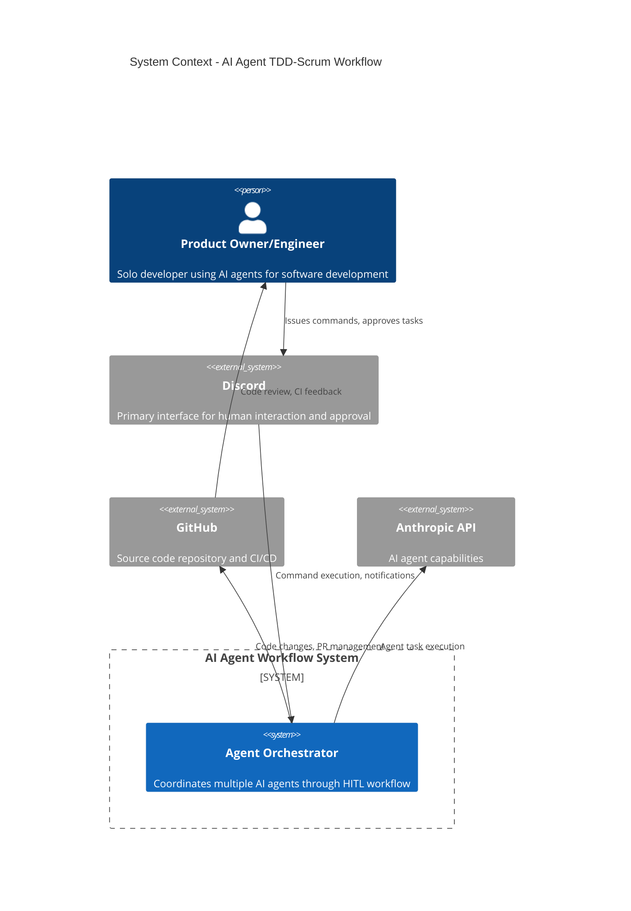

# C4 Context Diagram - AI Agent TDD-Scrum Workflow

## System Context

## Key Interactions

1. **User → Discord**: Issues slash commands (`/epic`, `/sprint`, `/approve`)
2. **Discord → Orchestrator**: Command parsing and state transitions
3. **Orchestrator → Agents**: Task dispatch and coordination
4. **Agents → GitHub**: Code implementation and PR creation
5. **GitHub → User**: CI results and code review
6. **User Approval Loop**: HITL gates for strategic decisions