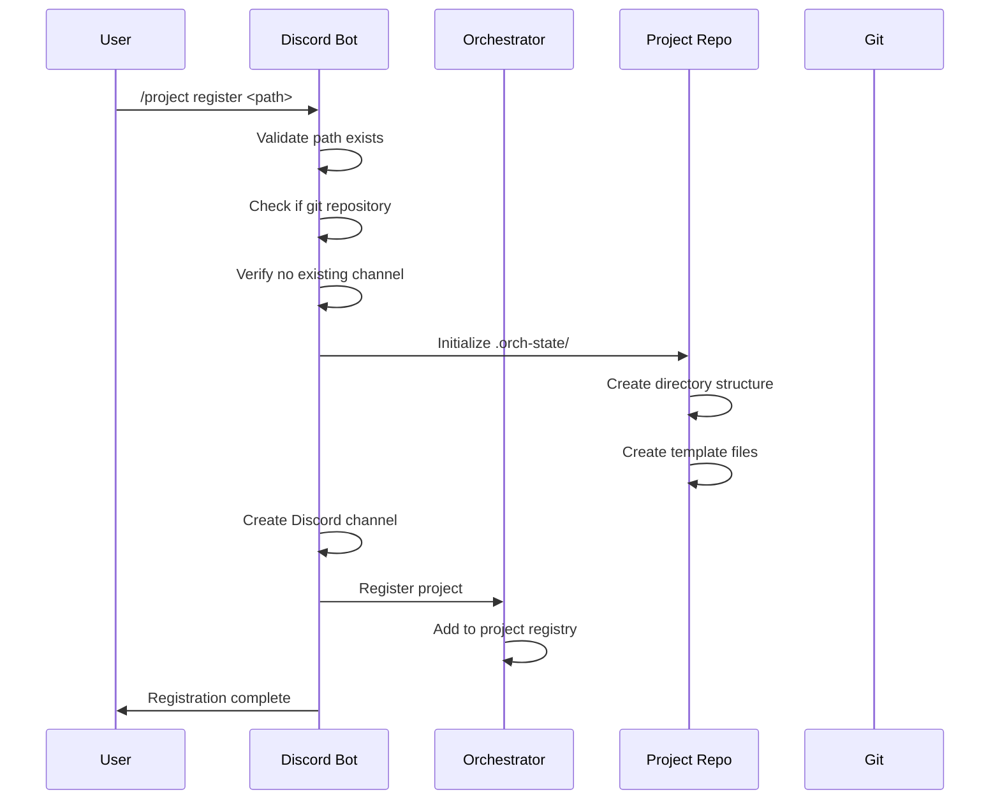
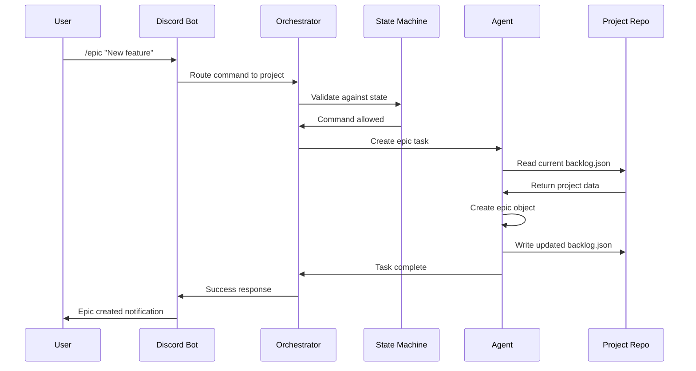
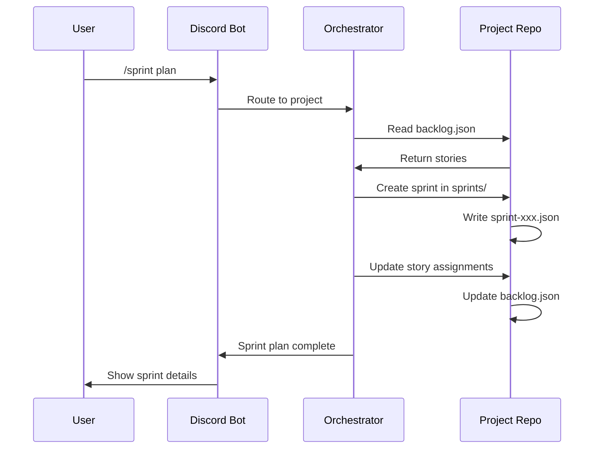
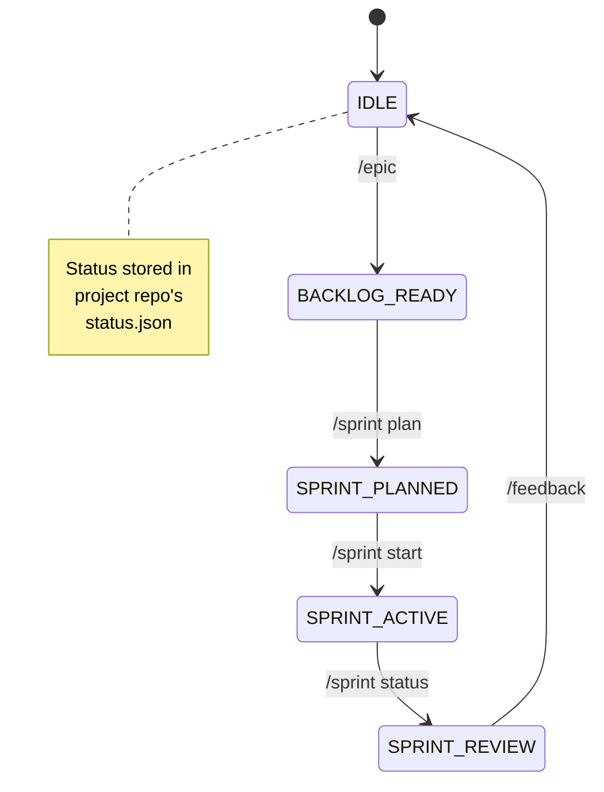

# Data Flow Architecture

This document describes how data flows between the orchestration repository and project repositories in the two-repository model.

## Overview

The AI Agent TDD-Scrum workflow system operates on a clear separation between:
- **Orchestration Repository**: Central framework and coordination
- **Project Repositories**: Individual codebases with embedded project management data

## Data Flow Patterns

### 1. Project Registration Flow



### 2. Command Execution Flow



### 3. Sprint Management Flow



## Data Storage Patterns

### Orchestration Repository
```
agent-workflow/
├── lib/
│   ├── agents/              # Agent definitions (global)
│   ├── state_machine.py     # Workflow states (global)
│   ├── discord_bot.py       # Interface (global)
│   └── agent_tool_config.py # Security policies (global)
├── scripts/
│   └── orchestrator.py      # Coordination engine (global)
└── docs_src/               # Framework documentation (global)
```

### Project Repository
```
project-repo/
├── src/                    # Project code (project-specific)
├── tests/                  # Project tests (project-specific)
├── .orch-state/           # Workflow data (project-specific)
│   ├── backlog.json       # Project management data
│   ├── sprints/           # Sprint history
│   ├── architecture.md    # Project architecture decisions
│   ├── best-practices.md  # Project conventions
│   └── status.json        # Current workflow state
└── .git/                  # Version control (project-specific)
```

## Read/Write Access Patterns

### Read Operations
- **Orchestrator → Project**: Reads state, backlog, and configuration
- **Discord Bot → Project**: Displays current status and history
- **Agents → Project**: Access context for decision making

### Write Operations
- **Orchestrator → Project**: Updates state and project data
- **Agents → Project**: Persist task results and changes
- **Discord Commands → Project**: Modify backlogs and sprints

### Security Boundaries
- **No Cross-Project Access**: Agents cannot read other project data
- **Limited Write Scope**: Only `.orch-state/` directory writable
- **Git Permissions**: Standard repository access controls apply

## State Synchronization

### Project State Machine


### Multi-Project Coordination
- **Independent States**: Each project has own state machine
- **Parallel Execution**: Multiple projects can be active simultaneously
- **Resource Sharing**: Agents allocated per project needs
- **Conflict Prevention**: Discord channels provide isolation

## Data Consistency

### Eventual Consistency Model
- **Local Consistency**: Each project maintains internal consistency
- **Global Coordination**: Orchestrator ensures cross-project resource allocation
- **Conflict Resolution**: Manual intervention for complex scenarios

### Transaction Boundaries
- **Single Project**: ACID properties maintained within project
- **Cross Project**: No transactions spanning projects
- **Rollback Strategy**: Git provides rollback capabilities

### Backup and Recovery
- **Git History**: Complete audit trail of all changes
- **State Recovery**: Projects can be restored from any git commit
- **Disaster Recovery**: Projects portable between orchestration instances

## Performance Considerations

### Read Performance
- **Local Access**: Project data accessed directly from filesystem
- **Caching Strategy**: Orchestrator caches frequently accessed data
- **Lazy Loading**: Project data loaded on-demand

### Write Performance
- **Batched Writes**: Multiple changes combined into single commits
- **Asynchronous Operations**: Non-blocking writes to project repositories
- **Conflict Avoidance**: Structured data minimizes merge conflicts

### Scalability
- **Horizontal Scaling**: Add projects without affecting others
- **Resource Isolation**: Per-project resource allocation
- **Network Efficiency**: Local filesystem access minimizes I/O

## Monitoring and Observability

### Data Flow Metrics
- **Command Latency**: Time from Discord to project update
- **State Transition Frequency**: Workflow progression rates
- **Error Rates**: Failed operations per project

### Audit Trail
- **Git History**: All changes tracked in version control
- **Discord Logs**: Command execution history
- **Agent Logs**: Detailed task execution traces

### Health Checks
- **Project Repository**: Git status and filesystem health
- **Data Integrity**: JSON schema validation
- **State Consistency**: State machine validation