# Architecture Overview

The AI Agent TDD-Scrum Workflow system implements a sophisticated dual state machine architecture that coordinates Test-Driven Development (TDD) cycles within a broader Scrum workflow management framework.

## Dual State Machine Architecture

The system operates two parallel state machines that work in coordination:

### 1. Workflow State Machine (Primary)
Manages the high-level Scrum development lifecycle:
- **IDLE** → **BACKLOG_READY** → **SPRINT_PLANNED** → **SPRINT_ACTIVE** → **SPRINT_REVIEW**
- Handles epic creation, sprint planning, and project coordination
- Enforces proper development sequences and human approval gates
- Persists project management data across sprint cycles

### 2. TDD State Machine (Secondary)
Manages individual story implementation through proper TDD cycles:
- **DESIGN** → **TEST_RED** → **CODE_GREEN** → **REFACTOR** → **COMMIT**
- Activated when the primary state machine enters SPRINT_ACTIVE
- Runs in parallel for each story in the active sprint
- Ensures proper RED-GREEN-REFACTOR TDD methodology

## Architecture Diagram

```mermaid
graph TB
    subgraph "👤 Solo Engineer"
        User[User]
    end
    
    subgraph DISCORD ["🎮 Discord Interface"]
        Discord["/epic /sprint /tdd<br/>Slash Commands"]
        State[Interactive State<br/>Visualization]
    end
    
    subgraph WORKFLOW ["🤖 Dual State Machine System"]
        subgraph "🎛️ Primary Control Layer"
            WSM[Workflow State Machine<br/>IDLE - BACKLOG - SPRINT]
            HITL[Approval Gates<br/>Strategic Decisions]
            PM[Persistent Storage<br/>Epics - Stories - Tasks]
        end
        
        subgraph "🎭 Ephemeral Orchestration"
            Orch[🎭 Orchestrator Agent<br/>Scrum Master<br/>spun up on demand]
            Coord[🎯 Multi-Task Coordinator<br/>Parallel Story Execution]
        end
        
        subgraph "🔄 TDD Execution Layer"
            subgraph "Story A TDD Cycle"
                TDD_A[TDD State Machine A<br/>DESIGN - TEST - CODE - REFACTOR]
                Design_A[🎨 Design Agent A]
                QA_A[🧪 Test Agent A]
                Code_A[💻 Code Agent A]
            end
            
            subgraph "Story B TDD Cycle"
                TDD_B[TDD State Machine B<br/>DESIGN - TEST - CODE - REFACTOR]
                Design_B[🎨 Design Agent B]
                QA_B[🧪 Test Agent B]
                Code_B[💻 Code Agent B]
            end
            
            Data[📊 Analytics Agent<br/>Cross-Story Metrics]
        end
    end
    
    subgraph PROJECT ["💾 Your Project"]
        Tests[🧪 Test Suite<br/>RED - GREEN - REFACTOR]
        Repo[📁 Git Repository<br/>Code & Documentation]
        State_Dir[📂 .orch-state/<br/>Sprint & TDD State]
    end
    
    User -->|"Commands"| Discord
    Discord <-->|"Validates"| WSM
    Discord -->|"Updates"| State
    State -->|"Progress"| User
    
    WSM -->|"Spins up"| Orch
    Orch -->|"Coordinates"| Coord
    WSM <-->|"Enforces"| HITL
    WSM <-->|"Reads/Writes"| PM
    
    Coord -->|"Assigns Stories"| TDD_A
    Coord -->|"Assigns Stories"| TDD_B
    
    TDD_A -->|"1 Design"| Design_A
    TDD_A -->|"2 Test"| QA_A
    TDD_A -->|"3 Code"| Code_A
    
    TDD_B -->|"1 Design"| Design_B
    TDD_B -->|"2 Test"| QA_B
    TDD_B -->|"3 Code"| Code_B
    
    Design_A -->|"Specs"| Tests
    QA_A -->|"Tests"| Tests
    Code_A -->|"Implementation"| Tests
    
    Design_B -->|"Specs"| Tests
    QA_B -->|"Tests"| Tests
    Code_B -->|"Implementation"| Tests
    
    Data -->|"Metrics"| State_Dir
    TDD_A -->|"Story State"| State_Dir
    TDD_B -->|"Story State"| State_Dir
    
    Tests -->|"Validates"| Repo
    Code_A -->|"Commits"| Repo
    Code_B -->|"Commits"| Repo
    
    HITL <-->|"Approvals"| Discord
    
    style User fill:#e1f5fe,stroke:#0277bd,stroke-width:3px
    style DISCORD fill:#f8f4ff,stroke:#7b1fa2,stroke-width:3px
    style WORKFLOW fill:#f0f8f0,stroke:#388e3c,stroke-width:3px
    style PROJECT fill:#fff8e1,stroke:#f57c00,stroke-width:3px
    style WSM fill:#ff6b6b,stroke:#c92a2a,stroke-width:3px
    style TDD_A fill:#4dabf7,stroke:#1971c2,stroke-width:3px
    style TDD_B fill:#4dabf7,stroke:#1971c2,stroke-width:3px
    style Coord fill:#ffd43b,stroke:#fab005,stroke-width:3px
```

## Ephemeral Agent Pattern

### On-Demand Orchestration
- **Orchestrator Agent**: Spun up when entering SPRINT_ACTIVE state
- **Multi-Task Coordination**: Manages parallel TDD cycles for multiple stories
- **Resource Optimization**: Agents created and destroyed based on workload
- **State Isolation**: Each TDD cycle operates independently with shared coordination

### Agent Lifecycle
1. **Workflow State Transition**: Primary state machine triggers agent creation
2. **Story Assignment**: Coordinator assigns stories to TDD state machines
3. **Parallel Execution**: Multiple TDD cycles run simultaneously
4. **Coordination**: Shared analytics and progress reporting
5. **Cleanup**: Agents destroyed when stories complete or sprint ends

## TDD State Machine Lifecycle

Each story follows a strict TDD methodology enforced by the secondary state machine:

### 1. DESIGN Phase
- **Design Agent** creates technical specifications
- Defines interfaces, data structures, and architecture
- Outputs design documents and acceptance criteria
- **Transition**: Automatic to TEST_RED when design approved

### 2. TEST_RED Phase  
- **QA Agent** writes failing tests based on design specs
- Implements unit tests, integration tests, and acceptance tests
- Ensures tests fail appropriately (RED state)
- **Transition**: Automatic to CODE_GREEN when tests written and failing

### 3. CODE_GREEN Phase
- **Code Agent** implements minimal code to make tests pass
- Focuses on making tests green without over-engineering
- Validates implementation against test suite
- **Transition**: Automatic to REFACTOR when all tests pass

### 4. REFACTOR Phase
- **Code Agent** improves code quality while maintaining green tests
- Applies design patterns, removes duplication, improves readability
- Ensures tests remain green throughout refactoring
- **Transition**: Manual approval or automatic after quality gates

### 5. COMMIT Phase
- **Code Agent** commits changes to version control
- Updates documentation and changelog
- Triggers CI/CD pipeline for validation
- **Transition**: Story marked complete, returns to coordinator

## State Machine Interactions

### Primary → Secondary Activation

### Parallel Story Execution

## Key Architectural Principles

### 1. Separation of Concerns
- **Workflow Management**: High-level project coordination and human interaction
- **TDD Implementation**: Technical development methodology enforcement
- **State Persistence**: Project data versioned with code, runtime state isolated

### 2. Human-In-The-Loop Integration
- **Strategic Approval**: Workflow state machine requires human approval for major decisions
- **TDD Oversight**: Optional human intervention at any TDD phase
- **Error Escalation**: Automatic escalation to humans after failed automation attempts

### 3. Parallel Processing
- **Multi-Story Execution**: Independent TDD cycles for parallel development
- **Resource Optimization**: Agents created/destroyed based on workload
- **Shared Analytics**: Cross-story metrics and progress reporting

### 4. State Isolation and Recovery
- **Independent Cycles**: TDD state machines operate independently
- **Failure Isolation**: Failed story doesn't impact other parallel stories
- **State Recovery**: System can resume from any state after interruption

## Security and Tool Access

### Agent Security Profiles
Each agent type has restricted tool access based on their role in the TDD cycle:

- **Orchestrator Agent**: Full system access for coordination
- **Design Agent**: Read-only access for architecture and documentation
- **QA Agent**: Test execution and quality analysis tools only
- **Code Agent**: Code editing, compilation, and version control
- **Analytics Agent**: Data analysis and reporting tools only

### Security Boundaries
- **Process Isolation**: Each TDD cycle runs in isolated environment
- **Tool Restrictions**: Agents cannot access tools outside their domain
- **Audit Trail**: All agent actions logged for security and debugging
- **Human Oversight**: Security-critical operations require human approval

## Data Flow and Persistence

### Persistent Data (.orch-state/)
- **Sprint Plans**: Active and historical sprint configurations
- **Story Status**: Current state of each TDD cycle
- **Analytics Data**: Metrics, coverage, and performance data
- **Error Logs**: Failed attempts and recovery information

### Runtime State
- **State Machine Status**: Current states of both state machines
- **Agent Registry**: Active agents and their assignments
- **Coordination Data**: Inter-story dependencies and shared resources
- **Progress Tracking**: Real-time status for Discord interface

This dual state machine architecture provides a robust foundation for AI-assisted development that maintains proper TDD methodology while enabling parallel processing and human oversight of the overall development workflow.