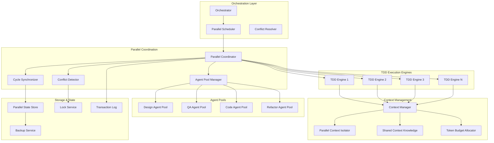

# Parallel TDD Execution Architecture

## Executive Summary

The Parallel TDD Execution Architecture enables concurrent execution of multiple TDD cycles while maintaining code quality, preventing conflicts, and optimizing resource utilization. This architecture builds on the proven sequential TDD foundation and integrates with the Context Management System to enable 2-3x faster story completion through intelligent parallelization.

## System Overview

### Core Capabilities
- **Concurrent TDD Cycles**: Run 2-5 TDD cycles in parallel with intelligent scheduling
- **Conflict Prevention**: Proactive detection and resolution of code conflicts
- **Resource Optimization**: Dynamic agent pool management with efficient allocation
- **Context Isolation**: Parallel-aware context management with shared knowledge
- **Quality Preservation**: Maintain TDD integrity and test coverage across parallel execution

### Architecture Principles
1. **Sequential Foundation**: Preserve sequential mode as default, parallel as opt-in enhancement
2. **Graceful Degradation**: Automatic fallback to sequential on conflict or failure
3. **Zero Data Corruption**: Transactional state management with rollback capability
4. **Progressive Enhancement**: Phased rollout from 2 parallel cycles to 5+

## High-Level Architecture



## Core Components

### 1. Parallel Coordinator (Central Brain)

**Responsibilities:**
- Orchestrate multiple TDD cycles concurrently
- Manage cycle lifecycle and state transitions
- Coordinate resource allocation and scheduling
- Handle conflict detection and resolution

**Key Interfaces:**
```python
class ParallelCoordinator:
    async def start_parallel_cycle(self, story_id: str, priority: int) -> TDDCycle
    async def schedule_cycles(self, pending_stories: List[Story]) -> List[TDDCycle]
    async def detect_conflicts(self, cycle1: TDDCycle, cycle2: TDDCycle) -> List[Conflict]
    async def resolve_conflicts(self, conflicts: List[Conflict]) -> ResolutionStrategy
    async def monitor_parallel_execution(self) -> ParallelStatus
```

### 2. Agent Pool Manager

**Responsibilities:**
- Maintain pools of specialized agents
- Dynamic scaling based on workload
- Efficient agent allocation across cycles
- Health monitoring and recovery

**Agent Pool Strategy:**
```python
@dataclass
class AgentPoolConfig:
    agent_type: AgentType
    min_instances: int = 1
    max_instances: int = 5
    idle_timeout: int = 300  # seconds
    scaling_policy: ScalingPolicy = ScalingPolicy.DYNAMIC
    
class AgentPool:
    def __init__(self, config: AgentPoolConfig):
        self.available_agents: Queue[Agent] = Queue()
        self.busy_agents: Dict[str, Agent] = {}
        self.config = config
        
    async def acquire_agent(self, timeout: int = 30) -> Agent:
        """Acquire agent from pool with timeout"""
        
    async def release_agent(self, agent: Agent) -> None:
        """Return agent to pool for reuse"""
        
    async def scale_pool(self, demand: int) -> None:
        """Scale pool size based on demand"""
```

### 3. Cycle Synchronizer

**Responsibilities:**
- Synchronize state across parallel cycles
- Manage shared resources and locks
- Coordinate phase transitions
- Handle cycle dependencies

**Synchronization Patterns:**
```python
class CycleSynchronizer:
    async def acquire_file_lock(self, file_path: str, cycle_id: str) -> FileLock
    async def wait_for_dependency(self, cycle_id: str, depends_on: str) -> None
    async def broadcast_phase_transition(self, cycle_id: str, new_phase: TDDState) -> None
    async def coordinate_test_execution(self, cycles: List[TDDCycle]) -> TestSchedule
```

### 4. Conflict Detector

**Responsibilities:**
- Proactive conflict detection before they occur
- Static analysis of code dependencies
- Runtime monitoring of file access patterns
- Predictive conflict analysis using ML

**Conflict Detection Strategy:**
```python
@dataclass
class Conflict:
    type: ConflictType  # FILE_OVERLAP, TEST_COLLISION, DEPENDENCY_CONFLICT
    severity: Severity  # LOW, MEDIUM, HIGH, CRITICAL
    cycles: List[str]   # Affected cycle IDs
    resources: List[str]  # Conflicting resources
    suggested_resolution: ResolutionStrategy
    
class ConflictDetector:
    async def analyze_static_conflicts(self, cycle1: TDDCycle, cycle2: TDDCycle) -> List[Conflict]
    async def monitor_runtime_conflicts(self) -> AsyncIterator[Conflict]
    async def predict_future_conflicts(self, scheduled_cycles: List[TDDCycle]) -> List[Conflict]
```

### 5. Parallel Context Isolator

**Responsibilities:**
- Isolate context between parallel cycles
- Share common project knowledge efficiently
- Manage token budget across parallel agents
- Prevent context contamination

**Context Isolation Model:**
```python
class ParallelContextIsolator:
    def __init__(self, base_context: ProjectContext):
        self.shared_context = base_context  # Read-only shared knowledge
        self.cycle_contexts: Dict[str, CycleContext] = {}
        
    async def create_isolated_context(self, cycle_id: str) -> CycleContext:
        """Create isolated context for a TDD cycle"""
        context = CycleContext(
            cycle_id=cycle_id,
            shared_knowledge=self.shared_context.get_readonly_view(),
            token_budget=self.calculate_token_allocation(cycle_id),
            file_scope=self.determine_file_scope(cycle_id)
        )
        return context
        
    async def merge_context_changes(self, cycle_id: str) -> None:
        """Merge cycle context changes back to shared knowledge"""
```

## Concurrency Architecture

### Execution Models

#### 1. Work-Stealing Model
```python
class WorkStealingScheduler:
    """Agents steal work from other queues when idle"""
    def __init__(self, worker_count: int):
        self.work_queues = [deque() for _ in range(worker_count)]
        self.workers = [Worker(i, self.work_queues) for i in range(worker_count)]
        
    async def schedule_task(self, task: TDDTask) -> None:
        # Find least loaded queue
        min_queue = min(self.work_queues, key=len)
        min_queue.append(task)
        
    async def steal_work(self, worker_id: int) -> Optional[TDDTask]:
        # Steal from longest queue
        max_queue = max(self.work_queues, key=len)
        if len(max_queue) > 1:
            return max_queue.popleft()
```

#### 2. Pipeline Model
```python
class PipelineScheduler:
    """Pipeline TDD phases across multiple cycles"""
    def __init__(self):
        self.phase_queues = {
            TDDState.DESIGN: asyncio.Queue(),
            TDDState.TEST_RED: asyncio.Queue(),
            TDDState.CODE_GREEN: asyncio.Queue(),
            TDDState.REFACTOR: asyncio.Queue()
        }
        
    async def schedule_phase(self, cycle: TDDCycle) -> None:
        current_phase = cycle.current_state
        await self.phase_queues[current_phase].put(cycle)
```

### Conflict Resolution Strategies

#### 1. File-Level Locking
```python
class FileLockManager:
    def __init__(self):
        self.file_locks: Dict[str, FileLock] = {}
        
    async def acquire_files(self, file_paths: List[str], cycle_id: str) -> List[FileLock]:
        """Acquire locks for multiple files atomically"""
        locks = []
        try:
            for path in sorted(file_paths):  # Sort to prevent deadlock
                lock = await self.acquire_file(path, cycle_id)
                locks.append(lock)
            return locks
        except LockTimeout:
            # Release all acquired locks on failure
            for lock in locks:
                await lock.release()
            raise
```

#### 2. Optimistic Concurrency Control
```python
class OptimisticConcurrencyManager:
    async def validate_changes(self, cycle_id: str, changes: Dict[str, FileChange]) -> bool:
        """Validate changes haven't conflicted with other cycles"""
        for file_path, change in changes.items():
            current_version = await self.get_file_version(file_path)
            if current_version != change.base_version:
                # Conflict detected - attempt auto-merge
                if await self.can_auto_merge(change, current_version):
                    await self.auto_merge(change, current_version)
                else:
                    return False  # Manual resolution required
        return True
```

#### 3. Dependency-Based Scheduling
```python
class DependencyScheduler:
    def __init__(self):
        self.dependency_graph = nx.DiGraph()
        
    async def add_cycle_dependencies(self, cycle: TDDCycle) -> None:
        """Add cycle to dependency graph"""
        self.dependency_graph.add_node(cycle.id, cycle=cycle)
        
        # Add edges for dependencies
        for dep_story_id in cycle.depends_on:
            dep_cycle = await self.get_cycle_for_story(dep_story_id)
            if dep_cycle:
                self.dependency_graph.add_edge(dep_cycle.id, cycle.id)
                
    async def get_schedulable_cycles(self) -> List[TDDCycle]:
        """Get cycles that can be scheduled (no pending dependencies)"""
        schedulable = []
        for node in self.dependency_graph.nodes():
            if self.dependency_graph.in_degree(node) == 0:
                cycle = self.dependency_graph.nodes[node]['cycle']
                if cycle.current_state != TDDState.COMMIT:
                    schedulable.append(cycle)
        return schedulable
```

## Resource Management

### Agent Pool Scaling

```python
class DynamicAgentScaler:
    def __init__(self, metrics_provider: MetricsProvider):
        self.metrics = metrics_provider
        self.scaling_decisions = []
        
    async def calculate_optimal_pool_size(self, agent_type: AgentType) -> int:
        """Calculate optimal pool size based on metrics"""
        current_size = await self.get_current_pool_size(agent_type)
        pending_tasks = await self.metrics.get_pending_tasks(agent_type)
        avg_task_duration = await self.metrics.get_avg_task_duration(agent_type)
        current_utilization = await self.metrics.get_utilization(agent_type)
        
        # Scaling algorithm
        if current_utilization > 0.8 and pending_tasks > current_size:
            # Scale up
            return min(current_size + 1, MAX_POOL_SIZE)
        elif current_utilization < 0.3 and current_size > MIN_POOL_SIZE:
            # Scale down
            return current_size - 1
        else:
            return current_size
            
    async def apply_scaling_decision(self, agent_type: AgentType, target_size: int) -> None:
        """Apply scaling decision with gradual rollout"""
        current_size = await self.get_current_pool_size(agent_type)
        
        if target_size > current_size:
            # Scale up gradually
            for _ in range(target_size - current_size):
                await self.add_agent_to_pool(agent_type)
                await asyncio.sleep(5)  # Gradual rollout
        elif target_size < current_size:
            # Scale down gracefully
            await self.mark_agents_for_removal(agent_type, current_size - target_size)
```

### Token Budget Distribution

```python
class ParallelTokenBudgetManager:
    def __init__(self, total_budget: int = 200000):
        self.total_budget = total_budget
        self.allocated_budgets: Dict[str, int] = {}
        self.usage_history: Dict[str, List[int]] = defaultdict(list)
        
    async def allocate_budget(self, cycle_ids: List[str]) -> Dict[str, int]:
        """Allocate token budget across parallel cycles"""
        num_cycles = len(cycle_ids)
        
        # Base allocation strategy
        base_allocation = self.total_budget // (num_cycles + 1)  # +1 for buffer
        
        # Adjust based on historical usage
        allocations = {}
        for cycle_id in cycle_ids:
            cycle_history = self.usage_history.get(cycle_id, [])
            if cycle_history:
                # Use 95th percentile of historical usage
                historical_need = np.percentile(cycle_history, 95)
                allocations[cycle_id] = min(
                    int(historical_need * 1.1),  # 10% buffer
                    base_allocation * 1.5  # Max 50% above base
                )
            else:
                allocations[cycle_id] = base_allocation
                
        # Ensure we don't exceed total budget
        total_allocated = sum(allocations.values())
        if total_allocated > self.total_budget * 0.9:  # Keep 10% buffer
            # Scale down proportionally
            scale_factor = (self.total_budget * 0.9) / total_allocated
            for cycle_id in allocations:
                allocations[cycle_id] = int(allocations[cycle_id] * scale_factor)
                
        return allocations
```

## Test Execution Coordination

### Parallel Test Runner

```python
class ParallelTestCoordinator:
    def __init__(self, max_parallel_suites: int = 3):
        self.max_parallel = max_parallel_suites
        self.test_environments = TestEnvironmentPool(max_parallel)
        
    async def run_parallel_test_suites(self, test_suites: List[TestSuite]) -> TestResults:
        """Run multiple test suites in parallel with isolation"""
        results = []
        
        # Group test suites by potential conflicts
        suite_groups = self.group_by_conflicts(test_suites)
        
        for group in suite_groups:
            if len(group) == 1:
                # No conflicts - run directly
                env = await self.test_environments.acquire()
                result = await self.run_suite_isolated(group[0], env)
                results.append(result)
                await self.test_environments.release(env)
            else:
                # Potential conflicts - run sequentially within group
                for suite in group:
                    env = await self.test_environments.acquire()
                    result = await self.run_suite_isolated(suite, env)
                    results.append(result)
                    await self.test_environments.release(env)
                    
        return TestResults.merge(results)
        
    async def run_suite_isolated(self, suite: TestSuite, env: TestEnvironment) -> TestResult:
        """Run test suite in isolated environment"""
        # Set up isolated database
        test_db = await env.create_test_database()
        
        # Set up isolated file system
        test_fs = await env.create_test_filesystem()
        
        try:
            # Run tests with isolation
            result = await suite.run(
                database=test_db,
                filesystem=test_fs,
                network_isolation=True
            )
            return result
        finally:
            # Clean up
            await env.cleanup()
```

### Test Fixture Management

```python
class ParallelFixtureManager:
    def __init__(self):
        self.shared_fixtures: Dict[str, Any] = {}
        self.fixture_locks: Dict[str, asyncio.Lock] = {}
        
    async def get_fixture(self, fixture_name: str, cycle_id: str) -> Any:
        """Get test fixture with copy-on-write semantics"""
        if fixture_name in self.shared_fixtures:
            # Return deep copy for isolation
            return deepcopy(self.shared_fixtures[fixture_name])
        else:
            # Create fixture if not exists
            async with self.get_fixture_lock(fixture_name):
                if fixture_name not in self.shared_fixtures:
                    self.shared_fixtures[fixture_name] = await self.create_fixture(fixture_name)
                return deepcopy(self.shared_fixtures[fixture_name])
```

## Human-in-the-Loop Coordination

### Parallel Approval Queue

```python
class ParallelApprovalQueue:
    def __init__(self):
        self.pending_approvals: PriorityQueue = PriorityQueue()
        self.approval_contexts: Dict[str, ApprovalContext] = {}
        
    async def request_approval(self, cycle_id: str, phase: TDDState, priority: int) -> None:
        """Request human approval with priority"""
        context = ApprovalContext(
            cycle_id=cycle_id,
            phase=phase,
            priority=priority,
            requested_at=datetime.now(),
            timeout=timedelta(hours=2),
            fallback_action=FallbackAction.PAUSE_CYCLE
        )
        
        self.approval_contexts[cycle_id] = context
        await self.pending_approvals.put((-priority, cycle_id))  # Negative for max heap
        
    async def get_next_approval(self) -> Optional[ApprovalContext]:
        """Get highest priority approval request"""
        if self.pending_approvals.empty():
            return None
            
        _, cycle_id = await self.pending_approvals.get()
        return self.approval_contexts.get(cycle_id)
        
    async def handle_approval_timeout(self, cycle_id: str) -> None:
        """Handle approval timeout with fallback action"""
        context = self.approval_contexts.get(cycle_id)
        if context and context.is_expired():
            if context.fallback_action == FallbackAction.PAUSE_CYCLE:
                await self.pause_cycle(cycle_id)
            elif context.fallback_action == FallbackAction.AUTO_APPROVE:
                await self.auto_approve_with_restrictions(cycle_id)
```

### Parallel Progress Dashboard

```python
class ParallelProgressMonitor:
    def __init__(self):
        self.cycle_metrics: Dict[str, CycleMetrics] = {}
        
    async def get_dashboard_data(self) -> Dict[str, Any]:
        """Get real-time dashboard data for all parallel cycles"""
        active_cycles = await self.get_active_cycles()
        
        dashboard = {
            "summary": {
                "active_cycles": len(active_cycles),
                "total_throughput": sum(m.tasks_per_hour for m in self.cycle_metrics.values()),
                "average_cycle_time": self.calculate_avg_cycle_time(),
                "conflict_rate": self.calculate_conflict_rate(),
                "resource_utilization": await self.get_resource_utilization()
            },
            "cycles": []
        }
        
        for cycle in active_cycles:
            metrics = self.cycle_metrics.get(cycle.id, CycleMetrics())
            dashboard["cycles"].append({
                "id": cycle.id,
                "story": cycle.story_id,
                "phase": cycle.current_state.value,
                "progress": metrics.progress_percentage,
                "eta": metrics.estimated_completion,
                "blockers": metrics.current_blockers,
                "agent": metrics.current_agent_type
            })
            
        return dashboard
```

## Implementation Strategy

### Phase 1: Basic Parallel Execution (Weeks 1-2)
1. **Dual Cycle Support**: Enable 2 concurrent TDD cycles
2. **Simple Conflict Detection**: File-level locking only
3. **Static Agent Allocation**: Fixed agent pools
4. **Manual Conflict Resolution**: Human intervention required

### Phase 2: Intelligent Scheduling (Weeks 3-4)
1. **Dependency-Based Scheduling**: Honor story dependencies
2. **Dynamic Agent Pools**: Scale based on demand
3. **Automated Conflict Resolution**: Simple auto-merge
4. **Parallel Test Execution**: Isolated test environments

### Phase 3: Advanced Parallelism (Weeks 5-6)
1. **5+ Concurrent Cycles**: Scale to more parallel execution
2. **Predictive Conflict Avoidance**: ML-based prediction
3. **Optimistic Concurrency**: Reduce locking overhead
4. **Context Optimization**: Parallel-aware context management

### Phase 4: Production Optimization (Weeks 7-8)
1. **Performance Tuning**: Optimize for throughput
2. **Advanced Monitoring**: Real-time analytics
3. **Cross-Project Parallelism**: Coordinate across projects
4. **Automated Scaling**: Self-tuning system

## Performance Targets

### Throughput Metrics
- **2 Parallel Cycles**: 1.8x throughput improvement
- **3 Parallel Cycles**: 2.5x throughput improvement
- **5 Parallel Cycles**: 3.5x throughput improvement
- **Overhead**: <10% coordination overhead

### Quality Metrics
- **Test Coverage**: Maintain >95% coverage
- **Conflict Rate**: <5% of cycles experience conflicts
- **Auto-Resolution**: >80% of conflicts resolved automatically
- **Zero Defects**: No quality degradation from parallelism

### Resource Metrics
- **CPU Utilization**: 70-85% optimal range
- **Memory Usage**: <2GB per TDD cycle
- **Agent Efficiency**: >80% agent utilization
- **Context Size**: <100k tokens per cycle

## Risk Mitigation

### Technical Risks
1. **Data Corruption**: Transactional state with automatic rollback
2. **Deadlocks**: Timeout-based deadlock detection and recovery
3. **Resource Exhaustion**: Hard limits and circuit breakers
4. **Quality Degradation**: Continuous quality monitoring

### Operational Risks
1. **Complexity**: Progressive rollout with feature flags
2. **Debugging**: Comprehensive distributed tracing
3. **Recovery**: Automatic fallback to sequential mode
4. **Monitoring**: Real-time alerting and dashboards

## Testing Strategy

### Unit Testing
```python
class TestParallelCoordinator:
    async def test_conflict_detection(self):
        """Test conflict detection between cycles"""
        cycle1 = create_test_cycle(files=["user.py", "auth.py"])
        cycle2 = create_test_cycle(files=["auth.py", "db.py"])
        
        conflicts = await coordinator.detect_conflicts(cycle1, cycle2)
        assert len(conflicts) == 1
        assert conflicts[0].resources == ["auth.py"]
        
    async def test_deadlock_prevention(self):
        """Test deadlock prevention in file locking"""
        # Create circular dependency scenario
        cycle1 = create_test_cycle(files=["a.py", "b.py"])
        cycle2 = create_test_cycle(files=["b.py", "a.py"])
        
        # Should not deadlock
        result = await coordinator.schedule_cycles([cycle1, cycle2])
        assert result.success
```

### Integration Testing
```python
class TestParallelIntegration:
    async def test_full_parallel_execution(self):
        """Test complete parallel TDD execution"""
        stories = [
            create_story("feature_a", files=["feature_a.py"]),
            create_story("feature_b", files=["feature_b.py"]),
            create_story("feature_c", files=["feature_c.py"])
        ]
        
        result = await orchestrator.execute_parallel_tdd(stories)
        
        assert all(s.status == "completed" for s in result.stories)
        assert result.total_time < sequential_baseline * 0.5  # 2x speedup
```

### Stress Testing
```python
class TestParallelStress:
    async def test_high_concurrency(self):
        """Test system under high parallel load"""
        num_cycles = 10
        cycles = [create_test_cycle(f"cycle_{i}") for i in range(num_cycles)]
        
        start_time = time.time()
        results = await coordinator.execute_parallel(cycles, max_parallel=5)
        duration = time.time() - start_time
        
        assert all(r.success for r in results)
        assert duration < sequential_estimate * 0.3  # 3x+ speedup
```

## Monitoring and Observability

### Key Metrics
```python
@dataclass
class ParallelMetrics:
    # Throughput metrics
    cycles_per_hour: float
    tasks_completed_per_hour: float
    average_cycle_duration: timedelta
    
    # Conflict metrics
    conflicts_detected: int
    conflicts_auto_resolved: int
    conflicts_manual_resolved: int
    conflict_resolution_time: timedelta
    
    # Resource metrics
    agent_utilization: Dict[AgentType, float]
    pool_scaling_events: int
    token_budget_efficiency: float
    
    # Quality metrics
    test_pass_rate: float
    code_coverage: float
    refactoring_impact: float
```

### Distributed Tracing
```python
class ParallelTracer:
    async def trace_cycle_execution(self, cycle_id: str) -> TraceData:
        """Trace complete cycle execution across parallel system"""
        trace = TraceData(cycle_id=cycle_id)
        
        # Trace agent interactions
        trace.add_span("agent_acquisition", 
                      duration=agent_acquire_time,
                      metadata={"agent_type": agent_type, "pool_size": pool_size})
        
        # Trace conflict detection
        trace.add_span("conflict_detection",
                      duration=conflict_check_time,
                      metadata={"conflicts_found": num_conflicts})
        
        # Trace context preparation
        trace.add_span("context_preparation",
                      duration=context_prep_time,
                      metadata={"token_count": tokens_used})
        
        return trace
```

## Future Enhancements

### Machine Learning Integration
- **Conflict Prediction**: ML model to predict conflicts before they occur
- **Optimal Scheduling**: Learn optimal scheduling patterns
- **Resource Prediction**: Predict resource needs based on story analysis
- **Quality Prediction**: Predict quality issues from parallel execution

### Advanced Features
- **Cross-Project Coordination**: Coordinate parallel execution across projects
- **Distributed Execution**: Distribute cycles across multiple machines
- **Real-time Collaboration**: Multiple humans coordinating parallel cycles
- **Adaptive Parallelism**: Self-adjusting parallelism level

This parallel TDD architecture provides a robust foundation for scaling TDD execution while maintaining quality and preventing conflicts. The phased implementation approach ensures gradual rollout with minimal risk.