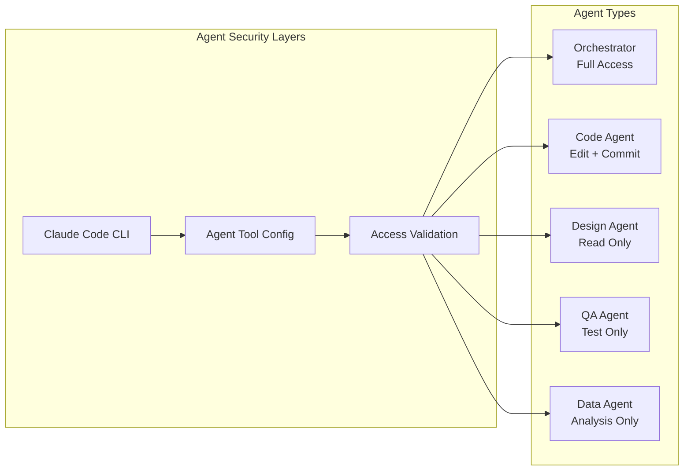

# Security Architecture

## Overview

The AI Agent TDD-Scrum Workflow system implements comprehensive security measures to ensure safe operation of AI agents with appropriate access controls and data protection.

## Agent Security Model

### Command Access Control

Each agent type operates under the **Principle of Least Privilege**, with access restricted to only the tools necessary for their specific function.



### Agent Access Matrix

| Tool Category | Orchestrator | Code Agent | Design Agent | QA Agent | Data Agent |
|---------------|-------------|------------|--------------|----------|------------|
| **File Operations** |
| Read files | ✅ | ✅ | ✅ | ✅ | ✅ |
| Write new files | ✅ | ✅ | ✅ | ❌ | ✅ |
| Edit existing code | ✅ | ✅ | ❌ | ❌ | ❌ |
| Delete files | ✅ | ❌ | ❌ | ❌ | ❌ |
| **Version Control** |
| Git status/diff | ✅ | ✅ | ✅ | ✅ | ❌ |
| Git add/commit | ✅ | ✅ | ❌ | ❌ | ❌ |
| Git push | ✅ | ❌ | ❌ | ❌ | ❌ |
| **Testing & Analysis** |
| Run tests | ✅ | ✅ | ❌ | ✅ | ❌ |
| Code quality tools | ✅ | ✅ | ❌ | ✅ | ❌ |
| **System Operations** |
| Package management | ✅ | ✅ (limited) | ❌ | ❌ | ❌ |
| Process management | ✅ | ❌ | ❌ | ❌ | ❌ |
| Network access | ✅ | ❌ | ✅ (research) | ❌ | ❌ |

## Security Implementation

### 1. Tool Restriction Enforcement

The system leverages Claude Code's built-in security flags:

```bash
claude --allowedTools "Read Write Glob" --disallowedTools "Bash(rm) Edit"
```

**Architecture Components:**

- **`agent_tool_config.py`**: Centralized security configuration
- **Enhanced Claude Client**: Automatic tool restriction application
- **Agent Integration**: Transparent security enforcement

### 2. Command Categories

#### Restricted Commands (Blocked for Most Agents)
- `sudo`, `su` - Privilege escalation
- `chmod`, `chown` - Permission changes
- `kill`, `killall` - Process termination
- `curl`, `wget` - Network downloads
- `ssh`, `scp` - Remote access
- `docker run` - Container operations

#### Elevated Commands (Orchestrator Only)
- `rm`, `rmdir` - File deletion
- `git push` - Publishing changes

#### Code Management Commands (Orchestrator + Code Agent)
- `git commit` - Version control commits
- `git add` - Stage changes
- `git reset` - Reset changes

### 3. Security Validation

```python
from lib.agent_tool_config import validate_agent_access, AgentType

# Runtime validation
can_commit = validate_agent_access(AgentType.CODE, "Bash(git commit)")  # ✅ True
can_delete = validate_agent_access(AgentType.CODE, "Bash(rm)")          # ❌ False
```

## Data Protection

### 1. State Management Security

- **No Sensitive Data**: State files contain only workflow metadata
- **Local Storage**: State persisted locally in `.orch-state/`
- **Project Isolation**: Independent state per project
- **Access Control**: File system permissions protect state

### 2. Environment Security

```bash
# Required environment variables
export DISCORD_BOT_TOKEN="your_token_here"

# Optional: Restrict Claude Code directory access
claude --add-dir ./project-dir
```

### 3. Secret Management

- **Environment Variables**: All secrets stored as env vars
- **No Hardcoded Secrets**: Code contains no embedded credentials
- **Token Rotation**: Support for rotating API tokens
- **Audit Logging**: All credential usage logged

## Authentication & Authorization

### 1. Discord Bot Security

```python
# Role-based access control
@app_commands.command()
@requires_role("developer")
async def sensitive_command(self, interaction):
    # Only users with 'developer' role can execute
    pass
```

### 2. Project-Level Permissions

- **Channel Isolation**: Each project has dedicated Discord channel
- **User Permissions**: Discord role-based access control
- **Command Restrictions**: Sensitive commands require elevated roles

## Input Validation & Sanitization

### 1. Command Validation

```python
def validate_epic_command(description: str) -> bool:
    """Validate epic description input"""
    if len(description) > 500:
        raise ValueError("Epic description too long")
    
    # Prevent command injection
    dangerous_chars = [';', '&&', '||', '`', '$']
    if any(char in description for char in dangerous_chars):
        raise ValueError("Invalid characters in description")
    
    return True
```

### 2. State Machine Validation

- **Command Sequencing**: Only valid commands allowed per state
- **Parameter Validation**: All inputs validated before processing
- **Error Handling**: Graceful failure with helpful error messages

## Audit & Monitoring

### 1. Security Logging

```python
# Security-relevant events logged
logger.security("Agent access granted", extra={
    "agent_type": "CodeAgent",
    "tool": "git commit",
    "user": interaction.user.id,
    "project": project_name
})
```

### 2. Access Monitoring

- **Tool Usage Tracking**: All agent tool usage logged
- **Failed Access Attempts**: Blocked commands logged
- **User Activity**: Discord command usage tracked
- **Anomaly Detection**: Unusual usage patterns flagged

## Threat Model & Mitigations

### 1. Identified Threats

| Threat | Impact | Likelihood | Mitigation |
|--------|--------|------------|------------|
| **Malicious Agent Commands** | High | Medium | Tool access restrictions |
| **Privilege Escalation** | High | Low | Command filtering |
| **Code Injection** | Medium | Low | Input validation |
| **Data Exfiltration** | Medium | Low | Network restrictions |
| **Unauthorized Access** | Medium | Low | Discord role permissions |

### 2. Security Controls

#### Preventive Controls
- Agent tool restrictions
- Input validation
- Role-based access control
- Environment isolation

#### Detective Controls
- Comprehensive audit logging
- Access monitoring
- Anomaly detection
- Failed attempt tracking

#### Corrective Controls
- Automatic command blocking
- Error recovery procedures
- State rollback capabilities
- Alert escalation

## Security Testing

### 1. Automated Security Tests

```python
# Example security test
def test_code_agent_cannot_delete_files(self):
    """Verify code agent cannot use rm command"""
    access_granted = validate_agent_access(AgentType.CODE, "Bash(rm)")
    self.assertFalse(access_granted)
```

### 2. Security Test Categories

- **Access Control Tests**: Verify agent restrictions work
- **Input Validation Tests**: Test command injection prevention
- **Authentication Tests**: Verify Discord role enforcement
- **State Security Tests**: Ensure state tampering protection

## Security Configuration

### 1. Agent Security Profiles

Create custom security profiles by modifying `AGENT_TOOL_CONFIG`:

```python
CUSTOM_AGENT_CONFIG = {
    AgentType.CUSTOM: {
        "allowed_tools": [
            "Read", "Write",
            "Bash(custom_tool)"
        ],
        "disallowed_tools": [
            "Edit", "Bash(dangerous_command)"
        ]
    }
}
```

### 2. Environment Security Settings

```bash
# Restrict Claude Code to specific directories
export CLAUDE_ALLOWED_DIRS="/workspace/safe-dir"

# Enable additional security logging
export SECURITY_LOG_LEVEL="DEBUG"

# Require explicit permission for network access
export REQUIRE_NETWORK_APPROVAL="true"
```

## Best Practices

### 1. Development Security

- **Code Review**: All security-related changes require review
- **Principle of Least Privilege**: Grant minimal necessary permissions
- **Defense in Depth**: Multiple security layers
- **Fail Secure**: Default to deny for unknown operations

### 2. Operational Security

- **Regular Audits**: Periodic review of agent permissions
- **Security Updates**: Keep dependencies updated
- **Incident Response**: Clear procedures for security events
- **Backup & Recovery**: Secure backup of critical data

### 3. Monitoring & Alerting

```python
# Security alert example
if failed_access_attempts > 5:
    alert_security_team(
        "Multiple failed access attempts",
        agent_type=agent.name,
        user=user_id,
        timestamp=datetime.now()
    )
```

## Compliance Considerations

### 1. Data Privacy

- **No PII Storage**: System avoids storing personal information
- **Data Minimization**: Only necessary data collected
- **Retention Policies**: Automatic log rotation and cleanup

### 2. Access Controls

- **Role Separation**: Clear separation of duties
- **Audit Trail**: Complete audit trail of all actions
- **Access Reviews**: Regular review of user permissions

---

!!! warning "Security Updates"
    Security configurations should be reviewed regularly and updated as new threats emerge. Monitor security advisories for all dependencies.

!!! info "Incident Response"
    In case of suspected security incident, immediately disable affected agents and review audit logs. Contact security team for investigation procedures.