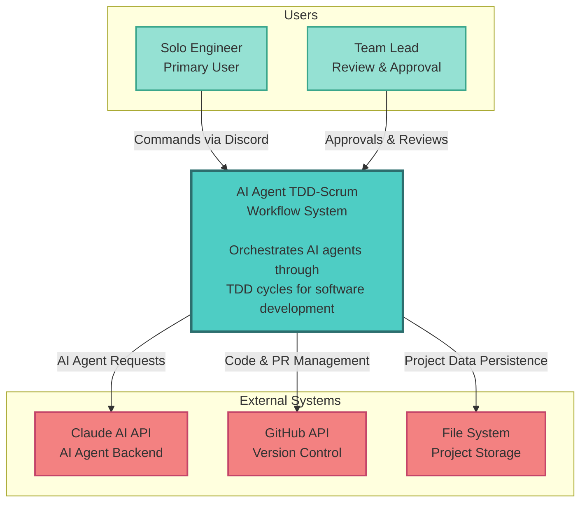
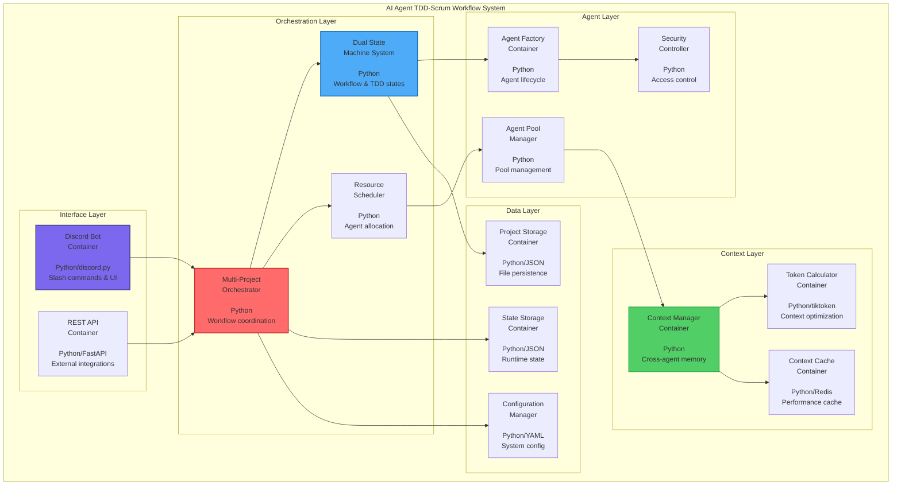
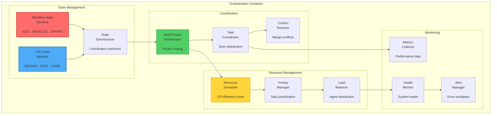
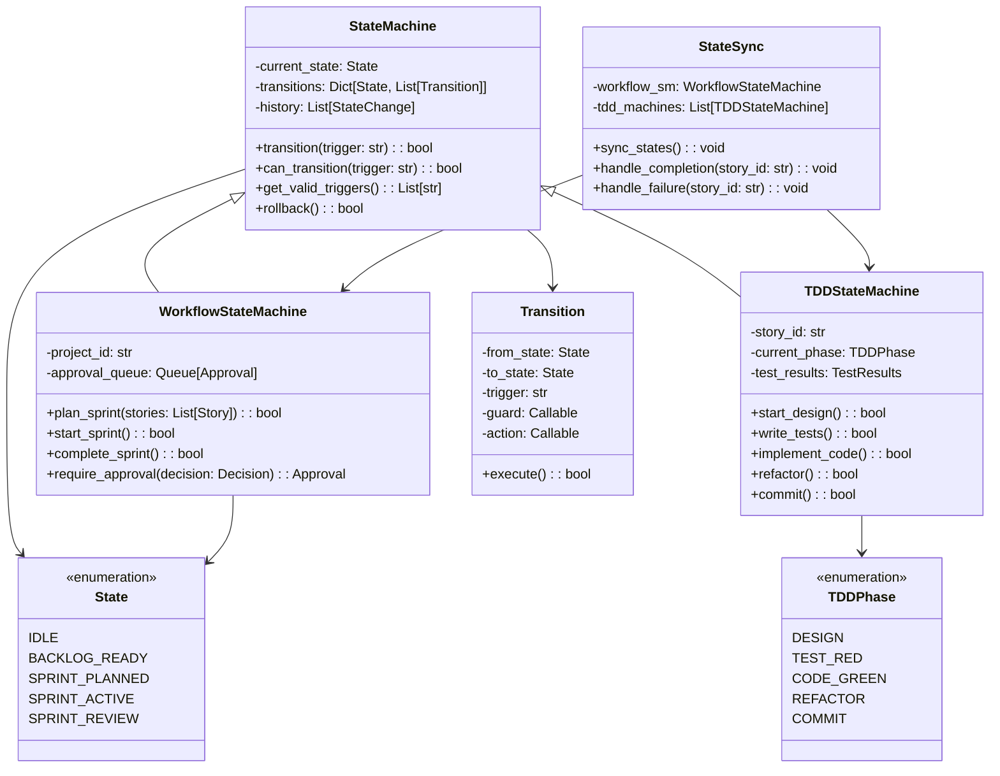
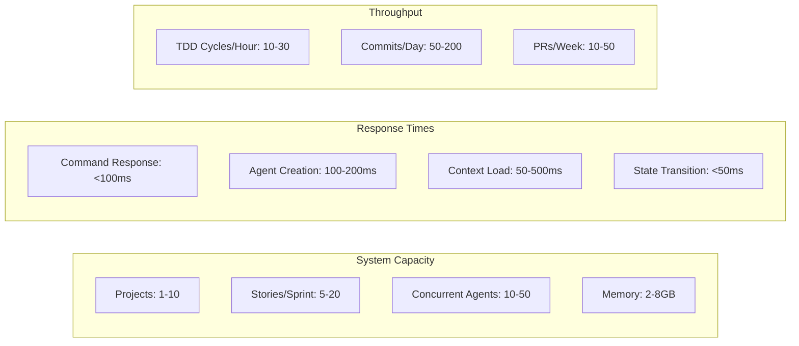
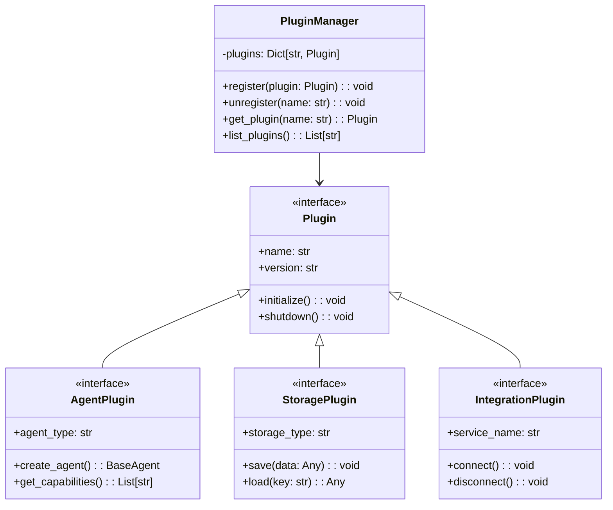
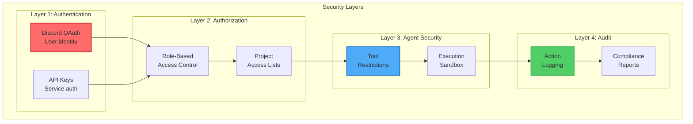
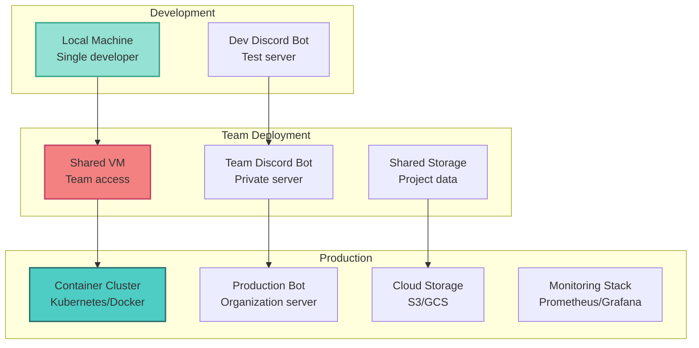

# System Overview - C4 Architecture

The AI Agent TDD-Scrum Workflow system is designed as a sophisticated multi-layered architecture that orchestrates AI agents through Test-Driven Development cycles within a Scrum framework. This document provides a comprehensive view using the C4 model (Context, Container, Component, Code).

## Level 1: System Context Diagram

The system operates as a central orchestration hub between engineers, AI agents, and project repositories:



### Key Relationships

- **Engineer → System**: Primary interaction through Discord slash commands
- **System → Claude AI**: Specialized agent requests with security boundaries
- **System → GitHub**: Automated PR creation, code commits, issue management
- **System → File System**: Persistent storage of project state and configuration

## Level 2: Container Diagram

The system is composed of multiple containers working in concert:



### Container Responsibilities

#### Interface Layer
- **Discord Bot**: Primary user interface with slash commands and interactive UI
- **REST API**: External system integration endpoints (future)

#### Orchestration Layer
- **Multi-Project Orchestrator**: Coordinates workflows across multiple projects
- **Dual State Machine**: Manages workflow states (Scrum) and TDD states independently
- **Resource Scheduler**: Intelligent agent allocation and priority management

#### Agent Layer
- **Agent Factory**: Creates specialized agents on-demand with proper security
- **Agent Pool Manager**: Manages agent lifecycle and resource optimization
- **Security Controller**: Enforces tool access restrictions per agent type

#### Context Layer
- **Context Manager**: Optimizes cross-agent communication and memory
- **Token Calculator**: Manages context size for efficient AI interactions
- **Context Cache**: High-performance caching for frequently accessed data

#### Data Layer
- **Project Storage**: Persistent file-based storage for project data
- **State Storage**: Runtime state management and recovery
- **Configuration Manager**: YAML-based system and project configuration

## Level 3: Component Diagram - Orchestration Core

Deep dive into the orchestration system components:



### Component Interactions

#### State Management Components
- **Workflow State Machine**: Manages high-level Scrum workflow states
- **TDD State Machine**: Controls individual story TDD cycles
- **State Synchronizer**: Ensures consistency between state machines

#### Coordination Components
- **Multi-Project Orchestrator**: Routes commands to appropriate projects
- **Task Coordinator**: Distributes stories to parallel TDD cycles
- **Conflict Resolver**: Handles merge conflicts in parallel development

#### Resource Management Components
- **Resource Scheduler**: Allocates CPU/memory based on priorities
- **Priority Manager**: Determines task execution order
- **Load Balancer**: Distributes work across available agents

#### Monitoring Components
- **Metrics Collector**: Gathers performance and progress data
- **Health Monitor**: Tracks system health and agent status
- **Alert Manager**: Escalates issues to human operators

## Level 4: Code Diagram - State Machine Implementation

Detailed view of the state machine implementation:



### Implementation Details

#### Base State Machine
- **Generic Implementation**: Reusable state machine with history and rollback
- **Transition Guards**: Conditional transitions based on system state
- **Action Hooks**: Execute code during state transitions

#### Workflow State Machine
- **Project Scoped**: Each project has its own workflow instance
- **Approval Queue**: Human approval integration for strategic decisions
- **Sprint Management**: Handles sprint planning and execution lifecycle

#### TDD State Machine
- **Story Scoped**: Each story gets its own TDD instance
- **Phase Tracking**: Enforces proper RED-GREEN-REFACTOR sequence
- **Test Integration**: Validates test results before transitions

#### State Synchronization
- **Bidirectional Sync**: Keeps workflow and TDD states consistent
- **Completion Handling**: Updates workflow when stories complete
- **Failure Recovery**: Handles TDD failures gracefully

## Technology Decisions

### Architecture Style: Microkernel + Pipes and Filters

**Decision**: Hybrid architecture combining microkernel for extensibility with pipes and filters for data flow.

**Rationale**:
- **Microkernel**: Core orchestration with pluggable agents
- **Pipes and Filters**: Natural fit for TDD phase transitions
- **Event-Driven**: Asynchronous agent coordination

**Trade-offs**:
- ✅ Highly extensible for new agent types
- ✅ Clear separation of concerns
- ✅ Natural parallelization
- ❌ Additional complexity in state synchronization
- ❌ Potential performance overhead in message passing

### State Management: Dual State Machines

**Decision**: Separate state machines for workflow and TDD cycles.

**Rationale**:
- **Separation**: Different concerns require different state models
- **Parallelization**: Multiple TDD cycles can run independently
- **Clarity**: Each state machine has focused responsibility

**Alternatives Considered**:
1. **Single State Machine**: Too complex with mixed concerns
2. **Hierarchical State Machine**: Unnecessary coupling
3. **Actor Model**: Overkill for current scale

### Agent Architecture: Ephemeral + Factory Pattern

**Decision**: On-demand agent creation with standardized factory.

**Rationale**:
- **Resource Efficiency**: Agents only exist when needed
- **Security**: Fresh environment for each task
- **Scalability**: Easy to scale horizontally

**Performance Characteristics**:
- Agent creation: ~100-200ms
- Memory per agent: ~50-100MB
- Concurrent agents: 10-20 per project

### Data Persistence: File-Based JSON

**Decision**: JSON files in project directories.

**Rationale**:
- **Simplicity**: No database dependencies
- **Version Control**: Data versioned with code
- **Portability**: Easy backup and migration

**Limitations**:
- File locking for concurrent access
- Limited query capabilities
- Manual index management

## Performance and Scaling

### Current Performance Metrics



### Scaling Strategies

#### Horizontal Scaling
- **Multi-Instance**: Run orchestrators per project group
- **Agent Distribution**: Distribute agents across machines
- **Load Balancing**: Route projects to available instances

#### Vertical Scaling
- **Resource Pools**: Pre-warmed agent pools
- **Context Sharding**: Distribute context across nodes
- **Parallel Execution**: Increase concurrent TDD cycles

### Bottlenecks and Optimizations

#### Identified Bottlenecks
1. **Context Loading**: Large codebases slow context preparation
2. **Agent Creation**: Cold start penalty for new agents
3. **State Synchronization**: Coordination overhead in parallel execution

#### Optimization Strategies
1. **Context Caching**: LRU cache for frequently accessed context
2. **Agent Pooling**: Pre-create agents for common tasks
3. **Async Operations**: Non-blocking state updates

## Integration Architecture

### API Surface

```mermaid
graph TB
    subgraph "External APIs"
        subgraph "Discord Integration"
            SlashCmd[Slash Commands<br/>/epic, /sprint, /tdd]
            Interactive[Interactive UI<br/>Buttons & Modals]
            Webhooks[Event Webhooks<br/>State updates]
        end
        
        subgraph "REST API"
            Projects[/api/projects<br/>Project management]
            Status[/api/status<br/>System status]
            Metrics[/api/metrics<br/>Performance data]
        end
        
        subgraph "WebSocket"
            StateStream[/ws/state<br/>Real-time state]
            LogStream[/ws/logs<br/>Live logs]
            MetricStream[/ws/metrics<br/>Live metrics]
        end
    end
    
    subgraph "Internal APIs"
        AgentAPI[Agent API<br/>standardized interface]
        StorageAPI[Storage API<br/>data persistence]
        ContextAPI[Context API<br/>memory management]
    end
    
    SlashCmd --> AgentAPI
    Projects --> StorageAPI
    StateStream --> ContextAPI
    
    style SlashCmd fill:#7b68ee,stroke:#483d8b,stroke-width:2px
    style Projects fill:#ff6b6b,stroke:#c92a2a,stroke-width:2px
    style StateStream fill:#4dabf7,stroke:#1971c2,stroke-width:2px
```

### Plugin Architecture

The system supports extensibility through plugins:



### Extension Points

1. **Custom Agents**: Implement new agent types for specialized tasks
2. **Storage Backends**: Add database or cloud storage options
3. **Integration Services**: Connect to Jira, Slack, Teams, etc.
4. **Metrics Exporters**: Send metrics to Prometheus, Grafana
5. **Security Providers**: Custom authentication and authorization

## Security Architecture

### Defense in Depth



### Agent Security Profiles

Detailed security boundaries per agent type:

| Agent Type | File Access | Git Operations | System Commands | Network | Build Tools |
|------------|------------|----------------|-----------------|---------|-------------|
| Orchestrator | Full | All | Limited | Yes | Yes |
| Design | Read-only | None | None | Yes | No |
| Code | Read/Write | Add/Commit | Limited | No | Yes |
| QA | Read/Write | None | Test only | No | Yes |
| Data | Read-only | None | Analysis | Yes | No |

### Security Implementation

```python
# Example: Agent security enforcement
class SecurityController:
    def get_agent_restrictions(self, agent_type: str) -> Dict[str, List[str]]:
        """Return tool restrictions for agent type"""
        profiles = {
            "orchestrator": {
                "allowed": ["*"],
                "blocked": ["rm -rf", "sudo", "format"]
            },
            "code": {
                "allowed": ["edit", "write", "git add", "git commit"],
                "blocked": ["rm", "git push", "sudo"]
            },
            "design": {
                "allowed": ["read", "web_search"],
                "blocked": ["edit", "write", "git", "rm"]
            }
        }
        return profiles.get(agent_type, {"allowed": [], "blocked": ["*"]})
```

## Deployment Architecture

### Deployment Options



### Container Architecture

```yaml
# Example: Docker Compose deployment
version: '3.8'
services:
  orchestrator:
    image: agent-workflow:latest
    environment:
      - DISCORD_BOT_TOKEN=${DISCORD_BOT_TOKEN}
      - CLAUDE_API_KEY=${CLAUDE_API_KEY}
    volumes:
      - ./projects:/projects
      - ./config:/config
    depends_on:
      - redis
      
  redis:
    image: redis:alpine
    volumes:
      - redis_data:/data
      
  monitoring:
    image: prom/prometheus
    volumes:
      - ./prometheus.yml:/etc/prometheus/prometheus.yml
      
volumes:
  redis_data:
```

## Summary

The AI Agent TDD-Scrum Workflow system implements a sophisticated architecture that:

1. **Separates Concerns**: Clear boundaries between orchestration, agents, and data
2. **Scales Efficiently**: Handles multiple projects and parallel execution
3. **Maintains Security**: Multi-layered security with agent restrictions
4. **Enables Extension**: Plugin architecture for customization
5. **Supports Teams**: From solo developers to large organizations

The architecture prioritizes clarity, security, and extensibility while maintaining performance for practical software development workflows.