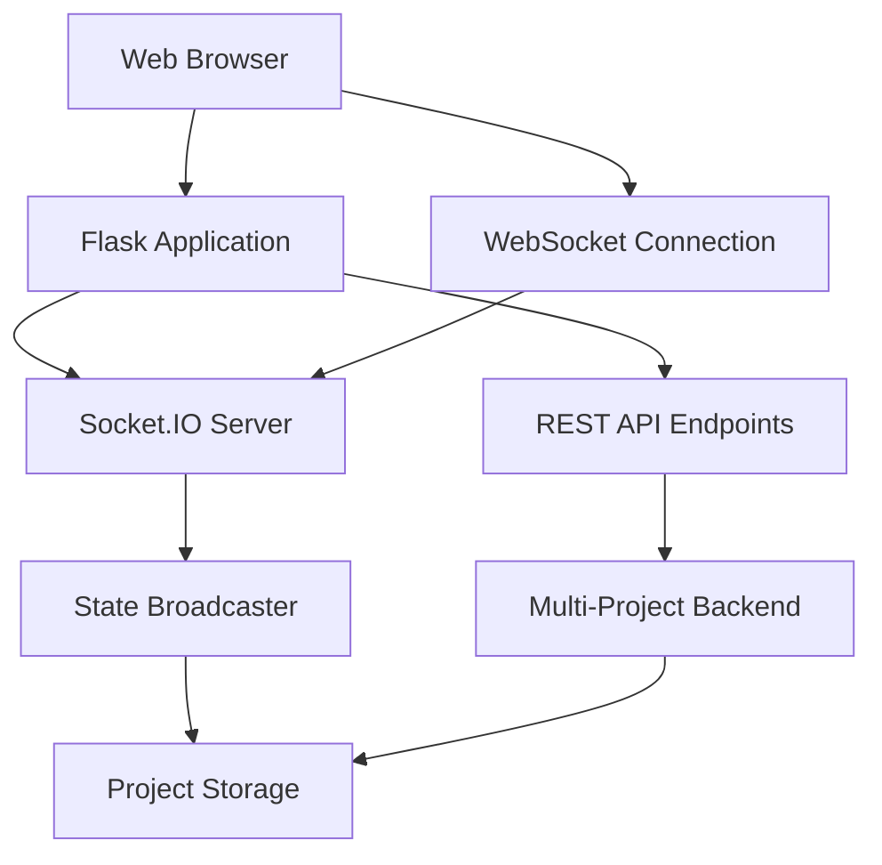

# Visualizer System Architecture

The Visualizer is a real-time web application that provides monitoring and control interfaces for the AI Agent Workflow system.

## Architecture Overview



## Core Components

### Flask Application (`app.py`)
- **Purpose**: Main web server and API gateway
- **Responsibilities**:
  - Serve static files and templates
  - Handle HTTP requests
  - Coordinate between frontend and backend
  - Manage WebSocket connections

### Socket.IO Server
- **Purpose**: Real-time bi-directional communication
- **Features**:
  - Project-specific rooms for isolation
  - State broadcasting
  - Chat message handling
  - Command processing

### Multi-Project Backend
- **Purpose**: Coordinate multiple project contexts
- **Components**:
  - Project registration and discovery
  - Context switching
  - Resource management
  - Cross-project intelligence

### State Broadcaster
- **Purpose**: Real-time state synchronization
- **Functions**:
  - Monitor project state changes
  - Broadcast updates to connected clients
  - Handle state persistence

## Frontend Architecture

### Component Structure
```
static/
├── js/
│   ├── app-core.js          # Core application logic
│   ├── discord-chat.js      # Chat interface
│   ├── project-manager.js   # Project switching
│   ├── websocket-manager.js # Real-time communication
│   └── visualizer.js        # State diagram rendering
├── css/
│   ├── discord-chat.css     # Chat styling
│   └── variables.css        # Theme variables
└── templates/
    └── index.html           # Main interface template
```

### State Management
- **Project Context**: Managed through dropdown selection
- **Chat History**: Isolated per project in browser storage
- **WebSocket Rooms**: Project-specific Socket.IO rooms
- **Diagram State**: Mermaid diagrams reflect current workflow state

## Data Flow

### 1. Project Selection
1. User selects project from dropdown
2. Frontend sends project switch request
3. Backend validates project access
4. WebSocket room switched
5. State diagram and chat context updated

### 2. Command Processing
1. User enters command in chat
2. Command sent via WebSocket
3. Backend validates and processes command
4. Agent executes command
5. Response broadcast to project room
6. Frontend updates chat and diagram

### 3. State Broadcasting
1. Agent completes workflow step
2. State change written to project storage
3. State broadcaster detects change
4. Update broadcast to all project clients
5. Diagram automatically re-renders

## Security Model

### Project Isolation
- **WebSocket Rooms**: Each project has dedicated communication channel
- **Session Management**: User sessions tracked per project
- **Data Separation**: Project data strictly separated in storage

### Access Controls
- **Project Registration**: Only registered projects accessible
- **Command Validation**: All commands validated before execution
- **Resource Limits**: Per-project resource constraints enforced

## Performance Optimizations

### Caching Strategy
- **Static Assets**: Browser caching with cache-busting for updates
- **Project Data**: In-memory caching with TTL
- **Diagram Rendering**: Mermaid diagram caching

### Resource Management
- **WebSocket Connections**: Connection pooling and cleanup
- **Memory Usage**: Bounded chat history and state data
- **CPU Usage**: Throttled diagram re-rendering

## Deployment Considerations

### Production Requirements
- **Reverse Proxy**: Nginx recommended for static file serving
- **SSL/TLS**: Required for WebSocket connections over HTTPS
- **Process Management**: systemd or supervisor for process control

### Scaling Options
- **Horizontal Scaling**: Multiple Flask instances with load balancer
- **Redis Backend**: For Socket.IO clustering
- **Database**: PostgreSQL for persistent storage

## Monitoring and Logging

### Health Checks
- **Endpoint**: `/health` for load balancer monitoring
- **Metrics**: Connection count, response times, error rates
- **Alerts**: Configurable thresholds for key metrics

### Logging Strategy
- **Application Logs**: Structured JSON logging
- **Access Logs**: Nginx access logs
- **Error Tracking**: Integration with monitoring systems

## Integration Points

### External Systems
- **Discord Bot**: Bi-directional chat integration
- **GitHub API**: Repository access and webhook handling
- **AI Services**: Claude API integration for agent responses

### Internal APIs
- **Orchestrator API**: Command execution and state management
- **Project Storage**: File-based project data persistence
- **Agent Pool**: Dynamic agent creation and management

## Future Architecture

### Planned Enhancements
- **Microservices**: Split into smaller, focused services
- **Event Sourcing**: Complete audit trail of all actions
- **Plugin System**: Extensible architecture for custom integrations
- **Mobile App**: Native mobile client for remote monitoring