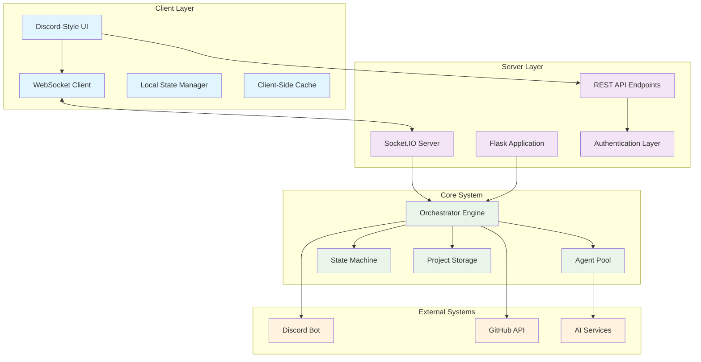
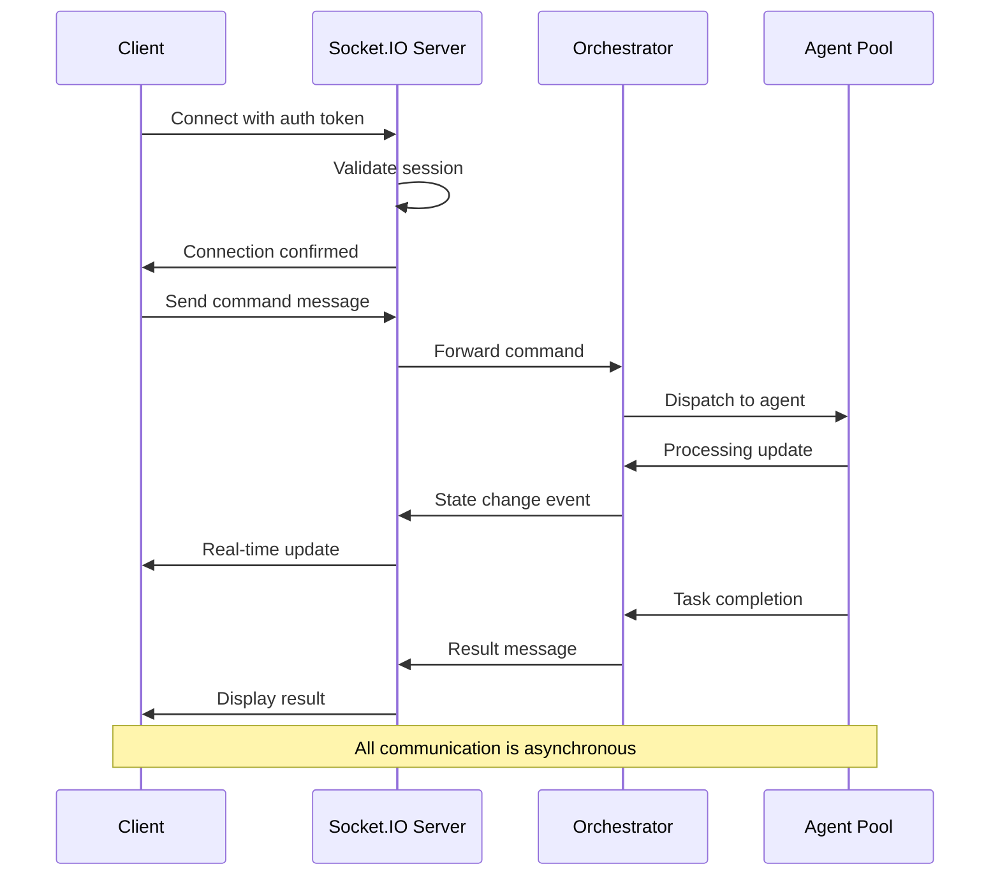

# 🌐 Web Architecture - Discord-Style Interface Technical Design

> **Complete technical architecture overview for the Discord-inspired web interface including WebSocket communication, state synchronization, and security implementation**

This document provides a comprehensive technical overview of the web-based user interface architecture, designed to deliver a Discord-like experience for AI agent orchestration with enterprise-grade performance, security, and scalability.

## 🏗️ Architecture Overview

### High-Level System Design

The web architecture implements a modern client-server design with real-time communication:



### Technology Stack

**Frontend Technologies**:
- **HTML5/CSS3**: Modern semantic markup and responsive design
- **JavaScript (ES6+)**: Vanilla JavaScript with modern features
- **WebSocket API**: Real-time bidirectional communication
- **Progressive Web App**: Service workers and offline capabilities
- **CSS Grid & Flexbox**: Advanced layout systems

**Backend Technologies**:
- **Flask 2.3+**: Lightweight web framework
- **Socket.IO**: Enhanced WebSocket communication
- **Flask-Login**: Session management and authentication
- **Flask-CORS**: Cross-origin resource sharing
- **Threading**: Concurrent request handling

**Communication Protocols**:
- **WebSocket**: Real-time messaging and state updates
- **HTTP/HTTPS**: REST API and static asset delivery
- **JSON**: Data serialization and message format
- **JWT**: Secure token-based authentication

## 🔄 WebSocket Communication Flow

### Real-Time Messaging Architecture

The WebSocket implementation provides sub-100ms message delivery with automatic reconnection:



### WebSocket Event Types

**Client-to-Server Events**:
```javascript
// Command execution
{
  "event": "command",
  "data": {
    "command": "/epic 'User authentication'",
    "channel": "main-project",
    "timestamp": "2024-01-15T10:30:00Z"
  }
}

// Channel management
{
  "event": "join_channel",
  "data": {
    "channel": "testing",
    "project_id": "my-webapp"
  }
}

// Agent interaction
{
  "event": "agent_message",
  "data": {
    "agent_id": "CodeAgent",
    "message": "Implement user login form",
    "context": {...}
  }
}
```

**Server-to-Client Events**:
```javascript
// State updates
{
  "event": "state_change",
  "data": {
    "old_state": "SPRINT_PLANNED",
    "new_state": "SPRINT_ACTIVE",
    "timestamp": "2024-01-15T10:30:05Z"
  }
}

// Agent responses
{
  "event": "agent_response",
  "data": {
    "agent_id": "CodeAgent",
    "message": "✅ Task completed successfully",
    "result": {...},
    "interactive_elements": [...]
  }
}

// System notifications
{
  "event": "notification",
  "data": {
    "type": "success|warning|error|info",
    "title": "Sprint Started",
    "message": "Sprint 'Authentication System' is now active",
    "actions": [...]
  }
}
```

### Connection Management

**Automatic Reconnection**:
```javascript
class WebSocketManager {
  constructor() {
    this.socket = null;
    this.reconnectAttempts = 0;
    this.maxReconnectAttempts = 5;
    this.reconnectDelay = 1000; // Start with 1 second
  }
  
  connect(token) {
    this.socket = io('/', {
      auth: { token },
      transports: ['websocket', 'polling'],
      upgrade: true,
      rememberUpgrade: true
    });
    
    this.socket.on('connect', () => {
      console.log('Connected to server');
      this.reconnectAttempts = 0;
      this.reconnectDelay = 1000;
    });
    
    this.socket.on('disconnect', (reason) => {
      console.log('Disconnected:', reason);
      if (reason === 'io server disconnect') {
        // Server initiated disconnect, don't reconnect
        return;
      }
      this.handleReconnection();
    });
  }
  
  handleReconnection() {
    if (this.reconnectAttempts < this.maxReconnectAttempts) {
      setTimeout(() => {
        this.reconnectAttempts++;
        this.reconnectDelay *= 1.5; // Exponential backoff
        this.socket.connect();
      }, this.reconnectDelay);
    }
  }
}
```

## 🎨 Frontend Architecture

### Component-Based Design

The frontend follows a modular component architecture:

```
frontend/
├── components/
│   ├── chat/
│   │   ├── MessageList.js      # Message display and scrolling
│   │   ├── MessageInput.js     # Command input with auto-complete
│   │   ├── MessageItem.js      # Individual message rendering
│   │   └── InteractiveElements.js  # Buttons, dropdowns, widgets
│   ├── sidebar/
│   │   ├── ChannelList.js      # Project channels navigation
│   │   ├── AgentStatus.js      # AI agent status indicators
│   │   └── Navigation.js       # Main navigation menu
│   ├── dashboard/
│   │   ├── ProjectCards.js     # Project overview cards
│   │   ├── SprintBoard.js      # Kanban-style sprint visualization
│   │   └── MetricsWidgets.js   # Performance monitoring
│   └── modals/
│       ├── SettingsModal.js    # Configuration interface
│       ├── HelpModal.js        # Context-sensitive help
│       └── CommandPalette.js   # Quick command access
├── services/
│   ├── WebSocketService.js     # WebSocket communication
│   ├── APIService.js           # REST API calls
│   ├── StateManager.js         # Application state management
│   └── NotificationService.js  # User notifications
├── utils/
│   ├── MessageParser.js        # Command parsing and validation
│   ├── ThemeManager.js         # Theme switching and customization
│   └── KeyboardHandler.js      # Keyboard shortcuts
└── styles/
    ├── discord-theme.css       # Discord-inspired styling
    ├── components.css          # Component-specific styles
    └── responsive.css          # Mobile responsiveness
```

### State Management Pattern

**Centralized State Management**:
```javascript
class AppState {
  constructor() {
    this.state = {
      // Connection state
      connected: false,
      connectionStatus: 'disconnected',
      
      // User session
      user: null,
      currentProject: null,
      currentChannel: 'main-project',
      
      // UI state
      activeView: 'chat',
      sidebarVisible: true,
      theme: 'dark',
      
      // Chat state
      messages: {},
      channels: [],
      typingUsers: {},
      
      // Agent state
      agents: {},
      agentStatuses: {},
      
      // System state
      orchestratorState: 'IDLE',
      notifications: [],
      performance: {}
    };
    
    this.listeners = [];
    this.middleware = [];
  }
  
  subscribe(listener) {
    this.listeners.push(listener);
    return () => {
      this.listeners = this.listeners.filter(l => l !== listener);
    };
  }
  
  dispatch(action) {
    // Apply middleware
    for (const middleware of this.middleware) {
      action = middleware(action, this.state);
    }
    
    // Update state
    const newState = this.reducer(this.state, action);
    if (newState !== this.state) {
      this.state = newState;
      
      // Notify listeners
      this.listeners.forEach(listener => listener(this.state));
    }
  }
  
  reducer(state, action) {
    switch (action.type) {
      case 'CONNECTION_STATUS_CHANGED':
        return { ...state, connected: action.connected, connectionStatus: action.status };
      
      case 'MESSAGE_RECEIVED':
        return {
          ...state,
          messages: {
            ...state.messages,
            [action.channel]: [...(state.messages[action.channel] || []), action.message]
          }
        };
      
      case 'AGENT_STATUS_UPDATED':
        return {
          ...state,
          agentStatuses: { ...state.agentStatuses, [action.agentId]: action.status }
        };
      
      default:
        return state;
    }
  }
}
```

### Responsive Design Implementation

**Mobile-First CSS Architecture**:
```css
/* Base mobile styles */
.chat-container {
  display: flex;
  flex-direction: column;
  height: 100vh;
  padding: 0;
}

.sidebar {
  display: none; /* Hidden on mobile by default */
  position: fixed;
  top: 0;
  left: 0;
  width: 240px;
  height: 100vh;
  background: var(--sidebar-bg);
  z-index: 1000;
  transform: translateX(-100%);
  transition: transform 0.3s ease;
}

.sidebar.visible {
  transform: translateX(0);
}

/* Tablet styles */
@media (min-width: 768px) {
  .chat-container {
    flex-direction: row;
  }
  
  .sidebar {
    position: relative;
    display: block;
    transform: none;
  }
  
  .main-content {
    flex: 1;
    margin-left: 0;
  }
}

/* Desktop styles */
@media (min-width: 1024px) {
  .sidebar {
    width: 280px;
  }
  
  .message-input {
    padding: 12px 16px;
  }
  
  .message-item:hover {
    background: var(--hover-bg);
  }
}

/* High-resolution displays */
@media (min-resolution: 2dppx) {
  .avatar {
    background-size: contain;
  }
  
  .icon {
    filter: contrast(1.1);
  }
}
```

## 🔧 Backend Implementation

### Flask Application Structure

**Application Factory Pattern**:
```python
# app/__init__.py
from flask import Flask
from flask_socketio import SocketIO
from flask_cors import CORS
from flask_login import LoginManager

def create_app(config_name='default'):
    app = Flask(__name__)
    app.config.from_object(config[config_name])
    
    # Initialize extensions
    socketio = SocketIO(app, cors_allowed_origins="*", 
                       async_mode='threading',
                       logger=True,
                       engineio_logger=True)
    
    CORS(app, resources={
        r"/api/*": {
            "origins": ["http://localhost:3000", "http://localhost:8080"],
            "methods": ["GET", "POST", "PUT", "DELETE"],
            "allow_headers": ["Content-Type", "Authorization"]
        }
    })
    
    login_manager = LoginManager()
    login_manager.init_app(app)
    login_manager.login_view = 'auth.login'
    
    # Register blueprints
    from .api import api_blueprint
    from .chat import chat_blueprint
    from .auth import auth_blueprint
    
    app.register_blueprint(api_blueprint, url_prefix='/api')
    app.register_blueprint(chat_blueprint)
    app.register_blueprint(auth_blueprint, url_prefix='/auth')
    
    # Register Socket.IO events
    from . import socketio_events
    socketio_events.register_events(socketio)
    
    return app, socketio
```

**WebSocket Event Handlers**:
```python
# app/socketio_events.py
from flask_socketio import emit, join_room, leave_room, rooms
from flask_login import current_user
import json
import asyncio
from threading import Thread

class SocketIOEventHandler:
    def __init__(self, socketio, orchestrator):
        self.socketio = socketio
        self.orchestrator = orchestrator
        self.active_connections = {}
        
    def register_events(self, socketio):
        @socketio.on('connect')
        def handle_connect(auth):
            if not current_user.is_authenticated:
                return False
            
            user_id = current_user.id
            self.active_connections[request.sid] = user_id
            
            # Join user-specific room
            join_room(f'user_{user_id}')
            
            # Join project channels
            user_projects = current_user.get_projects()
            for project in user_projects:
                join_room(f'project_{project.id}')
            
            emit('connected', {'status': 'success', 'user_id': user_id})
            
        @socketio.on('disconnect')
        def handle_disconnect():
            if request.sid in self.active_connections:
                del self.active_connections[request.sid]
            
        @socketio.on('command')
        def handle_command(data):
            try:
                command = data.get('command', '')
                channel = data.get('channel', 'main-project')
                project_id = data.get('project_id')
                
                # Validate command
                if not self.validate_command(command, current_user):
                    emit('error', {'message': 'Invalid command or insufficient permissions'})
                    return
                
                # Execute command asynchronously
                def execute_command():
                    try:
                        result = self.orchestrator.execute_command(
                            command=command,
                            user_id=current_user.id,
                            project_id=project_id,
                            channel=channel
                        )
                        
                        # Emit result to user
                        self.socketio.emit('command_result', {
                            'command': command,
                            'result': result,
                            'timestamp': datetime.utcnow().isoformat()
                        }, room=f'user_{current_user.id}')
                        
                        # Emit state updates to project channel
                        if result.get('state_change'):
                            self.socketio.emit('state_change', result['state_change'], 
                                             room=f'project_{project_id}')
                        
                    except Exception as e:
                        self.socketio.emit('error', {
                            'message': str(e),
                            'command': command
                        }, room=f'user_{current_user.id}')
                
                # Run in background thread
                Thread(target=execute_command).start()
                
                # Immediate acknowledgment
                emit('command_received', {'command': command})
                
            except Exception as e:
                emit('error', {'message': f'Command processing error: {str(e)}'})
        
        @socketio.on('join_channel')
        def handle_join_channel(data):
            channel = data.get('channel')
            project_id = data.get('project_id')
            
            if self.user_has_project_access(current_user, project_id):
                join_room(f'channel_{channel}')
                emit('joined_channel', {'channel': channel})
            else:
                emit('error', {'message': 'Access denied to channel'})
        
        @socketio.on('agent_message')
        def handle_agent_message(data):
            agent_id = data.get('agent_id')
            message = data.get('message')
            context = data.get('context', {})
            
            # Forward to agent
            def process_agent_message():
                response = self.orchestrator.send_agent_message(
                    agent_id=agent_id,
                    message=message,
                    context=context,
                    user_id=current_user.id
                )
                
                self.socketio.emit('agent_response', {
                    'agent_id': agent_id,
                    'response': response,
                    'timestamp': datetime.utcnow().isoformat()
                }, room=f'user_{current_user.id}')
            
            Thread(target=process_agent_message).start()
            emit('message_sent', {'agent_id': agent_id})
```

### REST API Endpoints

**API Blueprint Structure**:
```python
# app/api/__init__.py
from flask import Blueprint, jsonify, request
from flask_login import login_required, current_user
from ..models import Project, Agent, Message
from ..orchestrator import orchestrator

api_blueprint = Blueprint('api', __name__)

@api_blueprint.route('/projects', methods=['GET'])
@login_required
def get_projects():
    """Get all projects accessible to current user"""
    projects = current_user.get_accessible_projects()
    return jsonify({
        'projects': [project.to_dict() for project in projects],
        'total': len(projects)
    })

@api_blueprint.route('/projects/<project_id>/state', methods=['GET'])
@login_required
def get_project_state(project_id):
    """Get current state for a specific project"""
    if not current_user.has_project_access(project_id):
        return jsonify({'error': 'Access denied'}), 403
    
    state = orchestrator.get_project_state(project_id)
    return jsonify({
        'project_id': project_id,
        'state': state.to_dict(),
        'last_updated': state.last_updated.isoformat()
    })

@api_blueprint.route('/agents', methods=['GET'])
@login_required
def get_agents():
    """Get all available agents and their status"""
    agents = orchestrator.get_agent_statuses()
    return jsonify({
        'agents': agents,
        'total_agents': len(agents),
        'active_agents': len([a for a in agents if a['status'] == 'active'])
    })

@api_blueprint.route('/messages/<channel>', methods=['GET'])
@login_required
def get_channel_messages(channel):
    """Get message history for a channel"""
    page = request.args.get('page', 1, type=int)
    per_page = request.args.get('per_page', 50, type=int)
    
    messages = Message.query.filter_by(
        channel=channel,
        user_id=current_user.id
    ).order_by(Message.timestamp.desc()).paginate(
        page=page, per_page=per_page, error_out=False
    )
    
    return jsonify({
        'messages': [msg.to_dict() for msg in messages.items],
        'pagination': {
            'page': page,
            'per_page': per_page,
            'total': messages.total,
            'pages': messages.pages
        }
    })

@api_blueprint.route('/performance', methods=['GET'])
@login_required
def get_performance_metrics():
    """Get system performance metrics"""
    metrics = orchestrator.get_performance_metrics()
    return jsonify({
        'cpu_usage': metrics['cpu_usage'],
        'memory_usage': metrics['memory_usage'],
        'response_times': metrics['response_times'],
        'agent_performance': metrics['agent_performance'],
        'websocket_connections': len(active_connections),
        'timestamp': datetime.utcnow().isoformat()
    })
```

## 🔒 Security Implementation

### Authentication & Authorization

**JWT-Based Authentication**:
```python
# app/auth/models.py
from flask_login import UserMixin
from werkzeug.security import generate_password_hash, check_password_hash
import jwt
from datetime import datetime, timedelta

class User(UserMixin):
    def __init__(self, id, username, email, password_hash=None):
        self.id = id
        self.username = username
        self.email = email
        self.password_hash = password_hash
        self.created_at = datetime.utcnow()
        self.last_login = None
        self.projects = []
        self.permissions = []
    
    def set_password(self, password):
        self.password_hash = generate_password_hash(password)
    
    def check_password(self, password):
        return check_password_hash(self.password_hash, password)
    
    def generate_auth_token(self, expires_in=3600):
        """Generate JWT token for API authentication"""
        payload = {
            'user_id': self.id,
            'username': self.username,
            'exp': datetime.utcnow() + timedelta(seconds=expires_in),
            'iat': datetime.utcnow()
        }
        return jwt.encode(payload, current_app.config['SECRET_KEY'], algorithm='HS256')
    
    @staticmethod
    def verify_auth_token(token):
        """Verify JWT token and return user"""
        try:
            payload = jwt.decode(token, current_app.config['SECRET_KEY'], algorithms=['HS256'])
            user = User.get(payload['user_id'])
            return user
        except jwt.ExpiredSignatureError:
            return None  # Token expired
        except jwt.InvalidTokenError:
            return None  # Invalid token
    
    def has_project_access(self, project_id):
        """Check if user has access to specific project"""
        return any(p.id == project_id for p in self.projects)
    
    def has_permission(self, permission):
        """Check if user has specific permission"""
        return permission in self.permissions
```

**WebSocket Authentication**:
```javascript
// Frontend: Token-based WebSocket authentication
class AuthenticatedWebSocket {
  constructor() {
    this.token = localStorage.getItem('auth_token');
    this.socket = null;
  }
  
  connect() {
    if (!this.token) {
      throw new Error('No authentication token available');
    }
    
    this.socket = io('/', {
      auth: {
        token: this.token
      },
      transports: ['websocket', 'polling']
    });
    
    this.socket.on('connect_error', (error) => {
      if (error.message === 'Authentication failed') {
        // Token expired or invalid
        this.refreshToken().then(() => {
          this.connect(); // Retry with new token
        }).catch(() => {
          this.redirectToLogin();
        });
      }
    });
  }
  
  async refreshToken() {
    try {
      const response = await fetch('/auth/refresh', {
        method: 'POST',
        headers: {
          'Authorization': `Bearer ${this.token}`
        }
      });
      
      if (response.ok) {
        const data = await response.json();
        this.token = data.token;
        localStorage.setItem('auth_token', this.token);
      } else {
        throw new Error('Token refresh failed');
      }
    } catch (error) {
      localStorage.removeItem('auth_token');
      throw error;
    }
  }
}
```

### Input Validation & Security

**Command Sanitization**:
```python
# app/security/validators.py
import re
from html import escape
from flask import current_app

class CommandValidator:
    """Validates and sanitizes user commands"""
    
    ALLOWED_COMMANDS = {
        'epic', 'sprint', 'approve', 'state', 'help',
        'agents', 'context', 'status', 'logs'
    }
    
    DANGEROUS_PATTERNS = [
        r'(?i)(rm\s+-rf)',
        r'(?i)(sudo)',
        r'(?i)(exec)',
        r'(?i)(\|.*sh)',
        r'(?i)(&&.*rm)',
        r'(?i)(;.*rm)'
    ]
    
    @classmethod
    def validate_command(cls, command, user):
        """Validate command syntax and user permissions"""
        # Remove leading/trailing whitespace
        command = command.strip()
        
        # Check for empty command
        if not command:
            raise ValueError("Empty command not allowed")
        
        # Check for dangerous patterns
        for pattern in cls.DANGEROUS_PATTERNS:
            if re.search(pattern, command):
                current_app.logger.warning(f"Dangerous command blocked: {command} from user {user.id}")
                raise ValueError("Command contains potentially dangerous operations")
        
        # Extract base command
        if command.startswith('/'):
            base_command = command[1:].split()[0].lower()
        else:
            base_command = command.split()[0].lower()
        
        # Check if command is allowed
        if base_command not in cls.ALLOWED_COMMANDS:
            raise ValueError(f"Command '{base_command}' is not allowed")
        
        # User-specific permission checks
        if base_command in ['logs', 'status'] and not user.has_permission('admin'):
            raise ValueError("Insufficient permissions for admin commands")
        
        return True
    
    @classmethod
    def sanitize_input(cls, text):
        """Sanitize user input to prevent XSS and injection"""
        # HTML escape
        text = escape(text)
        
        # Remove null bytes
        text = text.replace('\x00', '')
        
        # Limit length
        if len(text) > 1000:
            text = text[:1000] + '...'
        
        return text
```

**CORS & CSP Configuration**:
```python
# app/security/headers.py
from flask import current_app

def configure_security_headers(app):
    """Configure security headers for the application"""
    
    @app.after_request
    def set_security_headers(response):
        # Content Security Policy
        csp = (
            "default-src 'self'; "
            "script-src 'self' 'unsafe-inline' https://cdn.jsdelivr.net; "
            "style-src 'self' 'unsafe-inline'; "
            "img-src 'self' data: https:; "
            "connect-src 'self' ws: wss:; "
            "font-src 'self' https://fonts.gstatic.com; "
            "frame-ancestors 'none'"
        )
        response.headers['Content-Security-Policy'] = csp
        
        # Other security headers
        response.headers['X-Content-Type-Options'] = 'nosniff'
        response.headers['X-Frame-Options'] = 'DENY'
        response.headers['X-XSS-Protection'] = '1; mode=block'
        response.headers['Referrer-Policy'] = 'strict-origin-when-cross-origin'
        response.headers['Permissions-Policy'] = 'geolocation=(), microphone=(), camera=()'
        
        # HSTS for HTTPS
        if request.is_secure:
            response.headers['Strict-Transport-Security'] = 'max-age=31536000; includeSubDomains'
        
        return response
    
    return app
```

## 📊 Performance Optimization

### Client-Side Performance

**Message Virtualization**:
```javascript
// Efficient rendering of large message lists
class VirtualizedMessageList {
  constructor(container, messages) {
    this.container = container;
    this.messages = messages;
    this.itemHeight = 60; // Average message height
    this.containerHeight = container.clientHeight;
    this.visibleCount = Math.ceil(this.containerHeight / this.itemHeight) + 2;
    this.startIndex = 0;
    this.endIndex = this.visibleCount;
    
    this.setupScrollListener();
    this.render();
  }
  
  setupScrollListener() {
    this.container.addEventListener('scroll', this.throttle(() => {
      const scrollTop = this.container.scrollTop;
      const newStartIndex = Math.floor(scrollTop / this.itemHeight);
      
      if (newStartIndex !== this.startIndex) {
        this.startIndex = Math.max(0, newStartIndex);
        this.endIndex = Math.min(this.messages.length, this.startIndex + this.visibleCount);
        this.render();
      }
    }, 16)); // ~60fps
  }
  
  render() {
    // Create visible message elements
    const visibleMessages = this.messages.slice(this.startIndex, this.endIndex);
    const messageElements = visibleMessages.map((message, index) => 
      this.createMessageElement(message, this.startIndex + index)
    );
    
    // Update container
    this.container.innerHTML = '';
    
    // Add spacer for messages above viewport
    if (this.startIndex > 0) {
      const topSpacer = document.createElement('div');
      topSpacer.style.height = `${this.startIndex * this.itemHeight}px`;
      this.container.appendChild(topSpacer);
    }
    
    // Add visible messages
    messageElements.forEach(el => this.container.appendChild(el));
    
    // Add spacer for messages below viewport
    const remainingMessages = this.messages.length - this.endIndex;
    if (remainingMessages > 0) {
      const bottomSpacer = document.createElement('div');
      bottomSpacer.style.height = `${remainingMessages * this.itemHeight}px`;
      this.container.appendChild(bottomSpacer);
    }
  }
  
  throttle(func, delay) {
    let timeoutId;
    let lastExecTime = 0;
    return function (...args) {
      const currentTime = Date.now();
      
      if (currentTime - lastExecTime > delay) {
        func.apply(this, args);
        lastExecTime = currentTime;
      } else {
        clearTimeout(timeoutId);
        timeoutId = setTimeout(() => {
          func.apply(this, args);
          lastExecTime = Date.now();
        }, delay - (currentTime - lastExecTime));
      }
    };
  }
}
```

**Client-Side Caching**:
```javascript
// Intelligent caching system
class ChatCache {
  constructor() {
    this.messageCache = new Map();
    this.agentCache = new Map();
    this.projectCache = new Map();
    this.maxCacheSize = 1000;
    this.cacheExpiry = 5 * 60 * 1000; // 5 minutes
  }
  
  setMessages(channel, messages) {
    const cacheEntry = {
      data: messages,
      timestamp: Date.now(),
      size: JSON.stringify(messages).length
    };
    
    this.messageCache.set(channel, cacheEntry);
    this.enforceMaxSize();
  }
  
  getMessages(channel) {
    const entry = this.messageCache.get(channel);
    if (!entry) return null;
    
    // Check expiry
    if (Date.now() - entry.timestamp > this.cacheExpiry) {
      this.messageCache.delete(channel);
      return null;
    }
    
    return entry.data;
  }
  
  enforceMaxSize() {
    if (this.messageCache.size <= this.maxCacheSize) return;
    
    // Remove oldest entries
    const entries = Array.from(this.messageCache.entries());
    entries.sort((a, b) => a[1].timestamp - b[1].timestamp);
    
    const toRemove = entries.slice(0, entries.length - this.maxCacheSize);
    toRemove.forEach(([key]) => this.messageCache.delete(key));
  }
  
  clear() {
    this.messageCache.clear();
    this.agentCache.clear();
    this.projectCache.clear();
  }
  
  getStats() {
    const totalSize = Array.from(this.messageCache.values())
      .reduce((sum, entry) => sum + entry.size, 0);
    
    return {
      entries: this.messageCache.size,
      totalSize: totalSize,
      hitRate: this.calculateHitRate()
    };
  }
}
```

### Server-Side Performance

**Connection Pool Management**:
```python
# app/performance/connection_pool.py
import threading
from collections import defaultdict, deque
from datetime import datetime, timedelta

class ConnectionPool:
    """Manages WebSocket connections and resources efficiently"""
    
    def __init__(self, max_connections_per_user=5, cleanup_interval=300):
        self.connections = defaultdict(list)  # user_id -> [connection_info]
        self.connection_stats = defaultdict(dict)
        self.max_connections_per_user = max_connections_per_user
        self.cleanup_interval = cleanup_interval
        self.lock = threading.RLock()
        
        # Start cleanup thread
        self.cleanup_thread = threading.Thread(target=self._cleanup_loop)
        self.cleanup_thread.daemon = True
        self.cleanup_thread.start()
    
    def add_connection(self, user_id, session_id, connection_info):
        """Add new connection with automatic cleanup of old connections"""
        with self.lock:
            user_connections = self.connections[user_id]
            
            # Remove old connections if limit exceeded
            if len(user_connections) >= self.max_connections_per_user:
                oldest_connection = min(user_connections, key=lambda x: x['connected_at'])
                self.remove_connection(user_id, oldest_connection['session_id'])
            
            # Add new connection
            connection_data = {
                'session_id': session_id,
                'connected_at': datetime.utcnow(),
                'last_activity': datetime.utcnow(),
                'message_count': 0,
                **connection_info
            }
            
            user_connections.append(connection_data)
            self.connection_stats[user_id][session_id] = {
                'messages_sent': 0,
                'messages_received': 0,
                'bytes_transferred': 0,
                'connection_quality': 'good'
            }
    
    def remove_connection(self, user_id, session_id):
        """Remove connection and cleanup resources"""
        with self.lock:
            user_connections = self.connections[user_id]
            self.connections[user_id] = [
                conn for conn in user_connections 
                if conn['session_id'] != session_id
            ]
            
            # Clean up stats
            if session_id in self.connection_stats[user_id]:
                del self.connection_stats[user_id][session_id]
            
            # Remove empty user entries
            if not self.connections[user_id]:
                del self.connections[user_id]
                if user_id in self.connection_stats:
                    del self.connection_stats[user_id]
    
    def update_activity(self, user_id, session_id):
        """Update last activity timestamp"""
        with self.lock:
            for connection in self.connections.get(user_id, []):
                if connection['session_id'] == session_id:
                    connection['last_activity'] = datetime.utcnow()
                    connection['message_count'] += 1
                    break
    
    def get_connection_stats(self):
        """Get current connection statistics"""
        with self.lock:
            total_connections = sum(len(conns) for conns in self.connections.values())
            active_users = len(self.connections)
            
            # Calculate connection quality metrics
            quality_stats = defaultdict(int)
            for user_stats in self.connection_stats.values():
                for session_stats in user_stats.values():
                    quality_stats[session_stats['connection_quality']] += 1
            
            return {
                'total_connections': total_connections,
                'active_users': active_users,
                'connection_quality': dict(quality_stats),
                'average_connections_per_user': total_connections / max(active_users, 1)
            }
    
    def _cleanup_loop(self):
        """Background cleanup of stale connections"""
        while True:
            threading.Event().wait(self.cleanup_interval)
            self._cleanup_stale_connections()
    
    def _cleanup_stale_connections(self):
        """Remove connections that haven't been active recently"""
        cutoff_time = datetime.utcnow() - timedelta(minutes=30)
        
        with self.lock:
            for user_id in list(self.connections.keys()):
                user_connections = self.connections[user_id]
                active_connections = [
                    conn for conn in user_connections 
                    if conn['last_activity'] > cutoff_time
                ]
                
                if len(active_connections) != len(user_connections):
                    self.connections[user_id] = active_connections
                    
                    # Clean up stats for removed connections
                    active_session_ids = {conn['session_id'] for conn in active_connections}
                    if user_id in self.connection_stats:
                        self.connection_stats[user_id] = {
                            sid: stats for sid, stats in self.connection_stats[user_id].items()
                            if sid in active_session_ids
                        }
```

## 🔍 Monitoring & Analytics

### Real-Time Performance Monitoring

**Performance Metrics Collection**:
```python
# app/monitoring/metrics.py
from datetime import datetime, timedelta
from collections import deque
import psutil
import threading
import time

class PerformanceMonitor:
    """Collects and analyzes real-time performance metrics"""
    
    def __init__(self, history_size=1000):
        self.metrics_history = deque(maxlen=history_size)
        self.current_metrics = {}
        self.lock = threading.RLock()
        self.monitoring = False
        
        # Metric collectors
        self.response_times = deque(maxlen=100)
        self.cpu_usage = deque(maxlen=60)
        self.memory_usage = deque(maxlen=60)
        self.websocket_metrics = {
            'connections': 0,
            'messages_per_second': 0,
            'avg_response_time': 0
        }
    
    def start_monitoring(self, interval=1):
        """Start continuous performance monitoring"""
        self.monitoring = True
        self.monitor_thread = threading.Thread(target=self._monitoring_loop, args=(interval,))
        self.monitor_thread.daemon = True
        self.monitor_thread.start()
    
    def stop_monitoring(self):
        """Stop performance monitoring"""
        self.monitoring = False
        if hasattr(self, 'monitor_thread'):
            self.monitor_thread.join()
    
    def record_response_time(self, endpoint, duration):
        """Record API response time"""
        with self.lock:
            self.response_times.append({
                'endpoint': endpoint,
                'duration': duration,
                'timestamp': datetime.utcnow()
            })
    
    def record_websocket_event(self, event_type, processing_time=None):
        """Record WebSocket event metrics"""
        with self.lock:
            current_time = datetime.utcnow()
            
            if event_type == 'message_sent':
                if processing_time:
                    self.websocket_metrics['avg_response_time'] = (
                        self.websocket_metrics['avg_response_time'] * 0.9 + 
                        processing_time * 0.1
                    )
    
    def get_current_metrics(self):
        """Get current performance snapshot"""
        with self.lock:
            # Calculate averages
            recent_response_times = [
                rt['duration'] for rt in list(self.response_times)[-10:]
            ]
            avg_response_time = sum(recent_response_times) / len(recent_response_times) if recent_response_times else 0
            
            return {
                'timestamp': datetime.utcnow().isoformat(),
                'cpu_usage_percent': list(self.cpu_usage)[-1] if self.cpu_usage else 0,
                'memory_usage_mb': list(self.memory_usage)[-1] if self.memory_usage else 0,
                'avg_response_time_ms': avg_response_time * 1000,
                'websocket_connections': self.websocket_metrics['connections'],
                'websocket_avg_response_ms': self.websocket_metrics['avg_response_time'] * 1000,
                'response_time_p95': self._calculate_percentile(recent_response_times, 95) * 1000,
                'response_time_p99': self._calculate_percentile(recent_response_times, 99) * 1000
            }
    
    def get_historical_data(self, hours=1):
        """Get historical performance data"""
        cutoff_time = datetime.utcnow() - timedelta(hours=hours)
        
        with self.lock:
            recent_metrics = [
                metric for metric in self.metrics_history
                if datetime.fromisoformat(metric['timestamp']) > cutoff_time
            ]
            
            return {
                'data_points': len(recent_metrics),
                'time_range_hours': hours,
                'metrics': recent_metrics
            }
    
    def _monitoring_loop(self, interval):
        """Background monitoring loop"""
        while self.monitoring:
            try:
                # Collect system metrics
                cpu_percent = psutil.cpu_percent(interval=None)
                memory_info = psutil.virtual_memory()
                memory_mb = memory_info.used / (1024 * 1024)
                
                with self.lock:
                    self.cpu_usage.append(cpu_percent)
                    self.memory_usage.append(memory_mb)
                    
                    # Store snapshot
                    snapshot = self.get_current_metrics()
                    self.metrics_history.append(snapshot)
                
                time.sleep(interval)
                
            except Exception as e:
                print(f"Monitoring error: {e}")
                time.sleep(interval)
    
    def _calculate_percentile(self, data, percentile):
        """Calculate percentile of data"""
        if not data:
            return 0
        
        sorted_data = sorted(data)
        index = int(len(sorted_data) * percentile / 100)
        return sorted_data[min(index, len(sorted_data) - 1)]
```

## 🚀 State Synchronization

### Bidirectional State Management

**State Synchronization Engine**:
```python
# app/sync/state_sync.py
import json
from datetime import datetime
from typing import Dict, Any, Optional, Set
from dataclasses import dataclass, asdict
from threading import RLock

@dataclass
class StateChange:
    """Represents a state change event"""
    change_id: str
    entity_type: str  # 'project', 'sprint', 'agent', etc.
    entity_id: str
    field: str
    old_value: Any
    new_value: Any
    timestamp: datetime
    user_id: Optional[str] = None
    source: str = 'system'  # 'user', 'agent', 'system'

class StateSynchronizer:
    """Manages bidirectional state synchronization between web UI and core system"""
    
    def __init__(self, orchestrator, socketio):
        self.orchestrator = orchestrator
        self.socketio = socketio
        self.state_lock = RLock()
        self.subscribers: Dict[str, Set[str]] = {}  # entity_id -> set of session_ids
        self.pending_changes: Dict[str, StateChange] = {}
        
        # Register for orchestrator state changes
        self.orchestrator.on_state_change(self.handle_orchestrator_state_change)
    
    def subscribe_to_entity(self, session_id: str, entity_type: str, entity_id: str):
        """Subscribe a WebSocket session to state changes for an entity"""
        with self.state_lock:
            subscription_key = f"{entity_type}:{entity_id}"
            if subscription_key not in self.subscribers:
                self.subscribers[subscription_key] = set()
            self.subscribers[subscription_key].add(session_id)
    
    def unsubscribe_session(self, session_id: str):
        """Remove all subscriptions for a WebSocket session"""
        with self.state_lock:
            for subscription_key in list(self.subscribers.keys()):
                self.subscribers[subscription_key].discard(session_id)
                if not self.subscribers[subscription_key]:
                    del self.subscribers[subscription_key]
    
    def handle_ui_state_change(self, session_id: str, change_dict: Dict[str, Any]):
        """Handle state change initiated from web UI"""
        try:
            # Validate and create state change
            change = StateChange(
                change_id=change_dict['change_id'],
                entity_type=change_dict['entity_type'],
                entity_id=change_dict['entity_id'],
                field=change_dict['field'],
                old_value=change_dict['old_value'],
                new_value=change_dict['new_value'],
                timestamp=datetime.utcnow(),
                user_id=change_dict.get('user_id'),
                source='ui'
            )
            
            # Validate change against current state
            if not self.validate_state_change(change):
                self.socketio.emit('state_change_rejected', {
                    'change_id': change.change_id,
                    'reason': 'Invalid state transition'
                }, room=session_id)
                return
            
            # Apply change to orchestrator
            success = self.apply_change_to_orchestrator(change)
            
            if success:
                # Broadcast to other subscribers
                self.broadcast_state_change(change, exclude_session=session_id)
                
                # Confirm to originating session
                self.socketio.emit('state_change_confirmed', {
                    'change_id': change.change_id
                }, room=session_id)
            else:
                # Reject change
                self.socketio.emit('state_change_rejected', {
                    'change_id': change.change_id,
                    'reason': 'Orchestrator rejected change'
                }, room=session_id)
                
        except Exception as e:
            self.socketio.emit('state_change_error', {
                'change_id': change_dict.get('change_id', 'unknown'),
                'error': str(e)
            }, room=session_id)
    
    def handle_orchestrator_state_change(self, entity_type: str, entity_id: str, 
                                       field: str, old_value: Any, new_value: Any):
        """Handle state change from orchestrator core"""
        change = StateChange(
            change_id=f"orch_{datetime.utcnow().timestamp()}",
            entity_type=entity_type,
            entity_id=entity_id,
            field=field,
            old_value=old_value,
            new_value=new_value,
            timestamp=datetime.utcnow(),
            source='orchestrator'
        )
        
        # Broadcast to all subscribers
        self.broadcast_state_change(change)
    
    def broadcast_state_change(self, change: StateChange, exclude_session: Optional[str] = None):
        """Broadcast state change to subscribed WebSocket sessions"""
        subscription_key = f"{change.entity_type}:{change.entity_id}"
        
        with self.state_lock:
            subscribers = self.subscribers.get(subscription_key, set())
            
            for session_id in subscribers:
                if session_id != exclude_session:
                    self.socketio.emit('state_changed', {
                        'change_id': change.change_id,
                        'entity_type': change.entity_type,
                        'entity_id': change.entity_id,
                        'field': change.field,
                        'old_value': change.old_value,
                        'new_value': change.new_value,
                        'timestamp': change.timestamp.isoformat(),
                        'source': change.source
                    }, room=session_id)
    
    def validate_state_change(self, change: StateChange) -> bool:
        """Validate that a state change is allowed"""
        # Get current state from orchestrator
        current_state = self.orchestrator.get_entity_state(
            change.entity_type, change.entity_id
        )
        
        if not current_state:
            return False
        
        # Check if the old value matches current state
        current_value = getattr(current_state, change.field, None)
        if current_value != change.old_value:
            return False
        
        # Entity-specific validation
        if change.entity_type == 'project':
            return self.validate_project_change(change, current_state)
        elif change.entity_type == 'sprint':
            return self.validate_sprint_change(change, current_state)
        elif change.entity_type == 'agent':
            return self.validate_agent_change(change, current_state)
        
        return True
    
    def apply_change_to_orchestrator(self, change: StateChange) -> bool:
        """Apply state change to the orchestrator"""
        try:
            if change.entity_type == 'project':
                return self.orchestrator.update_project_state(
                    change.entity_id, change.field, change.new_value
                )
            elif change.entity_type == 'sprint':
                return self.orchestrator.update_sprint_state(
                    change.entity_id, change.field, change.new_value
                )
            elif change.entity_type == 'agent':
                return self.orchestrator.update_agent_state(
                    change.entity_id, change.field, change.new_value
                )
            
            return False
            
        except Exception as e:
            print(f"Error applying state change: {e}")
            return False
    
    def get_entity_state(self, entity_type: str, entity_id: str) -> Optional[Dict[str, Any]]:
        """Get current state of an entity for UI synchronization"""
        state = self.orchestrator.get_entity_state(entity_type, entity_id)
        return asdict(state) if state else None
    
    def validate_project_change(self, change: StateChange, current_state) -> bool:
        """Validate project-specific state changes"""
        if change.field == 'status':
            # Validate status transitions
            valid_transitions = {
                'idle': ['planning', 'paused'],
                'planning': ['active', 'idle'],
                'active': ['paused', 'completed'],
                'paused': ['active', 'idle'],
                'completed': ['idle']
            }
            
            current_status = current_state.status
            return change.new_value in valid_transitions.get(current_status, [])
        
        return True
    
    def validate_sprint_change(self, change: StateChange, current_state) -> bool:
        """Validate sprint-specific state changes"""
        if change.field == 'status':
            valid_transitions = {
                'planned': ['active', 'cancelled'],
                'active': ['completed', 'paused'],
                'paused': ['active', 'cancelled'],
                'completed': [],
                'cancelled': []
            }
            
            current_status = current_state.status
            return change.new_value in valid_transitions.get(current_status, [])
        
        return True
    
    def validate_agent_change(self, change: StateChange, current_state) -> bool:
        """Validate agent-specific state changes"""
        if change.field == 'status':
            valid_transitions = {
                'idle': ['working', 'paused'],
                'working': ['idle', 'error'],
                'paused': ['working', 'idle'],
                'error': ['idle']
            }
            
            current_status = current_state.status
            return change.new_value in valid_transitions.get(current_status, [])
        
        return True
```

## 📋 Configuration & Deployment

### Production Configuration

**Environment-Based Configuration**:
```python
# config.py
import os
from datetime import timedelta

class Config:
    """Base configuration"""
    SECRET_KEY = os.environ.get('SECRET_KEY') or 'dev-secret-key-change-in-production'
    
    # WebSocket configuration
    SOCKETIO_ASYNC_MODE = 'threading'
    SOCKETIO_CORS_ALLOWED_ORIGINS = os.environ.get('CORS_ORIGINS', '*').split(',')
    SOCKETIO_ENGINEIO_LOGGER = os.environ.get('ENGINEIO_LOGGER', 'False').lower() == 'true'
    
    # Session configuration
    PERMANENT_SESSION_LIFETIME = timedelta(hours=24)
    SESSION_COOKIE_SECURE = os.environ.get('SESSION_SECURE', 'False').lower() == 'true'
    SESSION_COOKIE_HTTPONLY = True
    SESSION_COOKIE_SAMESITE = 'Lax'
    
    # JWT configuration
    JWT_SECRET_KEY = os.environ.get('JWT_SECRET_KEY') or SECRET_KEY
    JWT_ACCESS_TOKEN_EXPIRES = timedelta(hours=1)
    JWT_REFRESH_TOKEN_EXPIRES = timedelta(days=30)
    
    # Performance settings
    MAX_CONTENT_LENGTH = 16 * 1024 * 1024  # 16MB max upload
    MAX_WEBSOCKET_CONNECTIONS_PER_USER = int(os.environ.get('MAX_WS_CONNECTIONS', '5'))
    RESPONSE_TIMEOUT = int(os.environ.get('RESPONSE_TIMEOUT', '30'))
    
    # Rate limiting
    RATELIMIT_STORAGE_URL = os.environ.get('REDIS_URL', 'memory://')
    RATELIMIT_DEFAULT = "100 per hour"
    RATELIMIT_HEADERS_ENABLED = True

class DevelopmentConfig(Config):
    """Development configuration"""
    DEBUG = True
    SOCKETIO_LOGGER = True
    SOCKETIO_ENGINEIO_LOGGER = True
    
    # Relaxed CORS for development
    SOCKETIO_CORS_ALLOWED_ORIGINS = ["http://localhost:3000", "http://localhost:8080"]

class ProductionConfig(Config):
    """Production configuration"""
    DEBUG = False
    
    # Strict security settings
    SESSION_COOKIE_SECURE = True
    SESSION_COOKIE_SAMESITE = 'Strict'
    
    # Performance optimizations
    SEND_FILE_MAX_AGE_DEFAULT = timedelta(days=365)
    
    # Logging configuration
    LOG_LEVEL = os.environ.get('LOG_LEVEL', 'INFO')
    LOG_FORMAT = '%(asctime)s %(levelname)s %(name)s: %(message)s'

class TestingConfig(Config):
    """Testing configuration"""
    TESTING = True
    WTF_CSRF_ENABLED = False
    
    # Use in-memory storage for testing
    SOCKETIO_ASYNC_MODE = 'threading'
    RATELIMIT_STORAGE_URL = 'memory://'

config = {
    'development': DevelopmentConfig,
    'production': ProductionConfig,
    'testing': TestingConfig,
    'default': DevelopmentConfig
}
```

### Docker Deployment

**Production Dockerfile**:
```dockerfile
FROM python:3.11-slim

WORKDIR /app

# Install system dependencies
RUN apt-get update && \
    apt-get install -y --no-install-recommends \
    build-essential \
    curl \
    && rm -rf /var/lib/apt/lists/*

# Copy requirements and install Python dependencies
COPY requirements.txt .
RUN pip install --no-cache-dir -r requirements.txt

# Copy application code
COPY . .

# Create non-root user
RUN groupadd -r appuser && useradd -r -g appuser appuser
RUN chown -R appuser:appuser /app
USER appuser

# Health check
HEALTHCHECK --interval=30s --timeout=30s --start-period=5s --retries=3 \
    CMD curl -f http://localhost:8080/health || exit 1

# Expose port
EXPOSE 8080

# Production command
CMD ["gunicorn", "--worker-class", "eventlet", "-w", "1", "--bind", "0.0.0.0:8080", "app:app"]
```

**Docker Compose Configuration**:
```yaml
version: '3.8'

services:
  web:
    build: .
    ports:
      - "8080:8080"
    environment:
      - FLASK_ENV=production
      - SECRET_KEY=${SECRET_KEY}
      - JWT_SECRET_KEY=${JWT_SECRET_KEY}
      - REDIS_URL=redis://redis:6379/0
      - CORS_ORIGINS=https://yourdomain.com,https://www.yourdomain.com
    depends_on:
      - redis
    volumes:
      - ./logs:/app/logs
    restart: unless-stopped
    
  redis:
    image: redis:7-alpine
    command: redis-server --appendonly yes
    volumes:
      - redis_data:/data
    restart: unless-stopped
    
  nginx:
    image: nginx:alpine
    ports:
      - "80:80"
      - "443:443"
    volumes:
      - ./nginx.conf:/etc/nginx/nginx.conf
      - ./ssl:/etc/nginx/ssl
    depends_on:
      - web
    restart: unless-stopped

volumes:
  redis_data:
```

---

This comprehensive web architecture documentation provides a complete technical overview of the Discord-style interface implementation, covering all aspects from frontend components to backend security and deployment considerations. The architecture is designed for scalability, maintainability, and optimal user experience while maintaining enterprise-grade security and performance standards.