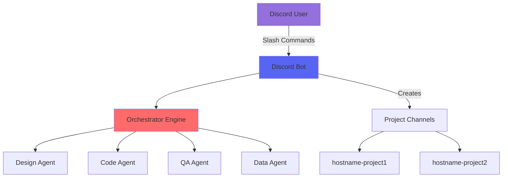

# Discord Setup: Complete Integration Guide

Your comprehensive guide to setting up Discord for the AI Agent TDD-Scrum workflow system. This guide includes step-by-step instructions, visual examples, and troubleshooting tips for both technical and non-technical users.

## Table of Contents

1. [Overview](#overview)
2. [Prerequisites](#prerequisites)
3. [Step 1: Create Discord Application](#step-1-create-discord-application)
4. [Step 2: Configure Your Bot](#step-2-configure-your-bot)
5. [Step 3: Set Bot Permissions](#step-3-set-bot-permissions)
6. [Step 4: Invite Bot to Server](#step-4-invite-bot-to-server)
7. [Step 5: Environment Configuration](#step-5-environment-configuration)
8. [Step 6: Test Your Bot](#step-6-test-your-bot)
9. [Step 7: Production Setup](#step-7-production-setup)
10. [Command Documentation](#command-documentation)
11. [Advanced Configuration](#advanced-configuration)
12. [Troubleshooting Guide](#troubleshooting-guide)
13. [Security Best Practices](#security-best-practices)
14. [FAQ](#frequently-asked-questions)

---

## Overview

The Discord bot serves as your primary interface for controlling the AI Agent orchestrator. It provides:

- **Slash Commands**: Modern Discord interface for all workflow operations
- **Interactive UI**: Buttons and embeds for visual state management
- **Multi-Project Support**: Automatic channel creation per project
- **Real-time Notifications**: Updates on agent activities and approvals
- **Secure Access Control**: Role-based permissions and command restrictions

### System Architecture



---

## Prerequisites

Before starting, ensure you have:

### Required

- **Discord Account**: Free account at [discord.com](https://discord.com)
- **Discord Server**: Where you have admin permissions
- **Python 3.8+**: For running the bot
- **Git**: For cloning the repository

### Optional but Recommended

- **Two-Factor Authentication**: Enabled on your Discord account
- **Developer Mode**: Enabled in Discord settings (for copying IDs)
- **Text Editor**: For editing configuration files

### Enable Developer Mode

1. Open Discord Settings (⚙️ icon)
2. Navigate to **Advanced**
3. Toggle **Developer Mode** ON


---

## Step 1: Create Discord Application

### 1.1 Access Developer Portal

1. Open [Discord Developer Portal](https://discord.com/developers/applications)
2. Sign in with your Discord account
3. Click the **New Application** button


### 1.2 Name Your Application

1. Enter application name: `AI Agent Workflow` (or your preference)
2. Read and accept the Developer Terms of Service
3. Click **Create**


### 1.3 Configure Application Details

On the **General Information** page:

1. **Description**: Add a helpful description
   ```
   AI Agent TDD-Scrum workflow orchestrator with Human-In-The-Loop controls
   ```

2. **App Icon**: Upload a custom icon (optional)
   - Recommended size: 512x512 pixels
   - Format: PNG, JPG, or GIF

3. **Tags**: Add relevant tags
   - `productivity`
   - `development`
   - `automation`

4. **Save Changes**


---

## Step 2: Configure Your Bot

### 2.1 Create the Bot

1. Navigate to the **Bot** section in the left sidebar
2. Click **Add Bot**
3. Confirm by clicking **Yes, do it!**


### 2.2 Bot Configuration

Configure these critical settings:

#### Username and Avatar

1. **Username**: Keep default or customize (e.g., `AI Workflow Bot`)
2. **Avatar**: Upload custom bot avatar (optional)

#### Bot Token

1. Click **Reset Token**
2. Click **Copy** to copy your token
3. **SAVE THIS TOKEN SECURELY** - You won't see it again!

```
⚠️ SECURITY WARNING
Never share your bot token publicly!
Never commit it to version control!
Store it as an environment variable!
```


### 2.3 Privileged Gateway Intents

Enable these intents for full functionality:

| Intent | Required | Purpose |
|--------|----------|---------|
| **Presence Intent** | ✅ Yes | Track user presence |
| **Server Members Intent** | ✅ Yes | Access member lists |
| **Message Content Intent** | ✅ Yes | Read message content |


### 2.4 Bot Permissions Settings

Configure authorization settings:

- **Public Bot**: ❌ Disabled (keep private)
- **Requires OAuth2 Code Grant**: ❌ Disabled

---

## Step 3: Set Bot Permissions

### 3.1 Understanding Permissions

The bot requires specific permissions to function:

#### Essential Permissions

| Permission | Why It's Needed |
|------------|-----------------|
| **Send Messages** | Post workflow updates |
| **Use Slash Commands** | Enable command interface |
| **Embed Links** | Rich message formatting |
| **Read Message History** | Context awareness |
| **Manage Channels** | Create project channels |
| **Create Public Threads** | Organize discussions |
| **Manage Threads** | Control thread lifecycle |
| **Add Reactions** | Interactive feedback |

#### Permission Integer

The calculated permission integer: `2147748928`

This includes:
- Text permissions: 2147483648
- Channel management: 265216
- Thread management: 17179869184

### 3.2 Permission Calculator

Use the visual permission calculator:

1. Go to **OAuth2** → **URL Generator**
2. Select **Scopes**:
   - ✅ `bot`
   - ✅ `applications.commands`

3. Select **Bot Permissions**:
   
   

---

## Step 4: Invite Bot to Server

### 4.1 Generate Invite Link

1. In **OAuth2** → **URL Generator**
2. Ensure scopes are selected:
   - ✅ `bot`
   - ✅ `applications.commands`
3. Copy the generated URL

### 4.2 Direct Invite URL Template

Replace `YOUR_CLIENT_ID` with your application's Client ID:

```
https://discord.com/api/oauth2/authorize?client_id=YOUR_CLIENT_ID&permissions=2147748928&scope=bot%20applications.commands
```

### 4.3 Complete the Invitation

1. Open the invite URL in your browser
2. Select your Discord server from dropdown
3. Review the permissions list
4. Click **Continue**
5. Click **Authorize**
6. Complete CAPTCHA if prompted


### 4.4 Verify Bot Joined

Check your Discord server:
- Bot should appear in member list
- Status: 🔴 Offline (until we start it)

---

## Step 5: Environment Configuration

### 5.1 Token Security

Store your bot token securely using environment variables.

#### Linux/macOS

```bash
# Add to shell profile (~/.bashrc, ~/.zshrc, etc.)
export DISCORD_BOT_TOKEN="your_bot_token_here"

# Apply changes
source ~/.bashrc
```

#### Windows PowerShell

```powershell
# Set for current session
$env:DISCORD_BOT_TOKEN="your_bot_token_here"

# Set permanently
[System.Environment]::SetEnvironmentVariable("DISCORD_BOT_TOKEN", "your_bot_token_here", "User")
```

#### Windows Command Prompt

```cmd
# Set for current session
set DISCORD_BOT_TOKEN=your_bot_token_here

# Set permanently
setx DISCORD_BOT_TOKEN "your_bot_token_here"
```

### 5.2 Development Setup (.env file)

For development, create a `.env` file in your project root:

```bash
# .env
DISCORD_BOT_TOKEN=your_bot_token_here

# Optional: Additional API keys
ANTHROPIC_API_KEY=your_anthropic_key
GITHUB_TOKEN=your_github_token
OPENAI_API_KEY=your_openai_key
```

**Important**: Add `.env` to `.gitignore`:

```bash
echo ".env" >> .gitignore
```

### 5.3 Verify Configuration

Test your environment setup:

```bash
# Linux/macOS
echo $DISCORD_BOT_TOKEN

# Windows PowerShell
echo $env:DISCORD_BOT_TOKEN

# Windows CMD
echo %DISCORD_BOT_TOKEN%
```

---

## Step 6: Test Your Bot

### 6.1 Start the Bot

From your project directory:

```bash
# Install dependencies
pip install -r requirements.txt

# Start the bot
python lib/discord_bot.py
```

### 6.2 Expected Console Output

Success looks like:

```
2024-01-10 10:00:00 - INFO - Setting up Discord bot commands...
2024-01-10 10:00:01 - INFO - Synced 12 slash commands
2024-01-10 10:00:01 - INFO - Bot logged in as AI Workflow Bot#1234
2024-01-10 10:00:01 - INFO - Discord bot started successfully
2024-01-10 10:00:01 - INFO - Bot is ready and listening for commands
```

### 6.3 First Commands

In your Discord server, test these commands:

#### Check Bot Status

```
/state
```


#### Create Your First Epic

```
/epic "Build a task management API with user authentication"
```


### 6.4 Troubleshooting Connection Issues

If the bot doesn't start:

1. **Check Token**: Ensure it's correctly set
2. **Check Network**: Firewall/proxy settings
3. **Check Logs**: Look for error messages
4. **Check Permissions**: Bot has server access

---

## Step 7: Production Setup

### 7.1 Server Organization

Create a dedicated server structure:

```
📁 AI Workflow Server
├── 📢 announcements
├── 📋 general
├── 🚨 alerts
├── 📊 monitoring
└── Projects (Category)
    ├── 🖥️ hostname-project1
    ├── 🖥️ hostname-project2
    └── 🖥️ hostname-project3
```

### 7.2 Role Configuration

Create roles for access control:

| Role | Permissions | Purpose |
|------|-------------|---------|
| **Workflow Admin** | All commands | System administrators |
| **Project Manager** | Epic, Sprint, Approve | Project oversight |
| **Developer** | Backlog, TDD | Development team |
| **Observer** | State, Status only | Stakeholders |

### 7.3 Channel Permissions

Set channel-specific permissions:

```
Project Channel Settings:
✅ Workflow Admin - All permissions
✅ Project Manager - Send messages, Use commands
✅ Developer - Send messages, Use commands
❌ @everyone - Send messages (read-only)
```

### 7.4 Multi-Server Setup

For multiple Discord servers:

1. **Development Server**: Testing and development
2. **Staging Server**: Pre-production validation
3. **Production Server**: Live project management

---

## Command Documentation

### Complete Command Reference

The bot provides 12 primary slash commands with various subcommands:

### 📋 Project Management Commands

#### `/project register <path> [name]`
Register a new project repository for orchestration.

**Parameters:**
- `path` (required): Absolute path to git repository
- `name` (optional): Custom project name (defaults to directory name)

**Example:**
```
/project register /home/user/my-app "MyAwesomeApp"
```

**Response:**


#### `/epic "<description>"`
Define a new high-level initiative.

**Parameters:**
- `description` (required): Epic description in quotes

**Example:**
```
/epic "Implement user authentication system with OAuth2 support"
```

**Interactive Response:**
- Shows proposed user stories
- Requires approval before adding to backlog
- Suggests next workflow step

### 📝 Backlog Management

#### `/backlog <action> [options]`
Manage product and sprint backlogs.

**Actions:**
- `view`: Display current backlog items
- `add_story`: Add new user story
- `prioritize`: Reorder backlog items

**Parameters:**
- `description`: Story description (for add_story)
- `feature`: Feature ID to associate with
- `priority`: top, high, medium, low

**Examples:**
```
/backlog view
/backlog add_story description:"Add login endpoint" feature:"AUTH-001" priority:high
/backlog prioritize
```

### 🏃 Sprint Management

#### `/sprint <action> [items]`
Control sprint lifecycle.

**Actions:**
- `plan`: Plan next sprint with selected stories
- `start`: Begin sprint execution
- `status`: View current sprint progress
- `pause`: Temporarily pause sprint
- `resume`: Resume paused sprint

**Examples:**
```
/sprint plan "STORY-001,STORY-002,STORY-003"
/sprint start
/sprint status
```

**Sprint Status Display:**


### 🔬 Test-Driven Development

#### `/tdd <action> [options]`
Manage TDD cycles for story implementation.

**Actions:**
- `start`: Begin TDD cycle for a story
- `status`: Current TDD state and progress
- `design`: Design phase activities
- `test`: Write/update tests
- `code`: Implementation phase
- `refactor`: Code improvement
- `run_tests`: Execute test suite
- `commit`: Commit changes
- `next`: Move to next TDD phase
- `abort`: Cancel current cycle
- `logs`: View cycle history
- `overview`: TDD metrics dashboard

**TDD Workflow Example:**
```
/tdd start story_id:"STORY-001" task_description:"Create user model"
/tdd design
/tdd test
/tdd code
/tdd run_tests
/tdd refactor
/tdd commit
```

**TDD Status Display:**


### ✅ Approval Commands

#### `/approve [items]`
Approve pending items (stories, PRs, etc.).

**Parameters:**
- `items`: Comma-separated IDs (or blank for all)

**Example:**
```
/approve "STORY-001,STORY-003"
/approve  # Approves all pending
```

#### `/request_changes "<description>"`
Request modifications during review.

**Example:**
```
/request_changes "Please add error handling for network failures"
```

### 🎛️ State Management

#### `/state`
View current workflow state with interactive controls.

**Interactive Features:**
- **Allowed Commands** button: Shows available commands
- **State Diagram** button: Visual state machine
- **Project Status** button: Detailed metrics


### 🔧 Workflow Control

#### `/suggest_fix "<description>"`
Provide fix for blocked tasks.

**Example:**
```
/suggest_fix "Use async/await instead of callbacks to fix the timeout issue"
```

#### `/skip_task`
Skip currently blocked task and continue.

#### `/feedback "<description>"`
Provide sprint retrospective feedback.

**Example:**
```
/feedback "Sprint went well. Consider smaller story sizes next time."
```

### Command Permission Matrix

| Command | Admin | PM | Dev | Observer |
|---------|-------|----|----|----------|
| `/project` | ✅ | ❌ | ❌ | ❌ |
| `/epic` | ✅ | ✅ | ❌ | ❌ |
| `/backlog` | ✅ | ✅ | ✅ | ❌ |
| `/sprint` | ✅ | ✅ | ❌ | ❌ |
| `/tdd` | ✅ | ✅ | ✅ | ❌ |
| `/approve` | ✅ | ✅ | ❌ | ❌ |
| `/state` | ✅ | ✅ | ✅ | ✅ |
| `/request_changes` | ✅ | ✅ | ✅ | ❌ |
| `/feedback` | ✅ | ✅ | ✅ | ❌ |

---

## Advanced Configuration

### Custom Command Prefixes

Add traditional prefix commands alongside slash commands:

```python
# In lib/discord_bot.py - Custom prefix commands
@bot.command(name='status')
async def status_command(ctx):
    """Traditional !status command"""
    embed = discord.Embed(
        title="Bot Status",
        description="All systems operational",
        color=discord.Color.green()
    )
    embed.add_field(name="Uptime", value="2 days, 3 hours", inline=True)
    embed.add_field(name="Projects", value="5 active", inline=True)
    await ctx.send(embed=embed)
```

### Webhook Integration

Configure webhooks for external notifications:

```python
# Webhook configuration
WEBHOOK_URLS = {
    "alerts": "https://discord.com/api/webhooks/xxx/yyy",
    "monitoring": "https://discord.com/api/webhooks/aaa/bbb"
}

async def send_webhook_alert(message: str, webhook_type: str = "alerts"):
    """Send notification via webhook"""
    webhook_url = WEBHOOK_URLS.get(webhook_type)
    if not webhook_url:
        return
    
    async with aiohttp.ClientSession() as session:
        webhook_data = {
            "content": message,
            "embeds": [{
                "title": "System Alert",
                "description": message,
                "color": 0xFF0000,  # Red
                "timestamp": datetime.utcnow().isoformat()
            }]
        }
        await session.post(webhook_url, json=webhook_data)
```

### Custom Embeds and Formatting

Create rich, branded messages:

```python
def create_custom_embed(title: str, description: str, 
                       color: int = 0x5865F2,  # Discord Blurple
                       thumbnail: str = None,
                       fields: list = None) -> discord.Embed:
    """Create branded embed with consistent styling"""
    embed = discord.Embed(
        title=title,
        description=description,
        color=color,
        timestamp=datetime.utcnow()
    )
    
    # Add branding
    embed.set_footer(
        text="AI Agent Workflow System",
        icon_url="https://example.com/logo.png"
    )
    
    if thumbnail:
        embed.set_thumbnail(url=thumbnail)
    
    if fields:
        for field in fields:
            embed.add_field(
                name=field["name"],
                value=field["value"],
                inline=field.get("inline", True)
            )
    
    return embed
```

### Notification Customization

Configure notification preferences:

```python
# Notification settings per project
NOTIFICATION_CONFIG = {
    "project1": {
        "sprint_start": True,
        "task_complete": True,
        "approval_needed": True,
        "error_alerts": True,
        "mention_roles": ["@projectmanager", "@developers"]
    },
    "project2": {
        "sprint_start": True,
        "task_complete": False,
        "approval_needed": True,
        "error_alerts": True,
        "mention_roles": ["@teamlead"]
    }
}

async def send_project_notification(project: str, event_type: str, 
                                  message: str, priority: str = "normal"):
    """Send customized project notifications"""
    config = NOTIFICATION_CONFIG.get(project, {})
    
    if not config.get(event_type, False):
        return  # Notification disabled
    
    # Build notification with mentions
    mentions = " ".join(config.get("mention_roles", []))
    
    # Color based on priority
    colors = {
        "high": 0xFF0000,    # Red
        "normal": 0x5865F2,  # Blue
        "low": 0x00FF00      # Green
    }
    
    embed = create_custom_embed(
        title=f"{event_type.replace('_', ' ').title()}",
        description=message,
        color=colors.get(priority, colors["normal"])
    )
    
    channel = bot.get_channel(project_channels[project])
    if channel:
        await channel.send(content=mentions, embed=embed)
```

### Role-Based Command Restrictions

Implement fine-grained permissions:

```python
from discord.ext import commands
from typing import Optional

def has_project_role(*allowed_roles):
    """Check if user has required project role"""
    async def predicate(interaction: discord.Interaction) -> bool:
        user_roles = [role.name.lower() for role in interaction.user.roles]
        return any(role in user_roles for role in allowed_roles)
    return commands.check(predicate)

# Usage in commands
@app_commands.command(name="approve")
@has_project_role("workflow admin", "project manager")
async def approve_command(self, interaction: discord.Interaction, items: str = ""):
    # Command implementation
    pass
```

### Multi-Language Support

Add internationalization:

```python
# Language configuration
LANGUAGES = {
    "en": {
        "epic_created": "Epic Created Successfully",
        "sprint_started": "Sprint Started",
        "approval_needed": "Approval Required",
        "error_occurred": "An error occurred"
    },
    "es": {
        "epic_created": "Épica Creada Exitosamente",
        "sprint_started": "Sprint Iniciado",
        "approval_needed": "Aprobación Requerida",
        "error_occurred": "Ocurrió un error"
    }
}

def get_text(key: str, lang: str = "en") -> str:
    """Get localized text"""
    return LANGUAGES.get(lang, LANGUAGES["en"]).get(key, key)
```

---

## Troubleshooting Guide

### Common Issues and Solutions

#### Bot Doesn't Appear Online

**Symptoms:**
- Bot shows as offline in member list
- No response to commands

**Solutions:**

1. **Verify Token**
   ```bash
   # Test token directly
   python -c "
   import discord
   import os
   client = discord.Client(intents=discord.Intents.default())
   @client.event
   async def on_ready():
       print(f'Connected as {client.user}')
       await client.close()
   client.run(os.environ.get('DISCORD_BOT_TOKEN'))
   "
   ```

2. **Check Network**
   - Firewall blocking Discord API
   - Proxy configuration issues
   - DNS resolution problems

3. **Verify Intents**
   - Ensure all required intents are enabled
   - Check Developer Portal settings

#### Slash Commands Not Appearing

**Symptoms:**
- Typing `/` doesn't show bot commands
- "Unknown command" errors

**Solutions:**

1. **Wait for Sync**
   - Global commands take up to 1 hour
   - Guild commands are instant

2. **Force Sync**
   ```python
   # Add to bot startup
   @bot.event
   async def on_ready():
       try:
           synced = await bot.tree.sync()
           print(f"Synced {len(synced)} commands")
       except Exception as e:
           print(f"Failed to sync: {e}")
   ```

3. **Clear Command Cache**
   - Restart Discord client
   - Try in different server

#### Permission Errors

**Symptoms:**
- "Missing permissions" errors
- Bot can't create channels
- Can't send messages

**Solutions:**

1. **Check Server Permissions**
   - Server Settings → Roles → Bot Role
   - Verify all required permissions

2. **Check Channel Overrides**
   - Channel Settings → Permissions
   - Remove restrictive overrides

3. **Role Hierarchy**
   - Bot role must be above member roles
   - Drag bot role higher in list

#### Rate Limiting Issues

**Symptoms:**
- Commands stop working temporarily
- "Rate limited" errors in logs

**Solutions:**

1. **Implement Rate Limit Handling**
   ```python
   from discord.ext import commands
   
   # Add cooldowns
   @commands.cooldown(1, 60, commands.BucketType.user)
   @app_commands.command(name="expensive_command")
   async def expensive_command(self, interaction: discord.Interaction):
       # Command implementation
       pass
   ```

2. **Use Webhooks for Bulk Messages**
   - Webhooks have separate rate limits
   - Better for high-volume notifications

### Debug Commands

Add these debug commands for troubleshooting:

```python
@app_commands.command(name="debug")
@commands.is_owner()  # Only bot owner
async def debug_command(self, interaction: discord.Interaction):
    """Show debug information"""
    embed = discord.Embed(title="Debug Information", color=0xFF0000)
    
    # Bot info
    embed.add_field(
        name="Bot Info",
        value=f"User: {self.user}\nID: {self.user.id}\nGuilds: {len(self.guilds)}",
        inline=False
    )
    
    # Guild info
    guild = interaction.guild
    embed.add_field(
        name="Guild Info",
        value=f"Name: {guild.name}\nID: {guild.id}\nMembers: {guild.member_count}",
        inline=False
    )
    
    # Permissions
    perms = interaction.guild.me.guild_permissions
    perm_list = [perm[0] for perm in perms if perm[1]]
    embed.add_field(
        name="Bot Permissions",
        value=", ".join(perm_list[:10]) + "...",  # First 10
        inline=False
    )
    
    # Project info
    embed.add_field(
        name="Active Projects",
        value=f"Count: {len(self.orchestrator.projects)}\nNames: {', '.join(self.orchestrator.projects.keys())}",
        inline=False
    )
    
    await interaction.response.send_message(embed=embed, ephemeral=True)
```

### Log Analysis

Enable detailed logging:

```python
import logging

# Configure logging
logging.basicConfig(
    level=logging.DEBUG,
    format='%(asctime)s - %(name)s - %(levelname)s - %(message)s',
    handlers=[
        logging.FileHandler('discord_bot.log'),
        logging.StreamHandler()
    ]
)

# Discord.py logging
discord_logger = logging.getLogger('discord')
discord_logger.setLevel(logging.INFO)

# Your bot logging
bot_logger = logging.getLogger('bot')
bot_logger.setLevel(logging.DEBUG)
```

### Performance Monitoring

Add performance metrics:

```python
import time
from functools import wraps

def measure_performance(func):
    """Decorator to measure command performance"""
    @wraps(func)
    async def wrapper(*args, **kwargs):
        start = time.time()
        try:
            result = await func(*args, **kwargs)
            duration = time.time() - start
            bot_logger.info(f"{func.__name__} took {duration:.2f}s")
            return result
        except Exception as e:
            duration = time.time() - start
            bot_logger.error(f"{func.__name__} failed after {duration:.2f}s: {e}")
            raise
    return wrapper

# Usage
@app_commands.command(name="sprint")
@measure_performance
async def sprint_command(self, interaction: discord.Interaction, action: str):
    # Command implementation
    pass
```

---

## Security Best Practices

### Token Management

#### Never Commit Tokens

```bash
# .gitignore
.env
*.env
config/secrets.json
*_token.txt
```

#### Rotate Tokens Regularly

Schedule quarterly token rotation:

1. Generate new token in Developer Portal
2. Update all environments
3. Test thoroughly
4. Revoke old token

#### Use Secret Management

For production, use proper secret management:

- AWS Secrets Manager
- Azure Key Vault
- HashiCorp Vault
- Kubernetes Secrets

### Server Security

#### Enable 2FA

Require 2FA for all administrators:

1. Server Settings → Safety Setup
2. Enable "Require 2FA for moderator actions"

#### Audit Logging

Monitor bot activity:

```python
# Log all commands
@bot.event
async def on_app_command_completion(
    interaction: discord.Interaction,
    command: app_commands.Command
):
    bot_logger.info(
        f"Command executed: {command.name} "
        f"by {interaction.user} ({interaction.user.id}) "
        f"in {interaction.channel} ({interaction.channel.id})"
    )
```

#### Permission Auditing

Regular permission reviews:

```python
@app_commands.command(name="audit_permissions")
@commands.is_owner()
async def audit_permissions(self, interaction: discord.Interaction):
    """Audit bot permissions across all servers"""
    report = []
    
    for guild in self.guilds:
        perms = guild.me.guild_permissions
        suspicious = []
        
        # Check for excessive permissions
        if perms.administrator:
            suspicious.append("Administrator")
        if perms.manage_guild:
            suspicious.append("Manage Server")
        if perms.manage_roles:
            suspicious.append("Manage Roles")
        
        if suspicious:
            report.append(f"{guild.name}: {', '.join(suspicious)}")
    
    if report:
        await interaction.response.send_message(
            f"⚠️ Excessive permissions found:\n" + "\n".join(report),
            ephemeral=True
        )
    else:
        await interaction.response.send_message(
            "✅ All permissions look appropriate",
            ephemeral=True
        )
```

### Access Control

#### Role-Based Access

Implement strict role checks:

```python
# Define role hierarchy
ROLE_HIERARCHY = {
    "workflow admin": ["all"],
    "project manager": ["epic", "sprint", "approve", "backlog"],
    "developer": ["backlog", "tdd", "state"],
    "observer": ["state"]
}

def check_command_access(user_roles: List[str], command: str) -> bool:
    """Check if user roles allow command access"""
    for role in user_roles:
        allowed_commands = ROLE_HIERARCHY.get(role.lower(), [])
        if "all" in allowed_commands or command in allowed_commands:
            return True
    return False
```

#### Channel Isolation

Ensure project isolation:

```python
async def verify_project_access(
    interaction: discord.Interaction,
    project_name: str
) -> bool:
    """Verify user has access to project"""
    # Check if command is in correct project channel
    channel_name = interaction.channel.name
    expected_suffix = f"-{project_name}"
    
    if not channel_name.endswith(expected_suffix):
        await interaction.response.send_message(
            f"❌ This command must be run in the {project_name} project channel",
            ephemeral=True
        )
        return False
    
    return True
```

### Data Protection

#### Sensitive Data Handling

Never log sensitive information:

```python
# Sanitize logs
def sanitize_for_logging(data: dict) -> dict:
    """Remove sensitive data before logging"""
    sensitive_keys = ["token", "password", "api_key", "secret"]
    sanitized = data.copy()
    
    for key in list(sanitized.keys()):
        if any(sensitive in key.lower() for sensitive in sensitive_keys):
            sanitized[key] = "[REDACTED]"
    
    return sanitized
```

#### Ephemeral Messages

Use ephemeral messages for sensitive info:

```python
# Send sensitive information privately
await interaction.response.send_message(
    "Sensitive information here...",
    ephemeral=True  # Only visible to command user
)
```

---

## Frequently Asked Questions

### General Questions

**Q: Can I use the bot in multiple servers?**
A: Yes! The bot can operate in multiple Discord servers simultaneously. Each server maintains separate project configurations.

**Q: How many projects can I manage?**
A: There's no hard limit. The bot can handle dozens of projects across multiple servers.

**Q: Does the bot work with Discord mobile?**
A: Yes, all slash commands work on Discord mobile apps. Some interactive features may have limited functionality.

**Q: Can I customize the bot's appearance?**
A: Yes! You can change the bot's username, avatar, and embed colors. See Advanced Configuration.

### Setup Issues

**Q: My bot token isn't working. What should I do?**
A: 
1. Ensure you copied the entire token
2. Check for extra spaces or quotes
3. Regenerate token if needed
4. Verify environment variable is set correctly

**Q: Slash commands aren't showing up. Why?**
A:
1. Wait up to 1 hour for global sync
2. Restart your Discord client
3. Check bot has applications.commands scope
4. Verify bot has Use Slash Commands permission

**Q: Can I change the bot's prefix from '/'?**
A: Slash commands always use '/'. You can add traditional prefix commands (like '!') alongside slash commands.

### Permission Questions

**Q: What's the minimum permissions needed?**
A: Absolute minimum:
- Send Messages
- Use Slash Commands
- Embed Links
- Read Message History

**Q: Can I restrict commands to specific roles?**
A: Yes! See the Role-Based Access section in Advanced Configuration.

**Q: Is it safe to give the bot admin permissions?**
A: Not recommended. Use only the specific permissions listed in this guide.

### Operational Questions

**Q: How do I backup my bot configuration?**
A: Backup these files:
- `.env` (environment variables)
- Project configuration YAMLs
- Any custom bot modifications

**Q: Can multiple people use commands simultaneously?**
A: Yes! The bot handles concurrent commands from multiple users.

**Q: What happens if the bot crashes?**
A: Active workflows pause safely. Simply restart the bot and resume operations.

**Q: How do I monitor bot uptime?**
A: Use monitoring tools like:
- UptimeRobot (external monitoring)
- Custom health check endpoints
- Discord bot status websites

### Integration Questions

**Q: Can I integrate with other tools?**
A: Yes! The bot supports:
- Webhooks for external notifications
- API endpoints for custom integrations
- GitHub/GitLab integration
- CI/CD pipeline triggers

**Q: Is there an API?**
A: The orchestrator provides internal APIs. See the API Reference documentation.

**Q: Can I use this with existing projects?**
A: Absolutely! Register any git repository using `/project register`.

---

## Conclusion

You now have a fully configured Discord bot for managing your AI Agent TDD-Scrum workflow! 

### Next Steps

1. **Explore Commands**: Try each command to understand the workflow
2. **Set Up Projects**: Register your first project with `/project register`
3. **Create an Epic**: Start with `/epic` to define your goals
4. **Run a Sprint**: Experience the full workflow cycle

### Getting Help

- **Documentation**: Full docs at [your-docs-site.com]
- **Discord Server**: Join our community [discord.gg/your-server]
- **GitHub Issues**: Report bugs and request features
- **Email Support**: support@your-domain.com

### Contributing

We welcome contributions! See our [Contributing Guide](../development/contributing.md) for details.

Remember: The bot is a tool to enhance your workflow, not replace human judgment. Use it to coordinate AI agents while maintaining control over critical decisions.

Happy orchestrating! 🚀

---

*Last updated: January 2024*
*Version: 1.0.0*