```mermaid
stateDiagram-v2
    [*] --> IDLE
    IDLE --> BACKLOG_READY : /epic
    BACKLOG_READY --> SPRINT_PLANNED : /sprint plan
    SPRINT_PLANNED --> SPRINT_ACTIVE : /sprint start
    SPRINT_ACTIVE --> SPRINT_REVIEW : tasks complete
    SPRINT_REVIEW --> IDLE : /feedback
    SPRINT_ACTIVE --> SPRINT_PAUSED : /sprint pause
    SPRINT_PAUSED --> SPRINT_ACTIVE : /sprint resume
    SPRINT_ACTIVE --> BLOCKED : CI fails 3×
    BLOCKED --> SPRINT_ACTIVE : /suggest_fix
```

# AI Agent TDD-Scrum Workflow

A sophisticated **Human-In-The-Loop (HITL)** orchestration framework that coordinates multiple specialized AI agents through a Discord interface, following a research-mode Scrum methodology optimized for solo engineers working with AI assistance.

## Overview

This system implements a sophisticated dual state machine architecture for AI-assisted software development with integrated Test-Driven Development and human oversight. It coordinates multiple TDD cycles in parallel while maintaining proper Scrum methodology, optimized for solo engineers working with AI assistance.

## How It Works

```mermaid
flowchart LR
    You["👨‍💻<br/>YOU"] 
    Chat["💬<br/>Discord<br/>Chat"]
    AI["🤖<br/>AI Team<br/>Helper"]
    Code["📝<br/>Your<br/>Project"]
    
    You -->|"Tell it what to build"| Chat
    Chat -->|"Coordinates"| AI
    AI -->|"Builds & tests"| Code
    Code -->|"Shows you progress"| You
    
    style You fill:#e3f2fd,stroke:#1976d2,stroke-width:3px
    style Chat fill:#f3e5f5,stroke:#7b1fa2,stroke-width:2px
    style AI fill:#e8f5e8,stroke:#388e3c,stroke-width:2px
    style Code fill:#fff3e0,stroke:#f57c00,stroke-width:2px
```



**The Big Picture:** You tell the system what you want to build through simple Discord messages. A team of AI agents collaborates to design, code, test, and improve your project while keeping you in control of every major decision.

---

### Detailed System Architecture


## Key Features

- **Dual State Machine Architecture**: Primary workflow coordination with secondary TDD state machines
- **Parallel TDD Processing**: Multiple stories developed simultaneously with proper RED-GREEN-REFACTOR cycles
- **Ephemeral Agent System**: On-demand agent creation and coordination for optimal resource utilization
- **Discord Integration**: Complete HITL interface with TDD-aware slash commands and interactive UI
- **Multi-Project Support**: Simultaneous orchestration across multiple projects with independent TDD cycles
- **Human Oversight**: Strategic approval gates with automated TDD execution and error escalation
- **Real-time TDD Monitoring**: Live visibility into all TDD cycles with interactive progress tracking
- **Comprehensive Testing**: Unit, integration, and E2E test coverage with TDD methodology enforcement

## Quick Start

Get up and running in minutes:

```bash
# Clone and install
git clone https://github.com/jmontp/agent-workflow.git
cd agent-workflow
make install

# Configure
export DISCORD_BOT_TOKEN="your_token_here"

# Run
make run
```

[**→ Detailed Installation Guide**](getting-started/installation.md)

## Dual State Machine Workflow

The system operates two coordinated state machines for complete TDD-Scrum integration:



### TDD State Machine (Per Story)


**Key TDD Commands:**
- `/tdd overview` - Monitor all active TDD cycles
- `/tdd status AUTH-1` - Check specific story progress
- `/tdd review_cycle AUTH-1` - Request human review
- `/tdd metrics` - View TDD performance data

[**→ Complete State Machine Reference**](user-guide/state-machine.md) | [**→ TDD Workflow Guide**](user-guide/tdd-workflow.md)

## Ephemeral AI Agent System

Specialized agents are created on-demand for optimal resource utilization:

### Orchestrator Agent (Temporary)
- Sprint coordination and multi-task management
- Spun up during SPRINT_ACTIVE state
- Manages parallel TDD cycle execution
- Handles cross-story dependencies and coordination

### Design Agents (Per Story)
- Technical specifications for individual stories
- Created during TDD DESIGN phase
- Architecture decisions and interface definitions
- Destroyed after design phase completion

### QA Agents (Per TDD Cycle)
- Test suite creation following TDD methodology
- Active during TEST_RED phase
- Comprehensive test coverage for story requirements
- Ensures proper failing tests before implementation

### Code Agents (Per TDD Cycle)
- Implementation during CODE_GREEN and REFACTOR phases
- Makes tests pass with minimal implementation
- Applies refactoring while maintaining green tests
- Handles version control and final commits

### Analytics Agent (Persistent)
- Cross-story metrics and performance analysis
- TDD cycle time tracking and optimization
- Sprint progress reporting and forecasting
- Continuous process improvement insights

[**→ Agent Capabilities Reference**](concepts/overview.md)

## Essential Commands

Master these key slash commands for dual state machine control:

### Workflow Commands
| Command | Purpose | Example |
|---------|---------|---------|
| `/epic` | Define high-level initiatives | `/epic "Build authentication system"` |
| `/sprint plan` | Plan sprint with stories | `/sprint plan AUTH-1 AUTH-2` |
| `/sprint start` | Begin sprint execution (creates TDD cycles) | `/sprint start` |
| `/approve` | Approve pending tasks | `/approve AUTH-1 AUTH-2` |
| `/state` | Interactive state inspection | `/state` |

### TDD Commands
| Command | Purpose | Example |
|---------|---------|---------|
| `/tdd overview` | Monitor all TDD cycles | `/tdd overview` |
| `/tdd status` | Check specific story progress | `/tdd status AUTH-1` |
| `/tdd review_cycle` | Request human review | `/tdd review_cycle AUTH-1` |
| `/tdd metrics` | View TDD performance data | `/tdd metrics` |
| `/tdd pause/resume` | Control TDD cycle execution | `/tdd pause AUTH-1` |

[**→ Complete Command Reference**](user-guide/hitl-commands.md)

## Architecture

The system uses a clean layered architecture:

- **Scripts Layer**: Executable orchestrator entry points
- **Library Layer**: Core business logic and agents
- **Interface Layer**: Discord bot and external integrations
- **Data Layer**: State persistence and configuration

[**→ Detailed Architecture Documentation**](concepts/overview.md)

## Testing & Quality

Comprehensive testing strategy ensures reliability:

- **Unit Tests**: State machine validation and component testing
- **Integration Tests**: Orchestrator workflows and agent coordination  
- **E2E Tests**: Complete user scenarios and error handling
- **Coverage Target**: >90% code coverage with automated reporting

[**→ Testing Strategy & Implementation**](advanced/testing.md)

## Contributing

We welcome contributions! The system is designed for extensibility:

1. **Fork** the repository
2. **Create** a feature branch
3. **Implement** with tests
4. **Submit** a pull request

[**→ Contributing Guidelines**](user-guide/faq.md)

## Documentation Sections

| Section | Description |
|---------|-------------|
| [**Getting Started**](getting-started/quick-start.md) | Installation, setup, and TDD workflow examples |
| [**User Guide**](user-guide/hitl-commands.md) | Commands, workflows, and daily usage |
| [**TDD Workflow**](user-guide/tdd-workflow.md) | Complete TDD cycle management and monitoring |
| [**State Machines**](user-guide/state-machine.md) | Dual state machine architecture and transitions |
| [**Architecture**](architecture/overview.md) | Dual state machine system design and coordination |
| [**Context Management**](architecture/context-management-system.md) | Intelligent agent communication and context optimization |
| [**Concepts**](concepts/overview.md) | Core principles and ephemeral agent patterns |
| [**Advanced**](advanced/architecture-detailed.md) | Detailed technical implementation |
| [**Deployment**](deployment/github-pages.md) | Production setup and configuration |

---

!!! tip "Getting Help"
    - Check the [**Command Reference**](user-guide/hitl-commands.md) for syntax
    - Use `/state` in Discord to see available commands
    - Review [**Common Workflows**](user-guide/workflow-sequences.md) for examples
    - See [**Troubleshooting**](user-guide/troubleshooting.md) for issues