# AI Agent TDD-Scrum Workflow

A sophisticated **Human-In-The-Loop (HITL)** orchestration framework that coordinates multiple specialized AI agents through a Discord interface, following a research-mode Scrum methodology optimized for solo engineers working with AI assistance.

## Overview

This system implements a complete workflow for AI-assisted software development with proper human oversight and control. It combines the best practices of Test-Driven Development (TDD) and Scrum methodology, adapted for modern AI-assisted development scenarios.

## How It Works

```mermaid
graph TB
    subgraph "👤 Solo Engineer/Product Owner"
        User[User]
    end
    
    subgraph "🎮 Discord Interface"
        Discord["/epic /sprint /approve<br/>Human Commands"]
    end
    
    subgraph "🤖 AI Agent TDD-Scrum Workflow System"
        subgraph "🎛️ Orchestrator"
            SM[State Machine<br/>IDLE → BACKLOG → SPRINT]
            HITL[Human-in-the-Loop<br/>Approval Gates]
        end
        
        subgraph "🔄 Agent Collaboration"
            Design[🎨 DesignAgent<br/>Architecture & Specs]
            Code[💻 CodeAgent<br/>Implementation & Fixes]
            QA[🧪 QAAgent<br/>Testing & Quality]
            Data[📊 DataAgent<br/>Analysis & Metrics]
        end
        
        subgraph "📋 Project Management"
            Epics[Epic Creation]
            Stories[Story Breakdown]
            Sprints[Sprint Execution]
        end
    end
    
    subgraph "🔗 External Services"
        GitHub[📁 GitHub<br/>Code Repository]
        AI[🧠 AI Services<br/>Claude/GPT]
    end
    
    User -.->|"Issues commands"| Discord
    Discord <-->|"Slash commands"| SM
    SM -->|"Orchestrates"| Design
    SM -->|"Coordinates"| Code
    SM -->|"Manages"| QA
    SM -->|"Directs"| Data
    
    Design -.->|"Creates specs for"| Code
    Code -.->|"Sends code to"| QA
    QA -.->|"Reports metrics to"| Data
    Data -.->|"Provides insights to"| Design
    
    HITL -.->|"Requires approval"| User
    
    Design & Code & QA & Data -->|"Execute tasks"| Epics
    Epics --> Stories
    Stories --> Sprints
    
    Code <-->|"Commits & PRs"| GitHub
    Design & Code & QA & Data <-->|"AI capabilities"| AI
    
    style User fill:#e1f5fe
    style Discord fill:#f3e5f5
    style SM fill:#fff3e0
    style Design fill:#f1f8e9
    style Code fill:#e8f5e8
    style QA fill:#fff8e1
    style Data fill:#fce4ec
```



**Key Benefits:**
- **Human Control**: You stay in command through simple Discord commands
- **AI Automation**: Specialized agents handle implementation details
- **Quality Assurance**: Built-in testing and review processes
- **Structured Workflow**: TDD-Scrum methodology ensures systematic progress
- **Transparency**: Every decision point requires your explicit approval

## Key Features

- **Multi-Agent Coordination**: Specialized AI agents for design, coding, testing, and data analysis
- **Discord Integration**: Complete HITL interface with slash commands and interactive UI
- **State Machine**: Enforced workflow states preventing invalid operations
- **Multi-Project Support**: Simultaneous orchestration across multiple projects
- **Human Oversight**: Approval gates for strategic decisions with escalation workflows
- **Interactive Visualization**: Real-time state inspection and command discovery
- **Comprehensive Testing**: Unit, integration, and E2E test coverage

## Quick Start

Get up and running in minutes:

```bash
# Clone and install
git clone https://github.com/jmontp/agent-workflow.git
cd agent-workflow
make install

# Configure
export DISCORD_BOT_TOKEN="your_token_here"

# Run
make run
```

[**→ Detailed Installation Guide**](getting-started/installation.md)

## Core Workflow

The system follows a finite state machine with clear transitions:

```mermaid
stateDiagram-v2
    [*] --> IDLE
    IDLE --> BACKLOG_READY : /epic
    BACKLOG_READY --> SPRINT_PLANNED : /sprint plan
    SPRINT_PLANNED --> SPRINT_ACTIVE : /sprint start
    SPRINT_ACTIVE --> SPRINT_REVIEW : tasks complete
    SPRINT_REVIEW --> IDLE : /feedback
    SPRINT_ACTIVE --> SPRINT_PAUSED : /sprint pause
    SPRINT_PAUSED --> SPRINT_ACTIVE : /sprint resume
    SPRINT_ACTIVE --> BLOCKED : CI fails 3×
    BLOCKED --> SPRINT_ACTIVE : /suggest_fix
```



[**→ Complete State Machine Reference**](user-guide/state-machine.md)

## AI Agents

Four specialized agents handle different aspects of development:

### DesignAgent
- System architecture creation
- Component design and interfaces  
- Technical specifications
- Design review and validation

### CodeAgent
- Feature implementation
- Bug fixing and debugging
- Code refactoring
- Performance optimization

### QAAgent
- Test suite creation
- Quality validation
- Coverage analysis
- Performance testing

### DataAgent
- Data analysis and insights
- Pipeline creation
- Metrics reporting
- Visualization generation

[**→ Agent Capabilities Reference**](concepts/overview.md)

## Essential Commands

Master these key slash commands in Discord:

| Command | Purpose | Example |
|---------|---------|---------|
| `/epic` | Define high-level initiatives | `/epic "Build authentication system"` |
| `/sprint plan` | Plan sprint with stories | `/sprint plan AUTH-1 AUTH-2` |
| `/sprint start` | Begin sprint execution | `/sprint start` |
| `/approve` | Approve pending tasks | `/approve AUTH-1 AUTH-2` |
| `/state` | Interactive state inspection | `/state` |

[**→ Complete Command Reference**](user-guide/hitl-commands.md)

## Architecture

The system uses a clean layered architecture:

- **Scripts Layer**: Executable orchestrator entry points
- **Library Layer**: Core business logic and agents
- **Interface Layer**: Discord bot and external integrations
- **Data Layer**: State persistence and configuration

[**→ Detailed Architecture Documentation**](concepts/overview.md)

## Testing & Quality

Comprehensive testing strategy ensures reliability:

- **Unit Tests**: State machine validation and component testing
- **Integration Tests**: Orchestrator workflows and agent coordination  
- **E2E Tests**: Complete user scenarios and error handling
- **Coverage Target**: >90% code coverage with automated reporting

[**→ Testing Strategy & Implementation**](advanced/testing.md)

## Contributing

We welcome contributions! The system is designed for extensibility:

1. **Fork** the repository
2. **Create** a feature branch
3. **Implement** with tests
4. **Submit** a pull request

[**→ Contributing Guidelines**](user-guide/faq.md)

## Documentation Sections

| Section | Description |
|---------|-------------|
| [**Getting Started**](getting-started/quick-start.md) | Installation, setup, and first steps |
| [**User Guide**](user-guide/hitl-commands.md) | Commands, workflows, and daily usage |
| [**Concepts**](concepts/overview.md) | System design and core principles |
| [**Advanced**](advanced/architecture-detailed.md) | Detailed technical documentation |
| [**Deployment**](deployment/github-pages.md) | Production setup and configuration |

---

!!! tip "Getting Help"
    - Check the [**Command Reference**](user-guide/hitl-commands.md) for syntax
    - Use `/state` in Discord to see available commands
    - Review [**Common Workflows**](user-guide/workflow-sequences.md) for examples
    - See [**Troubleshooting**](user-guide/troubleshooting.md) for issues