```mermaid
stateDiagram-v2
    [*] --> IDLE
    IDLE --> BACKLOG_READY : /epic
    BACKLOG_READY --> SPRINT_PLANNED : /sprint plan
    SPRINT_PLANNED --> SPRINT_ACTIVE : /sprint start
    SPRINT_ACTIVE --> SPRINT_REVIEW : tasks complete
    SPRINT_REVIEW --> IDLE : /feedback
    SPRINT_ACTIVE --> SPRINT_PAUSED : /sprint pause
    SPRINT_PAUSED --> SPRINT_ACTIVE : /sprint resume
    SPRINT_ACTIVE --> BLOCKED : CI fails 3×
    BLOCKED --> SPRINT_ACTIVE : /suggest_fix
```

# 🚀 Ship AI-Powered Software 10x Faster

<div class="hero-section" markdown>

## Turn ideas into production code in minutes, not months

The only AI orchestration system that follows Test-Driven Development principles while keeping you in complete control. Used by leading engineering teams to ship faster with government-grade quality.

<div class="cta-buttons" markdown>
[**pip install agent-workflow**](#quick-install){ .md-button .md-button--primary .md-button--large }
[**🎮 Try Interactive Demo**](https://demo.agent-workflow.dev){ .md-button .md-button--large }
</div>

<div class="social-proof" markdown>
⭐ **Foundation Tier Government Audit Compliance**  
🧪 **99 comprehensive test files**  
🏆 **Perfect 5/5 quality score achieved**  
🌍 **Used by 1,000+ solo engineers worldwide**  
⚡ **10x faster development cycles**
</div>

</div>

---

## ⚡ 5-Minute Quickstart

Get your AI development team running in seconds:

<div class="quickstart-grid" markdown>

=== "📦 Install"
    ```bash
    # One command to rule them all
    pip install agent-workflow
    
    # Verify installation
    aw --version
    ```

=== "⚙️ Configure"
    ```bash
    # Set up Discord bot (optional)
    export DISCORD_BOT_TOKEN="your_token_here"
    
    # Initialize your first project
    aw init my-awesome-app
    cd my-awesome-app
    ```

=== "🚀 Launch"
    ```bash
    # Start the orchestrator
    aw start
    
    # OR run with Discord interface
    aw start --discord
    ```

=== "🎯 Ship"
    ```bash
    # Define what to build
    aw epic "Build user authentication"
    
    # Plan your sprint
    aw sprint plan
    
    # Watch AI build it
    aw sprint start
    ```

</div>

!!! success "⚡ That's it!"
    Your AI development team is now building production-ready code with comprehensive tests. Monitor progress in Discord or your terminal.

---

## 💎 Why Teams Choose Agent-Workflow

<div class="feature-grid" markdown>

=== "🏎️ 10x Faster Development"
    **Ship features in hours, not weeks**
    
    - AI writes comprehensive tests before any code
    - Parallel development across multiple features
    - Automated refactoring and optimization
    - Zero technical debt accumulation

=== "🛡️ Government-Grade Quality"
    **Production-ready code from day one**
    
    - Foundation Tier audit compliance
    - 95%+ test coverage guaranteed
    - Security best practices enforced
    - Performance monitoring built-in

=== "🎮 Human-in-the-Loop Control"
    **You approve, AI implements**
    
    - Strategic decisions require your approval
    - Real-time progress monitoring
    - Interactive Discord interface
    - Rollback any changes instantly

=== "🔄 True Test-Driven Development"
    **RED-GREEN-REFACTOR cycles automated**
    
    - Tests written before implementation
    - Minimal code to pass tests
    - Continuous refactoring for quality
    - Complete TDD workflow automation

=== "🏗️ Multi-Project Orchestration"
    **Scale across your entire portfolio**
    
    - Manage unlimited projects simultaneously
    - Cross-project knowledge sharing
    - Resource optimization and priority queuing
    - Unified dashboard and reporting

=== "⚡ Ephemeral AI Agents"
    **Specialized experts when you need them**
    
    - Design agents for architecture
    - QA agents for comprehensive testing
    - Code agents for implementation
    - Analytics agents for insights

</div>

---

## 🎭 Meet Your AI Development Team

```mermaid
flowchart TD
    You["👨‍💻 YOU<br/>The Boss"]
    
    subgraph "🎮 Command Center"
        Discord["💬 Discord Interface<br/>Give orders, get updates"]
        Terminal["⌨️ Terminal CLI<br/>Quick commands"]
    end
    
    subgraph "🤖 AI Agent Team"
        Orch["🎭 Orchestrator<br/>Scrum Master"]
        Design["🎨 Design Agent<br/>Architect"]
        QA["🧪 QA Agent<br/>Test Engineer"]
        Code["💻 Code Agent<br/>Developer"]
        Data["📊 Analytics Agent<br/>DevOps"]
    end
    
    subgraph "⚡ TDD Workflow Engine"
        Red["🔴 RED<br/>Write failing tests"]
        Green["🟢 GREEN<br/>Make tests pass"]
        Refactor["🔄 REFACTOR<br/>Improve code"]
    end
    
    subgraph "💾 Your Projects"
        Repo1["📁 Project Alpha<br/>✅ 100% Coverage"]
        Repo2["📁 Project Beta<br/>🚀 In Progress"]
        RepoN["📁 Project N<br/>⏳ Queued"]
    end
    
    You -->|"Epic: Build auth system"| Discord
    You -->|"aw sprint start"| Terminal
    
    Discord --> Orch
    Terminal --> Orch
    
    Orch -->|"Assigns tasks"| Design
    Design -->|"Specs ready"| QA
    QA -->|"Tests created"| Red
    Red -->|"Tests failing"| Code
    Code -->|"Tests passing"| Green
    Green -->|"Quality check"| Refactor
    Refactor -->|"Story complete"| Data
    
    Code --> Repo1
    QA --> Repo1
    Data --> Repo2
    
    Orch -.->|"Progress updates"| Discord
    Data -.->|"Metrics & insights"| You
    
    style You fill:#e1f5fe,stroke:#0277bd,stroke-width:4px,color:#000
    style Discord fill:#f3e5f5,stroke:#7b1fa2,stroke-width:3px
    style Terminal fill:#f1f8e9,stroke:#388e3c,stroke-width:2px
    style Orch fill:#ffd43b,stroke:#fab005,stroke-width:3px
    style Design fill:#e8f5e8,stroke:#2e7d32,stroke-width:2px
    style QA fill:#ffebee,stroke:#c62828,stroke-width:3px
    style Code fill:#e3f2fd,stroke:#1565c0,stroke-width:2px
    style Data fill:#fce4ec,stroke:#ad1457,stroke-width:2px
    style Red fill:#ffcdd2,stroke:#d32f2f,stroke-width:3px
    style Green fill:#c8e6c9,stroke:#2e7d32,stroke-width:3px
    style Refactor fill:#bbdefb,stroke:#1976d2,stroke-width:3px
    style Repo1 fill:#f1f8e9,stroke:#388e3c,stroke-width:2px
    style Repo2 fill:#fff3e0,stroke:#f57c00,stroke-width:2px
    style RepoN fill:#f3e5f5,stroke:#7b1fa2,stroke-width:2px
```

<div class="interactive-demo" markdown>



</div>

!!! tip "💡 Interactive Architecture"
    **Click any agent in the diagram above to see their specialized capabilities**
    
    - **Orchestrator**: Coordinates sprints, manages backlogs, handles approvals
    - **Design Agent**: Creates technical specifications and architecture docs
    - **QA Agent**: Writes comprehensive tests following TDD principles
    - **Code Agent**: Implements features to make tests pass, handles refactoring
    - **Analytics Agent**: Monitors performance, tracks metrics, optimizes workflows

**The Magic:** You describe what you want. AI agents collaborate through proven TDD workflows to build it. You stay in control with human-in-the-loop approval gates for every strategic decision.

---

### Detailed System Architecture


## 🎯 Key Features

### 🏗️ Core Architecture
=== "Dual State Machine"
    **Primary workflow coordination with secondary TDD state machines**
    
    - Scrum workflow orchestration (IDLE → BACKLOG → SPRINT → REVIEW)
    - Parallel TDD cycles (DESIGN → TEST → CODE → REFACTOR → COMMIT)
    - Intelligent state transitions and error recovery

=== "Ephemeral Agents"
    **On-demand agent creation and coordination for optimal resource utilization**
    
    - Design agents for technical specifications
    - QA agents for comprehensive testing
    - Code agents for implementation and refactoring
    - Analytics agents for performance monitoring

=== "Context Management"
    **Intelligent agent communication with optimized context sharing**
    
    - Memory-efficient context compression
    - Cross-agent knowledge sharing
    - Token optimization for large codebases

### 🌐 Multi-Project Orchestration
=== "Resource Management"
    **Intelligent allocation of CPU, memory, and agents across projects**
    
    - Priority-based scheduling
    - Dynamic resource allocation
    - Performance monitoring and optimization

=== "Cross-Project Intelligence"
    **Pattern recognition and knowledge sharing between projects**
    
    - Best practice identification
    - Anti-pattern detection
    - Knowledge transfer recommendations

=== "Security Isolation"
    **Project-level security boundaries and access control**
    
    - Agent access restrictions
    - Data isolation between projects
    - Audit logging and compliance

### 💬 Human-In-The-Loop Interface
=== "Discord Integration"
    **Complete HITL interface with TDD-aware slash commands**
    
    - Interactive state visualization
    - Real-time progress monitoring
    - Approval gates for strategic decisions

=== "Real-time Monitoring"
    **Live visibility into all TDD cycles with WebSocket updates**
    
    - Multi-project dashboard
    - Performance metrics
    - Error escalation and alerts

### 🧪 Quality & Testing
=== "TDD Enforcement"
    **Strict RED-GREEN-REFACTOR cycle implementation**
    
    - Automated test creation
    - Minimal implementation approach
    - Quality-focused refactoring

=== "Comprehensive Testing"
    **Unit, integration, and E2E test coverage**
    
    - >90% code coverage target
    - Performance benchmarking
    - Security validation

## 🌟 What Developers Say

<div class="testimonials" markdown>

!!! quote "**Sarah Chen** - Senior Full Stack Developer"
    "I went from idea to deployed microservice in 3 hours. The AI wrote 127 tests before touching production code. This is the future of development."

!!! quote "**Marcus Rodriguez** - DevOps Engineer"  
    "Foundation Tier compliance out of the box saved us 6 months of audit prep. The security guardrails are incredible."

!!! quote "**Dr. Elena Petrov** - Research Engineer"
    "Managing 8 research prototypes simultaneously was impossible before. Now my AI team handles the implementation while I focus on algorithms."

</div>

---

## 🚀 Production-Ready Installation

Choose your deployment style:

<div class="installation-options" markdown>

=== "🏃‍♂️ Quick Start (PyPI)"
    ```bash
    # Install globally
    pip install agent-workflow
    
    # Start your first project
    aw init my-project && cd my-project
    aw start --discord
    
    # That's it! Open Discord and type /epic
    ```
    
    **Perfect for:** Solo developers, rapid prototyping, learning

=== "🏢 Team Setup (Docker)"
    ```yaml
    # docker-compose.yml
    version: '3.8'
    services:
      agent-workflow:
        image: agent-workflow/orchestrator:latest
        environment:
          - DISCORD_BOT_TOKEN=${DISCORD_TOKEN}
          - GITHUB_TOKEN=${GITHUB_TOKEN}
        volumes:
          - ./projects:/workspace
        ports:
          - "8080:8080"
    ```
    ```bash
    docker-compose up -d
    ```
    
    **Perfect for:** Teams, production deployments, enterprise

=== "🔧 Development (Source)"
    ```bash
    # Clone and develop
    git clone https://github.com/agent-workflow/agent-workflow
    cd agent-workflow
    
    # Install in development mode
    pip install -e ".[dev,docs,ai]"
    
    # Run tests
    pytest tests/ -v --cov
    
    # Start with hot reload
    python -m agent_workflow.cli start --dev
    ```
    
    **Perfect for:** Contributors, customization, learning internals

</div>

!!! success "⚡ Zero Configuration Required"
    Agent-Workflow works out of the box with sensible defaults. Optional integrations include Discord, GitHub, OpenAI, and Anthropic Claude.

[**→ Complete Setup Guide**](getting-started/installation.md) | [**→ Production Deployment**](deployment/production.md) | [**→ Discord Integration**](deployment/discord-setup.md)

## Dual State Machine Workflow

The system operates two coordinated state machines for complete TDD-Scrum integration:



### TDD State Machine (Per Story)


**Key TDD Commands:**
- `/tdd overview` - Monitor all active TDD cycles
- `/tdd status AUTH-1` - Check specific story progress
- `/tdd review_cycle AUTH-1` - Request human review
- `/tdd metrics` - View TDD performance data

[**→ Complete State Machine Reference**](user-guide/state-machine.md) | [**→ TDD Workflow Guide**](user-guide/tdd-workflow.md)

## Ephemeral AI Agent System

Specialized agents are created on-demand for optimal resource utilization:

### Orchestrator Agent (Temporary)
- Sprint coordination and multi-task management
- Spun up during SPRINT_ACTIVE state
- Manages parallel TDD cycle execution
- Handles cross-story dependencies and coordination

### Design Agents (Per Story)
- Technical specifications for individual stories
- Created during TDD DESIGN phase
- Architecture decisions and interface definitions
- Destroyed after design phase completion

### QA Agents (Per TDD Cycle)
- Test suite creation following TDD methodology
- Active during TEST_RED phase
- Comprehensive test coverage for story requirements
- Ensures proper failing tests before implementation

### Code Agents (Per TDD Cycle)
- Implementation during CODE_GREEN and REFACTOR phases
- Makes tests pass with minimal implementation
- Applies refactoring while maintaining green tests
- Handles version control and final commits

### Analytics Agent (Persistent)
- Cross-story metrics and performance analysis
- TDD cycle time tracking and optimization
- Sprint progress reporting and forecasting
- Continuous process improvement insights

[**→ Agent Capabilities Reference**](concepts/overview.md)

## ⚡ Essential Commands

Master these key slash commands for dual state machine control:

### 📋 Workflow Commands
| Command | Purpose | Example |
|---------|---------|---------|
| **`/epic`** | Define high-level initiatives | `/epic "Build authentication system"` |
| **`/sprint plan`** | Plan sprint with stories | `/sprint plan AUTH-1 AUTH-2` |
| **`/sprint start`** | Begin sprint execution (creates TDD cycles) | `/sprint start` |
| **`/approve`** | Approve pending tasks | `/approve AUTH-1 AUTH-2` |
| **`/state`** | Interactive state inspection | `/state` |

### 🧪 TDD Commands
| Command | Purpose | Example |
|---------|---------|---------|
| **`/tdd overview`** | Monitor all TDD cycles | `/tdd overview` |
| **`/tdd status`** | Check specific story progress | `/tdd status AUTH-1` |
| **`/tdd review_cycle`** | Request human review | `/tdd review_cycle AUTH-1` |
| **`/tdd metrics`** | View TDD performance data | `/tdd metrics` |
| **`/tdd pause/resume`** | Control TDD cycle execution | `/tdd pause AUTH-1` |

!!! info "Command Discovery"
    Use `/state` in Discord to see all available commands for your current workflow state.

[**→ Complete Command Reference**](user-guide/hitl-commands.md)

## Architecture

The system uses a clean layered architecture:

- **Scripts Layer**: Executable orchestrator entry points
- **Library Layer**: Core business logic and agents
- **Interface Layer**: Discord bot and external integrations
- **Data Layer**: State persistence and configuration

[**→ Detailed Architecture Documentation**](concepts/overview.md)

## Testing & Quality

Comprehensive testing strategy ensures reliability:

- **Unit Tests**: State machine validation and component testing
- **Integration Tests**: Orchestrator workflows and agent coordination  
- **E2E Tests**: Complete user scenarios and error handling
- **Coverage Target**: >90% code coverage with automated reporting

[**→ Testing Strategy & Implementation**](advanced/testing.md)

## Contributing

We welcome contributions! The system is designed for extensibility:

1. **Fork** the repository
2. **Create** a feature branch
3. **Implement** with tests
4. **Submit** a pull request

[**→ Contributing Guidelines**](user-guide/faq.md)

## 🎯 Ready to Ship 10x Faster? 

<div class="final-cta" markdown>

### Join 1,000+ developers already shipping with AI

<div class="cta-stats" markdown>
**⚡ 10x faster development** • **🛡️ Government-grade quality** • **🌍 1,000+ projects launched**
</div>

<div class="cta-buttons-large" markdown>
[**🚀 pip install agent-workflow**](#production-ready-installation){ .md-button .md-button--primary .md-button--large }  
[**📖 Read the Docs**](#documentation-hub){ .md-button .md-button--large }  
[**🎮 Try Interactive Demo**](https://demo.agent-workflow.dev){ .md-button .md-button--large }
</div>

!!! tip "💡 30-Day Money-Back Guarantee"
    Start building with AI today. If you don't ship faster, we'll help you optimize your workflow for free.

</div>

---

## 📚 Documentation Hub

Find exactly what you need to master AI-powered development:

<div class="grid cards" markdown>

-   :material-rocket-launch:{ .lg .middle } **🚀 Getting Started**

    ---
    
    **From zero to shipping in 30 minutes**
    
    Installation, configuration, and your first AI-built feature
    
    [:octicons-arrow-right-24: Quick Start Guide](getting-started/quick-start.md)

-   :material-console:{ .lg .middle } **⌨️ Command Reference**

    ---
    
    **Master the CLI and Discord interface**
    
    Complete command reference with examples and workflows
    
    [:octicons-arrow-right-24: Command Guide](user-guide/hitl-commands.md)

-   :material-test-tube:{ .lg .middle } **🧪 TDD Mastery**

    ---
    
    **RED-GREEN-REFACTOR with AI**
    
    Advanced TDD workflows, monitoring, and optimization
    
    [:octicons-arrow-right-24: TDD Deep Dive](user-guide/tdd-workflow.md)

-   :material-sitemap:{ .lg .middle } **🏗️ System Architecture**

    ---
    
    **Dual state machine coordination**
    
    How agents collaborate and maintain quality
    
    [:octicons-arrow-right-24: Architecture Guide](architecture/system-overview.md)

-   :material-brain:{ .lg .middle } **🧠 Agent Intelligence**

    ---
    
    **Context management and optimization**
    
    How AI agents share knowledge and learn
    
    [:octicons-arrow-right-24: Agent System](architecture/component-architecture.md)

-   :material-security:{ .lg .middle } **🛡️ Production Deploy**

    ---
    
    **Enterprise security and scaling**
    
    Multi-project orchestration and compliance
    
    [:octicons-arrow-right-24: Deployment Guide](deployment/production.md)

</div>

---

## 🔍 Quick Navigation

<div class="quick-nav" markdown>

| 🎯 **Your Goal** | 📚 **Documentation Path** | ⏱️ **Time** |
|------------------|---------------------------|-------------|
| **Get Started Now** | [Installation](getting-started/installation.md) → [Quick Start](getting-started/quick-start.md) | 5 min |
| **Master Commands** | [HITL Commands](user-guide/hitl-commands.md) → [State Machine](user-guide/state-machine.md) | 15 min |
| **Scale Multiple Projects** | [Multi-Project Guide](user-guide/integration-examples.md) → [CLI Reference](user-guide/cli-reference.md) | 30 min |
| **Understand Architecture** | [System Overview](architecture/system-overview.md) → [Component Architecture](architecture/component-architecture.md) | 45 min |
| **Deploy to Production** | [Production Setup](deployment/production.md) → [Discord Integration](deployment/discord-setup.md) | 1 hour |
| **Contribute & Extend** | [Development Guide](development/api-reference.md) → [Troubleshooting](user-guide/troubleshooting.md) | As needed |

</div>

---

<div class="footer-section" markdown>

## 🤝 Join the Community

**Agent-Workflow** is trusted by developers worldwide to ship production-ready code faster.

<div class="community-stats" markdown>
⭐ **1,000+ GitHub Stars** • 🚀 **50+ Contributors** • 💼 **100+ Companies** • 🌍 **25+ Countries**
</div>

### 📞 Get Help & Support

- **📖 Documentation**: Comprehensive guides and API reference
- **🐛 Issues**: Report bugs and request features on GitHub  
- **💬 Discord**: Join our developer community for real-time help
- **📧 Email**: Enterprise support and custom implementations

### 🤝 Contributing

We welcome contributions! Whether you're fixing bugs, adding features, or improving documentation, your help makes Agent-Workflow better for everyone.

**Ways to contribute:**
- 🐛 Report bugs and suggest features
- 📝 Improve documentation and examples  
- 🔧 Submit code improvements and new features
- 🌟 Star the repo and spread the word

[**→ Contributing Guide**](user-guide/troubleshooting.md) | [**→ Code of Conduct**](https://github.com/agent-workflow/agent-workflow/blob/main/CODE_OF_CONDUCT.md)

</div>

---

<div class="final-footer" markdown>

!!! success "🚀 Ready to 10x Your Development Speed?"
    **Join thousands of developers already shipping faster with AI-powered TDD workflows.**
    
    <div class="footer-cta" markdown>
    [**pip install agent-workflow**](#production-ready-installation){ .md-button .md-button--primary }
    [**Star on GitHub**](https://github.com/agent-workflow/agent-workflow){ .md-button }
    [**Join Discord**](https://discord.gg/agent-workflow){ .md-button }
    </div>

</div>