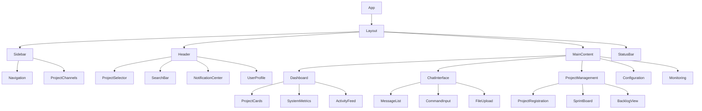

# Component Architecture and Technical Specifications

## Frontend Component Architecture

### Component Hierarchy and Data Flow



### State Management Architecture

**Global State Structure:**
```typescript
interface RootState {
  auth: AuthState;
  projects: ProjectsState;
  chat: ChatState;
  ui: UIState;
  realtime: RealtimeState;
  configuration: ConfigurationState;
}

interface ProjectsState {
  projects: Record<string, ProjectInfo>;
  currentProject: string | null;
  loading: boolean;
  error: string | null;
}

interface ChatState {
  channels: Record<string, ChannelState>;
  currentChannel: string | null;
  commandHistory: string[];
  suggestions: CommandSuggestion[];
}

interface UIState {
  theme: 'light' | 'dark' | 'system';
  sidebarCollapsed: boolean;
  notifications: Notification[];
  modals: ModalState[];
}
```

**Redux Toolkit Slices:**
```typescript
// Projects slice
const projectsSlice = createSlice({
  name: 'projects',
  initialState,
  reducers: {
    setProjects: (state, action) => {
      state.projects = action.payload;
    },
    updateProject: (state, action) => {
      const { name, updates } = action.payload;
      if (state.projects[name]) {
        state.projects[name] = { ...state.projects[name], ...updates };
      }
    },
    setCurrentProject: (state, action) => {
      state.currentProject = action.payload;
    },
  },
  extraReducers: (builder) => {
    builder
      .addCase(fetchProjects.pending, (state) => {
        state.loading = true;
      })
      .addCase(fetchProjects.fulfilled, (state, action) => {
        state.loading = false;
        state.projects = action.payload;
      })
      .addCase(fetchProjects.rejected, (state, action) => {
        state.loading = false;
        state.error = action.error.message;
      });
  },
});
```

## Core Component Specifications

### 1. Chat Interface Components

#### MessageList Component
```typescript
interface MessageListProps {
  projectName: string;
  messages: ChatMessage[];
  loading: boolean;
  onLoadMore: () => void;
  onThreadReply: (messageId: string) => void;
}

interface ChatMessage {
  id: string;
  project_name: string;
  user_id: string;
  content: string;
  type: 'command' | 'response' | 'system' | 'thread';
  timestamp: Date;
  thread_id?: string;
  command_result?: CommandResult;
  embed_data?: EmbedData;
  reactions: Reaction[];
}

const MessageList: React.FC<MessageListProps> = ({
  projectName,
  messages,
  loading,
  onLoadMore,
  onThreadReply
}) => {
  const [virtualizer] = useVirtualizer({
    count: messages.length,
    getScrollElement: () => parentRef.current,
    estimateSize: () => 100,
    overscan: 5,
  });

  return (
    <div className="message-list" ref={parentRef}>
      {virtualizer.getVirtualItems().map((virtualItem) => (
        <MessageItem
          key={virtualItem.key}
          message={messages[virtualItem.index]}
          onThreadReply={onThreadReply}
          style={{
            position: 'absolute',
            top: 0,
            left: 0,
            width: '100%',
            height: `${virtualItem.size}px`,
            transform: `translateY(${virtualItem.start}px)`,
          }}
        />
      ))}
    </div>
  );
};
```

#### CommandInput Component
```typescript
interface CommandInputProps {
  projectName: string;
  currentState: WorkflowState;
  onExecute: (command: string) => void;
  disabled?: boolean;
}

interface CommandSuggestion {
  command: string;
  description: string;
  parameters: Parameter[];
  available_in_state: WorkflowState[];
  category: 'workflow' | 'sprint' | 'backlog' | 'tdd' | 'project';
}

const CommandInput: React.FC<CommandInputProps> = ({
  projectName,
  currentState,
  onExecute,
  disabled = false
}) => {
  const [input, setInput] = useState('');
  const [suggestions, setSuggestions] = useState<CommandSuggestion[]>([]);
  const [selectedSuggestion, setSelectedSuggestion] = useState(0);
  const [historyIndex, setHistoryIndex] = useState(-1);
  
  const debouncedInput = useDebounce(input, 300);
  const commandHistory = useSelector(selectCommandHistory);
  
  useEffect(() => {
    if (debouncedInput) {
      const filteredSuggestions = getCommandSuggestions(
        debouncedInput,
        currentState
      );
      setSuggestions(filteredSuggestions);
    } else {
      setSuggestions([]);
    }
  }, [debouncedInput, currentState]);

  const handleKeyDown = (e: React.KeyboardEvent) => {
    switch (e.key) {
      case 'Enter':
        if (suggestions.length > 0 && selectedSuggestion >= 0) {
          handleSuggestionSelect(suggestions[selectedSuggestion]);
        } else {
          handleSubmit();
        }
        break;
      case 'ArrowUp':
        e.preventDefault();
        if (suggestions.length > 0) {
          setSelectedSuggestion(Math.max(0, selectedSuggestion - 1));
        } else {
          navigateHistory(-1);
        }
        break;
      case 'ArrowDown':
        e.preventDefault();
        if (suggestions.length > 0) {
          setSelectedSuggestion(
            Math.min(suggestions.length - 1, selectedSuggestion + 1)
          );
        } else {
          navigateHistory(1);
        }
        break;
      case 'Escape':
        setSuggestions([]);
        setSelectedSuggestion(0);
        break;
    }
  };

  return (
    <div className="command-input-container">
      <div className="input-wrapper">
        <input
          type="text"
          value={input}
          onChange={(e) => setInput(e.target.value)}
          onKeyDown={handleKeyDown}
          placeholder="Type a command..."
          disabled={disabled}
          className="command-input"
        />
        <button
          onClick={handleSubmit}
          disabled={disabled || !input.trim()}
          className="send-button"
        >
          Send
        </button>
      </div>
      
      {suggestions.length > 0 && (
        <SuggestionList
          suggestions={suggestions}
          selectedIndex={selectedSuggestion}
          onSelect={handleSuggestionSelect}
        />
      )}
      
      <StateIndicator currentState={currentState} />
    </div>
  );
};
```

### 2. Dashboard Components

#### ProjectCard Component
```typescript
interface ProjectCardProps {
  project: ProjectInfo;
  onSelect: (projectName: string) => void;
  onManage: (projectName: string) => void;
  realTimeUpdates: boolean;
}

interface ProjectInfo {
  name: string;
  path: string;
  status: ProjectStatus;
  current_state: WorkflowState;
  active_sprint?: SprintInfo;
  metrics: ProjectMetrics;
  last_activity: Date;
  health_score: number;
}

const ProjectCard: React.FC<ProjectCardProps> = ({
  project,
  onSelect,
  onManage,
  realTimeUpdates
}) => {
  const [isHovered, setIsHovered] = useState(false);
  const [pulse, setPulse] = useState(false);
  
  // Real-time updates
  useEffect(() => {
    if (realTimeUpdates) {
      const unsubscribe = subscribeToProjectUpdates(
        project.name,
        (update) => {
          setPulse(true);
          setTimeout(() => setPulse(false), 1000);
        }
      );
      return unsubscribe;
    }
  }, [project.name, realTimeUpdates]);

  const getStatusColor = (status: ProjectStatus) => {
    switch (status) {
      case 'SPRINT_ACTIVE': return 'text-green-500';
      case 'BLOCKED': return 'text-red-500';
      case 'SPRINT_PAUSED': return 'text-yellow-500';
      case 'IDLE': return 'text-blue-500';
      default: return 'text-gray-500';
    }
  };

  return (
    <div
      className={`project-card ${pulse ? 'pulse-animation' : ''}`}
      onMouseEnter={() => setIsHovered(true)}
      onMouseLeave={() => setIsHovered(false)}
      onClick={() => onSelect(project.name)}
    >
      <div className="card-header">
        <div className="project-info">
          <h3 className="project-name">{project.name}</h3>
          <p className="project-path">{project.path}</p>
        </div>
        <div className={`status-indicator ${getStatusColor(project.status)}`}>
          <StatusIcon status={project.status} />
          <span>{project.current_state}</span>
        </div>
      </div>
      
      <div className="card-content">
        {project.active_sprint && (
          <SprintProgress sprint={project.active_sprint} />
        )}
        
        <MetricsGrid metrics={project.metrics} />
        
        <div className="last-activity">
          <span>Last activity: {formatRelativeTime(project.last_activity)}</span>
        </div>
      </div>
      
      <div className="card-actions">
        <button
          onClick={(e) => {
            e.stopPropagation();
            onManage(project.name);
          }}
          className="manage-button"
        >
          Manage
        </button>
        <HealthIndicator score={project.health_score} />
      </div>
    </div>
  );
};
```

#### SystemMetrics Component
```typescript
interface SystemMetricsProps {
  metrics: SystemMetrics;
  refreshInterval?: number;
}

interface SystemMetrics {
  cpu_usage: number;
  memory_usage: number;
  disk_usage: number;
  network_status: 'good' | 'slow' | 'poor';
  active_projects: number;
  active_tasks: number;
  error_rate: number;
  uptime: number;
}

const SystemMetrics: React.FC<SystemMetricsProps> = ({
  metrics,
  refreshInterval = 5000
}) => {
  const [historicalData, setHistoricalData] = useState<MetricsHistory[]>([]);
  
  useEffect(() => {
    const interval = setInterval(() => {
      // Fetch latest metrics
      fetchSystemMetrics().then((newMetrics) => {
        setHistoricalData(prev => [
          ...prev.slice(-50), // Keep last 50 data points
          {
            timestamp: new Date(),
            ...newMetrics
          }
        ]);
      });
    }, refreshInterval);
    
    return () => clearInterval(interval);
  }, [refreshInterval]);

  return (
    <div className="system-metrics">
      <h3>System Health</h3>
      
      <div className="metrics-grid">
        <MetricCard
          title="CPU Usage"
          value={`${metrics.cpu_usage}%`}
          status={getMetricStatus(metrics.cpu_usage, [60, 80])}
          icon={<CpuIcon />}
        />
        
        <MetricCard
          title="Memory"
          value={`${metrics.memory_usage}%`}
          status={getMetricStatus(metrics.memory_usage, [70, 85])}
          icon={<MemoryIcon />}
        />
        
        <MetricCard
          title="Active Tasks"
          value={metrics.active_tasks}
          status="normal"
          icon={<TasksIcon />}
        />
        
        <MetricCard
          title="Error Rate"
          value={`${metrics.error_rate}%`}
          status={getMetricStatus(metrics.error_rate, [5, 10], true)}
          icon={<ErrorIcon />}
        />
      </div>
      
      <div className="metrics-chart">
        <ResponsiveContainer width="100%" height={200}>
          <LineChart data={historicalData}>
            <CartesianGrid strokeDasharray="3 3" />
            <XAxis dataKey="timestamp" tickFormatter={formatTime} />
            <YAxis />
            <Tooltip />
            <Line
              type="monotone"
              dataKey="cpu_usage"
              stroke="#8884d8"
              name="CPU %"
            />
            <Line
              type="monotone"
              dataKey="memory_usage"
              stroke="#82ca9d"
              name="Memory %"
            />
          </LineChart>
        </ResponsiveContainer>
      </div>
    </div>
  );
};
```

### 3. Configuration Components

#### AgentConfigPanel Component
```typescript
interface AgentConfigPanelProps {
  agentType: AgentType;
  config: AgentConfiguration;
  onSave: (config: AgentConfiguration) => void;
  onTest: (config: AgentConfiguration) => Promise<TestResult>;
}

interface AgentConfiguration {
  agent_type: AgentType;
  enabled: boolean;
  allowed_tools: string[];
  restricted_tools: string[];
  performance_settings: AgentPerformanceConfig;
  security_settings: AgentSecurityConfig;
}

const AgentConfigPanel: React.FC<AgentConfigPanelProps> = ({
  agentType,
  config,
  onSave,
  onTest
}) => {
  const [localConfig, setLocalConfig] = useState(config);
  const [testing, setTesting] = useState(false);
  const [testResult, setTestResult] = useState<TestResult | null>(null);
  const [hasChanges, setHasChanges] = useState(false);
  
  const availableTools = useSelector(selectAvailableTools);
  
  useEffect(() => {
    setHasChanges(JSON.stringify(localConfig) !== JSON.stringify(config));
  }, [localConfig, config]);

  const handleToolToggle = (toolName: string, allowed: boolean) => {
    setLocalConfig(prev => ({
      ...prev,
      allowed_tools: allowed 
        ? [...prev.allowed_tools, toolName]
        : prev.allowed_tools.filter(t => t !== toolName),
      restricted_tools: allowed
        ? prev.restricted_tools
        : [...prev.restricted_tools, toolName]
    }));
  };

  const handleTest = async () => {
    setTesting(true);
    try {
      const result = await onTest(localConfig);
      setTestResult(result);
    } catch (error) {
      setTestResult({
        success: false,
        error: error.message,
        details: {}
      });
    } finally {
      setTesting(false);
    }
  };

  return (
    <div className="agent-config-panel">
      <div className="panel-header">
        <h3>{agentType} Configuration</h3>
        <div className="agent-status">
          <Switch
            checked={localConfig.enabled}
            onChange={(enabled) => setLocalConfig(prev => ({ ...prev, enabled }))}
            label="Enabled"
          />
        </div>
      </div>
      
      <div className="config-sections">
        <section className="tool-access-section">
          <h4>Tool Access Control</h4>
          <div className="tools-grid">
            {availableTools.map(tool => (
              <ToolPermissionItem
                key={tool.name}
                tool={tool}
                allowed={localConfig.allowed_tools.includes(tool.name)}
                restricted={localConfig.restricted_tools.includes(tool.name)}
                onChange={(allowed) => handleToolToggle(tool.name, allowed)}
              />
            ))}
          </div>
        </section>
        
        <section className="performance-section">
          <h4>Performance Settings</h4>
          <div className="settings-grid">
            <NumberInput
              label="Max Concurrent Tasks"
              value={localConfig.performance_settings.max_concurrent_tasks}
              min={1}
              max={10}
              onChange={(value) => setLocalConfig(prev => ({
                ...prev,
                performance_settings: {
                  ...prev.performance_settings,
                  max_concurrent_tasks: value
                }
              }))}
            />
            
            <NumberInput
              label="Timeout (minutes)"
              value={localConfig.performance_settings.timeout_minutes}
              min={5}
              max={120}
              onChange={(value) => setLocalConfig(prev => ({
                ...prev,
                performance_settings: {
                  ...prev.performance_settings,
                  timeout_minutes: value
                }
              }))}
            />
          </div>
        </section>
        
        <section className="security-section">
          <h4>Security Settings</h4>
          <SecurityMatrix
            settings={localConfig.security_settings}
            onChange={(settings) => setLocalConfig(prev => ({
              ...prev,
              security_settings: settings
            }))}
          />
        </section>
      </div>
      
      <div className="panel-actions">
        <button
          onClick={handleTest}
          disabled={testing}
          className="test-button"
        >
          {testing ? 'Testing...' : 'Test Configuration'}
        </button>
        
        <button
          onClick={() => onSave(localConfig)}
          disabled={!hasChanges}
          className="save-button"
        >
          Save Changes
        </button>
        
        <button
          onClick={() => setLocalConfig(config)}
          disabled={!hasChanges}
          className="reset-button"
        >
          Reset
        </button>
      </div>
      
      {testResult && (
        <TestResultDisplay result={testResult} />
      )}
    </div>
  );
};
```

### 4. Monitoring Components

#### TDDCycleMonitor Component
```typescript
interface TDDCycleMonitorProps {
  projectName: string;
  cycleId?: string;
  realTimeUpdates: boolean;
}

interface TDDCycleInfo {
  cycle_id: string;
  story_id: string;
  current_state: TDDState;
  progress: TDDProgress;
  test_results: TestResult[];
  code_metrics: CodeMetrics;
  estimated_completion: Date;
}

const TDDCycleMonitor: React.FC<TDDCycleMonitorProps> = ({
  projectName,
  cycleId,
  realTimeUpdates
}) => {
  const [cycleInfo, setCycleInfo] = useState<TDDCycleInfo | null>(null);
  const [liveOutput, setLiveOutput] = useState<string[]>([]);
  const [selectedTab, setSelectedTab] = useState<'progress' | 'tests' | 'output'>('progress');
  
  useEffect(() => {
    if (realTimeUpdates && cycleId) {
      const unsubscribe = subscribeToTDDCycle(cycleId, (update) => {
        if (update.type === 'cycle_info') {
          setCycleInfo(update.data);
        } else if (update.type === 'output') {
          setLiveOutput(prev => [...prev, update.data]);
        }
      });
      
      return unsubscribe;
    }
  }, [cycleId, realTimeUpdates]);

  if (!cycleInfo) {
    return <div className="no-active-cycle">No active TDD cycle</div>;
  }

  return (
    <div className="tdd-cycle-monitor">
      <div className="cycle-header">
        <h3>TDD Cycle: {cycleInfo.cycle_id}</h3>
        <div className="cycle-meta">
          <span>Story: {cycleInfo.story_id}</span>
          <span>ETA: {formatRelativeTime(cycleInfo.estimated_completion)}</span>
        </div>
      </div>
      
      <TDDProgressIndicator
        currentState={cycleInfo.current_state}
        progress={cycleInfo.progress}
      />
      
      <div className="monitor-tabs">
        <button
          onClick={() => setSelectedTab('progress')}
          className={selectedTab === 'progress' ? 'active' : ''}
        >
          Progress
        </button>
        <button
          onClick={() => setSelectedTab('tests')}
          className={selectedTab === 'tests' ? 'active' : ''}
        >
          Tests
        </button>
        <button
          onClick={() => setSelectedTab('output')}
          className={selectedTab === 'output' ? 'active' : ''}
        >
          Live Output
        </button>
      </div>
      
      <div className="tab-content">
        {selectedTab === 'progress' && (
          <TDDProgressView
            progress={cycleInfo.progress}
            metrics={cycleInfo.code_metrics}
          />
        )}
        
        {selectedTab === 'tests' && (
          <TestResultsView results={cycleInfo.test_results} />
        )}
        
        {selectedTab === 'output' && (
          <LiveOutputView
            output={liveOutput}
            maxLines={1000}
            autoScroll={true}
          />
        )}
      </div>
    </div>
  );
};
```

### 5. Shared Components

#### StateIndicator Component
```typescript
interface StateIndicatorProps {
  currentState: WorkflowState;
  allowedCommands?: string[];
  onStateClick?: (state: WorkflowState) => void;
  interactive?: boolean;
}

const StateIndicator: React.FC<StateIndicatorProps> = ({
  currentState,
  allowedCommands = [],
  onStateClick,
  interactive = false
}) => {
  const [showTooltip, setShowTooltip] = useState(false);
  
  const getStateColor = (state: WorkflowState) => {
    switch (state) {
      case 'IDLE': return 'bg-gray-500';
      case 'BACKLOG_READY': return 'bg-blue-500';
      case 'SPRINT_PLANNED': return 'bg-yellow-500';
      case 'SPRINT_ACTIVE': return 'bg-green-500';
      case 'SPRINT_PAUSED': return 'bg-orange-500';
      case 'SPRINT_REVIEW': return 'bg-purple-500';
      case 'BLOCKED': return 'bg-red-500';
      default: return 'bg-gray-500';
    }
  };

  return (
    <div className="state-indicator-container">
      <div
        className={`state-indicator ${getStateColor(currentState)} ${
          interactive ? 'cursor-pointer' : ''
        }`}
        onClick={() => interactive && onStateClick?.(currentState)}
        onMouseEnter={() => setShowTooltip(true)}
        onMouseLeave={() => setShowTooltip(false)}
      >
        <StateIcon state={currentState} />
        <span>{currentState}</span>
      </div>
      
      {showTooltip && (
        <div className="state-tooltip">
          <div className="tooltip-content">
            <h4>Current State: {currentState}</h4>
            {allowedCommands.length > 0 && (
              <div className="allowed-commands">
                <h5>Available Commands:</h5>
                <ul>
                  {allowedCommands.map(command => (
                    <li key={command}>
                      <code>{command}</code>
                    </li>
                  ))}
                </ul>
              </div>
            )}
          </div>
        </div>
      )}
    </div>
  );
};
```

## Custom Hooks

### useWebSocket Hook
```typescript
interface UseWebSocketOptions {
  url: string;
  namespace?: string;
  reconnectAttempts?: number;
  reconnectInterval?: number;
}

interface WebSocketState {
  connected: boolean;
  error: string | null;
  lastMessage: any;
  send: (event: string, data: any) => void;
  subscribe: (event: string, callback: (data: any) => void) => () => void;
}

export const useWebSocket = (options: UseWebSocketOptions): WebSocketState => {
  const [connected, setConnected] = useState(false);
  const [error, setError] = useState<string | null>(null);
  const [lastMessage, setLastMessage] = useState<any>(null);
  const [socket, setSocket] = useState<Socket | null>(null);
  
  const subscriptions = useRef<Map<string, Set<(data: any) => void>>>(new Map());
  
  useEffect(() => {
    const newSocket = io(options.url, {
      transports: ['websocket'],
      reconnectionAttempts: options.reconnectAttempts || 5,
      reconnectionDelay: options.reconnectInterval || 1000,
    });
    
    if (options.namespace) {
      newSocket.emit('join', options.namespace);
    }
    
    newSocket.on('connect', () => {
      setConnected(true);
      setError(null);
    });
    
    newSocket.on('disconnect', () => {
      setConnected(false);
    });
    
    newSocket.on('error', (err) => {
      setError(err.message);
    });
    
    // Handle all incoming messages
    newSocket.onAny((event, data) => {
      setLastMessage({ event, data });
      
      const callbacks = subscriptions.current.get(event);
      if (callbacks) {
        callbacks.forEach(callback => callback(data));
      }
    });
    
    setSocket(newSocket);
    
    return () => {
      newSocket.close();
    };
  }, [options.url, options.namespace]);
  
  const send = useCallback((event: string, data: any) => {
    if (socket && connected) {
      socket.emit(event, data);
    }
  }, [socket, connected]);
  
  const subscribe = useCallback((event: string, callback: (data: any) => void) => {
    if (!subscriptions.current.has(event)) {
      subscriptions.current.set(event, new Set());
    }
    
    subscriptions.current.get(event)!.add(callback);
    
    return () => {
      const callbacks = subscriptions.current.get(event);
      if (callbacks) {
        callbacks.delete(callback);
        if (callbacks.size === 0) {
          subscriptions.current.delete(event);
        }
      }
    };
  }, []);
  
  return {
    connected,
    error,
    lastMessage,
    send,
    subscribe,
  };
};
```

### useCommandHistory Hook
```typescript
interface UseCommandHistoryOptions {
  maxHistory?: number;
  persistKey?: string;
}

export const useCommandHistory = (options: UseCommandHistoryOptions = {}) => {
  const { maxHistory = 100, persistKey = 'command-history' } = options;
  
  const [history, setHistory] = useState<string[]>(() => {
    if (persistKey) {
      const saved = localStorage.getItem(persistKey);
      return saved ? JSON.parse(saved) : [];
    }
    return [];
  });
  
  const [currentIndex, setCurrentIndex] = useState(-1);
  
  const addCommand = useCallback((command: string) => {
    setHistory(prev => {
      const newHistory = [command, ...prev.filter(cmd => cmd !== command)]
        .slice(0, maxHistory);
      
      if (persistKey) {
        localStorage.setItem(persistKey, JSON.stringify(newHistory));
      }
      
      return newHistory;
    });
    setCurrentIndex(-1);
  }, [maxHistory, persistKey]);
  
  const navigateHistory = useCallback((direction: 1 | -1) => {
    setCurrentIndex(prev => {
      const newIndex = prev + direction;
      return Math.max(-1, Math.min(history.length - 1, newIndex));
    });
  }, [history.length]);
  
  const getCurrentCommand = useCallback(() => {
    return currentIndex >= 0 ? history[currentIndex] : '';
  }, [history, currentIndex]);
  
  const clearHistory = useCallback(() => {
    setHistory([]);
    setCurrentIndex(-1);
    if (persistKey) {
      localStorage.removeItem(persistKey);
    }
  }, [persistKey]);
  
  return {
    history,
    currentIndex,
    addCommand,
    navigateHistory,
    getCurrentCommand,
    clearHistory,
  };
};
```

### useRealTimeUpdates Hook
```typescript
export const useRealTimeUpdates = (projectName: string) => {
  const webSocket = useWebSocket({
    url: '/api/ws',
    namespace: `project/${projectName}`,
  });
  
  const [projectState, setProjectState] = useState<ProjectState | null>(null);
  const [recentActivity, setRecentActivity] = useState<ActivityEvent[]>([]);
  
  useEffect(() => {
    const unsubscribeState = webSocket.subscribe('state_change', (data) => {
      setProjectState(prev => ({
        ...prev,
        ...data,
      }));
    });
    
    const unsubscribeActivity = webSocket.subscribe('activity', (data) => {
      setRecentActivity(prev => [data, ...prev.slice(0, 49)]);
    });
    
    const unsubscribeTask = webSocket.subscribe('task_update', (data) => {
      // Handle task updates
      dispatch(updateTask(data));
    });
    
    return () => {
      unsubscribeState();
      unsubscribeActivity();
      unsubscribeTask();
    };
  }, [webSocket]);
  
  return {
    connected: webSocket.connected,
    projectState,
    recentActivity,
    error: webSocket.error,
  };
};
```

This comprehensive component architecture provides a solid foundation for building the web portal with proper separation of concerns, reusable components, and efficient state management. The components are designed to be maintainable, testable, and performant while providing the rich functionality needed to replace the Discord interface.