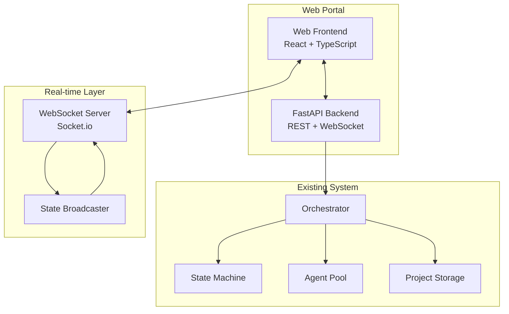
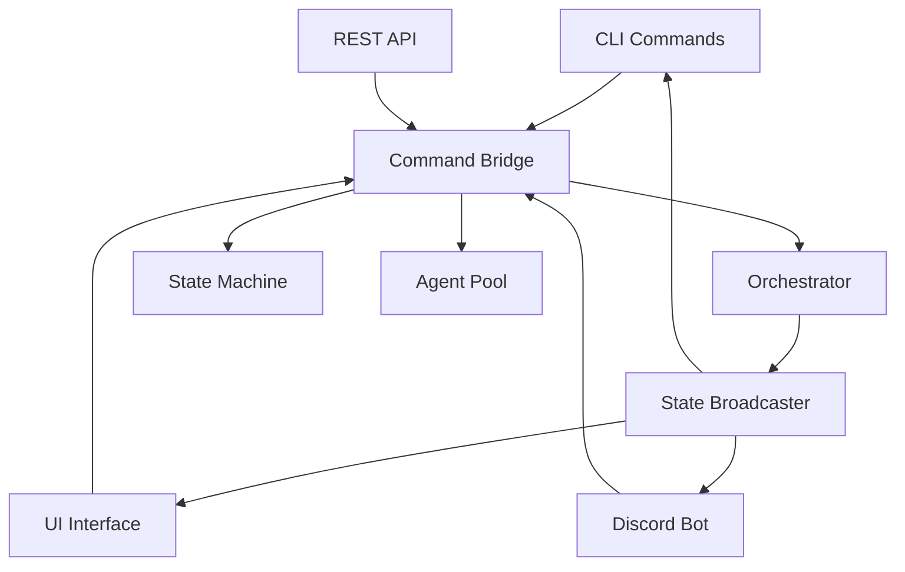

# UX/UI Portal Architecture Design

## Executive Summary

This document outlines the comprehensive architecture for replacing the Discord interface with a modern web-based management portal. The portal will provide a Discord-like chat interface with enhanced project management capabilities, real-time monitoring, and intuitive configuration management.

## Current State Analysis

### Existing Discord Interface Analysis

The current Discord bot provides:
- Slash commands for all HITL operations
- Interactive buttons for state visualization
- Project-specific channels (`hostname-projectname`)
- Real-time embeds for command results
- State machine visualization with Mermaid diagrams

### Integration Points

Key integration points with existing system:
- `Orchestrator` class for command handling
- `StateMachine` for state transitions
- `ProjectStorage` for data persistence
- Agent system for task execution
- Real-time state broadcasting system

## Portal Architecture Overview

### Technology Stack

**Frontend Architecture:**
- **Framework**: React 18+ with TypeScript
- **State Management**: Redux Toolkit for complex application state
- **UI Library**: Material-UI (MUI) v5 for professional components
- **Real-time**: Socket.io client for WebSocket connections
- **Routing**: React Router v6 for navigation
- **Forms**: React Hook Form with Zod validation
- **Charts**: Recharts for data visualization
- **Code Display**: Monaco Editor for code viewing/editing
- **Build Tool**: Vite for fast development and building

**Backend Architecture:**
- **Web Framework**: FastAPI with async/await support
- **WebSocket**: Socket.io server for real-time communication
- **Integration**: Direct integration with existing Orchestrator
- **API**: RESTful API + WebSocket for hybrid communication
- **Static Files**: Serve React build artifacts
- **CORS**: Configured for development and production

**Development Architecture:**
- **Frontend Dev Server**: Vite dev server on port 3000
- **Backend Dev Server**: FastAPI with hot reload on port 8000
- **WebSocket**: Socket.io namespace separation by project
- **Proxy**: Vite proxy for API calls during development

### System Integration Design



### Component Architecture

**Frontend Component Hierarchy:**
```
App
├── Layout
│   ├── Sidebar (Navigation)
│   ├── Header (Project Selector, Notifications)
│   └── Main Content Area
├── Chat Module
│   ├── ChannelList (Projects)
│   ├── ChatWindow
│   ├── MessageList
│   ├── CommandInput (with autocomplete)
│   └── FileUpload
├── Dashboard Module
│   ├── ProjectCards
│   ├── StatusWidgets
│   ├── ProgressCharts
│   └── RecentActivity
├── Project Management
│   ├── ProjectRegistration
│   ├── BacklogView
│   ├── SprintBoard
│   └── EpicPlanning
├── Configuration Module
│   ├── APIKeyManagement
│   ├── AgentSettings
│   ├── SecurityConfig
│   └── UserPreferences
└── Monitoring Module
    ├── TDDCycleView
    ├── AgentActivity
    ├── ResourceUsage
    └── LogViewer
```

## Feature Specifications

### 1. Local Chat Interface

**Discord-like Chat UI:**
- Channel-based project organization
- Message threading for command conversations
- Real-time message streaming with WebSocket
- Message history with infinite scroll
- Search functionality across messages and commands

**Command System:**
- Autocomplete with fuzzy matching
- Command validation before execution
- Inline help and documentation
- Command history navigation (up/down arrows)
- Syntax highlighting for command parameters

**Technical Implementation:**
```typescript
interface ChatMessage {
  id: string;
  project_name: string;
  user_id: string;
  content: string;
  type: 'command' | 'response' | 'system' | 'thread';
  timestamp: Date;
  thread_id?: string;
  command_result?: CommandResult;
  embed_data?: EmbedData;
}

interface CommandSuggestion {
  command: string;
  description: string;
  parameters: Parameter[];
  available_in_state: string[];
}
```

### 2. Project Management Dashboard

**Visual Project Registration:**
- Folder browser with git repository detection
- Drag-and-drop project addition
- Project validation (git repository, permissions)
- Bulk project registration with CSV/JSON import

**Project Status Cards:**
- Real-time status updates via WebSocket
- State machine visualization
- Progress indicators for active sprints
- Resource allocation displays
- Health status indicators

**Sprint Progress Visualization:**
- Burndown charts with real-time updates
- Task completion timelines
- Velocity tracking across sprints
- Story point estimates vs. actuals

**Technical Implementation:**
```typescript
interface ProjectCard {
  name: string;
  path: string;
  status: ProjectStatus;
  current_state: WorkflowState;
  active_sprint?: Sprint;
  metrics: ProjectMetrics;
  last_activity: Date;
  health_score: number;
}

interface ProjectMetrics {
  total_stories: number;
  completed_stories: number;
  failed_tasks: number;
  code_coverage: number;
  test_success_rate: number;
}
```

### 3. Configuration Interface

**Discord Bot Setup Wizard:**
- Step-by-step configuration guide
- Token validation and testing
- Channel creation and management
- Permission verification

**API Key Management:**
- Secure storage with encryption
- Key rotation capabilities
- Usage monitoring and rate limiting
- Integration testing tools

**Agent Configuration Panels:**
- Per-agent security settings
- Tool access control matrix
- Performance tuning parameters
- Agent health monitoring

**Technical Implementation:**
```typescript
interface ConfigurationModule {
  discord: DiscordConfig;
  api_keys: ApiKeyConfig;
  agents: AgentConfig[];
  security: SecurityConfig;
  user_preferences: UserPreferences;
}

interface AgentConfig {
  agent_type: AgentType;
  enabled: boolean;
  allowed_tools: string[];
  restricted_tools: string[];
  performance_settings: AgentPerformanceConfig;
}
```

### 4. Multi-Project Views

**Cross-Project Analytics:**
- Resource utilization across projects
- Performance comparisons
- Bottleneck identification
- Trend analysis over time

**Global Orchestrator Status:**
- System health dashboard
- Active task monitoring
- Error rate tracking
- Performance metrics

**Pattern Recognition Insights:**
- Common failure patterns
- Success pattern identification
- Optimization recommendations
- Predictive analytics for task duration

### 5. Discord-Style UX Features

**Channel Organization:**
- Project-based channels with consistent naming
- Channel categories for organization
- Favorites and pinned channels
- Channel search and filtering

**Notification System:**
- Real-time toast notifications
- Notification history and management
- Configurable notification preferences
- Email/webhook notification options

**User Experience:**
- Dark/light theme with system preference detection
- Responsive design for mobile and tablet
- Keyboard shortcuts for power users
- Accessibility compliance (WCAG 2.1)

## WebSocket API Specifications

### Connection Management

**Namespace Structure:**
```
/portal - Main application events
/project/{project_name} - Project-specific events
/chat/{project_name} - Chat message events
/monitoring - System monitoring events
```

**Event Specifications:**

**Chat Events:**
```typescript
// Client to Server
interface SendMessage {
  event: 'send_message';
  data: {
    project_name: string;
    content: string;
    type: 'command' | 'message';
    thread_id?: string;
  };
}

// Server to Client
interface MessageReceived {
  event: 'message_received';
  data: ChatMessage;
}

interface CommandResult {
  event: 'command_result';
  data: {
    message_id: string;
    success: boolean;
    result: any;
    execution_time: number;
  };
}
```

**State Update Events:**
```typescript
interface StateChange {
  event: 'state_change';
  data: {
    project_name: string;
    old_state: string;
    new_state: string;
    timestamp: Date;
    triggered_by: string;
  };
}

interface TaskUpdate {
  event: 'task_update';
  data: {
    project_name: string;
    task_id: string;
    status: TaskStatus;
    progress: number;
    agent_type: string;
  };
}
```

**Monitoring Events:**
```typescript
interface AgentActivity {
  event: 'agent_activity';
  data: {
    agent_type: string;
    project_name: string;
    action: string;
    status: 'started' | 'completed' | 'failed';
    metrics: AgentMetrics;
  };
}

interface SystemMetrics {
  event: 'system_metrics';
  data: {
    cpu_usage: number;
    memory_usage: number;
    active_projects: number;
    active_tasks: number;
    error_rate: number;
  };
}
```

## REST API Specifications

### Core Endpoints

**Project Management:**
```
GET /api/projects - List all projects
POST /api/projects - Register new project
GET /api/projects/{name} - Get project details
PUT /api/projects/{name} - Update project settings
DELETE /api/projects/{name} - Remove project

GET /api/projects/{name}/status - Get project status
GET /api/projects/{name}/metrics - Get project metrics
GET /api/projects/{name}/logs - Get project logs
```

**Command Execution:**
```
POST /api/commands - Execute command
GET /api/commands/{id} - Get command result
GET /api/commands/history - Get command history
```

**Configuration:**
```
GET /api/config - Get system configuration
PUT /api/config - Update system configuration
POST /api/config/validate - Validate configuration
GET /api/config/agents - Get agent configurations
PUT /api/config/agents/{type} - Update agent configuration
```

### API Response Formats

**Standard Response:**
```typescript
interface ApiResponse<T> {
  success: boolean;
  data?: T;
  error?: string;
  timestamp: Date;
  request_id: string;
}

interface PaginatedResponse<T> {
  items: T[];
  total: number;
  page: number;
  per_page: number;
  has_next: boolean;
  has_prev: boolean;
}
```

## Integration Strategy

### Existing System Integration

**Orchestrator Integration:**
- Direct instantiation of Orchestrator class
- Async command handling with proper error handling
- State synchronization between web portal and orchestrator
- Project lifecycle management

**State Machine Integration:**
- Real-time state transition monitoring
- Command validation before execution
- State-dependent UI updates
- State history and rollback capabilities

**Agent System Integration:**
- Agent status monitoring and display
- Task assignment and progress tracking
- Agent configuration management
- Performance metrics collection

### Migration Strategy

**Phase 1: Parallel Operation**
- Deploy web portal alongside Discord bot
- Mirror all Discord functionality in web interface
- Sync state between both interfaces
- User training and familiarity building

**Phase 2: Feature Enhancement**
- Add web-only features (advanced dashboards, bulk operations)
- Improve user experience with web-native interactions
- Enhanced visualization and monitoring capabilities
- Advanced configuration management

**Phase 3: Discord Deprecation**
- Gradual Discord feature removal
- User migration incentives
- Complete transition to web interface
- Discord bot removal and cleanup

### Data Migration

**Existing Data Preservation:**
- All project data remains unchanged
- State machine persistence continues
- Agent configurations preserved
- Command history maintained

**Enhanced Data Storage:**
- User preferences and customizations
- Dashboard configurations
- Notification settings
- Chat history and threading

## Security Architecture

### Authentication & Authorization

**User Management:**
- Local authentication with session management
- Role-based access control (Admin, User, Viewer)
- Project-level permissions
- API key management for programmatic access

**Security Headers:**
```
Content-Security-Policy: default-src 'self'; script-src 'self' 'unsafe-inline'
X-Frame-Options: DENY
X-Content-Type-Options: nosniff
Strict-Transport-Security: max-age=31536000; includeSubDomains
```

### Input Validation

**Command Validation:**
- Parameter type checking
- Command availability based on current state
- Rate limiting and abuse prevention
- SQL injection and XSS protection

**File Upload Security:**
- File type validation
- Size limitations
- Virus scanning integration
- Secure temporary storage

### WebSocket Security

**Connection Security:**
- Origin validation
- Rate limiting per connection
- Message size limitations
- Namespace-based access control

## Performance Considerations

### Frontend Optimization

**Code Splitting:**
- Route-based code splitting
- Component lazy loading
- Dynamic imports for heavy features
- Bundle size monitoring

**State Management:**
- Redux Toolkit for efficient updates
- Memoization for expensive computations
- Virtual scrolling for large lists
- Debounced user inputs

### Backend Optimization

**Caching Strategy:**
- Redis for session storage
- Application-level caching for frequently accessed data
- HTTP caching headers for static resources
- WebSocket connection pooling

**Database Optimization:**
- Efficient queries with proper indexing
- Connection pooling
- Read replicas for reporting queries
- Data archiving strategies

### Real-time Performance

**WebSocket Optimization:**
- Connection multiplexing
- Message batching for high-frequency updates
- Selective event subscription
- Client-side event filtering

**Resource Management:**
- Memory usage monitoring
- Connection limit enforcement
- Graceful degradation under load
- Background task queuing

## Deployment Architecture

### Development Environment

**Local Development:**
```bash
# Frontend development server
npm run dev  # Vite dev server on :3000

# Backend development server  
python -m uvicorn api:app --reload --port 8000

# WebSocket server
python -m socketio_server --port 8001
```

**Docker Development:**
```yaml
version: '3.8'
services:
  frontend:
    build: ./frontend
    ports: ["3000:3000"]
    volumes: ["./frontend/src:/app/src"]
    
  backend:
    build: ./backend
    ports: ["8000:8000"]
    volumes: ["./backend:/app"]
    environment:
      - DEVELOPMENT=true
      
  redis:
    image: redis:7-alpine
    ports: ["6379:6379"]
```

### Production Deployment

**Container Architecture:**
- Frontend: Nginx serving static React build
- Backend: Gunicorn with multiple FastAPI workers
- WebSocket: Separate Socket.io server instance
- Reverse Proxy: Nginx with load balancing

**Scaling Strategy:**
- Horizontal scaling of backend instances
- WebSocket server clustering with Redis adapter
- CDN for static asset delivery
- Database read replicas for heavy queries

## Success Metrics

### User Experience Metrics

**Usability:**
- Time to complete common tasks
- User satisfaction scores
- Feature adoption rates
- Support ticket reduction

**Performance:**
- Page load times < 2 seconds
- WebSocket message latency < 100ms
- Command execution feedback < 500ms
- 99.9% uptime availability

### Business Impact Metrics

**Productivity:**
- Reduction in context switching
- Increased command execution frequency
- Faster project setup times
- Improved error resolution rates

**System Health:**
- Reduced system resource usage
- Improved error tracking and resolution
- Enhanced monitoring and alertability
- Better user onboarding success rates

## CLI Integration Architecture

### Holistic UI Portal Trigger Capabilities

The UI portal integrates seamlessly with the CLI through multiple trigger mechanisms and launch modes, providing a unified experience across command-line and web interfaces.

#### CLI Command Integration

**Primary UI Launch Commands**:
```bash
# Core UI launch command
agent-orch ui [OPTIONS]

# Mode-specific launches
agent-orch ui --mode dashboard --project webapp
agent-orch ui --mode chat
agent-orch ui --mode config
agent-orch ui --mode monitor

# Deployment modes
agent-orch ui --headless --port 8080
agent-orch ui --dev-mode
agent-orch ui --production --ssl-cert /path/to/cert
agent-orch ui --team-mode --network-detect
```

**Configuration and Management Commands**:
```bash
# Status and health
agent-orch ui-status --verbose --health-check
agent-orch ui-health --detailed --performance-test

# Configuration
agent-orch ui-config setup --team-mode
agent-orch ui-config validate
agent-orch ui-config sync --bidirectional

# Process management
agent-orch ui-stop --graceful-ui --save-sessions
agent-orch ui-restart --preserve-sessions
```

#### Launch Mode Specifications

**Interactive Mode**:
- **Auto-detection**: Automatically detects running UI server
- **Browser Integration**: Cross-platform browser detection and launching
- **URL Generation**: Intelligent network interface selection
- **Mobile Access**: QR code generation for quick mobile access

**Server Mode**:
- **Background Process**: Daemonized server with PID management
- **Process Control**: Start, stop, restart, and status commands
- **Log Management**: Structured logging and rotation
- **Health Monitoring**: Automated health checks and metrics

**Development Mode**:
- **Hot Module Replacement**: Frontend auto-reload on changes
- **Backend Auto-restart**: Python file change detection
- **Source Maps**: Enhanced debugging capabilities
- **Development Proxy**: API proxying for frontend development

**Production Mode**:
- **Optimized Assets**: Minified and compressed static files
- **Security Headers**: Production security configurations
- **SSL/TLS Support**: Certificate management and HTTPS enforcement
- **Performance Monitoring**: Real-time metrics and alerting

### Seamless Integration Features

#### CLI-Triggered UI Commands

**Real-time Command Sync**:
```typescript
interface CommandBridge {
  executeFromCLI(command: string, context: ProjectContext): Promise<CommandResult>;
  executeFromUI(command: string, session: UserSession): Promise<CommandResult>;
  syncCommandHistory(): void;
  broadcastCommandResult(result: CommandResult): void;
}
```

**State Synchronization**:
- **Bidirectional Updates**: CLI commands reflect instantly in UI
- **Real-time Broadcasting**: WebSocket-based state updates
- **Configuration Hot-reload**: Auto-reload on configuration changes
- **Session Sharing**: Shared authentication and user context

#### Auto-Detection and Integration

**Server Detection Logic**:
```python
def detect_ui_server() -> Optional[UIServerInfo]:
    """Detect if UI portal is running and return connection info"""
    try:
        response = requests.get("http://localhost:8080/health", timeout=2)
        if response.status_code == 200:
            return UIServerInfo(
                url="http://localhost:8080",
                version=response.json().get("version"),
                status="healthy"
            )
    except requests.RequestException:
        return None
```

**Shared Configuration Management**:
- **Configuration Inheritance**: UI inherits all CLI configuration
- **Hot-reload Mechanism**: File system watchers for configuration changes
- **Cross-process Communication**: IPC for real-time updates
- **Conflict Resolution**: Smart merging of configuration changes

#### Browser Integration and URL Handling

**Cross-Platform Browser Detection**:
```python
BROWSER_DETECTION = {
    'darwin': {
        'primary': ['Safari', 'Google Chrome', 'Firefox'],
        'development': {
            'chrome-dev': '/Applications/Google Chrome Dev.app/Contents/MacOS/Google Chrome',
            'firefox-dev': '/Applications/Firefox Developer Edition.app/Contents/MacOS/firefox'
        }
    },
    'win32': {
        'primary': ['Microsoft Edge', 'Google Chrome', 'Firefox'],
        'development': {
            'chrome-dev': r'C:\Program Files\Google\Chrome Dev\Application\chrome.exe',
            'edge-dev': r'C:\Program Files\Microsoft\Edge Dev\Application\msedge.exe'
        }
    },
    'linux': {
        'primary': ['firefox', 'google-chrome', 'chromium-browser'],
        'development': {
            'chrome-dev': '/usr/bin/google-chrome-unstable',
            'firefox-dev': '/usr/bin/firefox-developer-edition'
        }
    }
}
```

**Network Interface Analysis**:
- **Multi-interface Detection**: Automatic discovery of network interfaces
- **Accessibility Testing**: Connectivity validation for each interface
- **Mobile Optimization**: QR code generation for mobile device access
- **Security Assessment**: Private vs public network recommendations

#### Configuration Sharing Mechanisms

**Automatic Configuration Sync**:
```yaml
# ~/.agent-workflow/config.yaml
cli_ui_integration:
  auto_sync: true
  sync_interval: 5  # seconds
  hot_reload: true
  shared_sessions: true
  
ui_portal:
  inherit_cli_config: true
  override_settings:
    theme: auto
    notifications: enabled
    mobile_optimized: true
```

**Bidirectional Configuration Updates**:
- **CLI to UI**: Configuration changes in CLI automatically update UI
- **UI to CLI**: User preferences in UI persist to CLI configuration
- **Conflict Resolution**: Intelligent merging with user preference priority
- **Rollback Capability**: Configuration history and rollback support

#### Cross-Process Communication Patterns

**WebSocket-Based Real-time Sync**:
```typescript
interface CLIUIBridge {
  // CLI → UI communication
  notifyUIOfCommand(command: CLICommand): void;
  updateUIState(state: SystemState): void;
  
  // UI → CLI communication
  executeCLICommand(command: string, context: UIContext): Promise<CommandResult>;
  requestCLIStatus(): Promise<CLIStatus>;
  
  // Bidirectional
  syncConfiguration(config: Configuration): void;
  broadcastStateChange(change: StateChange): void;
}
```

**Security Token Generation**:
```bash
# Session authentication for UI access
$ agent-orch ui-token generate --expires 24h --permissions full --project webapp

Generated UI access token:
├── Token: ui_webapp_abc123def456ghi789
├── Expires: 2024-01-16 14:30:00 UTC
├── Permissions: Full project access
├── Project Scope: webapp only
├── Access URL: http://localhost:8080/auth?token=ui_webapp_abc123def456ghi789
└── Revoke: agent-orch ui-token revoke ui_webapp_abc123def456ghi789
```

### Enhanced Architecture Integration

#### Multi-Modal Access Patterns

**Unified Command Interface**:


**Cross-Interface State Synchronization**:
- **Real-time Updates**: All interfaces receive immediate state updates
- **Command History Sharing**: Unified command history across interfaces
- **Session Continuity**: Seamless switching between interfaces
- **Conflict Prevention**: Distributed locking for concurrent operations

#### Progressive Web App Integration

**PWA Features for Mobile Access**:
```json
{
  "name": "Agent-Workflow Portal",
  "short_name": "AgentWorkflow",
  "start_url": "/dashboard",
  "display": "standalone",
  "background_color": "#ffffff",
  "theme_color": "#1976d2",
  "icons": [
    {
      "src": "/icons/icon-192.png",
      "sizes": "192x192",
      "type": "image/png"
    }
  ],
  "features": {
    "offline_support": true,
    "push_notifications": true,
    "background_sync": true,
    "device_integration": true
  }
}
```

**Mobile-Optimized Command Interface**:
- **Touch-Friendly Controls**: Large buttons and gesture navigation
- **Voice Input Support**: Speech-to-text for command input
- **Offline Mode**: Cached data viewing when disconnected
- **Push Notifications**: Real-time project updates
- **Responsive Design**: Adaptive layout for all screen sizes

#### Team Collaboration Enhancement

**Multi-User CLI-UI Coordination**:
```typescript
interface TeamCollaboration {
  // Real-time collaboration
  simultaneousEditing: boolean;
  conflictResolution: 'merge' | 'lock' | 'queue';
  activityBroadcasting: boolean;
  
  // Permission management
  roleBasedAccess: Record<UserRole, Permission[]>;
  projectLevelPermissions: Record<ProjectId, ProjectPermissions>;
  
  // Communication
  sharedCommandHistory: boolean;
  teamNotifications: boolean;
  presenceIndicators: boolean;
}
```

**Enhanced Security for Team Access**:
- **Role-Based Access Control**: Fine-grained permissions per user and project
- **Session Management**: Secure multi-user session handling
- **Audit Logging**: Complete activity tracking and audit trails
- **Network Security**: VPN and firewall considerations for team access

## Next Steps

### Enhanced Implementation Phases

**Phase 1: CLI-UI Foundation (Weeks 1-4)**
- Implement core `agent-orch ui` command with all launch modes
- Create CLI-UI communication bridge and WebSocket infrastructure
- Establish configuration sharing and hot-reload mechanisms
- Build cross-platform browser detection and launching

**Phase 2: Seamless Integration (Weeks 5-8)**
- Implement bidirectional command execution between CLI and UI
- Create real-time state synchronization and broadcasting system
- Build mobile-optimized interface with PWA capabilities
- Develop security token system and session management

**Phase 3: Advanced Features (Weeks 9-12)**
- Add team collaboration features and multi-user support
- Implement advanced monitoring and diagnostics commands
- Create network analysis and optimization features
- Build comprehensive integration health monitoring

**Phase 4: Production & Mobile (Weeks 13-16)**
- Optimize for production deployment with SSL/TLS support
- Enhance mobile experience with offline capabilities
- Create comprehensive documentation and user guides
- Implement automated testing for CLI-UI integration

This enhanced architecture provides a comprehensive foundation for holistic CLI-UI integration, enabling seamless switching between command-line efficiency and visual management capabilities while maintaining security, performance, and team collaboration features.