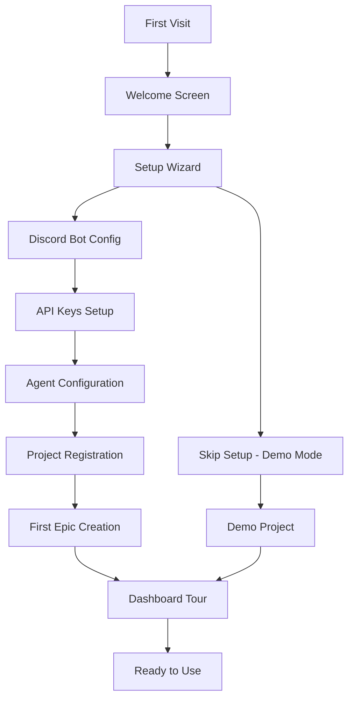
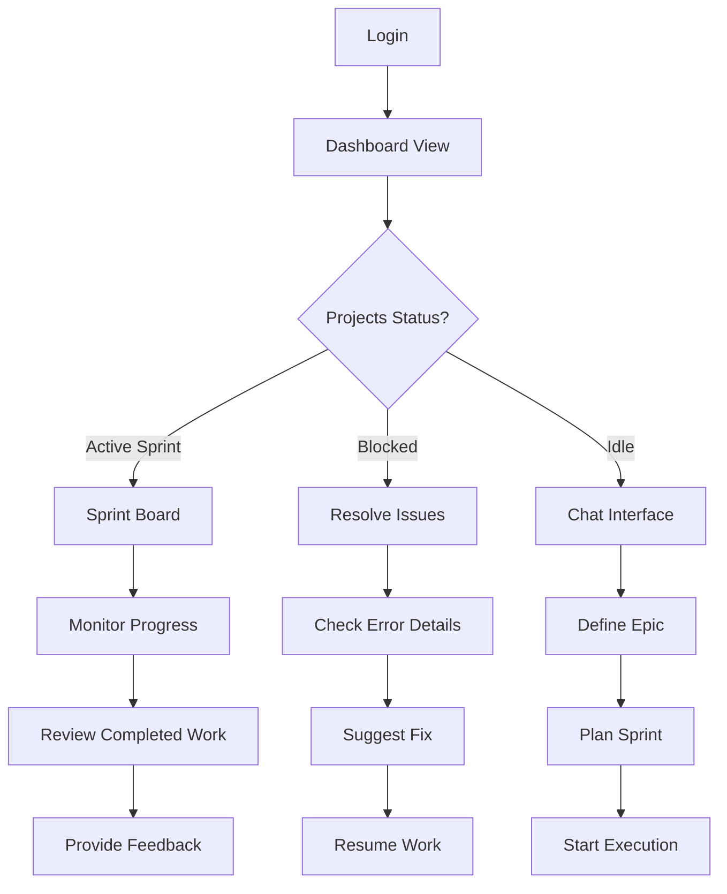
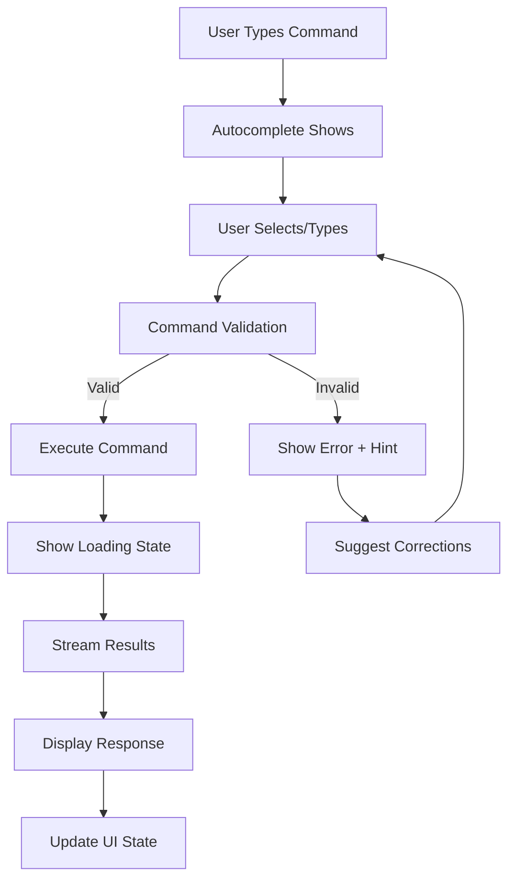

# UX/UI Portal Wireframes and User Experience Design

## Design Philosophy

The portal follows a Discord-inspired design language while incorporating modern project management and development workflow principles. The interface emphasizes:

- **Familiar Discord-like Navigation**: Left sidebar with channels/projects
- **Real-time Collaborative Feel**: Live updates and activity indicators  
- **Professional Development Tools**: Code-aware interfaces and technical dashboards
- **Contextual Information Architecture**: State-aware UI that adapts to workflow phases

## Color Palette and Design System

### Primary Color Scheme
```css
/* Dark Theme (Default) */
--primary-bg: #36393f;        /* Discord-like dark gray */
--secondary-bg: #2f3136;      /* Darker variant */
--accent-bg: #40444b;         /* Hover states */
--sidebar-bg: #202225;        /* Sidebar background */
--text-primary: #ffffff;      /* Primary text */
--text-secondary: #b9bbbe;    /* Secondary text */
--text-muted: #72767d;        /* Muted text */
--accent-color: #5865f2;      /* Discord blurple */
--success-color: #3ba55c;     /* Success states */
--warning-color: #faa61a;     /* Warning states */
--error-color: #ed4245;       /* Error states */
--info-color: #00b0f4;        /* Info states */

/* Light Theme */
--primary-bg-light: #ffffff;
--secondary-bg-light: #f6f6f6;
--accent-bg-light: #e3e5e8;
--sidebar-bg-light: #f2f3f5;
--text-primary-light: #2e3338;
--text-secondary-light: #4e5058;
--text-muted-light: #6a6d75;
```

### Typography System
```css
/* Font Stack */
font-family: -apple-system, BlinkMacSystemFont, "Segoe UI", Roboto, Helvetica, Arial, sans-serif;

/* Type Scale */
--text-xs: 0.75rem;    /* 12px - Timestamps, badges */
--text-sm: 0.875rem;   /* 14px - Secondary text */
--text-base: 1rem;     /* 16px - Body text */
--text-lg: 1.125rem;   /* 18px - Card titles */
--text-xl: 1.25rem;    /* 20px - Section headers */
--text-2xl: 1.5rem;    /* 24px - Page titles */
--text-3xl: 1.875rem;  /* 30px - Major headings */
```

## Main Layout Structure

### Overall Application Layout

```
┌─────────────────────────────────────────────────────────────────┐
│ Header Bar                                                      │
│ [Logo] [Project Selector ▼] [Search] [Notifications] [Profile] │
├─────────────────────────────────────────────────────────────────┤
│ │                                                             │ │
│ │ Sidebar                   Main Content Area                 │ │
│ │                                                             │ │
│ │ ┌─ Navigation              ┌─ Dynamic Content Based on     │ │
│ │ ├─ 🏠 Dashboard           │  Selected Navigation           │ │
│ │ ├─ 💬 Chat                │                                │ │
│ │ ├─ 📋 Projects            │  [Content varies by section]  │ │
│ │ ├─ ⚙️  Config             │                                │ │
│ │ └─ 📊 Monitoring          │                                │ │
│ │                           │                                │ │
│ │ ┌─ Project Channels       │                                │ │
│ │ ├─ # local-project1       │                                │ │
│ │ ├─ # local-project2       │                                │ │
│ │ └─ # local-project3       │                                │ │
├─────────────────────────────────────────────────────────────────┤
│ Status Bar                                                      │
│ [Connection Status] [Active Tasks: 3] [System Health: Good]    │
└─────────────────────────────────────────────────────────────────┘
```

### Responsive Breakpoints
- **Desktop**: 1024px+ (Full layout with sidebar)
- **Tablet**: 768px-1023px (Collapsible sidebar, stacked layout)
- **Mobile**: 320px-767px (Bottom navigation, full-screen modals)

## Page Wireframes

### 1. Dashboard View

```
┌─────────────────────────────────────────────────────────────────┐
│ Dashboard Overview                                    🔄 Auto   │
├─────────────────────────────────────────────────────────────────┤
│                                                                 │
│ ┌─── Quick Stats ─────┬─── System Health ─────┬─── Activity ───┐ │
│ │ 📊 Active Projects  │ 🟢 All Systems OK     │ 🔴 3 Failed    │ │
│ │ 5                   │ CPU: 45%  Memory: 60% │ 🟡 2 Pending   │ │
│ │                     │ Disk: 30%  Network:   │ 🟢 12 Success  │ │
│ │ 📈 Total Commands   │ Good                  │                │ │
│ │ 1,247 today         │                       │ Last 24h       │ │
│ └─────────────────────┴───────────────────────┴────────────────┘ │
│                                                                 │
│ ┌─── Recent Projects ─────────────────────────────────────────── │
│ │                                                               │ │
│ │ ┌─ project1 ─────┐ ┌─ project2 ─────┐ ┌─ project3 ─────┐    │ │
│ │ │ 🟢 SPRINT_ACTIVE│ │ 🟡 BLOCKED     │ │ 🔵 IDLE        │    │ │
│ │ │                 │ │                │ │                │    │ │
│ │ │ Sprint 2.1      │ │ Sprint 1.3     │ │ No active work │    │ │
│ │ │ 3/5 stories     │ │ Waiting fix    │ │                │    │ │
│ │ │ 2 days left     │ │ Task #42       │ │ 📝 Start epic  │    │ │
│ │ │                 │ │                │ │                │    │ │
│ │ │ [View Details]  │ │ [View Details] │ │ [View Details] │    │ │
│ │ └─────────────────┘ └────────────────┘ └────────────────┘    │ │
│ └───────────────────────────────────────────────────────────── │
│                                                                 │
│ ┌─── Global Activity Timeline ─────────────────────────────────  │
│ │ 🕐 2:34 PM - project1 - TDD cycle completed                   │ │
│ │ 🕐 1:45 PM - project2 - Task blocked, needs human review     │ │
│ │ 🕐 12:30 PM - project1 - Sprint started                      │ │
│ │ 🕐 11:15 AM - project3 - Epic created                        │ │
│ │ [Show more...]                                               │ │
│ └─────────────────────────────────────────────────────────────  │
└─────────────────────────────────────────────────────────────────┘
```

### 2. Chat Interface

```
┌─────────────────────────────────────────────────────────────────┐
│ # local-project1                                    👥 Online: 1│
├─────────────────────────────────────────────────────────────────┤
│                                                                 │
│ ┌─── Message History ───────────────────────────────────────────┐ │
│ │ [Today 2:30 PM]                                              │ │
│ │ 👤 You                                                       │ │
│ │ /epic "Add user authentication system"                      │ │
│ │                                                              │ │
│ │ 🤖 System                                                    │ │
│ │ ┌─ Epic Created ──────────────────────────────────────────┐  │ │
│ │ │ ✅ Epic: Add user authentication system                 │  │ │
│ │ │                                                         │  │ │
│ │ │ 📝 Proposed Stories:                                    │  │ │
│ │ │ • User registration with email validation              │  │ │
│ │ │ • Login/logout functionality                           │  │ │
│ │ │ • Password reset system                                │  │ │
│ │ │ • User profile management                              │  │ │
│ │ │                                                         │  │ │
│ │ │ Next: Use /approve to accept these stories             │  │ │
│ │ └─────────────────────────────────────────────────────────┘  │ │
│ │                                                              │ │
│ │ 👤 You                                                       │ │
│ │ /approve                                                     │ │
│ │                                                              │ │
│ │ 🤖 System                                                    │ │
│ │ ✅ 4 stories approved and added to backlog                  │ │
│ │ [2:45 PM]                                                   │ │
│ │                                                              │ │
│ │ ▼ ▼ ▼ More messages below ▼ ▼ ▼                            │ │
│ └──────────────────────────────────────────────────────────────┘ │
│                                                                 │
│ ┌─── Command Input ─────────────────────────────────────────────┐ │
│ │ /sprint start [📝 Type command... ]                    [Send]│ │
│ │                                                              │ │
│ │ 💡 Available commands in current state (BACKLOG_READY):     │ │
│ │ /sprint plan • /backlog view • /backlog add_story • /state  │ │
│ └──────────────────────────────────────────────────────────────┘ │
└─────────────────────────────────────────────────────────────────┘
```

### 3. Project Management Dashboard

```
┌─────────────────────────────────────────────────────────────────┐
│ Projects                                              [+ Add]   │
├─────────────────────────────────────────────────────────────────┤
│                                                                 │
│ ┌─── Project Registration ──────────────────────────────────────┐ │
│ │ 📁 Add New Project                                           │ │
│ │                                                              │ │
│ │ Project Path: [/path/to/project     ] [📂 Browse]           │ │
│ │ Project Name: [my-awesome-project   ] (auto-filled)         │ │
│ │ Git Repository: ✅ Detected (.git found)                    │ │
│ │                                                              │ │
│ │ [Cancel] [Register Project]                                  │ │
│ └──────────────────────────────────────────────────────────────┘ │
│                                                                 │
│ ┌─── Active Projects ───────────────────────────────────────────┐ │
│ │                                                              │ │
│ │ 🟢 project1                     SPRINT_ACTIVE    [Manage]   │ │
│ │ └─ /home/user/project1                                       │ │
│ │    Sprint 2.1 • 3/5 stories • 2 days left                  │ │
│ │    Last activity: TDD cycle completed (2m ago)              │ │
│ │                                                              │ │
│ │ 🟡 project2                     BLOCKED          [Manage]   │ │
│ │ └─ /home/user/project2                                       │ │
│ │    Sprint 1.3 • Waiting for fix on task #42                │ │
│ │    Last activity: Human intervention required (15m ago)     │ │
│ │                                                              │ │
│ │ 🔵 project3                     IDLE             [Manage]   │ │
│ │ └─ /home/user/project3                                       │ │
│ │    No active work • Ready for epic definition               │ │
│ │    Last activity: Project registered (1h ago)               │ │
│ │                                                              │ │
│ └──────────────────────────────────────────────────────────────┘ │
│                                                                 │
│ ┌─── Bulk Operations ───────────────────────────────────────────┐ │
│ │ Select Multiple: [ ] project1  [ ] project2  [ ] project3   │ │
│ │ Actions: [Pause All] [Resume All] [Export Status]           │ │
│ └──────────────────────────────────────────────────────────────┘ │
└─────────────────────────────────────────────────────────────────┘
```

### 4. Sprint Board View

```
┌─────────────────────────────────────────────────────────────────┐
│ project1 Sprint Board                           Sprint 2.1      │
├─────────────────────────────────────────────────────────────────┤
│                                                                 │
│ ┌─── Sprint Info ─────────────────────────────────────────────┐ │
│ │ 📅 March 15-29, 2024  │  📊 Progress: 3/5 stories  │  ⏱️ 2 days left │ │
│ └─────────────────────────────────────────────────────────────┘ │
│                                                                 │
│ ┌─ TO DO ──────┬─ IN PROGRESS ─┬─ TESTING ────┬─ DONE ─────────┐ │
│ │              │               │              │               │ │
│ │ 📋 Story #4  │ 🔄 Story #2   │ 🧪 Story #1  │ ✅ Story #3   │ │
│ │ User Profile │ Login System  │ Registration │ Database      │ │
│ │ Management   │               │ Flow         │ Schema        │ │
│ │              │ 🤖 CodeAgent  │              │               │ │
│ │ 📋 Story #5  │ Working...    │ 🧪 Story #5  │ ✅ Story #7   │ │
│ │ Password     │ ETA: 30min    │ Unit Tests   │ API Endpoints │ │
│ │ Reset        │               │ 85% coverage │               │ │
│ │              │               │              │               │ │
│ │ [+ Add Story]│               │              │               │ │
│ │              │               │              │               │ │
│ └──────────────┴───────────────┴──────────────┴───────────────┘ │
│                                                                 │
│ ┌─── Burndown Chart ──────────────────────────────────────────┐ │
│ │    Story Points                                             │ │
│ │ 25 ┤                                                        │ │
│ │ 20 ┤ ●─●                                                    │ │
│ │ 15 ┤     ●─●                                                │ │
│ │ 10 ┤         ●─●                                            │ │
│ │  5 ┤             ●─●                                        │ │
│ │  0 ┤─────────────────●──●──●                                │ │
│ │    Day 1  3   5   7   9  11 13                             │ │
│ │    ──── Ideal  ──── Actual                                 │ │
│ └─────────────────────────────────────────────────────────────┘ │
└─────────────────────────────────────────────────────────────────┘
```

### 5. Configuration Interface

```
┌─────────────────────────────────────────────────────────────────┐
│ Configuration                                                   │
├─────────────────────────────────────────────────────────────────┤
│                                                                 │
│ ┌─── Navigation ──────┐ ┌─── Discord Bot Setup ──────────────┐ │
│ │ 🤖 Discord Bot      │ │                                    │ │
│ │ 🔑 API Keys         │ │ Bot Token                          │ │
│ │ 👥 Agents           │ │ [●●●●●●●●●●●●●●●●●●●●●●●●●●●●●●]  │ │
│ │ 🔒 Security         │ │ [Test Connection]                  │ │
│ │ 🎨 Preferences      │ │                                    │ │
│ │                     │ │ ✅ Connected to Discord            │ │
│ │                     │ │ Server: AI Development (3 users)  │ │
│ │                     │ │                                    │ │
│ │                     │ │ Channel Management                 │ │
│ │                     │ │ ┌─ Existing Channels ─────────────┐ │ │
│ │                     │ │ │ # local-project1  [Edit]       │ │ │
│ │                     │ │ │ # local-project2  [Edit]       │ │ │
│ │                     │ │ │ # local-project3  [Edit]       │ │ │
│ │                     │ │ └─────────────────────────────────┘ │ │
│ │                     │ │                                    │ │
│ │                     │ │ [Create Missing Channels]          │ │
│ │                     │ │ [Sync Channel Permissions]         │ │
│ └─────────────────────┘ └────────────────────────────────────┘ │
└─────────────────────────────────────────────────────────────────┘

┌─────────────────────────────────────────────────────────────────┐
│ Configuration > Agents                                          │
├─────────────────────────────────────────────────────────────────┤
│                                                                 │
│ ┌─── Agent Configuration ──────────────────────────────────────┐ │
│ │                                                              │ │
│ │ Agent Type: [CodeAgent ▼]                                   │ │
│ │                                                              │ │
│ │ Status: 🟢 Enabled  [Toggle]                                │ │
│ │                                                              │ │
│ │ ┌─ Tool Access Control ─────────────────────────────────────┐ │ │
│ │ │ ✅ File Reading        ✅ Code Editing                    │ │ │
│ │ │ ✅ Git Operations      ❌ File Deletion                   │ │ │
│ │ │ ✅ Test Execution      ❌ System Commands                 │ │ │
│ │ │ ✅ Package Management  ❌ Network Access                  │ │ │
│ │ └───────────────────────────────────────────────────────────┘ │ │
│ │                                                              │ │
│ │ ┌─ Performance Settings ────────────────────────────────────┐ │ │
│ │ │ Max Concurrent Tasks: [3    ] (1-10)                     │ │ │
│ │ │ Timeout (minutes):    [30   ] (5-120)                    │ │ │
│ │ │ Retry Attempts:       [3    ] (1-5)                      │ │ │
│ │ │ Memory Limit (MB):    [1024 ] (512-4096)                 │ │ │
│ │ └───────────────────────────────────────────────────────────┘ │ │
│ │                                                              │ │
│ │ [Save Changes] [Reset to Defaults] [Test Configuration]     │ │
│ └──────────────────────────────────────────────────────────────┘ │
└─────────────────────────────────────────────────────────────────┘
```

### 6. TDD Monitoring Dashboard

```
┌─────────────────────────────────────────────────────────────────┐
│ TDD Monitoring                                    project1       │
├─────────────────────────────────────────────────────────────────┤
│                                                                 │
│ ┌─── Active TDD Cycle ──────────────────────────────────────────┐ │
│ │ Cycle ID: TDD-2024-03-15-001    Story: User Registration     │ │
│ │                                                              │ │
│ │ ┌─ Progress ─────────────────────────────────────────────────┐ │ │
│ │ │ RED ● GREEN ● REFACTOR ○ COMMIT ○                         │ │ │
│ │ │ Current: GREEN (Writing implementation)                   │ │ │
│ │ │ Tests: 12/12 passing • Coverage: 94%                     │ │ │
│ │ │ ETA: 15 minutes                                           │ │ │
│ │ └───────────────────────────────────────────────────────────┘ │ │
│ │                                                              │ │
│ │ 🤖 CodeAgent is working on implementation...                │ │
│ │ Last update: Writing UserService.register() method (30s ago)│ │
│ └──────────────────────────────────────────────────────────────┘ │
│                                                                 │
│ ┌─── TDD Metrics ───┬─── Test Results ──┬─── Code Quality ────┐ │
│ │ Cycles Today: 5   │ 🟢 Passing: 247   │ Coverage: 92.5%    │ │
│ │ Success Rate: 80% │ 🔴 Failing: 3     │ Complexity: Low    │ │
│ │ Avg Duration: 45m │ ⚠️  Flaky: 1      │ Tech Debt: 2 hrs   │ │
│ │ Refactors: 12     │ ⏸️  Skipped: 0    │ Duplication: 1.2%  │ │
│ └───────────────────┴───────────────────┴────────────────────┘ │
│                                                                 │
│ ┌─── Live Test Output ──────────────────────────────────────────┐ │
│ │ $ npm test -- --watch                                       │ │
│ │                                                              │ │
│ │ PASS src/services/UserService.test.js                       │ │
│ │ ✓ should register user with valid email (47ms)             │ │
│ │ ✓ should hash password correctly (23ms)                    │ │
│ │ ✓ should validate email format (12ms)                      │ │
│ │ ✓ should reject duplicate email (34ms)                     │ │
│ │                                                              │ │
│ │ Test Suites: 1 passed, 1 total                             │ │
│ │ Tests:       4 passed, 4 total                             │ │
│ │ Snapshots:   0 total                                        │ │
│ │ Time:        2.847s                                         │ │
│ │ Ran all test suites related to changed files.              │ │
│ │                                                              │ │
│ │ [Scroll to bottom] [Clear] [Full screen]                    │ │
│ └──────────────────────────────────────────────────────────────┘ │
└─────────────────────────────────────────────────────────────────┘
```

## User Journey Flows

### 1. New User Onboarding



### 2. Daily Workflow - Project Management



### 3. Command Execution Flow



## Responsive Design Patterns

### Mobile Adaptations

**Navigation Pattern:**
- Collapsible sidebar becomes bottom tab navigation
- Project channels accessible via project selector dropdown
- Chat interface takes full screen with swipe gestures

**Command Input:**
- Expanded textarea for mobile typing
- Voice-to-text integration for commands
- Swipe gestures for command history

**Dashboard Cards:**
- Stack vertically with full width
- Condensed information display
- Touch-friendly tap targets (44px minimum)

### Tablet Adaptations

**Hybrid Layout:**
- Collapsible sidebar with overlay mode
- Split-screen chat and monitoring
- Gesture-based navigation between sections

**Touch Interactions:**
- Drag-and-drop for sprint board
- Pinch-to-zoom for diagrams and charts
- Long-press for context menus

## Accessibility Features

### WCAG 2.1 AA Compliance

**Visual Accessibility:**
- High contrast color ratios (4.5:1 minimum)
- Scalable text up to 200% without horizontal scrolling
- Clear focus indicators for keyboard navigation
- Reduced motion options for animations

**Screen Reader Support:**
- Semantic HTML structure with proper ARIA labels
- Live regions for real-time updates
- Skip navigation links
- Descriptive alt text for visual elements

**Keyboard Navigation:**
- Tab order follows logical flow
- All interactive elements keyboard accessible
- Keyboard shortcuts for common actions
- Escape key to close modals and dropdowns

### Inclusive Design Features

**Language Support:**
- RTL language support for Arabic, Hebrew
- Internationalization framework ready
- Clear, simple language in interface text
- Technical jargon explanations available

**Cognitive Accessibility:**
- Consistent navigation patterns
- Clear error messages with actionable steps
- Progress indicators for long operations
- Confirmation dialogs for destructive actions

## Interactive Components

### Custom Component Library

**Command Input Component:**
```typescript
interface CommandInputProps {
  placeholder: string;
  onExecute: (command: string) => void;
  suggestions: CommandSuggestion[];
  currentState: WorkflowState;
  loading?: boolean;
}
```

**Project Status Card:**
```typescript
interface ProjectStatusCardProps {
  project: ProjectInfo;
  onManage: (projectName: string) => void;
  showMetrics: boolean;
  realTimeUpdates: boolean;
}
```

**State Machine Visualizer:**
```typescript
interface StateMachineVisualizerProps {
  currentState: WorkflowState;
  allowedTransitions: string[];
  onStateClick: (state: WorkflowState) => void;
  interactive: boolean;
}
```

### Animation and Micro-interactions

**Loading States:**
- Skeleton screens for content loading
- Progressive image loading with blur-up effect
- Shimmer animations for data fetching
- Smooth transitions between states

**Feedback Animations:**
- Success checkmarks with spring animation
- Error shake animations for invalid inputs
- Progress bars with smooth easing
- Hover states with subtle scale transforms

**Real-time Updates:**
- Slide-in animations for new messages
- Pulse animations for status changes
- Fade transitions for content updates
- Smooth scrolling to new content

This comprehensive wireframe and UX design provides a solid foundation for implementing the Discord-replacement portal with a professional, accessible, and user-friendly interface that maintains the familiar feel while adding powerful new capabilities.