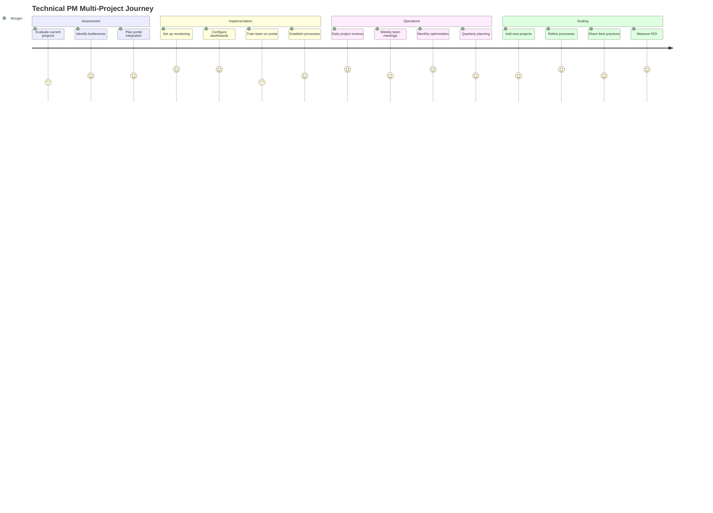
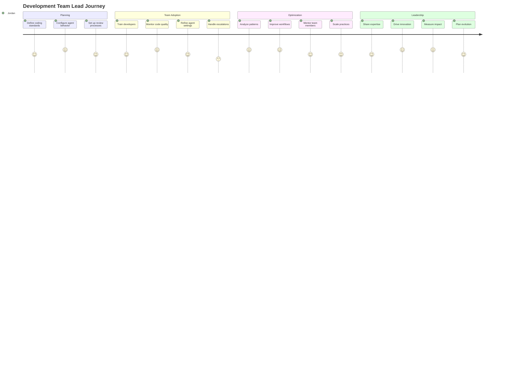
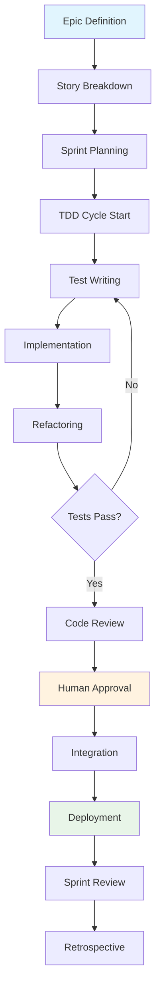
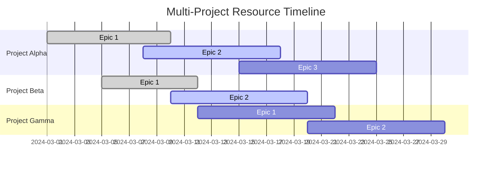
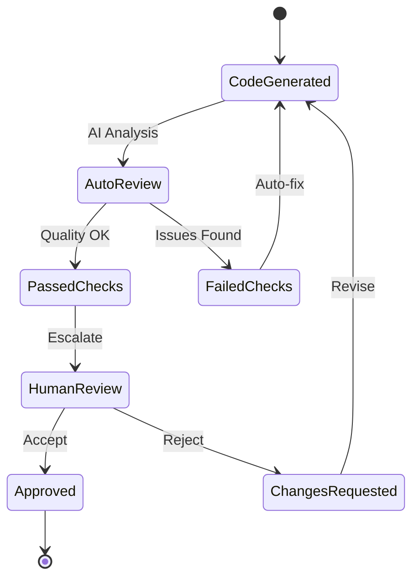

# User Journey Flows and Personas

## Primary User Personas

### 1. Solo Developer (Alex)

**Demographics:**
- Age: 28-35
- Experience: 5-8 years in software development
- Role: Full-stack developer, indie developer, or team lead on small projects
- Work Style: Values automation, efficiency, and minimal context switching

**Goals:**
- Reduce manual project management overhead
- Maintain high development velocity with AI assistance
- Keep comprehensive documentation and decision history
- Balance between AI automation and human control

**Pain Points:**
- Constantly switching between development tools and project management apps
- Forgetting to document architectural decisions
- Difficulty tracking progress across multiple concurrent projects
- Time spent on repetitive testing and deployment tasks

**Technology Comfort:**
- High comfort with command-line interfaces
- Prefers keyboard shortcuts and efficient workflows
- Uses Discord regularly for communication
- Familiar with modern web applications

**Portal Usage Patterns:**
- Primary workspace for project coordination
- Heavy use of chat interface for command execution
- Dashboard monitoring for project health
- Configuration management for automation fine-tuning

### 2. Technical Project Manager (Morgan)

**Demographics:**
- Age: 32-45
- Experience: 8-15 years in technology and project management
- Role: Technical PM, Engineering Manager, or Scrum Master
- Work Style: Data-driven decision making, process optimization

**Goals:**
- Oversee multiple AI-assisted development projects
- Maintain visibility into team productivity and blockers
- Ensure quality standards and security compliance
- Optimize resource allocation across projects

**Pain Points:**
- Lack of visibility into AI agent activities
- Difficulty tracking cross-project resource usage
- Challenges in measuring AI contribution to productivity
- Need for audit trails and compliance reporting

**Technology Comfort:**
- Moderate to high comfort with web applications
- Prefers visual dashboards over command-line interfaces
- Uses project management tools extensively
- Values real-time reporting and notifications

**Portal Usage Patterns:**
- Dashboard-focused for high-level project oversight
- Monitoring views for resource and performance tracking
- Configuration management for team-wide settings
- Report generation and analytics

### 3. Development Team Lead (Jordan)

**Demographics:**
- Age: 30-40
- Experience: 7-12 years in software development and team leadership
- Role: Senior Developer, Tech Lead, or Architecture lead
- Work Style: Mentoring-focused, quality-conscious, strategic thinking

**Goals:**
- Guide AI agent behavior to align with team standards
- Maintain code quality and architectural consistency
- Onboard team members to AI-assisted workflows
- Balance automation with learning opportunities

**Pain Points:**
- Ensuring AI agents follow coding standards and best practices
- Maintaining team skill development in AI-assisted environment
- Coordinating between human developers and AI agents
- Reviewing and approving AI-generated code and decisions

**Technology Comfort:**
- High comfort with development tools and processes
- Values both CLI and GUI interfaces depending on context
- Experienced with code review and collaboration tools
- Appreciates detailed configuration and customization options

**Portal Usage Patterns:**
- Heavy use of approval workflows and review interfaces
- Configuration management for agent behavior tuning
- Monitoring for code quality and team productivity metrics
- Chat interface for complex command sequences and troubleshooting

## User Journey Flows

### Journey 1: New User Onboarding (Alex - Solo Developer)


**Detailed Flow:**
1. **Discovery Phase (Day 1)**
   - Alex discovers the portal through a blog post or GitHub
   - Explores documentation to understand capabilities
   - Watches demo video showing Discord-like interface
   - Downloads the system to try locally

2. **Initial Setup (Day 1-2)**
   - Runs setup wizard on first launch
   - Follows guided Discord bot configuration
   - Sets up Claude Code API integration
   - Verifies system health and connectivity

3. **First Project Experience (Day 2-3)**
   - Registers existing project using folder browser
   - Defines first epic using chat interface
   - Plans initial sprint with AI assistance
   - Experiences first complete TDD cycle

4. **Optimization Phase (Week 1-2)**
   - Customizes agent behavior based on preferences
   - Sets up monitoring dashboards
   - Refines command shortcuts and workflows
   - Joins community for tips and best practices

**Success Criteria:**
- Completes full TDD cycle within first week
- Achieves 50%+ task automation rate
- Reports improved development velocity
- Successfully onboards second project

### Journey 2: Multi-Project Oversight (Morgan - Technical PM)



**Detailed Flow:**
1. **Assessment Phase (Week 1)**
   - Reviews current project portfolio and tooling
   - Identifies pain points in project visibility
   - Evaluates team readiness for AI-assisted workflows
   - Creates migration plan for portal adoption

2. **Implementation Phase (Week 2-4)**
   - Sets up centralized monitoring for all projects
   - Configures custom dashboards for stakeholder reporting
   - Conducts team training sessions on portal usage
   - Establishes approval workflows and governance processes

3. **Daily Operations (Ongoing)**
   - Morning dashboard review across all projects
   - Real-time monitoring of project health and blockers
   - Weekly team retrospectives using portal analytics
   - Monthly optimization based on usage patterns

4. **Scaling and Optimization (Month 2+)**
   - Onboards additional projects to the portal
   - Refines processes based on team feedback
   - Creates templates and best practices documentation
   - Measures and reports ROI to stakeholders

**Success Criteria:**
- 90%+ project visibility across portfolio
- 30% reduction in manual project management overhead  
- Improved team velocity and quality metrics
- Successful stakeholder adoption of new reporting

### Journey 3: Team Leadership and Quality Control (Jordan - Dev Team Lead)



**Detailed Flow:**
1. **Planning and Configuration (Week 1-2)**
   - Defines team coding standards and best practices
   - Configures agent behavior to enforce team conventions
   - Sets up code review and approval workflows
   - Creates documentation for team processes

2. **Team Adoption Phase (Week 3-6)**
   - Conducts hands-on training sessions with developers
   - Monitors code quality and agent behavior
   - Iteratively refines agent configurations based on results
   - Handles escalations and complex approval scenarios

3. **Continuous Optimization (Month 2+)**
   - Analyzes patterns in AI-generated code and decisions
   - Identifies opportunities for workflow improvements
   - Mentors team members on effective AI collaboration
   - Scales successful practices across multiple projects

4. **Technical Leadership (Month 3+)**
   - Shares expertise with broader organization
   - Drives innovation in AI-assisted development practices
   - Measures and communicates team productivity impacts
   - Plans evolution of development practices

**Success Criteria:**
- Maintains or improves code quality metrics
- Achieves team buy-in for AI-assisted workflows
- Reduces code review cycle time by 40%+
- Develops reusable patterns and practices

## Workflow-Specific User Journeys

### Journey 4: Epic to Deployment Flow

**User:** Any persona executing a complete development cycle



**Portal Interactions:**
1. **Epic Creation** (Chat Interface)
   ```
   /epic "Implement user authentication system"
   ```
   - AI generates story breakdown
   - User reviews and approves stories
   - Stories added to product backlog

2. **Sprint Planning** (Project Management Dashboard)
   - Drag stories from backlog to sprint
   - AI estimates story points and effort
   - Sprint goals and timeline established

3. **TDD Execution** (Monitoring Dashboard)
   - Real-time TDD cycle visualization
   - Live test output streaming
   - Code coverage and quality metrics

4. **Review and Approval** (Chat + Dashboard)
   - Automated notifications for human review
   - Code diff visualization in portal
   - Approval workflow with comments

5. **Deployment** (Monitoring Dashboard)
   - Deployment pipeline visualization
   - Real-time log streaming
   - Success/failure notifications

### Journey 5: Multi-Project Resource Management

**User:** Morgan (Technical PM) managing resource allocation



**Portal Workflow:**
1. **Resource Dashboard View**
   - Cross-project resource utilization chart
   - Agent allocation and availability
   - Bottleneck identification and alerts

2. **Dynamic Reallocation**
   - Drag-and-drop resource reassignment
   - Impact analysis for schedule changes  
   - Automated notifications to stakeholders

3. **Predictive Planning**
   - AI-powered resource demand forecasting
   - Optimal allocation recommendations
   - Scenario planning and what-if analysis

### Journey 6: Code Quality and Security Review

**User:** Jordan (Team Lead) ensuring quality standards



**Portal Features Used:**
1. **Real-time Code Analysis**
   - Live code quality metrics
   - Security vulnerability scanning
   - Architecture compliance checking

2. **Review Dashboard**
   - Pending review queue management
   - Code diff visualization with annotations
   - Historical quality trend analysis

3. **Approval Workflow**
   - Contextual approval requests
   - Batch review capabilities
   - Audit trail and decision history

## Accessibility and Inclusion Considerations

### Accessibility User Personas

#### Persona: Vision-Impaired Developer (Sam)

**Assistive Technology:**
- Screen reader (NVDA, JAWS, or VoiceOver)
- High contrast display settings
- Keyboard-only navigation

**Portal Requirements:**
- Full keyboard navigation support
- Semantic HTML and ARIA labels
- Screen reader compatible real-time updates
- High contrast theme with customizable colors
- Audio notifications for important events

**Journey Adaptations:**
- Voice command integration for common tasks
- Audio descriptions of visual charts and graphs
- Text-based alternatives to visual indicators
- Configurable notification preferences

#### Persona: Motor Impairment Developer (Riley)

**Assistive Technology:**
- Switch-based input device
- Voice recognition software
- Customized keyboard with macro keys

**Portal Requirements:**
- Large click targets (minimum 44px)
- Customizable keyboard shortcuts
- Voice command integration
- Adjustable timing for interactions
- Alternative input method support

### Internationalization Considerations

#### Persona: Non-Native English Developer (Yuki)

**Background:**
- Primary language: Japanese
- English proficiency: Intermediate
- Cultural context: Different workflow expectations

**Portal Adaptations:**
- Multi-language support with full i18n
- Cultural date/time format preferences
- Right-to-left language support for Arabic/Hebrew
- Simplified English option for technical terms
- Cultural workflow pattern accommodations

## User Testing and Validation

### Usability Testing Plan

**Testing Phases:**
1. **Prototype Testing** (Week 1-2)
   - Paper prototypes with primary personas
   - Task-based scenarios with think-aloud protocol
   - Identification of major usability issues

2. **Alpha Testing** (Week 3-4)
   - Interactive prototypes with key workflows
   - Accessibility testing with assistive technology users
   - Performance testing under realistic conditions

3. **Beta Testing** (Week 5-8)
   - Full feature testing with production-like data
   - Multi-project scenarios with team collaboration
   - Long-term usage pattern analysis

4. **Production Validation** (Ongoing)
   - A/B testing for feature optimization
   - User behavior analytics and heat mapping
   - Continuous feedback collection and iteration

### Success Metrics by Persona

#### Alex (Solo Developer)
- Time to complete first TDD cycle: < 30 minutes
- Daily command execution rate: > 50 commands
- Project setup time: < 10 minutes
- User satisfaction score: > 4.5/5

#### Morgan (Technical PM)
- Dashboard loading time: < 2 seconds
- Cross-project visibility: 100% of active projects
- Resource optimization time savings: > 2 hours/week
- Stakeholder reporting automation: > 80%

#### Jordan (Team Lead)
- Code review cycle time reduction: > 40%
- Quality metric maintenance: No degradation
- Team adoption rate: > 90%
- Knowledge transfer efficiency: > 60% improvement

### Feedback Collection Strategy

**In-App Feedback:**
- Contextual feedback prompts at key interaction points
- Rating widgets for specific features and workflows
- Bug reporting integration with detailed context capture
- Feature request submission with voting system

**User Research:**
- Monthly user interviews with representative personas
- Quarterly surveys for broader usage pattern analysis
- Community forum monitoring for organic feedback
- Usage analytics to identify pain points and opportunities

**Continuous Improvement:**
- Weekly review of user feedback and metrics
- Monthly feature prioritization based on user needs
- Quarterly user journey optimization
- Annual persona validation and evolution

This comprehensive user journey and persona framework ensures the portal design meets the diverse needs of its users while providing clear success criteria for measuring adoption and effectiveness.