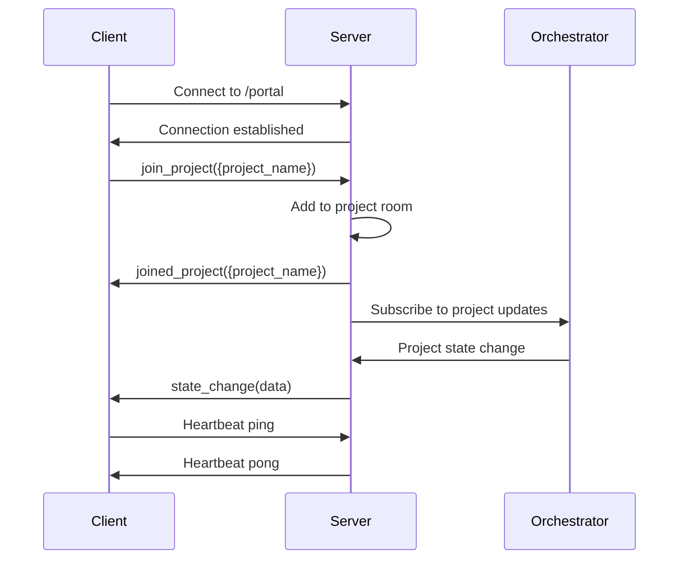

# WebSocket API Specification

## Overview

The WebSocket API provides real-time bidirectional communication between the web portal and the orchestrator system. It uses Socket.io for enhanced reliability, automatic reconnection, and namespace-based organization.

## Connection Architecture

### Base URL and Transports
```
Base URL: ws://localhost:8000/socket.io/
Transports: websocket, polling (fallback)
Heartbeat Interval: 25 seconds
Heartbeat Timeout: 60 seconds
```

### Namespace Organization

The WebSocket server uses Socket.io namespaces to organize different types of real-time communication:

```
/portal             - Main application events
/project/{name}     - Project-specific events  
/chat/{name}        - Chat message events
/monitoring         - System monitoring events
/admin              - Administrative events
```

### Connection Lifecycle



## Event Specifications

### 1. Portal Namespace (`/portal`)

#### Client to Server Events

**join_project**
```typescript
interface JoinProjectRequest {
  project_name: string;
  user_id?: string;
}

// Usage
socket.emit('join_project', {
  project_name: 'my-project',
  user_id: 'user123'
});
```

**leave_project**
```typescript
interface LeaveProjectRequest {
  project_name: string;
}

socket.emit('leave_project', {
  project_name: 'my-project'
});
```

**subscribe_to_events**
```typescript
interface SubscribeRequest {
  events: string[];
  project_name?: string;
}

socket.emit('subscribe_to_events', {
  events: ['state_change', 'task_update', 'agent_activity'],
  project_name: 'my-project'
});
```

#### Server to Client Events

**joined_project**
```typescript
interface JoinedProjectResponse {
  project_name: string;
  current_state: WorkflowState;
  active_users: number;
  last_activity: Date;
}

socket.on('joined_project', (data: JoinedProjectResponse) => {
  // Handle successful project join
});
```

**user_joined**
```typescript
interface UserJoinedEvent {
  user_id: string;
  project_name: string;
  timestamp: Date;
}

socket.on('user_joined', (data: UserJoinedEvent) => {
  // Handle another user joining project
});
```

**user_left**
```typescript
interface UserLeftEvent {
  user_id: string;
  project_name: string;
  timestamp: Date;
}

socket.on('user_left', (data: UserLeftEvent) => {
  // Handle user leaving project
});
```

### 2. Project Namespace (`/project/{name}`)

#### State Management Events

**state_change**
```typescript
interface StateChangeEvent {
  project_name: string;
  old_state: WorkflowState;
  new_state: WorkflowState;
  timestamp: Date;
  triggered_by: string;
  command?: string;
  reason?: string;
}

socket.on('state_change', (data: StateChangeEvent) => {
  // Update UI to reflect new state
  updateProjectState(data.project_name, data.new_state);
});
```

**task_update**
```typescript
interface TaskUpdateEvent {
  project_name: string;
  task_id: string;
  task_type: string;
  status: TaskStatus;
  progress: number;
  agent_type: string;
  started_at?: Date;
  completed_at?: Date;
  error?: string;
  metadata?: Record<string, any>;
}

socket.on('task_update', (data: TaskUpdateEvent) => {
  // Update task progress in UI
  updateTaskProgress(data.task_id, data.progress, data.status);
});
```

**approval_request**
```typescript
interface ApprovalRequestEvent {
  project_name: string;
  request_id: string;
  task: Task;
  reason: string;
  created_at: Date;
  retry_count: number;
  timeout_at: Date;
}

socket.on('approval_request', (data: ApprovalRequestEvent) => {
  // Show approval request in UI
  showApprovalDialog(data);
});
```

**approval_resolved**
```typescript
interface ApprovalResolvedEvent {
  project_name: string;
  request_id: string;
  approved: boolean;
  resolved_by: string;
  resolved_at: Date;
  comment?: string;
}

socket.on('approval_resolved', (data: ApprovalResolvedEvent) => {
  // Hide approval dialog and continue workflow
  hideApprovalDialog(data.request_id);
});
```

#### Sprint and Backlog Events

**sprint_progress**
```typescript
interface SprintProgressEvent {
  project_name: string;
  sprint_id: string;
  total_stories: number;
  completed_stories: number;
  failed_stories: number;
  in_progress_stories: number;
  estimated_completion: Date;
  velocity: number;
}

socket.on('sprint_progress', (data: SprintProgressEvent) => {
  // Update sprint progress visualization
  updateSprintProgress(data);
});
```

**backlog_updated**
```typescript
interface BacklogUpdatedEvent {
  project_name: string;
  change_type: 'added' | 'removed' | 'updated' | 'reordered';
  story_id: string;
  story?: Story;
  old_position?: number;
  new_position?: number;
}

socket.on('backlog_updated', (data: BacklogUpdatedEvent) => {
  // Update backlog display
  updateBacklogItem(data);
});
```

### 3. Chat Namespace (`/chat/{name}`)

#### Message Events

**send_message**
```typescript
interface SendMessageRequest {
  content: string;
  type: 'command' | 'message' | 'thread_reply';
  thread_id?: string;
  attachments?: FileAttachment[];
}

socket.emit('send_message', {
  content: '/sprint start',
  type: 'command'
});
```

**message_received**
```typescript
interface MessageReceivedEvent {
  message_id: string;
  project_name: string;
  user_id: string;
  content: string;
  type: 'command' | 'response' | 'system' | 'thread';
  timestamp: Date;
  thread_id?: string;
  attachments?: FileAttachment[];
  reactions?: Reaction[];
}

socket.on('message_received', (data: MessageReceivedEvent) => {
  // Add message to chat interface
  addMessageToChat(data);
});
```

**command_result**
```typescript
interface CommandResultEvent {
  message_id: string;
  command: string;
  success: boolean;
  result?: any;
  error?: string;
  execution_time: number;
  timestamp: Date;
  embed_data?: EmbedData;
}

socket.on('command_result', (data: CommandResultEvent) => {
  // Display command result in chat
  displayCommandResult(data);
});
```

**typing_start** / **typing_stop**
```typescript
interface TypingEvent {
  user_id: string;
  project_name: string;
  timestamp: Date;
}

socket.on('typing_start', (data: TypingEvent) => {
  showTypingIndicator(data.user_id);
});

socket.on('typing_stop', (data: TypingEvent) => {
  hideTypingIndicator(data.user_id);
});
```

#### Thread Management Events

**thread_created**
```typescript
interface ThreadCreatedEvent {
  thread_id: string;
  parent_message_id: string;
  project_name: string;
  created_by: string;
  timestamp: Date;
}

socket.on('thread_created', (data: ThreadCreatedEvent) => {
  // Enable thread view for message
  enableThreadView(data.parent_message_id, data.thread_id);
});
```

**thread_updated**
```typescript
interface ThreadUpdatedEvent {
  thread_id: string;
  message_count: number;
  last_message_at: Date;
  participants: string[];
}

socket.on('thread_updated', (data: ThreadUpdatedEvent) => {
  // Update thread metadata
  updateThreadInfo(data);
});
```

### 4. Monitoring Namespace (`/monitoring`)

#### Agent Activity Events

**agent_activity**
```typescript
interface AgentActivityEvent {
  agent_type: string;
  project_name: string;
  action: string;
  status: 'started' | 'completed' | 'failed' | 'paused';
  task_id?: string;
  story_id?: string;
  timestamp: Date;
  duration?: number;
  metrics?: AgentMetrics;
  error?: string;
}

socket.on('agent_activity', (data: AgentActivityEvent) => {
  // Update agent activity dashboard
  updateAgentActivity(data);
});
```

**system_metrics**
```typescript
interface SystemMetricsEvent {
  timestamp: Date;
  cpu_usage: number;
  memory_usage: number;
  disk_usage: number;
  network_io: {
    bytes_sent: number;
    bytes_received: number;
  };
  active_connections: number;
  active_projects: number;
  active_tasks: number;
  error_rate: number;
  uptime: number;
}

socket.on('system_metrics', (data: SystemMetricsEvent) => {
  // Update system metrics dashboard
  updateSystemMetrics(data);
});
```

#### TDD Monitoring Events

**tdd_cycle_started**
```typescript
interface TDDCycleStartedEvent {
  project_name: string;
  cycle_id: string;
  story_id: string;
  started_by: string;
  estimated_duration: number;
  timestamp: Date;
}

socket.on('tdd_cycle_started', (data: TDDCycleStartedEvent) => {
  // Show TDD cycle in monitoring dashboard
  startTDDCycleMonitoring(data);
});
```

**tdd_state_change**
```typescript
interface TDDStateChangeEvent {
  project_name: string;
  cycle_id: string;
  old_state: TDDState;
  new_state: TDDState;
  timestamp: Date;
  phase_duration?: number;
  test_results?: TestResult[];
  code_metrics?: CodeMetrics;
}

socket.on('tdd_state_change', (data: TDDStateChangeEvent) => {
  // Update TDD cycle progress
  updateTDDCycleState(data);
});
```

**test_output**
```typescript
interface TestOutputEvent {
  project_name: string;
  cycle_id: string;
  output_type: 'stdout' | 'stderr' | 'test_result';
  content: string;
  timestamp: Date;
  sequence_number: number;
}

socket.on('test_output', (data: TestOutputEvent) => {
  // Stream test output to UI
  appendTestOutput(data);
});
```

### 5. Admin Namespace (`/admin`)

#### Configuration Events

**config_changed**
```typescript
interface ConfigChangedEvent {
  config_type: 'agent' | 'system' | 'security' | 'user';
  changed_by: string;
  changes: Record<string, any>;
  timestamp: Date;
  reason?: string;
}

socket.on('config_changed', (data: ConfigChangedEvent) => {
  // Refresh configuration UI
  refreshConfiguration(data.config_type);
});
```

**user_action**
```typescript
interface UserActionEvent {
  user_id: string;
  action: string;
  resource: string;
  timestamp: Date;
  ip_address?: string;
  user_agent?: string;
  success: boolean;
  error?: string;
}

socket.on('user_action', (data: UserActionEvent) => {
  // Log user action for audit
  logUserAction(data);
});
```

## Client-Side Integration

### Socket.io Client Setup

```typescript
import { io, Socket } from 'socket.io-client';

class WebSocketManager {
  private sockets: Map<string, Socket> = new Map();
  private subscriptions: Map<string, Set<(data: any) => void>> = new Map();
  
  connect(namespace: string = '/portal'): Socket {
    if (this.sockets.has(namespace)) {
      return this.sockets.get(namespace)!;
    }
    
    const socket = io(`ws://localhost:8000${namespace}`, {
      transports: ['websocket', 'polling'],
      timeout: 5000,
      reconnection: true,
      reconnectionAttempts: 5,
      reconnectionDelay: 1000,
      reconnectionDelayMax: 5000,
    });
    
    this.setupSocketListeners(socket, namespace);
    this.sockets.set(namespace, socket);
    
    return socket;
  }
  
  private setupSocketListeners(socket: Socket, namespace: string) {
    socket.on('connect', () => {
      console.log(`Connected to ${namespace}`);
      this.notifySubscribers(`${namespace}:connected`, { namespace });
    });
    
    socket.on('disconnect', (reason) => {
      console.log(`Disconnected from ${namespace}:`, reason);
      this.notifySubscribers(`${namespace}:disconnected`, { namespace, reason });
    });
    
    socket.on('error', (error) => {
      console.error(`Socket error on ${namespace}:`, error);
      this.notifySubscribers(`${namespace}:error`, { namespace, error });
    });
    
    // Forward all events to subscribers
    socket.onAny((event, data) => {
      this.notifySubscribers(`${namespace}:${event}`, data);
    });
  }
  
  subscribe(namespace: string, event: string, callback: (data: any) => void): () => void {
    const key = `${namespace}:${event}`;
    
    if (!this.subscriptions.has(key)) {
      this.subscriptions.set(key, new Set());
    }
    
    this.subscriptions.get(key)!.add(callback);
    
    // Ensure connection exists
    this.connect(namespace);
    
    return () => {
      const subscribers = this.subscriptions.get(key);
      if (subscribers) {
        subscribers.delete(callback);
        if (subscribers.size === 0) {
          this.subscriptions.delete(key);
        }
      }
    };
  }
  
  emit(namespace: string, event: string, data: any) {
    const socket = this.connect(namespace);
    socket.emit(event, data);
  }
  
  private notifySubscribers(key: string, data: any) {
    const subscribers = this.subscriptions.get(key);
    if (subscribers) {
      subscribers.forEach(callback => callback(data));
    }
  }
  
  disconnect(namespace?: string) {
    if (namespace) {
      const socket = this.sockets.get(namespace);
      if (socket) {
        socket.disconnect();
        this.sockets.delete(namespace);
      }
    } else {
      // Disconnect all
      this.sockets.forEach(socket => socket.disconnect());
      this.sockets.clear();
    }
  }
}

export const wsManager = new WebSocketManager();
```

### React Hook Integration

```typescript
export const useWebSocketEvent = <T>(
  namespace: string,
  event: string,
  callback: (data: T) => void,
  dependencies: any[] = []
) => {
  useEffect(() => {
    const unsubscribe = wsManager.subscribe(namespace, event, callback);
    return unsubscribe;
  }, [namespace, event, ...dependencies]);
};

export const useProjectWebSocket = (projectName: string) => {
  const [connected, setConnected] = useState(false);
  const [error, setError] = useState<string | null>(null);
  
  const namespace = `/project/${projectName}`;
  
  useWebSocketEvent(namespace, 'connected', () => setConnected(true));
  useWebSocketEvent(namespace, 'disconnected', () => setConnected(false));
  useWebSocketEvent(namespace, 'error', (error) => setError(error.message));
  
  const joinProject = useCallback(() => {
    wsManager.emit(namespace, 'join_project', { project_name: projectName });
  }, [namespace, projectName]);
  
  const leaveProject = useCallback(() => {
    wsManager.emit(namespace, 'leave_project', { project_name: projectName });
  }, [namespace, projectName]);
  
  useEffect(() => {
    joinProject();
    return () => leaveProject();
  }, [joinProject, leaveProject]);
  
  return {
    connected,
    error,
    emit: (event: string, data: any) => wsManager.emit(namespace, event, data),
  };
};
```

## Error Handling and Reconnection

### Error Types and Handling

```typescript
interface WebSocketError {
  type: 'connection' | 'authentication' | 'validation' | 'server' | 'network';
  message: string;
  code?: string;
  details?: any;
  timestamp: Date;
}

class WebSocketErrorHandler {
  static handle(error: WebSocketError, namespace: string) {
    switch (error.type) {
      case 'connection':
        this.handleConnectionError(error, namespace);
        break;
      case 'authentication':
        this.handleAuthError(error, namespace);
        break;
      case 'validation':
        this.handleValidationError(error, namespace);
        break;
      case 'server':
        this.handleServerError(error, namespace);
        break;
      case 'network':
        this.handleNetworkError(error, namespace);
        break;
    }
  }
  
  private static handleConnectionError(error: WebSocketError, namespace: string) {
    // Show connection status indicator
    // Attempt automatic reconnection
    console.warn(`Connection error on ${namespace}:`, error.message);
  }
  
  private static handleAuthError(error: WebSocketError, namespace: string) {
    // Redirect to login or show auth modal
    console.error(`Authentication error on ${namespace}:`, error.message);
  }
  
  private static handleValidationError(error: WebSocketError, namespace: string) {
    // Show validation error to user
    console.error(`Validation error on ${namespace}:`, error.message);
  }
  
  private static handleServerError(error: WebSocketError, namespace: string) {
    // Show server error notification
    console.error(`Server error on ${namespace}:`, error.message);
  }
  
  private static handleNetworkError(error: WebSocketError, namespace: string) {
    // Show network connectivity indicator
    console.warn(`Network error on ${namespace}:`, error.message);
  }
}
```

### Reconnection Strategy

```typescript
interface ReconnectionConfig {
  maxAttempts: number;
  baseDelay: number;
  maxDelay: number;
  backoffFactor: number;
  jitter: boolean;
}

class ReconnectionManager {
  private config: ReconnectionConfig = {
    maxAttempts: 5,
    baseDelay: 1000,
    maxDelay: 30000,
    backoffFactor: 2,
    jitter: true,
  };
  
  private attemptCounts: Map<string, number> = new Map();
  
  calculateDelay(namespace: string): number {
    const attempts = this.attemptCounts.get(namespace) || 0;
    let delay = Math.min(
      this.config.baseDelay * Math.pow(this.config.backoffFactor, attempts),
      this.config.maxDelay
    );
    
    if (this.config.jitter) {
      delay = delay * (0.5 + Math.random() * 0.5);
    }
    
    return delay;
  }
  
  shouldReconnect(namespace: string): boolean {
    const attempts = this.attemptCounts.get(namespace) || 0;
    return attempts < this.config.maxAttempts;
  }
  
  recordAttempt(namespace: string) {
    const current = this.attemptCounts.get(namespace) || 0;
    this.attemptCounts.set(namespace, current + 1);
  }
  
  resetAttempts(namespace: string) {
    this.attemptCounts.delete(namespace);
  }
}
```

## Security Considerations

### Authentication and Authorization

```typescript
interface WebSocketAuth {
  token: string;
  user_id: string;
  permissions: string[];
  project_access: string[];
}

// Client-side authentication
socket.on('connect', () => {
  socket.emit('authenticate', {
    token: getAuthToken(),
    user_id: getCurrentUserId(),
  });
});

socket.on('authenticated', (data: { user_id: string; permissions: string[] }) => {
  // Authentication successful
  console.log('WebSocket authenticated:', data);
});

socket.on('authentication_failed', (error: { message: string; code: string }) => {
  // Handle authentication failure
  console.error('WebSocket authentication failed:', error);
  // Redirect to login or show error
});
```

### Rate Limiting and Abuse Prevention

```typescript
interface RateLimitConfig {
  maxEventsPerSecond: number;
  maxEventsPerMinute: number;
  maxConcurrentConnections: number;
  banDuration: number;
}

// Server-side rate limiting (pseudo-code)
const rateLimiter = new RateLimiter({
  maxEventsPerSecond: 10,
  maxEventsPerMinute: 100,
  maxConcurrentConnections: 5,
  banDuration: 300000, // 5 minutes
});

socket.on('*', (event, data) => {
  if (!rateLimiter.allow(socket.id, event)) {
    socket.emit('rate_limited', {
      message: 'Rate limit exceeded',
      retry_after: rateLimiter.getRetryAfter(socket.id),
    });
    return;
  }
  
  // Process event normally
});
```

### Input Validation and Sanitization

```typescript
import Joi from 'joi';

const messageSchema = Joi.object({
  content: Joi.string().max(2000).required(),
  type: Joi.string().valid('command', 'message', 'thread_reply').required(),
  thread_id: Joi.string().uuid().optional(),
  attachments: Joi.array().items(Joi.object({
    name: Joi.string().required(),
    size: Joi.number().max(10485760).required(), // 10MB max
    type: Joi.string().required(),
  })).max(5).optional(),
});

socket.on('send_message', (data) => {
  const { error, value } = messageSchema.validate(data);
  if (error) {
    socket.emit('validation_error', {
      message: 'Invalid message format',
      details: error.details,
    });
    return;
  }
  
  // Process validated message
  processMessage(value);
});
```

This comprehensive WebSocket API specification provides the foundation for real-time communication in the web portal, ensuring reliable, secure, and efficient data exchange between the client and server components.