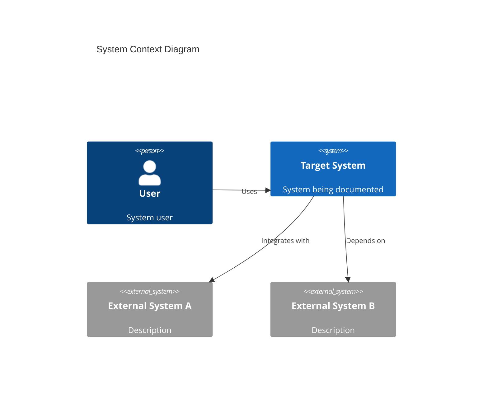
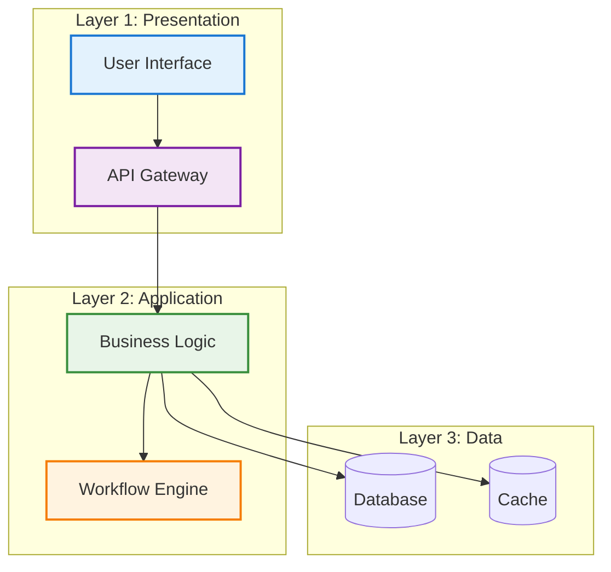
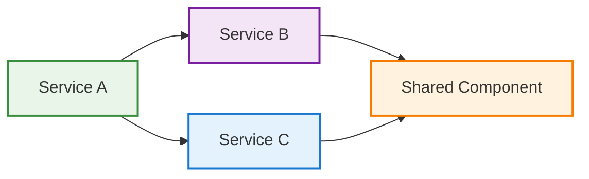
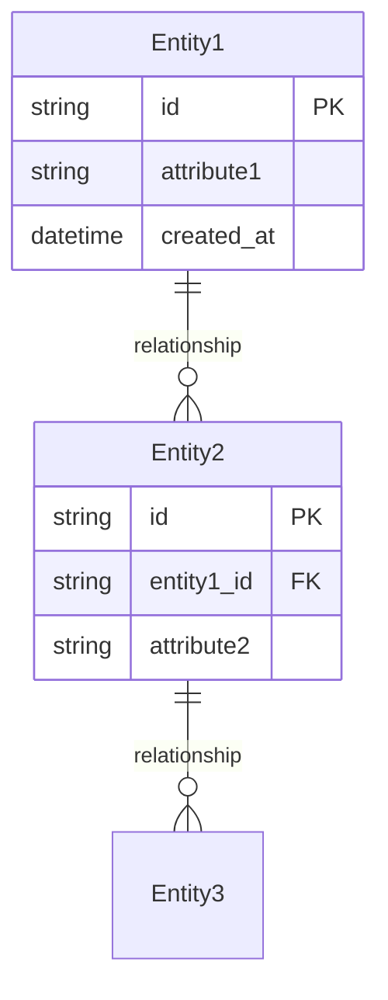
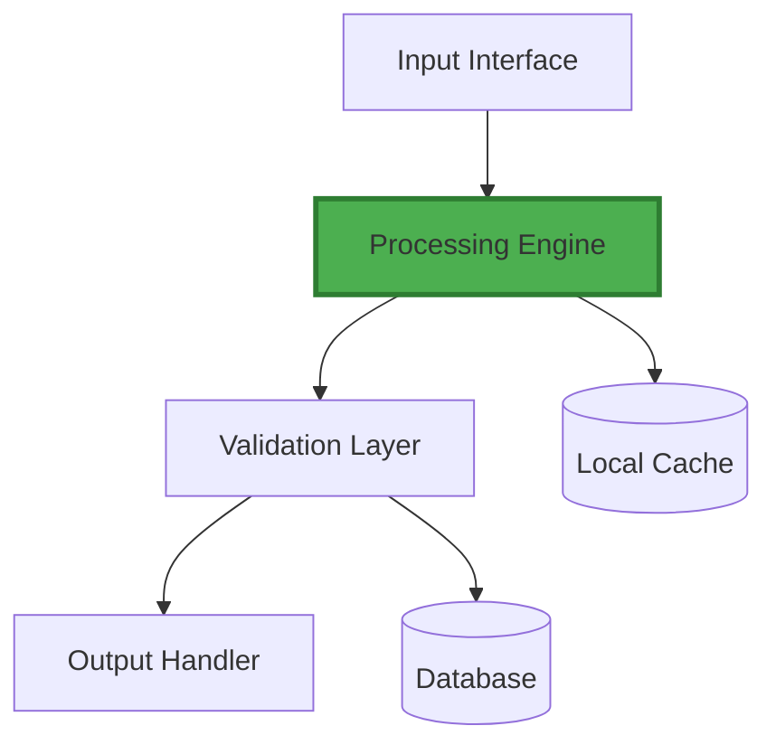
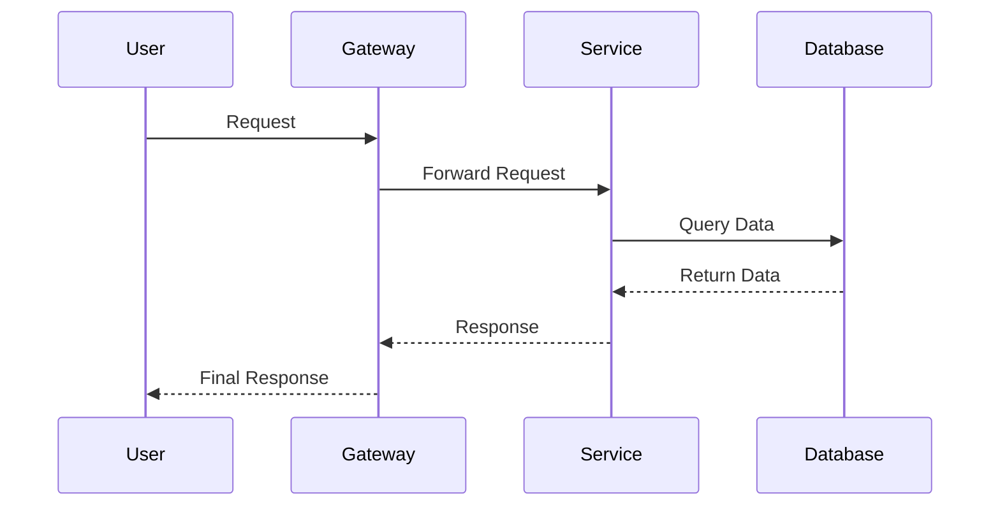
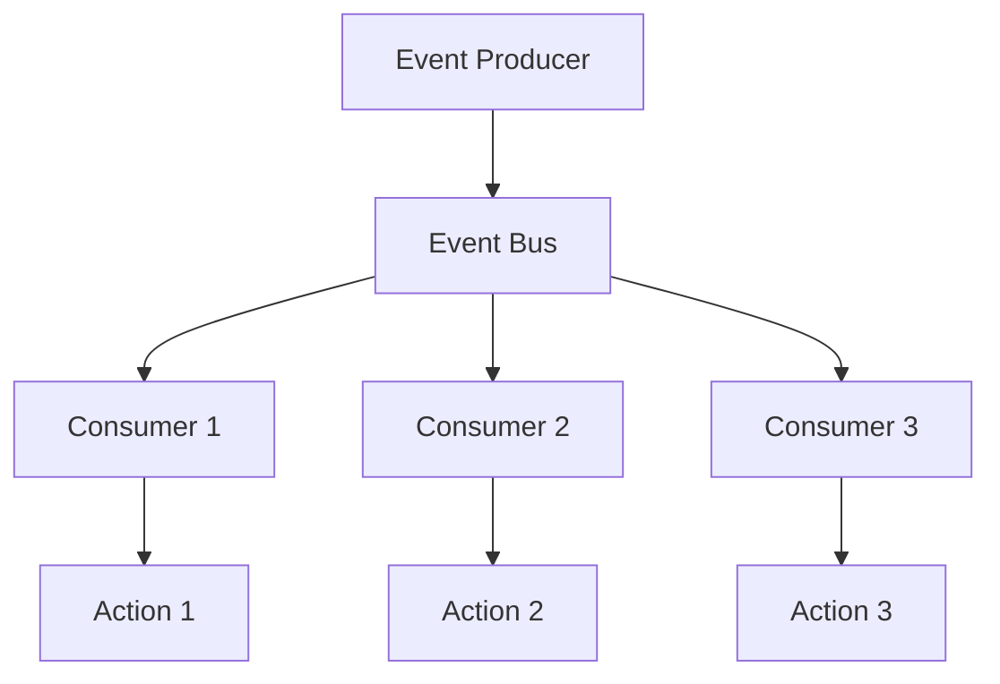
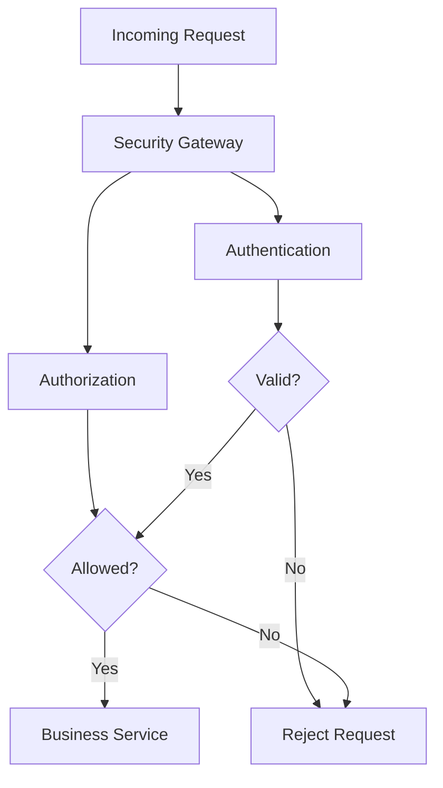
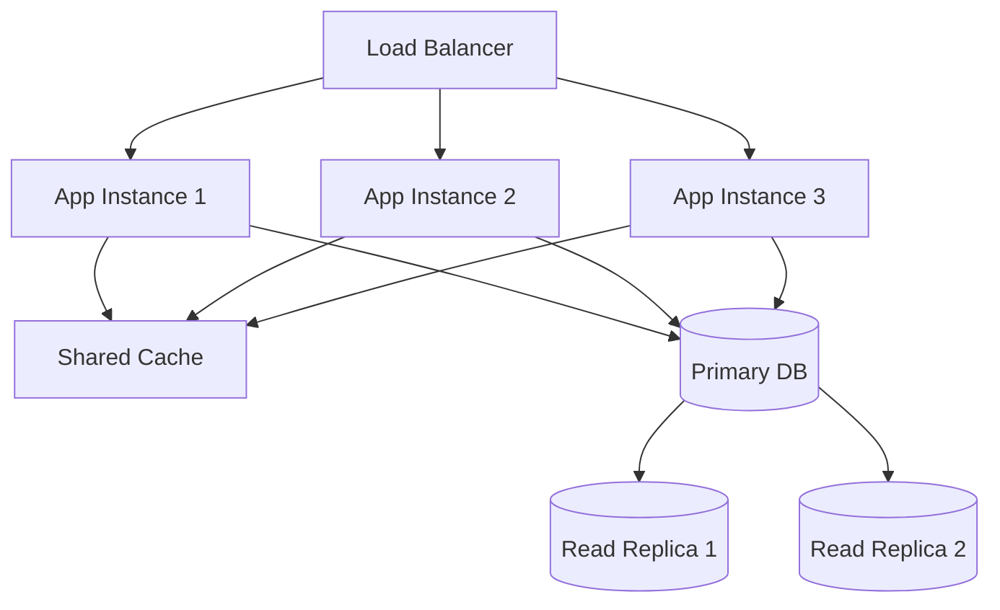
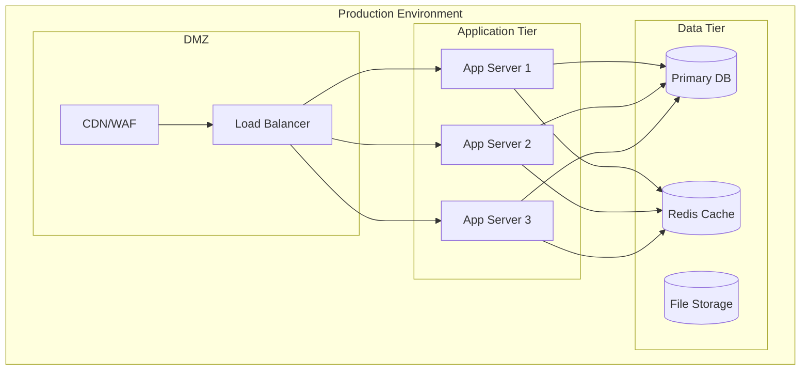

# Architecture Documentation Template

Use this template for documenting system architecture, technical design, and implementation details.

## Page Structure

```markdown
# 🏗️ Architecture Title

Brief description of the architectural component, system, or design being documented.

## Executive Summary

### Purpose
High-level explanation of what this architecture accomplishes and why it was designed this way.

### Key Design Decisions
- **Decision 1**: Rationale and trade-offs considered
- **Decision 2**: Benefits and constraints  
- **Decision 3**: Alternative approaches evaluated

### Architecture Principles
- **Principle 1**: Core design philosophy (e.g., modularity, scalability)
- **Principle 2**: Operational philosophy (e.g., reliability, maintainability)
- **Principle 3**: Technical philosophy (e.g., performance, security)

## System Overview

### Context Diagram


### High-Level Architecture


## Architecture Layers

### 🎨 Presentation Layer
**Purpose:** User interface and external API management

**Components:**
- **Component A**: Responsibility and implementation details
- **Component B**: Role in the overall system
- **Component C**: Integration points and protocols

**Technologies:**
- Framework/Library 1: Why chosen and how used
- Framework/Library 2: Benefits and considerations

**Design Patterns:**
- Pattern 1: Implementation and benefits
- Pattern 2: Use cases and examples

### 🔧 Application Layer  
**Purpose:** Core business logic and workflow orchestration

**Components:**


**Service Responsibilities:**
- **Service A**: Specific domain logic and operations
- **Service B**: Cross-cutting concerns and utilities
- **Service C**: Integration and coordination logic

### 💾 Data Layer
**Purpose:** Data persistence, caching, and management

**Data Architecture:**


**Storage Strategy:**
- **Primary Database**: Technology choice and rationale
- **Caching Layer**: Strategy and implementation
- **File Storage**: Approach for large files or media

## Component Deep Dive

### 🎯 Critical Component 1

#### Responsibilities
- Primary function and business value
- Secondary capabilities and features
- Integration responsibilities

#### Architecture


#### Implementation Details
- **Design Patterns**: Which patterns and why
- **Technologies**: Stack choices and reasoning
- **Dependencies**: External libraries and services

#### Configuration
```yaml
component:
  name: "component-1"
  settings:
    performance:
      cache_size: "100MB"
      timeout: "30s"
    security:
      encryption: true
      auth_required: true
```

#### API Interface
```typescript
interface ComponentAPI {
  process(input: InputType): Promise<OutputType>;
  configure(settings: ConfigType): boolean;
  getStatus(): StatusType;
}
```

### 🔄 Critical Component 2
[Repeat structure for other key components]

## Data Flow and Communication

### Request Processing Flow


### Event-Driven Architecture


### Communication Patterns
- **Synchronous**: When and why to use sync communication
- **Asynchronous**: Event-driven patterns and messaging
- **Hybrid**: Mixed approaches for different scenarios

## Security Architecture

### 🔒 Security Layers

#### Authentication & Authorization
- **Identity Management**: User authentication strategy
- **Access Control**: Permission model and implementation
- **Token Management**: JWT, sessions, or API keys

#### Data Protection
- **Encryption**: At rest and in transit
- **Privacy**: PII handling and compliance
- **Audit**: Logging and monitoring requirements

#### Network Security
- **Perimeter Defense**: Firewalls and network controls
- **Internal Security**: Service-to-service authentication
- **Monitoring**: Intrusion detection and response

### Security Patterns


## Performance and Scalability

### 📊 Performance Characteristics

#### Throughput Targets
- **Peak Load**: Maximum requests per second
- **Normal Load**: Typical operational requirements
- **Growth Projections**: Scaling timeline and requirements

#### Latency Requirements
- **User-Facing**: Response time expectations
- **Internal Services**: Service-to-service latency
- **Batch Processing**: Acceptable processing windows

### Scalability Strategy


### Performance Optimizations
- **Caching Strategy**: Multi-level caching approach
- **Database Optimization**: Indexing and query optimization
- **Resource Management**: CPU, memory, and I/O optimization

## Deployment Architecture

### 🚀 Environment Strategy

#### Development
- Local development setup and tooling
- Development database and services
- Testing and debugging capabilities

#### Staging
- Production-like environment configuration
- Integration testing and validation
- Performance testing setup

#### Production
- High-availability configuration
- Disaster recovery planning
- Monitoring and alerting setup

### Infrastructure Diagram


## Quality Attributes

### 🎯 Non-Functional Requirements

#### Reliability
- **Availability Target**: 99.9% uptime requirement
- **MTTR**: Mean time to recovery expectations
- **Backup Strategy**: Data backup and restoration procedures

#### Maintainability
- **Code Quality**: Standards and review processes
- **Documentation**: Technical documentation requirements
- **Testing**: Automated testing strategy and coverage

#### Observability
- **Logging**: Structured logging approach
- **Metrics**: Key performance indicators and monitoring
- **Tracing**: Distributed tracing for request flows

### Quality Metrics
| Attribute | Target | Measurement | Current |
|-----------|--------|-------------|---------|
| Availability | 99.9% | Uptime monitoring | 99.8% |
| Response Time | <200ms | Application metrics | 150ms |
| Throughput | 1000 RPS | Load testing | 800 RPS |

## Implementation Guidelines

### 🛠️ Development Standards

#### Code Organization
```
project/
├── src/
│   ├── components/     # Reusable components
│   ├── services/       # Business logic
│   ├── models/         # Data models
│   └── utils/          # Utility functions
├── tests/
│   ├── unit/           # Unit tests
│   ├── integration/    # Integration tests
│   └── e2e/            # End-to-end tests
└── docs/
    ├── api/            # API documentation
    └── architecture/   # Architecture docs
```

#### Design Patterns
- **Pattern 1**: When and how to implement
- **Pattern 2**: Benefits and trade-offs
- **Pattern 3**: Examples and best practices

#### Technology Choices
- **Primary Stack**: Core technologies and versions
- **Dependencies**: Third-party libraries and rationale
- **Tools**: Development and deployment tooling

## Migration and Evolution

### 🔄 Migration Strategy

#### Current State Analysis
- Existing system assessment
- Technical debt identification
- Performance baseline establishment

#### Target State Planning
- Architecture roadmap and timeline
- Migration phases and milestones
- Risk assessment and mitigation

#### Implementation Approach
- **Phase 1**: Foundation and core services
- **Phase 2**: Feature migration and testing
- **Phase 3**: Cutover and optimization

### Evolution Considerations
- **Versioning Strategy**: API and service versioning
- **Backward Compatibility**: Supporting legacy clients
- **Feature Flags**: Gradual feature rollout approach

## Risk Assessment

### 🚨 Technical Risks

| Risk | Impact | Probability | Mitigation |
|------|--------|-------------|------------|
| Risk 1 | High | Low | Mitigation strategy |
| Risk 2 | Medium | Medium | Prevention approach |
| Risk 3 | Low | High | Monitoring and response |

### Risk Mitigation Strategies
- **Monitoring**: Early warning systems and alerting
- **Redundancy**: Backup systems and failover procedures
- **Testing**: Comprehensive testing and validation
- **Documentation**: Runbooks and incident response procedures

## Decision Records

### 🗳️ Architecture Decision Records (ADRs)

#### ADR-001: Technology Stack Selection
**Date:** YYYY-MM-DD  
**Status:** Accepted  
**Context:** Decision context and requirements  
**Decision:** Chosen approach and reasoning  
**Consequences:** Expected outcomes and trade-offs  

#### ADR-002: Communication Pattern Choice
**Date:** YYYY-MM-DD  
**Status:** Accepted  
**Context:** Integration requirements and constraints  
**Decision:** Selected communication approach  
**Consequences:** Impact on performance and complexity  

## References and Resources

### 📚 Additional Documentation
- [**System Requirements**](../requirements/functional.md)
- [**API Documentation**](../development/api-reference.md)
- [**Deployment Guide**](../deployment/production.md)
- [**Operations Manual**](../operations/runbook.md)

### External References
- [Technology Documentation](external-link)
- [Industry Best Practices](external-link)
- [Architecture Patterns](external-link)

---

!!! info "Living Document"
    This architecture documentation is a living document that should be updated as the system evolves. Regular reviews and updates ensure accuracy and relevance.
```

## Template Usage Notes

1. **Executive Summary**: Start with high-level overview for different audiences
2. **Visual Architecture**: Use diagrams to communicate complex relationships
3. **Layered Approach**: Organize by architectural layers and concerns
4. **Decision Documentation**: Record architectural decisions and rationale
5. **Quality Attributes**: Address non-functional requirements explicitly
6. **Implementation Guidance**: Provide practical development guidelines
7. **Evolution Planning**: Consider future changes and migration strategies
8. **Risk Assessment**: Identify and mitigate technical risks