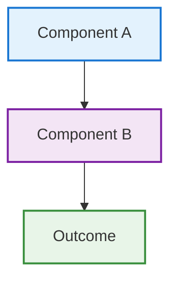

# Feature Overview Template

Use this template for documenting system features and capabilities.

## Page Structure

```markdown
# 🎯 Feature Name

One-sentence value proposition explaining what this feature does and why it matters.

## Overview

Brief 2-3 sentence explanation of the feature's purpose, target users, and primary benefits.

## How It Works

### Architecture Diagram


### Process Flow
1. **Input**: What triggers or initiates the feature
2. **Processing**: What happens internally
3. **Output**: What users see or experience

## Key Benefits

- **Benefit 1**: Specific value with measurable impact
- **Benefit 2**: User experience improvement
- **Benefit 3**: Technical advantage or efficiency gain

## Quick Start

Get up and running in minutes:

```bash
# Step 1: Basic setup
command setup --feature-name

# Step 2: Configuration  
command configure --option value

# Step 3: Verify
command status
```

**Expected Result:**
```
Feature initialized successfully
Status: Active
Configuration: Verified
```

[**→ Detailed Setup Guide**](link-to-detailed-guide.md)

## Core Concepts

### 🔧 Concept 1
Brief explanation of fundamental concept with practical example.

**Example:**
```bash
example command demonstrating concept
```

### 📊 Concept 2
Brief explanation of another key concept.

**Use Case:**
Real-world scenario where this concept applies.

## Configuration Options

| Option | Default | Description | Example |
|--------|---------|-------------|---------|
| `setting1` | `default` | What this controls | `--setting1 value` |
| `setting2` | `auto` | When to adjust this | `--setting2 custom` |

## Advanced Usage

### Integration with Other Features
- **Feature A**: How they work together
- **Feature B**: Synergies and combined benefits

### Customization Options
```yaml
# Configuration example
feature:
  enabled: true
  options:
    level: advanced
    timeout: 30s
```

### Performance Tuning
!!! tip "Performance Optimization"
    For high-volume usage, consider adjusting these settings:
    - Setting 1: Recommended values and impact
    - Setting 2: Trade-offs and considerations

## Real-World Examples

### Example 1: Common Use Case
**Scenario:** Typical user workflow or requirement

**Implementation:**
```bash
# Commands to achieve the scenario
command1 --option value
command2 --flag
```

**Outcome:** What the user accomplishes

### Example 2: Advanced Use Case
**Scenario:** Power user or complex requirement

**Implementation:**
```bash
# More sophisticated command sequence
advanced-command --complex-options
```

**Outcome:** Advanced results or capabilities

## Monitoring and Analytics

### Key Metrics
- Metric 1: What it measures and why it matters
- Metric 2: Performance indicators
- Metric 3: Success criteria

### Monitoring Commands
```bash
# Check feature status
/status feature-name

# View performance metrics
/metrics feature-name

# Detailed diagnostics
/debug feature-name
```

## Troubleshooting

### Common Issues

**Issue: Feature not working as expected**
```
Symptoms: What users experience
Cause: Root cause explanation
Solution: Step-by-step fix
```

**Issue: Performance problems**
```
Symptoms: Slow response or timeouts
Cause: Resource constraints or configuration
Solution: Optimization steps
```

### Diagnostic Commands
```bash
# Check feature health
/health feature-name

# View logs
/logs feature-name --level debug

# Reset to defaults
/reset feature-name
```

## Security Considerations

!!! warning "Security Note"
    Important security considerations and best practices.

- Permission requirements
- Data privacy implications  
- Access control considerations

## Limitations and Known Issues

- Limitation 1: Current constraints and workarounds
- Limitation 2: Known bugs and timeline for fixes
- Limitation 3: Feature boundaries and scope

## Roadmap and Future Enhancements

- **Short-term**: Planned improvements (next release)
- **Medium-term**: Major features (next quarter)  
- **Long-term**: Vision and strategic direction

## Related Features

| Feature | Relationship | Documentation |
|---------|--------------|---------------|
| [Feature A](link) | Dependency/Integration | How they connect |
| [Feature B](link) | Alternative/Complement | When to use each |

## Additional Resources

- [**→ API Reference**](../development/api-reference.md)
- [**→ Configuration Guide**](../getting-started/configuration.md)
- [**→ Best Practices**](../user-guide/best-practices.md)
- [**→ Community Examples**](external-link)

---

!!! tip "Getting Help"
    - Check the [FAQ](../user-guide/faq.md) for common questions
    - Join the discussion in [GitHub Issues](https://github.com/user/repo/issues)
    - Review [troubleshooting guide](../user-guide/troubleshooting.md) for solutions
```

## Template Usage Notes

1. **Value Proposition**: Lead with clear benefit statement
2. **Visual Structure**: Use diagrams to explain complex concepts
3. **Progressive Disclosure**: Start simple, add complexity gradually
4. **Practical Examples**: Always include working code examples
5. **Comprehensive Coverage**: Address configuration, monitoring, troubleshooting
6. **Cross-References**: Link to related documentation
7. **Accessibility**: Use semantic structure and alt text for images