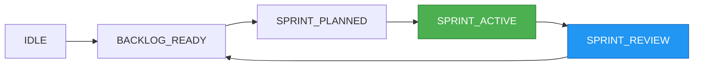

# 💬 Discord-Style Chat Interface - Your AI Command Center

> **Complete guide to the Discord-inspired web interface for real-time AI agent interaction, command execution, and workflow management**

Welcome to the **Chat Interface** - the heart of your AI-powered development environment. Inspired by Discord's intuitive design but supercharged for software development workflows, this interface provides seamless real-time communication with AI agents while maintaining the familiar feel of modern chat applications.

!!! tip "Quick Launch"
    ```bash
    # Launch the chat interface instantly
    agent-orch ui --chat-focus
    
    # Start with pre-configured channel for current project
    agent-orch ui --project-channel
    ```

## 🎯 Chat Interface Overview

### Modern Discord-Style Design

The chat interface brings the best of Discord's user experience to AI development:

```
┌─────────────────────────────────────────────────────────────────┐
│ 🎯 Agent Workflow - Chat Interface                [⚙️][🔔][👤] │
├─────────────────────────────────────────────────────────────────┤
│ │ 🏠 Dashboard      │                                         │ │
│ │ 💬 Chat           │ #current-project                        │ │
│ │ 📋 Projects       │ ─────────────────────────────────────── │ │
│ │ 🤖 Agents         │                                         │ │
│ │ 📊 Monitor        │ 👤 You               [2:30 PM]         │ │
│ │                   │ /epic "Add user authentication"        │ │
│ │ 🏷️ CHANNELS       │                                         │ │
│ │ # main-project    │ 🤖 System                               │ │
│ │ # api-backend     │ ┌─ Epic Analysis Complete ────────────┐ │ │
│ │ # frontend        │ │ ✨ Generated 4 user stories         │ │ │
│ │ # testing         │ │ 🎯 Estimated: 2-3 sprints           │ │ │
│ │                   │ │ 🔧 Tech: React, Node.js, JWT        │ │ │
│ │ 🤖 AGENTS         │ │ [✅ Approve] [✏️ Edit] [🔄 Regen]    │ │ │
│ │ 🟢 CodeAgent      │ └──────────────────────────────────────┘ │ │
│ │ 🟢 DesignAgent    │                                         │ │
│ │ 🟡 QAAgent        │ ┌─────────────────────────────────────┐ │ │
│ │ 🔴 DataAgent      │ │ 💬 Type your command...             │ │ │
│ │                   │ │ /help for assistance                 │ │ │
│ └───────────────────┴─┘ └─────────────────────────────────────┘ │ │
└─────────────────────────────────────────────────────────────────┘
```

### Real-Time Communication Features

- **🔥 Instant Messaging**: Sub-100ms message delivery with WebSocket technology
- **📱 Responsive Design**: Perfect experience on desktop, tablet, and mobile
- **🎨 Rich Formatting**: Markdown support, syntax highlighting, and interactive elements
- **🔔 Smart Notifications**: Contextual alerts with sound and visual indicators
- **🧠 Command Intelligence**: Smart auto-complete and contextual suggestions

## 🚀 Getting Started - 5-Minute Setup

### First Launch Experience

1. **Start the Interface**:
   ```bash
   agent-orch ui --chat-focus --welcome-tour
   ```

2. **Join Your Project Channel**: Automatically connected to `#main-project` or create new channels for your repositories

3. **Meet Your AI Team**: See all available agents in the sidebar with real-time status indicators

4. **Send Your First Command**: Type `/help` to explore available commands with guided assistance

### Interface Tour - Key Areas

**Left Sidebar - Navigation & Agents**:
- **🏠 Dashboard**: Quick access to project overview
- **💬 Chat**: Current active channel (you are here!)
- **🏷️ Channels**: Project-specific chat rooms
- **🤖 Agents**: AI agent status and direct messaging

**Main Chat Area**:
- **Message Stream**: Chronological conversation with agents
- **Rich Interactions**: Buttons, dropdowns, and interactive elements
- **File Sharing**: Drag-and-drop for code snippets and images

**Input Area**:
- **Command Interface**: Start with `/` for commands or type naturally
- **Smart Suggestions**: Real-time auto-complete and context hints
- **Multi-line Support**: `Shift + Enter` for code blocks and detailed messages

## 💬 Chat Commands Reference

### Essential Commands

=== "Project Management"

    **Epic Creation**
    ```
    /epic "Create user authentication system"
    ```
    Define high-level initiatives with automatic story generation.

    **Sprint Management**
    ```
    /sprint start
    /sprint status
    /sprint pause
    ```
    Control sprint lifecycle with real-time updates.

    **Task Approval**
    ```
    /approve AUTH-1 AUTH-2
    /approve all
    ```
    Approve generated stories and agent proposals.

=== "Agent Interaction"

    **Direct Agent Communication**
    ```
    @CodeAgent implement user login form
    @DesignAgent review architecture for auth system
    @QAAgent create test cases for authentication
    ```
    Mention agents directly for specific tasks.

    **Agent Status**
    ```
    /agents status
    /agents performance
    ```
    Monitor agent workload and performance metrics.

=== "Workflow Control"

    **State Management**
    ```
    /state
    /state diagram
    /state history
    ```
    Inspect and visualize current workflow state.

    **Context Commands**
    ```
    /context refresh
    /context summary
    /context files
    ```
    Manage and inspect current project context.

=== "Quick Actions"

    **Help & Discovery**
    ```
    /help
    /help commands
    /help <command>
    ```
    Get contextual help and command documentation.

    **System Control**
    ```
    /status
    /logs
    /performance
    ```
    System diagnostics and monitoring.

### Command Auto-Complete & Intelligence

The chat interface provides intelligent command completion:

```
┌─ Command Suggestions ──────────────────────────────────────────┐
│ /sprint                                                        │
│ ├─ /sprint start     Start a new sprint                       │
│ ├─ /sprint status    View current sprint progress             │
│ ├─ /sprint pause     Pause current sprint                     │
│ ├─ /sprint resume    Resume paused sprint                     │
│ └─ /sprint complete  Complete current sprint                  │
│                                                                │
│ 💡 Based on current state: SPRINT_PLANNED                     │
│ 🎯 Suggested: /sprint start                                   │
└────────────────────────────────────────────────────────────────┘
```

**Smart Features**:
- **Context-Aware**: Suggestions based on current workflow state
- **Parameter Help**: Inline documentation for command parameters
- **Error Prevention**: Validation before command execution
- **Quick Fill**: One-click parameter completion

## 🎨 Rich Message Experience

### Interactive Message Elements

Messages aren't just text - they're interactive experiences:

**Agent Responses with Actions**:
```
🤖 CodeAgent                                        [3:45 PM]
✅ Successfully implemented user authentication

📋 Changes Made:
• Created UserAuth.js component
• Added JWT token handling  
• Implemented login/logout flow
• Updated routing with auth guards

🧪 Test Results: 15/15 passing ✅
📊 Code Coverage: 94% (+3%)

[🔍 View Changes] [📝 Review Code] [🚀 Deploy] [❌ Rollback]
```

**Epic/Story Planning Interface**:
```
🤖 System                                          [2:15 PM]
┌─ Epic Breakdown: "User Authentication System" ─────────────┐
│                                                             │
│ 📋 Generated Stories (4):                                   │
│ ┌─────────────────────────────────────────────────────────┐ │
│ │ ✅ Story 1: Login form UI component           [3 pts]   │ │
│ │ ⏳ Story 2: JWT token management              [5 pts]   │ │
│ │ ⏳ Story 3: User session persistence          [2 pts]   │ │
│ │ ⏳ Story 4: Logout and security cleanup       [1 pt]    │ │
│ └─────────────────────────────────────────────────────────┘ │
│                                                             │
│ 🎯 Total Effort: 11 story points                           │
│ ⏱️ Estimated Duration: 1.5 sprints                         │
│ 🏗️ Dependencies: None identified                           │
│                                                             │
│ [✅ Approve All Stories] [✏️ Edit Stories] [🔄 Regenerate] │
└─────────────────────────────────────────────────────────────┘
```

### File and Code Sharing

**Drag-and-Drop Support**:
- Drop code files directly into chat for review
- Paste screenshots for visual discussions
- Share configuration files with syntax highlighting

**Code Block Enhancements**:
```python
# Syntax highlighting with line numbers
def authenticate_user(username, password):
    """Authenticate user with JWT token generation."""
    user = User.find_by_username(username)
    if user and user.verify_password(password):
        token = generate_jwt_token(user.id)
        return {'token': token, 'user': user.to_dict()}
    return None

# [🚀 Run Code] [📋 Copy] [💾 Save to Project] [🔍 Analyze]
```

## 🔔 Notifications & Alerts

### Smart Notification System

The chat interface provides contextual notifications without overwhelming you:

**Notification Types**:
- **🚨 Critical**: Failed builds, security issues, blocked workflows
- **⚡ Important**: Completed tasks, approval requests, state changes
- **💡 Info**: Performance updates, suggestions, background completions
- **🎉 Success**: Deployments, milestone completions, test passes

**Notification Settings**:
```
┌─ Notification Preferences ─────────────────────────────────────┐
│                                                                │
│ 🔊 Sound Alerts                                                │
│ ├─ ✅ Critical events (always)                                │
│ ├─ ✅ Task completions                                         │
│ ├─ ⏸️ Info messages (work hours only)                          │
│ └─ ❌ Background updates                                        │
│                                                                │
│ 📱 Desktop Notifications                                       │
│ ├─ ✅ Agent mentions (@CodeAgent)                              │
│ ├─ ✅ Approval requests                                        │
│ └─ ⏸️ Status updates (minimized)                               │
│                                                                │
│ ⏰ Do Not Disturb                                              │
│ ├─ 🌙 Quiet hours: 10 PM - 8 AM                              │
│ ├─ 📅 Weekend mode: Reduced notifications                      │
│ └─ 🎯 Focus mode: Critical only                               │
│                                                                │
│ [Save Preferences] [Test Notifications] [Reset to Defaults]   │
└────────────────────────────────────────────────────────────────┘
```

## 🎹 Keyboard Shortcuts for Power Users

Master these shortcuts to become a chat interface power user:

### Essential Chat Shortcuts

| Shortcut | Action | Description |
|----------|--------|-------------|
| `Ctrl/Cmd + K` | **Quick Command** | Open command palette |
| `Ctrl/Cmd + /` | **Focus Chat** | Jump to message input |
| `Ctrl/Cmd + ↑/↓` | **Navigate Channels** | Switch between channels |
| `Ctrl/Cmd + Shift + K` | **Search Messages** | Global message search |
| `↑/↓` | **Message History** | Navigate sent messages |
| `Tab` | **Auto-Complete** | Complete command/mention |
| `Shift + Enter` | **New Line** | Multi-line without sending |
| `Ctrl/Cmd + Enter` | **Send Message** | Send current message |
| `Esc` | **Cancel** | Cancel current input/modal |

### Advanced Shortcuts

| Shortcut | Action | Description |
|----------|--------|-------------|
| `Ctrl/Cmd + 1-9` | **Quick Channel** | Switch to numbered channel |
| `Ctrl/Cmd + Shift + A` | **Mention All Agents** | @mention all active agents |
| `Ctrl/Cmd + M` | **Mark as Read** | Mark all messages as read |
| `Ctrl/Cmd + D` | **Duplicate Command** | Repeat last command |
| `Ctrl/Cmd + R` | **Refresh Chat** | Reload current channel |
| `Ctrl/Cmd + .` | **Toggle Sidebar** | Show/hide left sidebar |

## 📱 Mobile Experience

### Responsive Design Features

The chat interface adapts perfectly to mobile devices:

**Touch-Optimized Interface**:
- Large tap targets for easy interaction
- Swipe gestures for navigation
- Mobile-specific command shortcuts
- Voice input support (where available)

**Mobile-Specific Features**:
```bash
# Launch mobile-optimized interface
agent-orch ui --mobile-optimize --touch-friendly
```

**Progressive Web App (PWA)**:
- Install directly to home screen
- Offline message caching  
- Push notifications
- Native app-like experience

### Mobile Screenshots & Usage

**Portrait Mode Layout**:
```
┌─────────────────────┐
│ 🎯 Agent Workflow   │
├─────────────────────┤
│ #main-project    [≡]│
├─────────────────────┤
│                     │
│ 👤 You   [2:30 PM]  │
│ /sprint status      │
│                     │
│ 🤖 System           │
│ ┌─ Sprint Status ─┐ │
│ │ 📊 Progress: 60% │ │
│ │ ⏱️ Days left: 3  │ │
│ │ ✅ Tasks: 4/7    │ │
│ │ [View Board]     │ │
│ └─────────────────┘ │
│                     │
├─────────────────────┤
│ 💬 Type command...  │
└─────────────────────┘
```

**Landscape Mode Optimization**:
- Split-screen layout with sidebar visible
- Horizontal scrolling for wide content
- Landscape-specific button layouts

## 🔍 Search & History

### Powerful Message Search

Find any message, command, or interaction instantly:

**Search Interface**:
```
┌─ Search Messages ──────────────────────────────────────────────┐
│                                                                │
│ 🔍 Search: authentication                                      │
│ ├─ 📅 Last 30 days                                            │
│ ├─ 👤 All users                                               │
│ ├─ 📋 All channels                                             │
│ └─ 🏷️ All message types                                        │
│                                                                │
│ Results (23):                                                  │
│ ┌──────────────────────────────────────────────────────────┐ │
│ │ 💬 #main-project • 2 days ago • You                     │ │
│ │ "/epic 'Build authentication system'"                   │ │
│ │ [Jump to Message]                                        │ │
│ ├──────────────────────────────────────────────────────────┤ │
│ │ 🤖 #main-project • 2 days ago • CodeAgent               │ │
│ │ "✅ Authentication module implementation complete"       │ │
│ │ [Jump to Message]                                        │ │
│ └──────────────────────────────────────────────────────────┘ │
│                                                                │
│ [Export Results] [Save Search] [Advanced Filters]             │
└────────────────────────────────────────────────────────────────┘
```

**Search Features**:
- **Full-text search** across all messages and commands
- **Date range filtering** with calendar picker
- **User/agent filtering** to find specific conversations
- **Command history** with execution results
- **Export capabilities** for reporting and analysis

### Command History & Favorites

**Command History Panel**:
```
┌─ Recent Commands ──────────────────────────────────────────────┐
│                                                                │
│ 🕐 Recent (10):                                                │
│ ├─ /sprint status                            [⭐] [🔄]        │
│ ├─ /approve AUTH-1 AUTH-2                    [⭐] [🔄]        │
│ ├─ @CodeAgent implement login form           [⭐] [🔄]        │
│ ├─ /epic "Add user authentication"           [⭐] [🔄]        │
│ └─ /state diagram                            [⭐] [🔄]        │
│                                                                │
│ ⭐ Favorites (5):                                              │
│ ├─ /help commands                            [📌] [🔄]        │
│ ├─ /agents status                            [📌] [🔄]        │
│ ├─ /sprint start                             [📌] [🔄]        │
│ └─ /state                                    [📌] [🔄]        │
│                                                                │
│ [Clear History] [Export History] [Import Favorites]           │
└────────────────────────────────────────────────────────────────┘
```

## 🎮 Interactive Elements & Widgets

### Embedded Widgets

The chat interface supports rich interactive widgets:

**Sprint Board Widget**:
```
🤖 System                                          [4:20 PM]
📊 Current Sprint Status

┌─ Sprint Board ─────────────────────────────────────────────────┐
│ TO DO        │ IN PROGRESS  │ TESTING     │ DONE              │
├──────────────┼──────────────┼─────────────┼───────────────────┤
│ 📋 Story #4  │ 🔄 Story #2  │ 🧪 Story #1 │ ✅ Story #3      │
│ Profile Mgmt │ Login System │ Registration│ Database Schema   │
│              │              │             │                   │
│ [Drag here]  │ 🤖 CodeAgent │ 95% tests   │ ✨ Deployed      │
│              │ ⏱️ 30min left│ passing     │                   │
└──────────────┴──────────────┴─────────────┴───────────────────┘

[🔄 Refresh Board] [📋 Add Story] [📊 Sprint Report]
```

**State Diagram Widget**:


**Performance Monitor Widget**:
```
📊 Live Performance Metrics                       [Auto-refresh: ON]

┌─ Agent Performance ────────────────────────────────────────────┐
│ 🤖 CodeAgent    ████████████████████████ 95%  [2.1s avg]      │
│ 🎨 DesignAgent  ████████████████████░░░░ 87%  [1.8s avg]      │
│ 🧪 QAAgent      ██████████████████████░░ 92%  [3.2s avg]      │
│ 📊 DataAgent    ████████████████████████ 98%  [0.9s avg]      │
└────────────────────────────────────────────────────────────────┘

🔥 System Load: ████████░░░░ 68%
💾 Memory: ██████░░░░░░ 2.1GB / 8GB
🌐 Network: ████████████ 45ms latency

[📈 Detailed Report] [⚙️ Optimize] [📋 Export Metrics]
```

## 🔧 Customization & Themes

### Theme Options

Personalize your chat experience:

**Available Themes**:
- **🌟 Default**: Clean, professional Discord-inspired design
- **🌙 Dark Mode**: High contrast for low-light coding sessions  
- **🌅 Light Mode**: Bright, clean interface for day work
- **💎 High Contrast**: Maximum accessibility and readability
- **🎮 Gamer**: RGB accents and gaming-inspired colors
- **🏢 Corporate**: Subtle, professional appearance

**Theme Customization**:
```
┌─ Appearance Settings ──────────────────────────────────────────┐
│                                                                │
│ 🎨 Theme: Dark Mode                              [▼]           │
│                                                                │
│ 🌈 Accent Color:                                               │
│ ● Blue    ○ Green    ○ Purple    ○ Orange    ○ Custom         │
│                                                                │
│ 📱 Interface Density:                                          │
│ ○ Compact    ● Comfortable    ○ Spacious                      │
│                                                                │
│ 🔤 Font Settings:                                              │
│ ├─ Chat Font: Inter                             [▼]           │
│ ├─ Code Font: JetBrains Mono                   [▼]           │
│ ├─ Font Size: 14px                              [▼]           │
│ └─ Line Height: 1.4                            [▼]           │
│                                                                │
│ ✨ Animations:                                                 │
│ ├─ ✅ Message transitions                                      │
│ ├─ ✅ Button hover effects                                     │
│ ├─ ✅ Typing indicators                                        │
│ └─ ⏸️ Background particles (performance)                       │
│                                                                │
│ [Apply Changes] [Reset to Default] [Import Theme]             │
└────────────────────────────────────────────────────────────────┘
```

## 🔒 Security & Privacy

### Message Security

Your conversations are protected:

- **🔐 End-to-End Encryption**: All messages encrypted in transit
- **🏠 Local Storage**: Chat history stored locally by default
- **🚫 No Tracking**: Zero telemetry or usage tracking
- **🔄 Message Retention**: Configurable history retention policies
- **🗑️ Secure Deletion**: Complete message removal on request

### Privacy Controls

```
┌─ Privacy & Security Settings ──────────────────────────────────┐
│                                                                │
│ 💾 Message Storage:                                            │
│ ● Local only          ○ Local + encrypted backup              │
│                                                                │
│ 🕐 Message Retention:                                          │
│ ○ 30 days    ● 90 days    ○ 1 year    ○ Forever              │
│                                                                │
│ 🔒 Security Features:                                          │
│ ├─ ✅ Encrypt message history                                  │
│ ├─ ✅ Secure WebSocket connections                             │
│ ├─ ✅ Session timeout (30 minutes)                            │
│ └─ ✅ Automatic screen lock                                    │
│                                                                │
│ 📊 Telemetry & Analytics:                                      │
│ ├─ ❌ Usage statistics                                         │
│ ├─ ❌ Performance metrics                                      │
│ ├─ ❌ Error reporting                                          │
│ └─ ❌ Feature usage tracking                                   │
│                                                                │
│ [Save Settings] [Export Data] [Delete All Data]               │
└────────────────────────────────────────────────────────────────┘
```

## 🚀 Advanced Features

### Multi-Channel Management

Organize your work across multiple chat channels:

**Channel Types**:
- **#project-main**: Primary project discussion
- **#notifications**: System alerts and updates  
- **#testing**: Test results and QA discussions
- **#deployments**: Build and deployment logs
- **#agents**: Direct agent communication
- **#custom-channels**: Create channels for specific features

**Channel Management**:
```bash
# Create new project channel
/channel create "mobile-app" --project mobile-app

# Set channel permissions
/channel permissions "testing" --agents QAAgent --notifications test-results

# Archive completed project channels
/channel archive "old-project" --export-history
```

### Webhook Integrations

Connect external services to your chat:

**Supported Integrations**:
- **GitHub**: Pull requests, issues, commits
- **CI/CD**: Build results, deployment status
- **Monitoring**: Performance alerts, error tracking
- **Project Management**: Jira, Trello, Linear updates

### Bot Extensions

Extend functionality with custom bots:

```javascript
// Example custom bot for code reviews
{
  "name": "ReviewBot",
  "triggers": ["pull_request", "code_review"],
  "actions": [
    "analyze_code_quality",
    "suggest_improvements", 
    "check_test_coverage"
  ]
}
```

## 🛠️ Troubleshooting

### Common Issues & Solutions

**Connection Problems**:
```
❌ WebSocket connection failed
🔧 Solution: Check firewall settings and restart interface

❌ Messages not sending  
🔧 Solution: Refresh page or run `agent-orch ui --reset-connection`

❌ Commands not responding
🔧 Solution: Verify agent status with `/agents status`
```

**Performance Issues**:
```
❌ Slow message loading
🔧 Solution: Clear message history or reduce retention period

❌ High memory usage
🔧 Solution: Reduce animation settings and close unused channels

❌ Lag in command execution  
🔧 Solution: Switch to SIMPLE context mode for faster processing
```

### Debug Mode

Enable detailed logging for troubleshooting:

```bash
# Launch with debug mode
agent-orch ui --debug --verbose

# View real-time logs
agent-orch ui --log-level debug --show-websocket
```

## 💡 Pro Tips & Best Practices

### Workflow Optimization

**Command Efficiency**:
- Use command history (`↑/↓`) to repeat frequent commands
- Create custom aliases for complex command sequences
- Leverage auto-complete to avoid typing errors

**Channel Organization**:
- Create dedicated channels for different project areas
- Use notifications settings to manage channel noise
- Archive completed project channels to reduce clutter

**Agent Communication**:
- Use @mentions for direct agent communication
- Batch similar tasks in single messages for efficiency
- Monitor agent workload to distribute tasks effectively

### Collaboration Best Practices

**Team Communication**:
- Establish channel naming conventions
- Use message threading for detailed discussions
- Share command templates for consistent workflows

**Documentation**:
- Export important chat conversations for project records
- Use search functionality to find previous solutions
- Create command favorites for team-wide procedures

## 🎊 Getting Started Checklist

Ready to master the chat interface? Complete this checklist:

- [ ] **Launch the Chat Interface**: Run `agent-orch ui --chat-focus`
- [ ] **Explore Available Commands**: Type `/help` and browse the command list
- [ ] **Send Your First Epic**: Use `/epic "Your first project feature"`
- [ ] **Approve Generated Stories**: Practice with `/approve` command
- [ ] **Customize Your Theme**: Set up your preferred appearance
- [ ] **Configure Notifications**: Adjust alerts for your workflow
- [ ] **Learn Keyboard Shortcuts**: Master at least 5 essential shortcuts
- [ ] **Test Mobile Access**: Open the interface on your phone
- [ ] **Set Up Search Favorites**: Save frequently used search queries
- [ ] **Create Custom Channels**: Organize your project communications

## 💬 Need Help?

The chat interface includes comprehensive help:

- **`/help`**: General help and command overview
- **`/help <command>`**: Detailed help for specific commands  
- **`/tutorial`**: Interactive guided tour
- **`/feedback`**: Send feedback and report issues
- **`/support`**: Access support resources and documentation

---

**Ready to revolutionize your AI development workflow?** The Discord-style chat interface brings the familiar comfort of modern messaging with the power of AI agent orchestration. Start chatting with your AI team today! 💬✨

```bash
agent-orch ui --chat-focus --welcome-tour
```

*Welcome to the future of conversational AI development.* 🚀