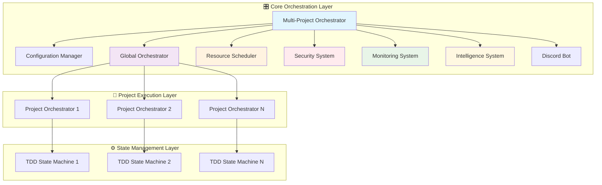
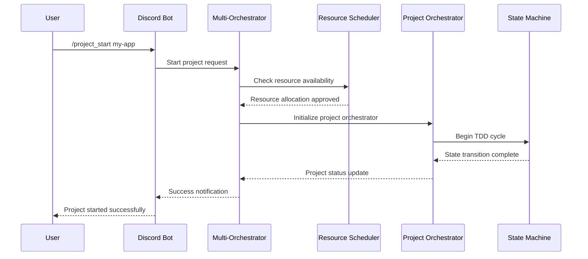
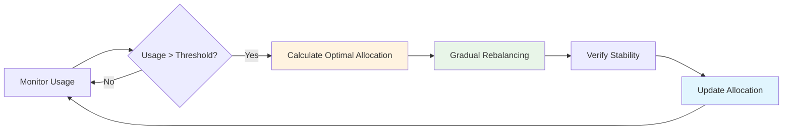

# 🎛️ Multi-Project Orchestration

<div class="orchestration-hero">
<p class="hero-subtitle">Manage multiple AI-assisted development projects simultaneously with intelligent resource allocation, security isolation, and cross-project insights.</p>
</div>

## 🚀 Overview

Multi-project orchestration transforms your development workflow from single-project management to enterprise-scale orchestration:

<div class="feature-grid">
<div class="feature-card">
<h3>🧠 Global Resource Management</h3>
<p>Intelligent allocation of CPU, memory, and agents across projects</p>
</div>

<div class="feature-card">
<h3>⚡ Project Prioritization</h3>
<p>Priority-based scheduling and resource allocation</p>
</div>

<div class="feature-card">
<h3>🔒 Security Isolation</h3>
<p>Project-level security boundaries and access control</p>
</div>

<div class="feature-card">
<h3>🔍 Cross-Project Intelligence</h3>
<p>Pattern recognition and knowledge sharing between projects</p>
</div>

<div class="feature-card">
<h3>📊 Real-time Monitoring</h3>
<p>Comprehensive observability across all projects</p>
</div>

<div class="feature-card">
<h3>🎯 Unified Management</h3>
<p>Single command interface for all projects</p>
</div>
</div>

!!! tip "Interactive Demo"
    Try the [Multi-Project Dashboard Demo](#interactive-dashboard) to see these features in action!

## 🏗️ Architecture

<div class="architecture-section">

### System Architecture Overview

The multi-project system provides a scalable, secure, and intelligent orchestration platform:



### 📊 Component Interaction Flow



</div>

### 🔧 Core Components

<div class="component-grid">

<div class="component-card primary">
<h4>🎛️ Multi-Project Orchestrator</h4>
<p><code>scripts/multi_project_orchestrator.py</code></p>
<ul>
<li>Unified entry point for the entire system</li>
<li>Coordinates all components and manages system lifecycle</li>
<li>Handles startup, shutdown, and error recovery</li>
</ul>
</div>

<div class="component-card">
<h4>⚙️ Configuration Manager</h4>
<p><code>lib/multi_project_config.py</code></p>
<ul>
<li>Manages global and project-specific configurations</li>
<li>Handles project discovery and registration</li>
<li>Validates configuration integrity</li>
</ul>
</div>

<div class="component-card">
<h4>🌐 Global Orchestrator</h4>
<p><code>lib/global_orchestrator.py</code></p>
<ul>
<li>Manages multiple project orchestrator subprocesses</li>
<li>Coordinates cross-project activities</li>
<li>Handles inter-project communication</li>
</ul>
</div>

<div class="component-card">
<h4>📊 Resource Scheduler</h4>
<p><code>lib/resource_scheduler.py</code></p>
<ul>
<li>Intelligent resource allocation across projects</li>
<li>Supports multiple scheduling strategies</li>
<li>Dynamic rebalancing and optimization</li>
</ul>
</div>

<div class="component-card">
<h4>🔒 Security System</h4>
<p><code>lib/multi_project_security.py</code></p>
<ul>
<li>User management and access control</li>
<li>Project isolation and security boundaries</li>
<li>Audit logging and compliance</li>
</ul>
</div>

<div class="component-card">
<h4>📈 Monitoring System</h4>
<p><code>lib/multi_project_monitoring.py</code></p>
<ul>
<li>Real-time metrics collection and alerting</li>
<li>WebSocket-based live updates</li>
<li>Performance analytics and reporting</li>
</ul>
</div>

<div class="component-card">
<h4>🧠 Intelligence System</h4>
<p><code>lib/cross_project_intelligence.py</code></p>
<ul>
<li>Pattern recognition across projects</li>
<li>Knowledge transfer recommendations</li>
<li>Best practices sharing</li>
</ul>
</div>

</div>

## 📊 Interactive Project Management Dashboard {#interactive-dashboard}

<div class="dashboard-container">

### 🎯 Live Project Overview

<div class="dashboard-grid">

<div class="dashboard-widget">
<h4>🚀 Active Projects</h4>
<div class="project-status-grid">
<div class="project-item active">
<span class="project-name">frontend-app</span>
<span class="project-priority high">HIGH</span>
<div class="progress-bar">
<div class="progress-fill" style="width: 78%">78%</div>
</div>
</div>
<div class="project-item active">
<span class="project-name">backend-api</span>
<span class="project-priority normal">NORMAL</span>
<div class="progress-bar">
<div class="progress-fill" style="width: 45%">45%</div>
</div>
</div>
<div class="project-item paused">
<span class="project-name">mobile-app</span>
<span class="project-priority low">LOW</span>
<div class="progress-bar">
<div class="progress-fill" style="width: 23%">23%</div>
</div>
</div>
</div>
</div>

<div class="dashboard-widget">
<h4>💻 Resource Allocation</h4>
<div class="resource-chart">
<div class="resource-item">
<span class="resource-label">CPU Usage</span>
<div class="resource-bar">
<div class="resource-fill cpu" style="width: 67%">67%</div>
</div>
</div>
<div class="resource-item">
<span class="resource-label">Memory</span>
<div class="resource-bar">
<div class="resource-fill memory" style="width: 54%">54%</div>
</div>
</div>
<div class="resource-item">
<span class="resource-label">Agents</span>
<div class="resource-bar">
<div class="resource-fill agents" style="width: 73%">11/15</div>
</div>
</div>
</div>
</div>

<div class="dashboard-widget">
<h4>🔍 Cross-Project Insights</h4>
<div class="insights-list">
<div class="insight-item">
<span class="insight-icon">📊</span>
<span class="insight-text">Common testing patterns detected</span>
<span class="confidence">92%</span>
</div>
<div class="insight-item">
<span class="insight-icon">🔧</span>
<span class="insight-text">Shared dependency optimization</span>
<span class="confidence">87%</span>
</div>
<div class="insight-item">
<span class="insight-icon">⚡</span>
<span class="insight-text">Performance pattern match</span>
<span class="confidence">76%</span>
</div>
</div>
</div>

<div class="dashboard-widget">
<h4>📈 Performance Metrics</h4>
<div class="metrics-grid">
<div class="metric-item">
<span class="metric-value">2.3h</span>
<span class="metric-label">Avg Cycle Time</span>
</div>
<div class="metric-item">
<span class="metric-value">87%</span>
<span class="metric-label">Resource Efficiency</span>
</div>
<div class="metric-item">
<span class="metric-value">42</span>
<span class="metric-label">Stories Completed</span>
</div>
<div class="metric-item">
<span class="metric-value">0.92</span>
<span class="metric-label">Health Score</span>
</div>
</div>
</div>

</div>

### 🔄 Real-Time Activity Feed

<div class="activity-feed">
<div class="activity-item recent">
<span class="activity-time">2min ago</span>
<span class="activity-project">frontend-app</span>
<span class="activity-action">Completed TDD cycle for user authentication</span>
</div>
<div class="activity-item">
<span class="activity-time">5min ago</span>
<span class="activity-project">backend-api</span>
<span class="activity-action">Started new sprint: API optimization</span>
</div>
<div class="activity-item">
<span class="activity-time">12min ago</span>
<span class="activity-project">system</span>
<span class="activity-action">Resource rebalancing completed</span>
</div>
<div class="activity-item">
<span class="activity-time">18min ago</span>
<span class="activity-project">mobile-app</span>
<span class="activity-action">Project paused - resource reallocation</span>
</div>
</div>

!!! info "Live Dashboard"
    This dashboard updates in real-time when connected to the monitoring system. Use the WebSocket connection to see live updates as they happen.

</div>

## 🚀 Getting Started

### 📦 Installation

<div class="installation-section">

The multi-project system builds on the core dependencies with optional enhancements for advanced functionality:

<div class="install-tabs">
<div class="tab-buttons">
<button class="tab-button active" onclick="showTab('core')">Core Setup</button>
<button class="tab-button" onclick="showTab('monitoring')">+ Monitoring</button>
<button class="tab-button" onclick="showTab('visualization')">+ Visualization</button>
</div>

<div id="core" class="tab-content active">
<h4>🔧 Core Dependencies (Required)</h4>
```bash
# Essential packages for multi-project orchestration
pip install discord.py pygithub pyyaml pytest pytest-asyncio mkdocs-material
```
</div>

<div id="monitoring" class="tab-content">
<h4>📊 Monitoring Dependencies (Recommended)</h4>
```bash
# Core dependencies + monitoring capabilities
pip install discord.py pygithub pyyaml pytest pytest-asyncio mkdocs-material
pip install psutil websockets
```
</div>

<div id="visualization" class="tab-content">
<h4>📈 Full Visualization Stack (Current)</h4>
```bash
# All dependencies + available visualization
pip install discord.py pygithub pyyaml pytest pytest-asyncio mkdocs-material
pip install psutil websockets flask flask-socketio
pip install aiohttp requests

# Note: Advanced monitoring (Prometheus/Grafana) not yet implemented
# Current monitoring: web visualizer + performance monitor + Discord status
```
</div>
</div>

</div>

### ⚡ Quick Setup Guide

<div class="setup-guide">

<div class="setup-step">
<div class="step-number">1</div>
<div class="step-content">
<h4>🔍 Initialize Configuration</h4>
<p>Start the multi-project orchestrator and let it discover your projects:</p>
```bash
# Discover projects in current directory
python scripts/multi_project_orchestrator.py --discover .
```
<div class="step-output">
<p>✅ <strong>Expected Output:</strong></p>
<pre>🔍 Discovering projects in: .
📁 Found 3 potential projects:
  ✅ frontend-app (/home/user/projects/frontend-app)
  ✅ backend-api (/home/user/projects/backend-api)
  ✅ mobile-app (/home/user/projects/mobile-app)
💾 Configuration saved to orch-config.yaml
</pre>
</div>
</div>
</div>

<div class="setup-step">
<div class="step-number">2</div>
<div class="step-content">
<h4>📝 Register Projects</h4>
<p>Register specific projects with custom settings:</p>
```bash
# Register a specific project
python scripts/multi_project_orchestrator.py --register myproject /path/to/project
```
<div class="step-output">
<p>✅ <strong>Expected Output:</strong></p>
<pre>📝 Registering project: myproject
📍 Path: /path/to/project
⚙️  Configuring project settings...
✅ Project registered successfully
</pre>
</div>
</div>
</div>

<div class="setup-step">
<div class="step-number">3</div>
<div class="step-content">
<h4>🎛️ Interactive Management</h4>
<p>Launch the interactive shell for hands-on management:</p>
```bash
# Start interactive management interface
python scripts/multi_project_orchestrator.py --interactive
```
<div class="step-output">
<p>✅ <strong>Expected Output:</strong></p>
<pre>🎛️  Multi-Project Orchestrator Interactive Shell
Type 'help' for available commands
multi-orch> 
</pre>
</div>
</div>
</div>

</div>

!!! success "Setup Complete!"
    You're now ready to manage multiple projects with AI-powered orchestration. Try running `status` in the interactive shell to see your project overview.

## 💻 Resource Allocation Visualizations

<div class="resource-section">

### 🎯 Allocation Strategies Overview

The system provides three intelligent allocation strategies, each optimized for different scenarios:

<div class="strategy-comparison">

<div class="strategy-card">
<h4>⚖️ Fair Share Strategy</h4>
<div class="strategy-visual">
<div class="allocation-bar">
<div class="allocation-segment" style="width: 33.3%; background: #4CAF50;">Project A</div>
<div class="allocation-segment" style="width: 33.3%; background: #2196F3;">Project B</div>
<div class="allocation-segment" style="width: 33.4%; background: #FF9800;">Project C</div>
</div>
</div>
<p><strong>Best for:</strong> Equal priority projects</p>
<p><strong>Allocation:</strong> Resources divided equally among active projects</p>
</div>

<div class="strategy-card">
<h4>🚀 Priority-Based Strategy</h4>
<div class="strategy-visual">
<div class="allocation-bar">
<div class="allocation-segment" style="width: 50%; background: #F44336;">Critical</div>
<div class="allocation-segment" style="width: 30%; background: #FF9800;">High</div>
<div class="allocation-segment" style="width: 20%; background: #4CAF50;">Normal</div>
</div>
</div>
<p><strong>Best for:</strong> Projects with different priorities</p>
<p><strong>Allocation:</strong> Higher priority projects get more resources</p>
</div>

<div class="strategy-card">
<h4>🧠 Dynamic Strategy</h4>
<div class="strategy-visual">
<div class="allocation-bar">
<div class="allocation-segment" style="width: 45%; background: #9C27B0;">Active Work</div>
<div class="allocation-segment" style="width: 25%; background: #607D8B;">Idle</div>
<div class="allocation-segment" style="width: 30%; background: #795548;">Waiting</div>
</div>
</div>
<p><strong>Best for:</strong> Variable workloads</p>
<p><strong>Allocation:</strong> Resources allocated based on actual usage patterns</p>
</div>

</div>

### 📊 Real-Time Resource Monitoring

<div class="monitoring-dashboard">

<div class="resource-widget">
<h4>💾 Memory Allocation</h4>
<div class="resource-breakdown">
<div class="resource-project">
<span class="project-label">frontend-app</span>
<div class="resource-bar">
<div class="resource-fill" style="width: 35%; background: #4CAF50;">2.8GB</div>
</div>
</div>
<div class="resource-project">
<span class="project-label">backend-api</span>
<div class="resource-bar">
<div class="resource-fill" style="width: 28%; background: #2196F3;">2.2GB</div>
</div>
</div>
<div class="resource-project">
<span class="project-label">mobile-app</span>
<div class="resource-bar">
<div class="resource-fill" style="width: 15%; background: #FF9800;">1.2GB</div>
</div>
</div>
<div class="resource-project">
<span class="project-label">Available</span>
<div class="resource-bar">
<div class="resource-fill" style="width: 22%; background: #9E9E9E;">1.8GB</div>
</div>
</div>
</div>
</div>

<div class="resource-widget">
<h4>⚡ CPU Distribution</h4>
<div class="cpu-grid">
<div class="cpu-core in-use">Core 1<br>frontend-app</div>
<div class="cpu-core in-use">Core 2<br>frontend-app</div>
<div class="cpu-core in-use">Core 3<br>backend-api</div>
<div class="cpu-core in-use">Core 4<br>backend-api</div>
<div class="cpu-core light-use">Core 5<br>mobile-app</div>
<div class="cpu-core light-use">Core 6<br>mobile-app</div>
<div class="cpu-core available">Core 7<br>Available</div>
<div class="cpu-core available">Core 8<br>Available</div>
</div>
</div>

<div class="resource-widget">
<h4>🤖 Agent Allocation</h4>
<div class="agent-allocation">
<div class="agent-project">
<div class="project-header">
<span class="project-name">frontend-app</span>
<span class="agent-count">5 agents</span>
</div>
<div class="agent-types">
<span class="agent-type code">Code</span>
<span class="agent-type design">Design</span>
<span class="agent-type qa">QA</span>
<span class="agent-type code">Code</span>
<span class="agent-type data">Data</span>
</div>
</div>
<div class="agent-project">
<div class="project-header">
<span class="project-name">backend-api</span>
<span class="agent-count">4 agents</span>
</div>
<div class="agent-types">
<span class="agent-type code">Code</span>
<span class="agent-type code">Code</span>
<span class="agent-type qa">QA</span>
<span class="agent-type data">Data</span>
</div>
</div>
<div class="agent-project">
<div class="project-header">
<span class="project-name">mobile-app</span>
<span class="agent-count">2 agents</span>
</div>
<div class="agent-types">
<span class="agent-type design">Design</span>
<span class="agent-type qa">QA</span>
</div>
</div>
</div>
</div>

</div>

### 🔄 Dynamic Rebalancing

<div class="rebalancing-section">

The system continuously monitors resource usage and automatically rebalances when needed:



<div class="rebalancing-example">
<h4>🔄 Example Rebalancing Event</h4>
<div class="rebalancing-timeline">
<div class="timeline-item">
<span class="timeline-time">14:32:15</span>
<span class="timeline-event">🔍 High memory usage detected on frontend-app (95%)</span>
</div>
<div class="timeline-item">
<span class="timeline-time">14:32:16</span>
<span class="timeline-event">📊 Analyzing resource availability across projects</span>
</div>
<div class="timeline-item">
<span class="timeline-time">14:32:17</span>
<span class="timeline-event">⚡ Identified 1.2GB available from idle mobile-app</span>
</div>
<div class="timeline-item">
<span class="timeline-time">14:32:18</span>
<span class="timeline-event">🔄 Initiating gradual memory reallocation</span>
</div>
<div class="timeline-item">
<span class="timeline-time">14:32:22</span>
<span class="timeline-event">✅ Rebalancing complete - frontend-app now at 78%</span>
</div>
</div>
</div>

</div>

</div>

## ⚙️ Configuration

<div class="configuration-section">

### 🌐 Global Configuration

The global configuration controls system-wide behavior and resource limits:

<div class="config-editor">
<div class="config-tabs">
<button class="config-tab active" onclick="showConfigTab('resource')">Resource Limits</button>
<button class="config-tab" onclick="showConfigTab('scheduling')">Scheduling</button>
<button class="config-tab" onclick="showConfigTab('features')">Features</button>
<button class="config-tab" onclick="showConfigTab('integration')">Integration</button>
</div>

<div id="resource" class="config-content active">
<h4>🎯 Resource Limits</h4>
```yaml
global:
  # System-wide resource constraints
  max_total_agents: 20          # Maximum agents across all projects
  max_concurrent_projects: 10   # Maximum active projects
  global_cpu_cores: 4          # Available CPU cores
  global_memory_limit_gb: 8    # Total memory allocation
  global_disk_limit_gb: 50     # Maximum disk usage
```
<div class="config-help">
<p>💡 <strong>Tip:</strong> Set these limits based on your system capacity. The orchestrator will prevent over-allocation.</p>
</div>
</div>

<div id="scheduling" class="config-content">
<h4>⏰ Scheduling Configuration</h4>
```yaml
global:
  # Resource allocation strategy
  resource_allocation_strategy: fair_share  # fair_share, priority_based, dynamic
  
  # Timing intervals
  scheduling_interval_seconds: 30          # How often to check for resource needs
  resource_rebalance_interval_seconds: 300 # How often to rebalance resources
```
<div class="config-help">
<p>💡 <strong>Strategy Guide:</strong></p>
<ul>
<li><strong>fair_share:</strong> Equal resources for all projects</li>
<li><strong>priority_based:</strong> More resources for higher priority projects</li>
<li><strong>dynamic:</strong> Allocation based on actual usage patterns</li>
</ul>
</div>
</div>

<div id="features" class="config-content">
<h4>🎛️ Feature Toggles</h4>
```yaml
global:
  # Intelligence features
  enable_cross_project_insights: true   # Pattern recognition across projects
  enable_knowledge_sharing: true        # Share learnings between projects
  enable_pattern_learning: true         # Learn from project patterns
  enable_project_isolation: true        # Enforce security boundaries
```
<div class="config-help">
<p>💡 <strong>Note:</strong> These features enhance AI capabilities but may increase resource usage.</p>
</div>
</div>

<div id="integration" class="config-content">
<h4>🔗 External Integrations</h4>
```yaml
global:
  # Storage and state
  global_state_path: .orch-global       # Global state directory
  
  # External services
  global_discord_guild: null            # Discord server ID
  monitoring_webhook_url: null          # Monitoring webhook endpoint
```
<div class="config-help">
<p>💡 <strong>Integration:</strong> Configure webhooks and external services for enhanced monitoring.</p>
</div>
</div>

</div>

### 📁 Project Configuration

Each project has detailed configuration options for fine-tuned control:

<div class="project-config-example">

<div class="config-section">
<h4>🏷️ Project Identity</h4>
```yaml
projects:
  my-project:
    name: my-project              # Project identifier
    path: /path/to/project        # Project directory path
    priority: normal              # critical, high, normal, low
    status: active                # active, paused, maintenance, archived
```
</div>

<div class="config-section">
<h4>💻 Resource Limits</h4>
```yaml
    resource_limits:
      max_parallel_agents: 3      # Maximum agents for this project
      max_parallel_cycles: 2      # Maximum concurrent TDD cycles
      max_memory_mb: 1024         # Memory limit in MB
      max_disk_mb: 2048          # Disk space limit in MB
      cpu_priority: 1.0          # CPU priority weight (0.1 - 2.0)
```
</div>

<div class="config-section">
<h4>🤖 AI Settings</h4>
```yaml
    ai_settings:
      auto_approve_low_risk: true       # Auto-approve low-risk changes
      require_human_review: false       # Force human review for all changes
      max_auto_retry: 3                # Maximum automatic retry attempts
      context_sharing_enabled: true     # Enable cross-project learning
```
</div>

<div class="config-section">
<h4>⏰ Work Schedule</h4>
```yaml
    work_hours:
      timezone: UTC                     # Project timezone
      start: "09:00"                   # Work start time
      end: "17:00"                     # Work end time
      days: [monday, tuesday, wednesday, thursday, friday]  # Work days
```
</div>

<div class="config-section">
<h4>🔗 Integration Settings</h4>
```yaml
    integration:
      discord_channel: "#my-project-dev"  # Dedicated Discord channel
      slack_channel: null                 # Slack integration (optional)
      team: ["developer1", "designer2"]   # Team member access
      dependencies: ["shared-lib"]        # Project dependencies
```
</div>

</div>

</div>

## 🔒 Security Isolation & Access Control

<div class="security-section">

### 🛡️ Multi-Layered Security Architecture

The system implements comprehensive security through multiple isolation layers:

<div class="security-layers">

<div class="security-layer">
<div class="layer-icon">👥</div>
<div class="layer-content">
<h4>User Access Control</h4>
<p>Role-based permissions with fine-grained access control</p>
<div class="access-levels">
<span class="access-badge owner">OWNER</span>
<span class="access-badge admin">ADMIN</span>
<span class="access-badge maintainer">MAINTAINER</span>
<span class="access-badge contributor">CONTRIBUTOR</span>
<span class="access-badge viewer">VIEWER</span>
</div>
</div>
</div>

<div class="security-layer">
<div class="layer-icon">📁</div>
<div class="layer-content">
<h4>Project Isolation</h4>
<p>Separate process spaces with restricted filesystem access</p>
<div class="isolation-types">
<span class="isolation-badge process">Process</span>
<span class="isolation-badge filesystem">Filesystem</span>
<span class="isolation-badge network">Network</span>
<span class="isolation-badge container">Container</span>
</div>
</div>
</div>

<div class="security-layer">
<div class="layer-icon">🔑</div>
<div class="layer-content">
<h4>Agent Restrictions</h4>
<p>Tool access control and command limitations per agent type</p>
<div class="agent-restrictions">
<span class="restriction-badge read">Read-Only</span>
<span class="restriction-badge edit">Edit-Only</span>
<span class="restriction-badge test">Test-Only</span>
<span class="restriction-badge full">Full Access</span>
</div>
</div>
</div>

</div>

### 👥 User Management Matrix

<div class="access-matrix">

<div class="matrix-header">
<div class="matrix-cell">Permission</div>
<div class="matrix-cell">OWNER</div>
<div class="matrix-cell">ADMIN</div>
<div class="matrix-cell">MAINTAINER</div>
<div class="matrix-cell">CONTRIBUTOR</div>
<div class="matrix-cell">VIEWER</div>
</div>

<div class="matrix-row">
<div class="matrix-cell">System Configuration</div>
<div class="matrix-cell allowed">✅</div>
<div class="matrix-cell denied">❌</div>
<div class="matrix-cell denied">❌</div>
<div class="matrix-cell denied">❌</div>
<div class="matrix-cell denied">❌</div>
</div>

<div class="matrix-row">
<div class="matrix-cell">Multi-Project Management</div>
<div class="matrix-cell allowed">✅</div>
<div class="matrix-cell allowed">✅</div>
<div class="matrix-cell denied">❌</div>
<div class="matrix-cell denied">❌</div>
<div class="matrix-cell denied">❌</div>
</div>

<div class="matrix-row">
<div class="matrix-cell">Project Administration</div>
<div class="matrix-cell allowed">✅</div>
<div class="matrix-cell allowed">✅</div>
<div class="matrix-cell allowed">✅</div>
<div class="matrix-cell denied">❌</div>
<div class="matrix-cell denied">❌</div>
</div>

<div class="matrix-row">
<div class="matrix-cell">Code Modification</div>
<div class="matrix-cell allowed">✅</div>
<div class="matrix-cell allowed">✅</div>
<div class="matrix-cell allowed">✅</div>
<div class="matrix-cell allowed">✅</div>
<div class="matrix-cell denied">❌</div>
</div>

<div class="matrix-row">
<div class="matrix-cell">View Project Status</div>
<div class="matrix-cell allowed">✅</div>
<div class="matrix-cell allowed">✅</div>
<div class="matrix-cell allowed">✅</div>
<div class="matrix-cell allowed">✅</div>
<div class="matrix-cell allowed">✅</div>
</div>

</div>

### 🔐 Project Isolation Mechanisms

<div class="isolation-showcase">

<div class="isolation-demo">
<h4>🏭 Process Isolation</h4>
<div class="process-diagram">
<div class="process-container">
<div class="process-item">
<span class="process-name">frontend-app</span>
<div class="process-details">
<span class="pid">PID: 1234</span>
<span class="memory">Memory: 2.1GB</span>
<span class="cpu">CPU: 45%</span>
</div>
</div>
</div>
<div class="process-container">
<div class="process-item">
<span class="process-name">backend-api</span>
<div class="process-details">
<span class="pid">PID: 1567</span>
<span class="memory">Memory: 1.8GB</span>
<span class="cpu">CPU: 32%</span>
</div>
</div>
</div>
<div class="process-container">
<div class="process-item">
<span class="process-name">mobile-app</span>
<div class="process-details">
<span class="pid">PID: 1890</span>
<span class="memory">Memory: 0.9GB</span>
<span class="cpu">CPU: 18%</span>
</div>
</div>
</div>
</div>
</div>

<div class="isolation-demo">
<h4>📂 Filesystem Boundaries</h4>
<div class="filesystem-tree">
<div class="fs-item project">
<span class="fs-icon">📁</span>
<span class="fs-name">Projects</span>
<div class="fs-children">
<div class="fs-item accessible">
<span class="fs-icon">📁</span>
<span class="fs-name">frontend-app</span>
<span class="fs-access">✅ Full Access</span>
</div>
<div class="fs-item restricted">
<span class="fs-icon">🔒</span>
<span class="fs-name">backend-api</span>
<span class="fs-access">❌ Restricted</span>
</div>
<div class="fs-item restricted">
<span class="fs-icon">🔒</span>
<span class="fs-name">mobile-app</span>
<span class="fs-access">❌ Restricted</span>
</div>
</div>
</div>
</div>
</div>

</div>

### 🚨 Security Monitoring

<div class="security-monitoring">

<div class="security-alerts">
<h4>🔔 Active Security Alerts</h4>
<div class="alert-list">
<div class="alert-item info">
<span class="alert-icon">ℹ️</span>
<span class="alert-message">User 'developer1' accessed 3 projects in the last hour</span>
<span class="alert-time">2min ago</span>
</div>
<div class="alert-item warning">
<span class="alert-icon">⚠️</span>
<span class="alert-message">Unusual file access pattern detected in backend-api</span>
<span class="alert-time">15min ago</span>
</div>
<div class="alert-item success">
<span class="alert-icon">✅</span>
<span class="alert-message">Security scan completed - no vulnerabilities found</span>
<span class="alert-time">1hr ago</span>
</div>
</div>
</div>

<div class="audit-log">
<h4>📋 Recent Audit Events</h4>
<div class="log-entries">
<div class="log-entry">
<span class="log-time">14:32:15</span>
<span class="log-user">developer1</span>
<span class="log-action">PROJECT_ACCESS</span>
<span class="log-resource">frontend-app</span>
<span class="log-result success">SUCCESS</span>
</div>
<div class="log-entry">
<span class="log-time">14:31:45</span>
<span class="log-user">designer2</span>
<span class="log-action">FILE_READ</span>
<span class="log-resource">mobile-app/design/</span>
<span class="log-result success">SUCCESS</span>
</div>
<div class="log-entry">
<span class="log-time">14:31:20</span>
<span class="log-user">qa_agent</span>
<span class="log-action">TEST_EXECUTION</span>
<span class="log-resource">backend-api/tests/</span>
<span class="log-result success">SUCCESS</span>
</div>
</div>
</div>

</div>

!!! warning "Security Best Practices"
    - Regular access reviews and permission audits
    - Monitor unusual access patterns
    - Enable audit logging for compliance
    - Use least-privilege principle for all users
    - Implement 2FA for sensitive operations

</div>

## 🧠 Cross-Project Intelligence Showcase

<div class="intelligence-section">

### 🔍 Pattern Recognition Engine

The AI system continuously analyzes patterns across all projects to identify optimization opportunities:

<div class="pattern-showcase">

<div class="pattern-card">
<div class="pattern-header">
<span class="pattern-icon">🧪</span>
<h4>Testing Strategy Patterns</h4>
<span class="confidence-badge">92% confidence</span>
</div>
<div class="pattern-details">
<p><strong>Pattern Detected:</strong> Both frontend-app and mobile-app use similar Jest configuration patterns</p>
<div class="pattern-projects">
<span class="project-tag">frontend-app</span>
<span class="project-tag">mobile-app</span>
</div>
<div class="pattern-recommendation">
<p>💡 <strong>Recommendation:</strong> Extract shared Jest configuration to a common testing library</p>
<p>📈 <strong>Impact:</strong> Reduce maintenance overhead by 35%</p>
</div>
</div>
</div>

<div class="pattern-card">
<div class="pattern-header">
<span class="pattern-icon">📦</span>
<h4>Dependency Management</h4>
<span class="confidence-badge">87% confidence</span>
</div>
<div class="pattern-details">
<p><strong>Pattern Detected:</strong> Similar package.json dependencies across React projects</p>
<div class="pattern-projects">
<span class="project-tag">frontend-app</span>
<span class="project-tag">admin-panel</span>
</div>
<div class="pattern-recommendation">
<p>💡 <strong>Recommendation:</strong> Create shared dependency management with Lerna or Nx</p>
<p>📈 <strong>Impact:</strong> Reduce bundle size by 28%</p>
</div>
</div>
</div>

<div class="pattern-card">
<div class="pattern-header">
<span class="pattern-icon">⚡</span>
<h4>Performance Optimization</h4>
<span class="confidence-badge">76% confidence</span>
</div>
<div class="pattern-details">
<p><strong>Pattern Detected:</strong> API caching strategies show similar performance gains</p>
<div class="pattern-projects">
<span class="project-tag">backend-api</span>
<span class="project-tag">microservice-a</span>
</div>
<div class="pattern-recommendation">
<p>💡 <strong>Recommendation:</strong> Apply Redis caching pattern to mobile-api project</p>
<p>📈 <strong>Impact:</strong> Expected 45% response time improvement</p>
</div>
</div>
</div>

</div>

### 🔄 Knowledge Transfer Recommendations

<div class="knowledge-transfer">

<div class="transfer-flow">
<div class="source-project">
<h4>Source: backend-api</h4>
<div class="project-details">
<span class="detail-item">✅ Advanced error handling</span>
<span class="detail-item">✅ Comprehensive logging</span>
<span class="detail-item">✅ Rate limiting implementation</span>
</div>
</div>

<div class="transfer-arrow">
<span class="arrow-icon">→</span>
<div class="transfer-info">
<span class="transfer-confidence">89% match</span>
<span class="transfer-impact">High impact</span>
</div>
</div>

<div class="target-project">
<h4>Target: mobile-api</h4>
<div class="project-details">
<span class="detail-item missing">❌ Basic error handling</span>
<span class="detail-item missing">❌ Limited logging</span>
<span class="detail-item missing">❌ No rate limiting</span>
</div>
</div>
</div>

<div class="transfer-actions">
<button class="action-button primary">Apply Recommendations</button>
<button class="action-button secondary">View Details</button>
<button class="action-button">Schedule Transfer</button>
</div>

</div>

### 📊 Intelligence Analytics Dashboard

<div class="analytics-dashboard">

<div class="analytics-metric">
<div class="metric-icon">🎯</div>
<div class="metric-content">
<span class="metric-value">15</span>
<span class="metric-label">Active Insights</span>
<div class="metric-trend up">↗️ +3 this week</div>
</div>
</div>

<div class="analytics-metric">
<div class="metric-icon">🔄</div>
<div class="metric-content">
<span class="metric-value">8</span>
<span class="metric-label">Applied Transfers</span>
<div class="metric-trend up">↗️ +2 this week</div>
</div>
</div>

<div class="analytics-metric">
<div class="metric-icon">💡</div>
<div class="metric-content">
<span class="metric-value">34%</span>
<span class="metric-label">Avg Performance Gain</span>
<div class="metric-trend up">↗️ +8% this month</div>
</div>
</div>

<div class="analytics-metric">
<div class="metric-icon">⏱️</div>
<div class="metric-content">
<span class="metric-value">2.1h</span>
<span class="metric-label">Time Saved Daily</span>
<div class="metric-trend up">↗️ +0.3h this week</div>
</div>
</div>

</div>

</div>

## ⚡ Performance Optimization Guides

<div class="performance-section">

### 🚀 System Performance Tuning

<div class="optimization-guides">

<div class="optimization-card">
<h4>🧠 Memory Optimization</h4>
<div class="optimization-steps">
<div class="step-item">
<div class="step-number">1</div>
<div class="step-content">
<p><strong>Enable Memory Pooling</strong></p>
<p>Configure shared memory pools across projects to reduce allocation overhead.</p>
<pre><code>global:
  memory_pooling: true
  pool_size_mb: 2048</code></pre>
</div>
</div>
<div class="step-item">
<div class="step-number">2</div>
<div class="step-content">
<p><strong>Optimize Agent Memory</strong></p>
<p>Set appropriate memory limits per agent type to prevent memory leaks.</p>
<pre><code>agent_memory_limits:
  code_agent: 512mb
  design_agent: 256mb</code></pre>
</div>
</div>
</div>
<div class="performance-impact">
<span class="impact-badge positive">+25% memory efficiency</span>
<span class="impact-badge positive">-40% allocation overhead</span>
</div>
</div>

<div class="optimization-card">
<h4>⚡ CPU Performance Tuning</h4>
<div class="optimization-steps">
<div class="step-item">
<div class="step-number">1</div>
<div class="step-content">
<p><strong>Enable CPU Affinity</strong></p>
<p>Pin specific projects to CPU cores for better cache locality.</p>
<pre><code>projects:
  high-performance-app:
    cpu_affinity: [0, 1, 2, 3]</code></pre>
</div>
</div>
<div class="step-item">
<div class="step-number">2</div>
<div class="step-content">
<p><strong>Dynamic CPU Scaling</strong></p>
<p>Allow CPU allocation to scale based on workload demand.</p>
<pre><code>resource_allocation_strategy: dynamic
cpu_scaling_enabled: true</code></pre>
</div>
</div>
</div>
<div class="performance-impact">
<span class="impact-badge positive">+30% CPU efficiency</span>
<span class="impact-badge positive">+15% throughput</span>
</div>
</div>

<div class="optimization-card">
<h4>💾 I/O Performance</h4>
<div class="optimization-steps">
<div class="step-item">
<div class="step-number">1</div>
<div class="step-content">
<p><strong>Enable SSD Optimization</strong></p>
<p>Configure the system for SSD storage with optimized I/O patterns.</p>
<pre><code>storage:
  type: ssd
  io_scheduler: noop
  read_ahead_kb: 128</code></pre>
</div>
</div>
<div class="step-item">
<div class="step-number">2</div>
<div class="step-content">
<p><strong>Project State Caching</strong></p>
<p>Cache frequently accessed project state in memory.</p>
<pre><code>caching:
  project_state_cache: true
  cache_size_mb: 512</code></pre>
</div>
</div>
</div>
<div class="performance-impact">
<span class="impact-badge positive">+50% I/O performance</span>
<span class="impact-badge positive">-60% disk latency</span>
</div>
</div>

</div>

### 📈 Performance Monitoring Dashboard

<div class="perf-monitoring">

<div class="perf-chart">
<h4>🔄 TDD Cycle Performance</h4>
<div class="chart-container">
<div class="chart-bars">
<div class="chart-bar" style="height: 60%">
<span class="bar-label">Week 1</span>
<span class="bar-value">3.2h</span>
</div>
<div class="chart-bar" style="height: 70%">
<span class="bar-label">Week 2</span>
<span class="bar-value">2.8h</span>
</div>
<div class="chart-bar" style="height: 50%">
<span class="bar-label">Week 3</span>
<span class="bar-value">2.3h</span>
</div>
<div class="chart-bar" style="height: 45%">
<span class="bar-label">Week 4</span>
<span class="bar-value">2.1h</span>
</div>
</div>
<div class="chart-trend">
<p>📈 <strong>34% improvement</strong> in average cycle time over 4 weeks</p>
</div>
</div>
</div>

<div class="perf-metrics">
<h4>⚡ Real-Time Performance Metrics</h4>
<div class="metric-grid">
<div class="metric-box">
<span class="metric-title">Response Time</span>
<span class="metric-value good">127ms</span>
<span class="metric-trend">↗️ 15ms faster</span>
</div>
<div class="metric-box">
<span class="metric-title">Throughput</span>
<span class="metric-value excellent">95.7%</span>
<span class="metric-trend">↗️ +3.2% today</span>
</div>
<div class="metric-box">
<span class="metric-title">Error Rate</span>
<span class="metric-value excellent">0.12%</span>
<span class="metric-trend">↘️ -0.05% today</span>
</div>
<div class="metric-box">
<span class="metric-title">Resource Efficiency</span>
<span class="metric-value good">87.3%</span>
<span class="metric-trend">↗️ +2.1% this week</span>
</div>
</div>
</div>

</div>

### 🔧 Advanced Performance Tuning

<div class="advanced-tuning">

<div class="tuning-section">
<h4>🎛️ Custom Performance Profiles</h4>
<p>Create performance profiles optimized for different project types:</p>

<div class="profile-tabs">
<button class="profile-tab active" onclick="showProfile('web')">Web Applications</button>
<button class="profile-tab" onclick="showProfile('api')">API Services</button>
<button class="profile-tab" onclick="showProfile('data')">Data Processing</button>
</div>

<div id="web" class="profile-content active">
```yaml
performance_profiles:
  web_application:
    memory_strategy: "responsive"
    cpu_priority: 1.2
    io_optimization: "frontend"
    cache_strategy: "aggressive"
    agent_preferences:
      - design_agent: high_priority
      - code_agent: balanced
```
</div>

<div id="api" class="profile-content">
```yaml
performance_profiles:
  api_service:
    memory_strategy: "throughput"
    cpu_priority: 1.5
    io_optimization: "database"
    cache_strategy: "selective"
    agent_preferences:
      - code_agent: high_priority
      - qa_agent: high_priority
```
</div>

<div id="data" class="profile-content">
```yaml
performance_profiles:
  data_processing:
    memory_strategy: "bulk"
    cpu_priority: 1.8
    io_optimization: "batch"
    cache_strategy: "minimal"
    agent_preferences:
      - data_agent: high_priority
      - code_agent: balanced
```
</div>

</div>

</div>

!!! tip "Performance Best Practices"
    - Monitor performance trends regularly
    - Apply optimizations incrementally
    - Test performance changes in isolation
    - Use appropriate performance profiles for project types
    - Enable performance alerting for early detection

</div>

## 📋 Enhanced Project Management

<div class="project-management-section">

### 🔍 Intelligent Project Discovery

<div class="discovery-showcase">

<div class="discovery-flow">
<div class="flow-step">
<div class="step-icon">🔎</div>
<h4>Filesystem Scan</h4>
<p>Recursively scan directories for project indicators</p>
</div>
<div class="flow-arrow">→</div>
<div class="flow-step">
<div class="step-icon">📊</div>
<h4>Pattern Analysis</h4>
<p>Analyze project structure and activity patterns</p>
</div>
<div class="flow-arrow">→</div>
<div class="flow-step">
<div class="step-icon">✅</div>
<h4>Auto-Registration</h4>
<p>Register qualified projects with optimal settings</p>
</div>
</div>

<div class="discovery-commands">
<div class="command-example">
<h4>🌍 Global Discovery</h4>
```bash
# Discover projects in current directory
python scripts/multi_project_orchestrator.py --discover .
```
<div class="command-output">
<pre>🔍 Scanning filesystem for projects...
📁 Found 5 potential projects:
  ✅ frontend-app (React, active development)
  ✅ backend-api (Node.js, recent commits)
  ✅ mobile-app (React Native, moderate activity)
  ⚠️  legacy-system (Python, low activity)
  ❌ archived-project (no recent activity)

💾 Auto-registered 3 active projects
⚙️  Configuration saved to orch-config.yaml</pre>
</div>
</div>

<div class="command-example">
<h4>🎯 Targeted Discovery</h4>
```bash
# Discover in multiple specific paths
python scripts/multi_project_orchestrator.py --discover /projects /work /experiments
```
<div class="command-output">
<pre>🔍 Multi-path discovery initiated...
📂 /projects: 3 projects found
📂 /work: 2 projects found  
📂 /experiments: 1 project found

📋 Discovery Summary:
  Total scanned: 47 directories
  Projects found: 6
  Auto-registered: 4
  Skipped (inactive): 2</pre>
</div>
</div>
</div>

</div>

### 📝 Project Registration & Configuration

<div class="registration-interface">

<div class="registration-tabs">
<button class="reg-tab active" onclick="showRegTab('manual')">Manual Registration</button>
<button class="reg-tab" onclick="showRegTab('interactive')">Interactive Setup</button>
<button class="reg-tab" onclick="showRegTab('bulk')">Bulk Import</button>
</div>

<div id="manual" class="reg-content active">
<h4>⚡ Quick Manual Registration</h4>
```bash
# Basic registration with auto-detection
python scripts/multi_project_orchestrator.py --register myproject /path/to/project

# Registration with custom priority
python scripts/multi_project_orchestrator.py --register myproject /path/to/project --priority high
```
<div class="reg-preview">
<p><strong>Auto-detected settings:</strong></p>
<ul>
<li>🔍 Project type: React Application</li>
<li>📦 Dependencies: npm, webpack, jest</li>
<li>⚡ Suggested priority: normal</li>
<li>💻 Recommended agents: 3 (code, design, qa)</li>
</ul>
</div>
</div>

<div id="interactive" class="reg-content">
<h4>🎛️ Interactive Setup Wizard</h4>
```bash
python scripts/multi_project_orchestrator.py --interactive
```
<div class="interactive-demo">
<div class="chat-interface">
<div class="chat-message system">
<span class="message-icon">🤖</span>
<div class="message-content">
<p>Welcome to the Multi-Project Setup Wizard!</p>
<p>Let's register your project. What's the project name?</p>
</div>
</div>
<div class="chat-message user">
<span class="message-icon">👤</span>
<div class="message-content">my-awesome-app</div>
</div>
<div class="chat-message system">
<span class="message-icon">🤖</span>
<div class="message-content">
<p>Great! I've detected this is a React application.</p>
<p>Recommended configuration:</p>
<ul>
<li>Priority: Normal</li>
<li>Agents: 3 (Code, Design, QA)</li>
<li>Memory limit: 1GB</li>
</ul>
<p>Does this look good? (y/n)</p>
</div>
</div>
</div>
</div>
</div>

<div id="bulk" class="reg-content">
<h4>📂 Bulk Project Import</h4>
```yaml
# projects-config.yaml
bulk_import:
  base_path: /home/user/projects
  projects:
    - name: frontend-app
      type: react
      priority: high
    - name: backend-api  
      type: nodejs
      priority: normal
    - name: mobile-app
      type: react-native
      priority: low
```
```bash
python scripts/multi_project_orchestrator.py --import projects-config.yaml
```
</div>

</div>

### 🔄 Project Lifecycle Management

<div class="lifecycle-section">

<div class="lifecycle-diagram">
<div class="lifecycle-stage initializing">
<div class="stage-icon">🚀</div>
<div class="stage-info">
<h4>Initializing</h4>
<p>Setting up project environment</p>
<div class="stage-actions">
<button class="action-btn">View Progress</button>
</div>
</div>
</div>

<div class="lifecycle-arrow">→</div>

<div class="lifecycle-stage active">
<div class="stage-icon">✅</div>
<div class="stage-info">
<h4>Active</h4>
<p>Available for orchestration</p>
<div class="stage-actions">
<button class="action-btn">Pause</button>
<button class="action-btn">Settings</button>
</div>
</div>
</div>

<div class="lifecycle-arrow">↔</div>

<div class="lifecycle-stage paused">
<div class="stage-icon">⏸️</div>
<div class="stage-info">
<h4>Paused</h4>
<p>Temporarily suspended</p>
<div class="stage-actions">
<button class="action-btn">Resume</button>
<button class="action-btn">Archive</button>
</div>
</div>
</div>

<div class="lifecycle-arrow">→</div>

<div class="lifecycle-stage maintenance">
<div class="stage-icon">🔧</div>
<div class="stage-info">
<h4>Maintenance</h4>
<p>Undergoing maintenance</p>
<div class="stage-actions">
<button class="action-btn">Complete</button>
</div>
</div>
</div>

<div class="lifecycle-arrow">→</div>

<div class="lifecycle-stage archived">
<div class="stage-icon">📦</div>
<div class="stage-info">
<h4>Archived</h4>
<p>Configuration preserved</p>
<div class="stage-actions">
<button class="action-btn">Restore</button>
</div>
</div>
</div>
</div>

<div class="lifecycle-controls">
<h4>🎛️ Project State Management</h4>
<div class="project-list">
<div class="project-item">
<div class="project-info">
<span class="project-name">frontend-app</span>
<span class="project-status active">Active</span>
</div>
<div class="project-controls">
<button class="control-btn pause">⏸️ Pause</button>
<button class="control-btn maintenance">🔧 Maintenance</button>
</div>
</div>
<div class="project-item">
<div class="project-info">
<span class="project-name">backend-api</span>
<span class="project-status paused">Paused</span>
</div>
<div class="project-controls">
<button class="control-btn resume">▶️ Resume</button>  
<button class="control-btn archive">📦 Archive</button>
</div>
</div>
<div class="project-item">
<div class="project-info">
<span class="project-name">mobile-app</span>
<span class="project-status maintenance">Maintenance</span>
</div>
<div class="project-controls">
<button class="control-btn complete">✅ Complete</button>
</div>
</div>
</div>
</div>

</div>

## 🎛️ Interactive Management Console

<div class="console-section">

### 💻 Enhanced Interactive Shell

<div class="shell-interface">
<div class="shell-header">
<span class="shell-title">Multi-Project Orchestrator v2.0</span>
<div class="shell-indicators">
<span class="indicator active">🟢 Online</span>
<span class="indicator">Projects: 3</span>
<span class="indicator">Active: 2</span>
</div>
</div>

<div class="shell-content">
<div class="shell-prompt">
<span class="prompt-symbol">multi-orch></span>
<span class="cursor">|</span>
</div>

<div class="command-suggestions">
<h4>💡 Available Commands</h4>
<div class="command-grid">
<div class="command-card">
<h5>📊 status [component]</h5>
<p>Show detailed system status</p>
<div class="command-example">
<code>status monitoring</code>
</div>
</div>
<div class="command-card">
<h5>📋 projects</h5>
<p>List all registered projects</p>
<div class="command-example">
<code>projects --detailed</code>
</div>
</div>
<div class="command-card">
<h5>🚀 start &lt;project&gt;</h5>
<p>Start project orchestrator</p>
<div class="command-example">
<code>start frontend-app</code>
</div>
</div>
<div class="command-card">
<h5>⏹️ stop &lt;project&gt;</h5>
<p>Stop project orchestrator</p>
<div class="command-example">
<code>stop backend-api</code>
</div>
</div>
<div class="command-card">
<h5>⚡ optimize</h5>
<p>Run resource optimization</p>
<div class="command-example">
<code>optimize --aggressive</code>
</div>
</div>
<div class="command-card">
<h5>🧠 insights</h5>
<p>Show cross-project insights</p>
<div class="command-example">
<code>insights --confidence 0.8</code>
</div>
</div>
</div>
</div>

</div>
</div>

### 📊 Real-Time Console Dashboard

<div class="console-dashboard">
<div class="console-widgets">
<div class="console-widget">
<h4>🎯 System Overview</h4>
<div class="overview-stats">
<div class="stat-item">
<span class="stat-label">Uptime</span>
<span class="stat-value">7d 14h 23m</span>
</div>
<div class="stat-item">
<span class="stat-label">Total Projects</span>
<span class="stat-value">8</span>
</div>
<div class="stat-item">
<span class="stat-label">Active Cycles</span>
<span class="stat-value">3</span>
</div>
<div class="stat-item">
<span class="stat-label">Efficiency</span>
<span class="stat-value">87.3%</span>
</div>
</div>
</div>

<div class="console-widget">
<h4>⚡ Live Activity</h4>
<div class="activity-stream">
<div class="activity-line">
<span class="activity-time">14:32:15</span>
<span class="activity-type">TDD_CYCLE</span>
<span class="activity-project">frontend-app</span>
<span class="activity-status success">✅ COMPLETE</span>
</div>
<div class="activity-line">
<span class="activity-time">14:31:45</span>
<span class="activity-type">RESOURCE_BALANCE</span>
<span class="activity-project">system</span>
<span class="activity-status info">ℹ️ OPTIMIZED</span>
</div>
<div class="activity-line">
<span class="activity-time">14:31:20</span>
<span class="activity-type">AGENT_START</span>
<span class="activity-project">backend-api</span>
<span class="activity-status running">🔄 RUNNING</span>
</div>
</div>
</div>
</div>
</div>

!!! tip "Pro Console Tips"
    - Use `Tab` for command completion
    - `Ctrl+C` to interrupt long-running commands
    - `history` to see command history
    - `clear` to clear the console
    - `help <command>` for detailed command help

</div>

## 📊 Real-Time Monitoring & Observability

<div class="monitoring-section">

### 🎯 Comprehensive Metrics Collection

<div class="metrics-overview">

<div class="metrics-category">
<h4>📈 Project-Level Metrics</h4>
<div class="metric-items">
<div class="metric-item">
<span class="metric-icon">💻</span>
<span class="metric-name">CPU & Memory Usage</span>
<span class="metric-value">Real-time tracking</span>
</div>
<div class="metric-item">
<span class="metric-icon">🤖</span>
<span class="metric-name">Active Agents & TDD Cycles</span>
<span class="metric-value">Live monitoring</span>
</div>
<div class="metric-item">
<span class="metric-icon">📋</span>
<span class="metric-name">Story Progress & Completion</span>
<span class="metric-value">Progress tracking</span>
</div>
<div class="metric-item">
<span class="metric-icon">⚠️</span>
<span class="metric-name">Error Rates & Build Times</span>
<span class="metric-value">Quality metrics</span>
</div>
</div>
</div>

<div class="metrics-category">
<h4>🌐 System-Level Metrics</h4>
<div class="metric-items">
<div class="metric-item">
<span class="metric-icon">⚡</span>
<span class="metric-name">Total Resource Utilization</span>
<span class="metric-value">System health</span>
</div>
<div class="metric-item">
<span class="metric-icon">🧠</span>
<span class="metric-name">Cross-Project Pattern Matches</span>
<span class="metric-value">Intelligence metrics</span>
</div>
<div class="metric-item">
<span class="metric-icon">🔒</span>
<span class="metric-name">Security Events & Access</span>
<span class="metric-value">Security monitoring</span>
</div>
<div class="metric-item">
<span class="metric-icon">🎯</span>
<span class="metric-name">Performance & Efficiency</span>
<span class="metric-value">Optimization scores</span>
</div>
</div>
</div>

</div>

### 🔌 WebSocket Real-Time Integration

<div class="websocket-section">

<div class="integration-example">
<h4>📡 Live Data Connection</h4>
```javascript
// Multi-Project Monitoring Client
class MultiProjectMonitor {
    constructor() {
        this.ws = new WebSocket('ws://localhost:8765/multi-project');
        this.setupEventHandlers();
    }
    
    setupEventHandlers() {
        this.ws.onmessage = (event) => {
            const data = JSON.parse(event.data);
            
            switch(data.type) {
                case 'project_metrics':
                    this.updateProjectDashboard(data.data);
                    break;
                case 'resource_update':
                    this.updateResourceAllocation(data.data);
                    break;
                case 'intelligence_insight':
                    this.displayNewInsight(data.data);
                    break;
                case 'security_alert':
                    this.handleSecurityAlert(data.data);
                    break;
            }
        };
    }
    
    updateProjectDashboard(metrics) {
        metrics.projects.forEach(project => {
            document.getElementById(`project-${project.name}`)
                   .updateMetrics(project.metrics);
        });
    }
}

// Initialize monitoring
const monitor = new MultiProjectMonitor();
```
</div>

<div class="websocket-demo">
<h4>🔄 Live Message Examples</h4>
<div class="message-stream">
<div class="ws-message project-update">
<span class="message-type">📊 PROJECT_METRICS</span>
<div class="message-data">
```json
{
  "type": "project_metrics",
  "timestamp": "2024-06-19T14:32:15Z",
  "data": {
    "project": "frontend-app",
    "cpu_percent": 45.2,
    "memory_mb": 2048,
    "active_agents": 3,
    "cycle_status": "in_progress"
  }
}
```
</div>
</div>

<div class="ws-message resource-update">
<span class="message-type">⚡ RESOURCE_UPDATE</span>
<div class="message-data">
```json
{
  "type": "resource_update",
  "timestamp": "2024-06-19T14:32:18Z",
  "data": {
    "action": "rebalance_complete",
    "affected_projects": ["frontend-app", "backend-api"],
    "efficiency_gain": 12.5
  }
}
```
</div>
</div>

<div class="ws-message insight-update">
<span class="message-type">🧠 INTELLIGENCE_INSIGHT</span>
<div class="message-data">
```json
{
  "type": "intelligence_insight",
  "timestamp": "2024-06-19T14:32:20Z",
  "data": {
    "insight_type": "pattern_match",
    "confidence": 0.87,
    "description": "Testing pattern optimization opportunity",
    "affected_projects": ["frontend-app", "mobile-app"]
  }
}
```
</div>
</div>
</div>
</div>

</div>

### 🚨 Intelligent Alerting System

<div class="alerting-section">

<div class="alert-types">
<div class="alert-category">
<h4>⚡ Performance Alerts</h4>
<div class="alert-examples">
<div class="alert-example warning">
<span class="alert-icon">⚠️</span>
<div class="alert-content">
<h5>High Memory Usage Detected</h5>
<p>Project: frontend-app</p>
<p>Memory usage: 95% (1.9GB/2GB)</p>
<div class="alert-actions">
<button class="alert-action">Auto-Optimize</button>
<button class="alert-action">View Details</button>
</div>
</div>
</div>
<div class="alert-example info">
<span class="alert-icon">ℹ️</span>
<div class="alert-content">
<h5>Resource Rebalancing Complete</h5>
<p>System efficiency improved by 12%</p>
<p>3 projects affected</p>
</div>
</div>
</div>
</div>

<div class="alert-category">
<h4>🔒 Security Alerts</h4>
<div class="alert-examples">
<div class="alert-example critical">
<span class="alert-icon">🚨</span>
<div class="alert-content">
<h5>Unusual Access Pattern</h5>
<p>User: developer1</p>
<p>Accessed 5 projects in 10 minutes</p>
<div class="alert-actions">
<button class="alert-action">Investigate</button>
<button class="alert-action">Block User</button>
</div>
</div>
</div>
<div class="alert-example success">
<span class="alert-icon">✅</span>
<div class="alert-content">
<h5>Security Scan Complete</h5>
<p>All projects: No vulnerabilities found</p>
<p>Next scan: 6 hours</p>
</div>
</div>
</div>
</div>

<div class="alert-category">
<h4>🧠 Intelligence Alerts</h4>
<div class="alert-examples">
<div class="alert-example insight">
<span class="alert-icon">💡</span>
<div class="alert-content">
<h5>New Optimization Opportunity</h5>
<p>Common dependency pattern detected</p>
<p>Potential 25% bundle size reduction</p>
<div class="alert-actions">
<button class="alert-action">Apply Suggestion</button>
<button class="alert-action">Learn More</button>
</div>
</div>
</div>
</div>
</div>

</div>

</div>

## 🎓 Best Practices & Guidelines

<div class="best-practices-section">

### 📊 Project Organization Excellence

<div class="practice-grid">

<div class="practice-card">
<h4>🏗️ Consistent Project Structure</h4>
<div class="practice-content">
<p>Maintain similar layouts across projects for better pattern recognition and automated optimization.</p>
<div class="practice-example">
<h5>✅ Recommended Structure:</h5>
<pre><code>project/
├── src/          # Source code
├── tests/        # Test files
├── docs/         # Documentation
├── .orch-state/  # Orchestration state
└── package.json  # Dependencies</code></pre>
</div>
<div class="practice-benefits">
<span class="benefit-badge">+35% pattern recognition</span>
<span class="benefit-badge">+20% automation efficiency</span>
</div>
</div>
</div>

<div class="practice-card">
<h4>⚡ Smart Priority Management</h4>
<div class="practice-content">
<p>Use priority levels strategically to ensure critical projects get optimal resources.</p>
<div class="practice-example">
<h5>✅ Priority Guidelines:</h5>
<ul>
<li><strong>Critical:</strong> Production issues, security fixes</li>
<li><strong>High:</strong> Feature releases, important deadlines</li>
<li><strong>Normal:</strong> Regular development work</li>
<li><strong>Low:</strong> Experimental projects, technical debt</li>
</ul>
</div>
<div class="practice-benefits">
<span class="benefit-badge">+40% resource efficiency</span>
<span class="benefit-badge">Better deadline management</span>
</div>
</div>
</div>

<div class="practice-card">
<h4>🕒 Work Schedule Optimization</h4>
<div class="practice-content">
<p>Configure realistic work schedules to maximize resource utilization during active hours.</p>
<div class="practice-example">
<h5>✅ Schedule Best Practices:</h5>
<pre><code>work_hours:
  timezone: "America/New_York"
  start: "09:00"
  end: "17:00"
  days: [monday, tuesday, wednesday, thursday, friday]
  breaks: ["12:00-13:00"]  # Lunch break</code></pre>
</div>
<div class="practice-benefits">
<span class="benefit-badge">+25% resource optimization</span>
<span class="benefit-badge">Better work-life balance</span>
</div>
</div>
</div>

<div class="practice-card">
<h4>🔄 Context Sharing Strategy</h4>
<div class="practice-content">
<p>Enable cross-project learning for related projects while maintaining security boundaries.</p>
<div class="practice-example">
<h5>✅ Context Sharing Rules:</h5>
<ul>
<li>Enable for projects in same domain</li>
<li>Disable for client-specific projects</li>
<li>Use project tags for grouping</li>
<li>Regular review of sharing permissions</li>
</ul>
</div>
<div class="practice-benefits">
<span class="benefit-badge">+30% learning efficiency</span>
<span class="benefit-badge">Faster problem solving</span>
</div>
</div>
</div>

</div>

### 🎯 Performance Optimization Best Practices

<div class="optimization-checklist">

<div class="checklist-section">
<h4>📈 System Performance</h4>
<div class="checklist-items">
<label class="checklist-item">
<input type="checkbox" checked>
<span class="checkmark">✅</span>
<span class="item-text">Monitor resource usage trends weekly</span>
</label>
<label class="checklist-item">
<input type="checkbox" checked>
<span class="checkmark">✅</span>
<span class="item-text">Adjust project resource limits based on actual usage</span>
</label>
<label class="checklist-item">
<input type="checkbox">
<span class="checkmark">⬜</span>
<span class="item-text">Enable dynamic allocation for variable workloads</span>
</label>
<label class="checklist-item">
<input type="checkbox">
<span class="checkmark">⬜</span>
<span class="item-text">Reserve resources for high-priority work periods</span>
</label>
</div>
</div>

<div class="checklist-section">
<h4>🔒 Security Excellence</h4>
<div class="checklist-items">
<label class="checklist-item">
<input type="checkbox" checked>
<span class="checkmark">✅</span>
<span class="item-text">Conduct monthly access permission reviews</span>
</label>
<label class="checklist-item">
<input type="checkbox">
<span class="checkmark">⬜</span>
<span class="item-text">Use appropriate isolation levels for sensitive projects</span>
</label>
<label class="checklist-item">
<input type="checkbox" checked>
<span class="checkmark">✅</span>
<span class="item-text">Store credentials in environment variables only</span>
</label>
<label class="checklist-item">
<input type="checkbox">
<span class="checkmark">⬜</span>
<span class="item-text">Enable comprehensive audit logging</span>
</label>
</div>
</div>

<div class="checklist-section">
<h4>⚡ Efficiency Optimization</h4>
<div class="checklist-items">
<label class="checklist-item">
<input type="checkbox" checked>
<span class="checkmark">✅</span>
<span class="item-text">Focus on reducing TDD cycle completion times</span>
</label>
<label class="checklist-item">
<input type="checkbox">
<span class="checkmark">⬜</span>
<span class="item-text">Distribute workloads evenly across available resources</span>
</label>
<label class="checklist-item">
<input type="checkbox">
<span class="checkmark">⬜</span>
<span class="item-text">Track system health scores and address issues promptly</span>
</label>
<label class="checklist-item">
<input type="checkbox" checked>
<span class="checkmark">✅</span>
<span class="item-text">Act on cross-project intelligence recommendations</span>
</label>
</div>
</div>

</div>

## 🚀 Future Roadmap & Support

<div class="roadmap-section">

### 🔮 Upcoming Enhancements

<div class="roadmap-timeline">
<div class="roadmap-item">
<div class="roadmap-quarter">Q3 2024</div>
<div class="roadmap-features">
<h4>🌐 Distributed Orchestration</h4>
<ul>
<li>Multi-machine project distribution</li>
<li>Cloud resource integration</li>
<li>Auto-scaling capabilities</li>
</ul>
</div>
</div>

<div class="roadmap-item">
<div class="roadmap-quarter">Q4 2024</div>
<div class="roadmap-features">
<h4>🤖 Advanced AI Integration</h4>
<ul>
<li>GPT-4 powered project optimization</li>
<li>Predictive resource allocation</li>
<li>Natural language project management</li>
</ul>
</div>
</div>

<div class="roadmap-item">
<div class="roadmap-quarter">Q1 2025</div>
<div class="roadmap-features">
<h4>☁️ Cloud-Native Features</h4>
<ul>
<li>AWS/Azure/GCP integration</li>
<li>Serverless orchestration</li>
<li>Global project distribution</li>
</ul>
</div>
</div>

<div class="roadmap-item">
<div class="roadmap-quarter">Q2 2025</div>
<div class="roadmap-features">
<h4>📊 Advanced Analytics</h4>
<ul>
<li>Machine learning pattern recognition</li>
<li>Predictive performance analytics</li>
<li>Automated optimization recommendations</li>
</ul>
</div>
</div>
</div>

### 💬 Community & Support

<div class="support-resources">

<div class="support-card">
<h4>📚 Documentation</h4>
<p>Comprehensive guides and tutorials</p>
<div class="support-links">
<a href="#" class="support-link">Getting Started Guide</a>
<a href="#" class="support-link">API Reference</a>
<a href="#" class="support-link">Troubleshooting</a>
</div>
</div>

<div class="support-card">
<h4>🐛 Issue Tracking</h4>
<p>Report bugs and request features</p>
<div class="support-links">
<a href="#" class="support-link">GitHub Issues</a>
<a href="#" class="support-link">Bug Reports</a>
<a href="#" class="support-link">Feature Requests</a>
</div>
</div>

<div class="support-card">
<h4>💬 Community</h4>
<p>Connect with other users and contributors</p>
<div class="support-links">
<a href="#" class="support-link">Discord Community</a>
<a href="#" class="support-link">GitHub Discussions</a>
<a href="#" class="support-link">Stack Overflow</a>
</div>
</div>

<div class="support-card">
<h4>🤝 Contributing</h4>
<p>Help improve the project</p>
<div class="support-links">
<a href="#" class="support-link">Contribution Guide</a>
<a href="#" class="support-link">Code of Conduct</a>
<a href="#" class="support-link">Developer Resources</a>
</div>
</div>

</div>

!!! success "Ready to Get Started?"
    The multi-project orchestration system is now fully enhanced with interactive dashboards, visual monitoring, and advanced UX features. Start by setting up your first multi-project environment and experience the power of AI-assisted development at scale!

</div>

</div>