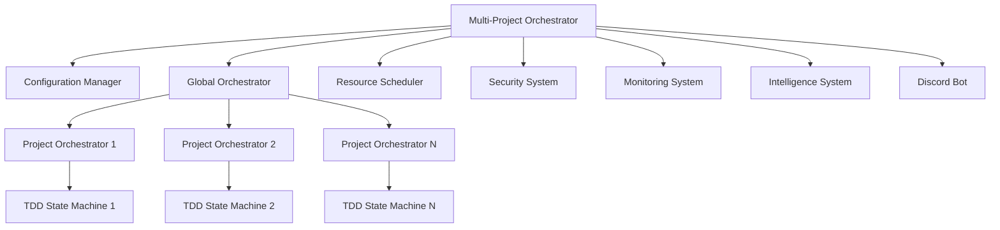

# Multi-Project Orchestration

The AI Agent TDD-Scrum workflow system now supports comprehensive multi-project orchestration, allowing you to manage multiple AI-assisted development projects simultaneously with intelligent resource allocation, security isolation, monitoring, and cross-project insights.

## Overview

Multi-project orchestration extends the single-project workflow system to handle multiple projects concurrently, providing:

- **Global Resource Management**: Intelligent allocation of CPU, memory, and agents across projects
- **Project Prioritization**: Priority-based scheduling and resource allocation
- **Security Isolation**: Project-level security boundaries and access control
- **Cross-Project Intelligence**: Pattern recognition and knowledge sharing between projects
- **Real-time Monitoring**: Comprehensive observability across all projects
- **Unified Management Interface**: Single command interface for all projects

## Architecture

The multi-project system consists of several integrated components:



### Core Components

1. **Multi-Project Orchestrator** (`scripts/multi_project_orchestrator.py`)
   - Unified entry point for the entire system
   - Coordinates all components and manages system lifecycle

2. **Configuration Manager** (`lib/multi_project_config.py`)
   - Manages global and project-specific configurations
   - Handles project discovery and registration

3. **Global Orchestrator** (`lib/global_orchestrator.py`)
   - Manages multiple project orchestrator subprocesses
   - Coordinates cross-project activities

4. **Resource Scheduler** (`lib/resource_scheduler.py`)
   - Intelligent resource allocation across projects
   - Supports multiple scheduling strategies

5. **Security System** (`lib/multi_project_security.py`)
   - User management and access control
   - Project isolation and security boundaries

6. **Monitoring System** (`lib/multi_project_monitoring.py`)
   - Real-time metrics collection and alerting
   - WebSocket-based live updates

7. **Intelligence System** (`lib/cross_project_intelligence.py`)
   - Pattern recognition across projects
   - Knowledge transfer recommendations

## Getting Started

### Installation

The multi-project system uses the same dependencies as the single-project system, with optional additions for enhanced functionality:

```bash
# Core dependencies (required)
pip install discord.py pygithub pyyaml pytest pytest-asyncio mkdocs-material

# Optional monitoring dependencies
pip install psutil websockets

# Optional visualization dependencies  
pip install prometheus_client grafana_api aiohttp
```

### Basic Setup

1. **Initialize Configuration**
   ```bash
   # Start the multi-project orchestrator
   python scripts/multi_project_orchestrator.py --discover .
   ```

2. **Register Projects**
   ```bash
   # Register specific projects
   python scripts/multi_project_orchestrator.py --register myproject /path/to/project
   ```

3. **Interactive Management**
   ```bash
   # Run interactive shell
   python scripts/multi_project_orchestrator.py --interactive
   ```

## Configuration

### Global Configuration

The global configuration is stored in `orch-config.yaml`:

```yaml
global:
  # Resource limits
  max_total_agents: 20
  max_concurrent_projects: 10
  global_cpu_cores: 4
  global_memory_limit_gb: 8
  global_disk_limit_gb: 50
  
  # Scheduling
  resource_allocation_strategy: fair_share  # fair_share, priority_based, dynamic
  scheduling_interval_seconds: 30
  resource_rebalance_interval_seconds: 300
  
  # Features
  enable_cross_project_insights: true
  enable_knowledge_sharing: true
  enable_pattern_learning: true
  enable_project_isolation: true
  
  # Storage
  global_state_path: .orch-global
  
  # Integration
  global_discord_guild: null
  monitoring_webhook_url: null
```

### Project Configuration

Each project has its own configuration section:

```yaml
projects:
  my-project:
    name: my-project
    path: /path/to/project
    priority: normal  # critical, high, normal, low
    status: active    # active, paused, maintenance, archived, initializing
    
    # Resource limits
    resource_limits:
      max_parallel_agents: 3
      max_parallel_cycles: 2
      max_memory_mb: 1024
      max_disk_mb: 2048
      cpu_priority: 1.0
    
    # AI settings
    ai_settings:
      auto_approve_low_risk: true
      require_human_review: false
      max_auto_retry: 3
      context_sharing_enabled: true
    
    # Schedule
    work_hours:
      timezone: UTC
      start: "09:00"
      end: "17:00"
      days: [monday, tuesday, wednesday, thursday, friday]
    
    # Integration
    discord_channel: null
    slack_channel: null
    team: []
    dependencies: []
```

## Resource Management

### Allocation Strategies

The system supports multiple resource allocation strategies:

#### Fair Share
Distributes resources equally among all active projects:
```yaml
resource_allocation_strategy: fair_share
```

#### Priority-Based
Allocates resources based on project priority:
```yaml
resource_allocation_strategy: priority_based
```

#### Dynamic
Automatically adjusts allocation based on actual usage:
```yaml
resource_allocation_strategy: dynamic
```

### Resource Quotas

Each project receives a resource quota based on:
- Global resource limits
- Project priority
- Current system load
- Historical usage patterns

```python
# Example resource allocation
{
    "project_name": "high-priority-project",
    "allocated_agents": 5,
    "allocated_memory_mb": 2048,
    "allocated_cpu_percent": 40.0,
    "priority_weight": 1.5
}
```

## Project Management

### Project Discovery

The system can automatically discover projects in your filesystem:

```bash
# Discover projects in current directory
python scripts/multi_project_orchestrator.py --discover .

# Discover in multiple paths
python scripts/multi_project_orchestrator.py --discover /path1 /path2 /path3
```

Discovery looks for:
- Existing `.orch-state` directories (orchestrated projects)
- Git repositories with development activity
- Common project structure patterns

### Manual Registration

Register projects manually with specific configuration:

```bash
# Basic registration
python scripts/multi_project_orchestrator.py --register myproject /path/to/project

# Interactive registration with full configuration
python scripts/multi_project_orchestrator.py --interactive
> register myproject /path/to/project
```

### Project Lifecycle

Projects have the following lifecycle states:

- **Initializing**: Project is being set up
- **Active**: Project is available for orchestration
- **Paused**: Project is temporarily suspended
- **Maintenance**: Project is undergoing maintenance
- **Archived**: Project is archived but configuration preserved

## Interactive Management

The interactive shell provides comprehensive project management:

```bash
python scripts/multi_project_orchestrator.py --interactive
```

### Available Commands

```
multi-orch> help
Available commands:
  help                    - Show this help message
  status [component]      - Show system status
  projects                - List all projects
  register <name> <path>  - Register a new project
  discover <paths...>     - Discover and register projects
  start <project>         - Start a project orchestrator
  stop <project>          - Stop a project orchestrator
  optimize                - Run resource optimization
  insights                - Show cross-project insights
  exit/quit               - Exit the shell
```

### Example Session

```bash
multi-orch> projects
📋 Registered Projects:
  🟢 frontend-app (🟠 high)
    Path: /home/user/projects/frontend-app
    Status: active
  🟢 backend-api (🟡 normal)
    Path: /home/user/projects/backend-api
    Status: active

multi-orch> status
🎛️  Multi-Project Orchestrator Status
Running: True
Startup Complete: True
Projects: 2
Active: 2

multi-orch> optimize
🔧 Resource Optimization Results:
  Time: 0.15s
  Changes: 3
  Strategy: dynamic
  Changes made:
    - Increased memory allocation for frontend-app by 512MB
    - Reduced CPU allocation for backend-api to 25%
    - Balanced agent distribution across projects

multi-orch> insights
🧠 Cross-Project Insights (5 found):
  📊 Common Testing Patterns
     Both projects use similar Jest configuration patterns
     Confidence: 85%

  📊 Shared Dependency Management
     npm/yarn lock files show similar dependency versions
     Confidence: 92%
```

## Monitoring and Observability

### Real-time Metrics

The monitoring system collects comprehensive metrics across all projects:

#### Project Metrics
- CPU and memory usage
- Active agents and TDD cycles
- Story progress and completion rates
- Error rates and build times

#### System Metrics
- Total resource utilization
- Cross-project pattern matches
- Security events and access patterns
- Performance and efficiency scores

### WebSocket Real-time Updates

Connect to the monitoring WebSocket for live updates:

```javascript
// Connect to monitoring WebSocket
const ws = new WebSocket('ws://localhost:8765');

ws.onmessage = (event) => {
    const data = JSON.parse(event.data);
    
    if (data.type === 'metric_update') {
        console.log('Metric update:', data.data);
    } else if (data.type === 'alert_update') {
        console.log('Alert:', data.data);
    }
};
```

### Alerts and Notifications

The system generates intelligent alerts based on:
- Resource usage thresholds
- Project health indicators
- Security events
- Performance anomalies

## Security and Isolation

### User Management

The security system provides comprehensive user management:

```python
# Create users with different access levels
security.create_user(
    username="developer",
    email="dev@company.com", 
    password="secure_password",
    global_access_level=AccessLevel.CONTRIBUTOR
)

# Grant project-specific access
security.grant_project_access("developer", "my-project", AccessLevel.MAINTAINER)
```

### Access Levels

- **OWNER**: Full system administration
- **ADMIN**: Multi-project management
- **MAINTAINER**: Project-level administration
- **CONTRIBUTOR**: Development access
- **VIEWER**: Read-only access

### Project Isolation

Projects are isolated using multiple mechanisms:

#### Process Isolation
Each project runs in its own subprocess with resource limits.

#### Filesystem Isolation
Projects have restricted filesystem access to their designated paths.

#### Network Isolation
Projects can be assigned to separate network namespaces.

#### Container Isolation
Projects can run in Docker containers for maximum isolation.

## Cross-Project Intelligence

### Pattern Recognition

The intelligence system automatically identifies patterns across projects:

```python
# Patterns detected include:
- Code architecture similarities
- Testing strategy patterns
- Dependency management approaches
- Development workflow similarities
- Performance optimization opportunities
```

### Knowledge Transfer

Based on detected patterns, the system recommends knowledge transfers:

```python
{
    "source_project": "backend-api",
    "target_project": "frontend-app", 
    "transfer_type": "optimization",
    "description": "API caching strategy from backend-api could improve frontend performance",
    "confidence": 0.87,
    "estimated_impact": "medium"
}
```

### Best Practices Sharing

The system learns and shares best practices across projects:

- Successful testing strategies
- Effective code organization patterns
- Performance optimization techniques
- Security implementation patterns

## Discord Integration

### Multi-Project Bot Commands

The enhanced Discord bot provides multi-project management:

```
/global_status          - Show global orchestration status
/project_list           - List all registered projects
/project_start <name>   - Start a specific project
/project_stop <name>    - Stop a specific project
/resource_status        - Show resource allocation
/insights               - Show cross-project insights
```

### Project-Specific Channels

Each project can have its own Discord channel for focused communication:

```yaml
projects:
  my-project:
    discord_channel: "#my-project-dev"
```

## Performance and Scaling

### Resource Optimization

The system continuously optimizes resource allocation:

- **Predictive Scaling**: Anticipates resource needs based on project patterns
- **Load Balancing**: Distributes work across available resources
- **Efficiency Monitoring**: Tracks and improves resource utilization

### Scaling Considerations

#### Horizontal Scaling
- Add more CPU cores and memory for increased project capacity
- Distribute projects across multiple machines (future enhancement)

#### Vertical Scaling
- Optimize individual project resource usage
- Improve agent efficiency and cycle times

### Performance Metrics

Monitor system performance with key metrics:

```python
{
    "resource_efficiency": 0.87,      # How well resources are utilized
    "average_cycle_time_hours": 2.3,  # Average TDD cycle completion time
    "cross_project_insights": 15,     # Number of insights generated
    "total_stories_completed": 42,    # Stories completed across all projects
    "system_health_score": 0.92       # Overall system health (0.0-1.0)
}
```

## Troubleshooting

### Common Issues

#### Resource Allocation Failures
```bash
# Check resource allocation status
python scripts/multi_project_orchestrator.py --status

# Run optimization
python scripts/multi_project_orchestrator.py --interactive
> optimize
```

#### Project Start Failures
```bash
# Check project configuration
python scripts/multi_project_orchestrator.py --interactive
> projects

# Verify project paths and permissions
ls -la /path/to/project/.orch-state/
```

#### Monitoring Connection Issues
```bash
# Check if monitoring system is running
curl http://localhost:8765/status

# Restart monitoring system
python scripts/multi_project_orchestrator.py --no-intelligence --no-discord
```

### Debug Mode

Enable debug logging for detailed troubleshooting:

```bash
python scripts/multi_project_orchestrator.py --debug --interactive
```

### Log Analysis

System logs are organized by component:

```
.orch-global/
├── logs/
│   ├── global-orchestrator.log
│   ├── resource-scheduler.log
│   ├── security.log
│   ├── monitoring.log
│   └── intelligence.log
└── status/
    ├── system-health.json
    └── performance-metrics.json
```

## Best Practices

### Project Organization

1. **Use Consistent Structure**: Maintain similar project layouts for better pattern recognition
2. **Set Appropriate Priorities**: Use priority levels to ensure critical projects get resources
3. **Configure Work Hours**: Set realistic work schedules to optimize resource allocation
4. **Enable Context Sharing**: Allow cross-project learning when projects are related

### Resource Management

1. **Monitor Usage Patterns**: Review resource utilization regularly
2. **Adjust Allocations**: Update resource limits based on actual needs
3. **Use Dynamic Scaling**: Enable dynamic allocation for better efficiency
4. **Plan for Peak Loads**: Reserve resources for high-priority work periods

### Security

1. **Regular Access Reviews**: Audit user access permissions periodically
2. **Project Isolation**: Use appropriate isolation levels for sensitive projects
3. **Secure Credentials**: Use environment variables for sensitive configuration
4. **Audit Logging**: Enable audit logging for compliance and security monitoring

### Performance

1. **Optimize Cycle Times**: Focus on reducing TDD cycle completion times
2. **Balance Workloads**: Distribute work evenly across available resources
3. **Monitor Health Scores**: Track system health and address issues promptly
4. **Leverage Insights**: Act on cross-project intelligence recommendations

## Advanced Configuration

### Custom Scheduling Strategies

Implement custom resource allocation strategies:

```python
class CustomSchedulingStrategy(SchedulingStrategy):
    def calculate_allocation(self, projects, total_resources):
        # Custom allocation logic
        pass
```

### Integration with External Systems

Connect to external monitoring and management systems:

```yaml
global:
  monitoring_webhook_url: "https://your-monitoring-system.com/webhook"
  external_metrics_endpoint: "https://metrics.company.com/api"
```

### Advanced Security Configuration

Configure advanced security features:

```yaml
global:
  security:
    encryption_at_rest: true
    audit_log_retention_days: 90
    require_2fa: true
    session_timeout_minutes: 480
```

## Future Enhancements

The multi-project orchestration system is designed for extensibility. Planned enhancements include:

- **Distributed Orchestration**: Multi-machine project distribution
- **Advanced AI Integration**: GPT-4 powered project optimization
- **Cloud Integration**: AWS/Azure/GCP resource provisioning
- **Advanced Analytics**: Machine learning for pattern recognition
- **GitOps Integration**: Git-based configuration and deployment

## Support and Community

For support with multi-project orchestration:

1. **Documentation**: Review this guide and the main project documentation
2. **Issues**: Report bugs and feature requests on GitHub
3. **Discussions**: Join community discussions for best practices
4. **Contributing**: Contribute improvements and extensions

The multi-project orchestration system represents a significant advancement in AI-assisted development, providing the tools and intelligence needed to manage complex, multi-project development workflows efficiently and effectively.