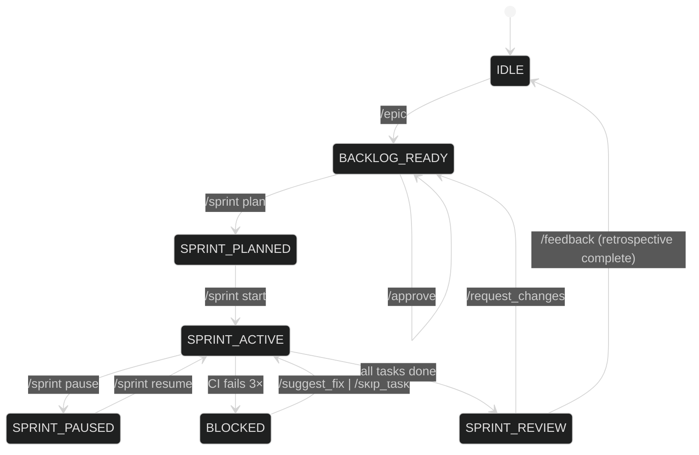
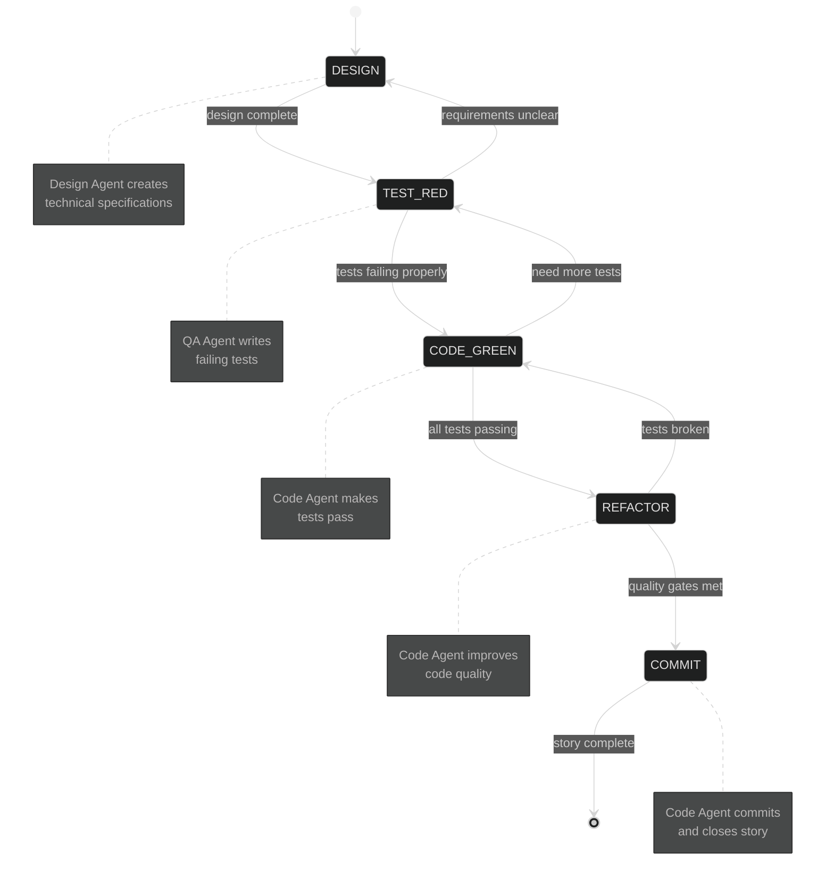
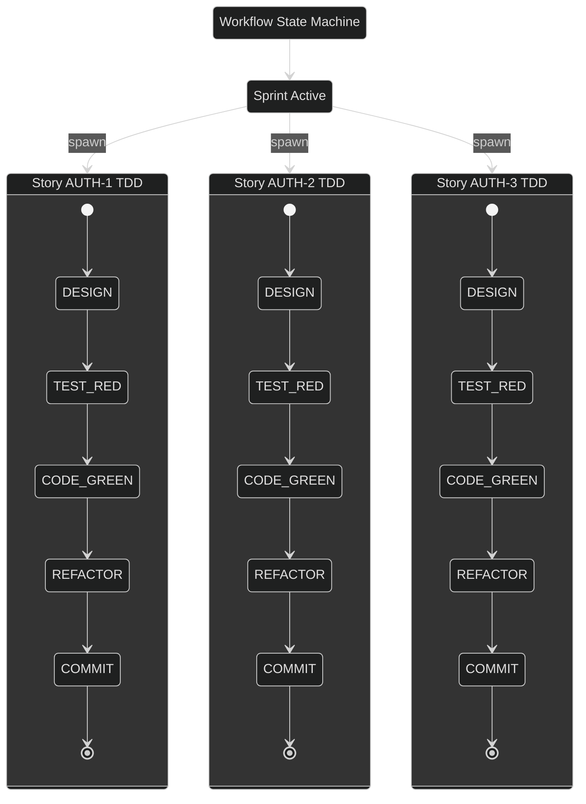
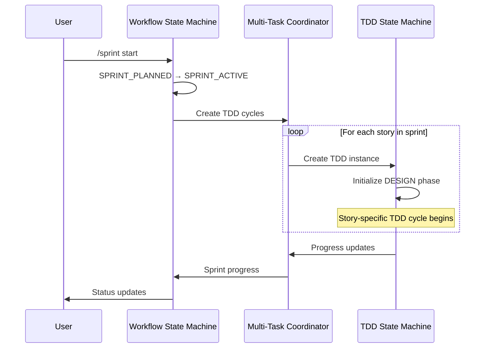

# Dual State Machine Architecture

_This document formalizes the dual state machine system: the primary Workflow State Machine for Scrum coordination and the secondary TDD State Machines for individual story implementation._

---

## 1. Primary Workflow State Machine

### Top-Level States
| Key | State Name | Description |
| --- | ----------- | ----------- |
| **IDLE** | Idle / Awaiting Vision | No epic defined; waiting for `/epic` or backlog grooming. |
| **BACKLOG_READY** | Backlog Ready | Stories exist in the product backlog, none selected for sprint. |
| **SPRINT_PLANNED** | Sprint Planned | A sprint backlog has been drafted but not started. |
| **SPRINT_ACTIVE** | Sprint Active | Agents are working on tasks. |
| **SPRINT_PAUSED** | Sprint Paused | Active sprint is temporarily halted. |
| **SPRINT_REVIEW** | Sprint Review | Sprint tasks done; PR awaiting user review. |
| **BLOCKED** | Blocked Task | Sprint task failed CI 3× and awaits user input. (_Sub-state of `SPRINT_ACTIVE`_.)|

---

### Workflow Command → State Matrix

| Command | Allowed in States | Resulting State |
|---------|-------------------|-----------------|
| `/epic` | IDLE, BACKLOG_READY | BACKLOG_READY |
| `/approve` | BACKLOG_READY | BACKLOG_READY |
| `/backlog *` | Any (except SPRINT_REVIEW locked) | (no change) |
| `/sprint plan` | BACKLOG_READY | SPRINT_PLANNED |
| `/sprint start` | SPRINT_PLANNED | SPRINT_ACTIVE |
| `/sprint status` | SPRINT_ACTIVE, SPRINT_PAUSED, BLOCKED | (no change) |
| `/sprint pause` | SPRINT_ACTIVE | SPRINT_PAUSED |
| `/sprint resume` | SPRINT_PAUSED | SPRINT_ACTIVE |
| `/request_changes` | SPRINT_REVIEW | BACKLOG_READY |
| `/suggest_fix` | BLOCKED | SPRINT_ACTIVE |
| `/skip_task` | BLOCKED | SPRINT_ACTIVE (next task) |
| `/feedback` | SPRINT_REVIEW | IDLE |

*Commands issued outside their **Allowed States** trigger an error response (see §4).*  
*`/backlog` commands are always safe but may show different context (product vs sprint).*  
*`BLOCKED` is transient: once the user responds the orchestrator returns to `SPRINT_ACTIVE` or skips forward.*

---

### Primary Workflow State Diagram



---

## 2. Secondary TDD State Machines

### TDD States per Story
When the primary state machine enters `SPRINT_ACTIVE`, individual TDD state machines are created for each story in the sprint.

| Key | State Name | Description |
| --- | ----------- | ----------- |
| **DESIGN** | Design Phase | Design Agent creates technical specifications and architecture. |
| **TEST_RED** | Test Red Phase | QA Agent writes failing tests based on design specifications. |
| **CODE_GREEN** | Code Green Phase | Code Agent implements minimal code to make all tests pass. |
| **REFACTOR** | Refactor Phase | Code Agent improves code quality while maintaining green tests. |
| **COMMIT** | Commit Phase | Code Agent commits changes and completes the story. |

### TDD Command → State Matrix

| Command | Allowed in States | Resulting State |
|---------|-------------------|-----------------|
| `/tdd start <ID>` | Any (auto-started from SPRINT_ACTIVE) | DESIGN |
| `/tdd status [ID]` | Any TDD state | (no change) |
| `/tdd design_complete <ID>` | DESIGN | TEST_RED |
| `/tdd tests_ready <ID>` | TEST_RED | CODE_GREEN |
| `/tdd code_green <ID>` | CODE_GREEN | REFACTOR |
| `/tdd refactor_done <ID>` | REFACTOR | COMMIT |
| `/tdd review_cycle <ID>` | Any TDD state | (pause for review) |
| `/tdd skip_phase <ID>` | Any TDD state | (next phase) |
| `/tdd pause <ID>` | Any active TDD state | (paused) |
| `/tdd resume <ID>` | Paused TDD state | (previous state) |

### TDD State Diagram



### Parallel TDD Execution

Multiple TDD state machines run simultaneously during an active sprint:



## 3. State Machine Interactions

### Primary to Secondary Activation

When the primary state machine transitions to `SPRINT_ACTIVE`, it triggers the creation of TDD state machines:



### Cross-State Machine Commands

Some commands affect both state machines:

| Command | Primary Effect | Secondary Effect |
|---------|----------------|------------------|
| `/sprint pause` | SPRINT_ACTIVE → SPRINT_PAUSED | Pause all TDD cycles |
| `/sprint resume` | SPRINT_PAUSED → SPRINT_ACTIVE | Resume all TDD cycles |
| `/sprint status` | Show sprint progress | Show TDD cycle status |
| `/state` | Show workflow state | Show active TDD states |

---

## 4. Standardised Error & Hint Response
When a user issues an invalid command for the current state, the orchestrator must reply with:

```json
{
  "type": "error",
  "code": "INVALID_STATE",
  "current_state": "SPRINT_ACTIVE",
  "command": "/sprint plan",
  "allowed_in": ["BACKLOG_READY"],
  "hint": "Sprint already active. Use /sprint status or /sprint pause instead."
}
```

In Discord this is rendered as:
> ⚠️ Command `/sprint plan` is not allowed now (state: **SPRINT_ACTIVE**). Try `/sprint status` or `/sprint pause`.

---

## 5. Implementation Notes
1. Maintain state in orchestrator memory / lightweight DB keyed by guild or workspace.
2. Expose a `/state` debug command (admin-only) to dump current finite-state and backlog summary.
3. Unit-test the state machine with a table-driven test: `(state, command) → expected`.
4. Extend easily: add columns/rows to matrix and diagram.

_This state machine keeps user interactions predictable and provides immediate, actionable feedback when mis-ordered commands occur._ 