# Dual State Machine Architecture

_This document formalizes the dual state machine system: the primary Workflow State Machine for Scrum coordination and the secondary TDD State Machines for individual story implementation._

---

## 1. Primary Workflow State Machine

### Top-Level States
| Key | State Name | Description |
| --- | ----------- | ----------- |
| **IDLE** | Idle / Awaiting Vision | No epic defined; waiting for `/epic` or backlog grooming. |
| **BACKLOG_READY** | Backlog Ready | Stories exist in the product backlog, none selected for sprint. |
| **SPRINT_PLANNED** | Sprint Planned | A sprint backlog has been drafted but not started. |
| **SPRINT_ACTIVE** | Sprint Active | Agents are working on tasks. |
| **SPRINT_PAUSED** | Sprint Paused | Active sprint is temporarily halted. |
| **SPRINT_REVIEW** | Sprint Review | Sprint tasks done; PR awaiting user review. |
| **BLOCKED** | Blocked Task | Sprint task failed CI 3× and awaits user input. (_Sub-state of `SPRINT_ACTIVE`_.)|

---

### Workflow Command → State Matrix

| Command | Allowed in States | Resulting State |
|---------|-------------------|-----------------|
| `/epic` | IDLE, BACKLOG_READY | BACKLOG_READY |
| `/approve` | BACKLOG_READY | BACKLOG_READY |
| `/backlog *` | Any (except SPRINT_REVIEW locked) | (no change) |
| `/sprint plan` | BACKLOG_READY | SPRINT_PLANNED |
| `/sprint start` | SPRINT_PLANNED | SPRINT_ACTIVE |
| `/sprint status` | SPRINT_ACTIVE, SPRINT_PAUSED, BLOCKED | (no change) |
| `/sprint pause` | SPRINT_ACTIVE | SPRINT_PAUSED |
| `/sprint resume` | SPRINT_PAUSED | SPRINT_ACTIVE |
| `/request_changes` | SPRINT_REVIEW | BACKLOG_READY |
| `/suggest_fix` | BLOCKED | SPRINT_ACTIVE |
| `/skip_task` | BLOCKED | SPRINT_ACTIVE (next task) |
| `/feedback` | SPRINT_REVIEW | IDLE |

*Commands issued outside their **Allowed States** trigger an error response (see §4).*  
*`/backlog` commands are always safe but may show different context (product vs sprint).*  
*`BLOCKED` is transient: once the user responds the orchestrator returns to `SPRINT_ACTIVE` or skips forward.*

---

### Primary Workflow State Diagram

```mermaid
%%{init: {'theme': 'dark'}}%%
stateDiagram-v2
    [*] --> IDLE
    IDLE --> BACKLOG_READY : /epic
    BACKLOG_READY --> BACKLOG_READY : /approve
    BACKLOG_READY --> SPRINT_PLANNED : /sprint plan
    SPRINT_PLANNED --> SPRINT_ACTIVE : /sprint start
    SPRINT_ACTIVE --> SPRINT_PAUSED : /sprint pause
    SPRINT_PAUSED --> SPRINT_ACTIVE : /sprint resume
    SPRINT_ACTIVE --> BLOCKED : CI fails 3×
    BLOCKED --> SPRINT_ACTIVE : /suggest_fix | /skip_task
    SPRINT_ACTIVE --> SPRINT_REVIEW : all tasks done (TDD complete)
    SPRINT_REVIEW --> BACKLOG_READY : /request_changes
    SPRINT_REVIEW --> IDLE : /feedback (retrospective complete)
    
    note right of SPRINT_ACTIVE : TDD cycles coordination
    note right of SPRINT_REVIEW : Requires TDD completion
```



---

## 2. Secondary TDD State Machines

### TDD States per Story
When the primary state machine enters `SPRINT_ACTIVE`, individual TDD state machines are created for each story in the sprint.

| Key | State Name | Description |
| --- | ----------- | ----------- |
| **DESIGN** | Design Phase | Design Agent creates technical specifications and architecture. |
| **TEST_RED** | Test Red Phase | QA Agent writes failing tests based on design specifications. |
| **CODE_GREEN** | Code Green Phase | Code Agent implements minimal code to make all tests pass. |
| **REFACTOR** | Refactor Phase | Code Agent improves code quality while maintaining green tests. |
| **COMMIT** | Commit Phase | Code Agent commits changes and completes the story. |

### TDD Command → State Matrix

| Command | Allowed in States | Resulting State |
|---------|-------------------|-----------------|
| `/tdd start <ID>` | Any (auto-started from SPRINT_ACTIVE) | DESIGN |
| `/tdd status [ID]` | Any TDD state | (no change) |
| `/tdd design_complete <ID>` | DESIGN | TEST_RED |
| `/tdd tests_ready <ID>` | TEST_RED | CODE_GREEN |
| `/tdd code_green <ID>` | CODE_GREEN | REFACTOR |
| `/tdd refactor_done <ID>` | REFACTOR | COMMIT |
| `/tdd review_cycle <ID>` | Any TDD state | (pause for review) |
| `/tdd skip_phase <ID>` | Any TDD state | (next phase) |
| `/tdd pause <ID>` | Any active TDD state | (paused) |
| `/tdd resume <ID>` | Paused TDD state | (previous state) |

### TDD State Diagram


### Parallel TDD Execution

Multiple TDD state machines run simultaneously during an active sprint:


## 3. State Machine Interactions

### Primary to Secondary Activation

When the primary state machine transitions to `SPRINT_ACTIVE`, it triggers the creation of TDD state machines:


### Cross-State Machine Commands

Some commands affect both state machines:

| Command | Primary Effect | Secondary Effect |
|---------|----------------|------------------|
| `/sprint pause` | SPRINT_ACTIVE → SPRINT_PAUSED | Pause all TDD cycles |
| `/sprint resume` | SPRINT_PAUSED → SPRINT_ACTIVE | Resume all TDD cycles |
| `/sprint status` | Show sprint progress | Show TDD cycle status |
| `/state` | Show workflow state | Show active TDD states |

---

## 4. Standardised Error & Hint Response
When a user issues an invalid command for the current state, the orchestrator must reply with:

```json
{
  "type": "error",
  "code": "INVALID_STATE",
  "current_state": "SPRINT_ACTIVE",
  "command": "/sprint plan",
  "allowed_in": ["BACKLOG_READY"],
  "hint": "Sprint already active. Use /sprint status or /sprint pause instead."
}
```

In Discord this is rendered as:
> ⚠️ Command `/sprint plan` is not allowed now (state: **SPRINT_ACTIVE**). Try `/sprint status` or `/sprint pause`.

---

## 5. Real-time State Broadcasting and Visualization

### WebSocket Integration

The enhanced state machine provides real-time updates through WebSocket broadcasting:

```python
# Automatic state transition broadcasting
def transition(self, command: str, project_name: str = "default") -> CommandResult:
    result = self.validate_command(command)
    
    if result.success and result.new_state:
        old_state = self.current_state
        self.current_state = result.new_state
        
        # Emit real-time transition for visualization
        emit_workflow_transition(old_state, self.current_state, project_name)
```

### Real-time Event Types

| Event Type | Description | Payload |
|------------|-------------|---------|
| `workflow_transition` | Primary state machine transitions | `{old_state, new_state, project_name, timestamp}` |
| `tdd_transition` | TDD cycle state changes | `{cycle_id, story_id, old_state, new_state, agent_type}` |
| `agent_activity` | Agent execution events | `{agent_type, action, status, duration}` |
| `state_update` | Full state synchronization | `{workflow_state, active_cycles, system_status}` |

### Live Visualization

Access the real-time state visualizer at: **http://localhost:5000**

```bash
# Start the state visualizer
cd tools/visualizer
python app.py --host 0.0.0.0 --port 5000
```

The visualizer provides:
- **Live State Diagrams**: Real-time highlighting of current states
- **TDD Cycle Tracking**: Visual representation of parallel TDD execution
- **Activity Log**: Chronological event stream with filtering
- **Connection Status**: WebSocket connection monitoring

---

## 6. State Transition History and Recovery

### Transition History Tracking

The state machine maintains a comprehensive audit trail:

```python
def _track_transition_minimal(self, old_state: State, new_state: State, command: str):
    self._transition_history.append({
        "timestamp": datetime.now().isoformat(),
        "from": old_state.value,
        "to": new_state.value,
        "command": command
    })
```

### Recovery Mechanisms

#### Automatic Recovery Options

```python
def get_recovery_options(self) -> List[Dict]:
    """Get available recovery options based on state history"""
    # Returns unique recent states as recovery options
    return [
        {"state": "SPRINT_ACTIVE", "timestamp": "2024-01-15T10:30:00", "reason": "recover_from_/sprint_pause"},
        {"state": "BACKLOG_READY", "timestamp": "2024-01-15T09:15:00", "reason": "recover_from_/epic"}
    ]
```

#### Manual State Recovery

For emergency situations, manual state recovery is available:

```python
# Force state transition with audit trail
state_machine.force_state(State.SPRINT_ACTIVE, reason="ci_recovery")
```

### State Audit Trail

Access transition history via the `/state` command:

```json
{
  "current_state": "SPRINT_ACTIVE",
  "recent_transitions": [
    {"timestamp": "2024-01-15T10:30:00", "from": "SPRINT_PLANNED", "to": "SPRINT_ACTIVE", "command": "/sprint start"},
    {"timestamp": "2024-01-15T10:25:00", "from": "BACKLOG_READY", "to": "SPRINT_PLANNED", "command": "/sprint plan"}
  ],
  "recovery_options": [...]
}
```

---

## 7. Context-Aware Validation and TDD Constraints

### Context-Aware State Transitions

The state machine now validates transitions based on contextual information:

```python
def _validate_transition_context(self, command: str, target_state: State, context: Dict) -> CommandResult:
    # TDD cycle constraints
    if target_state in [State.SPRINT_REVIEW, State.IDLE] and self.has_active_tdd_cycles():
        return CommandResult(
            success=False,
            error_message=f"Cannot transition to {target_state.value} with active TDD cycles",
            hint="Complete active TDD cycles or use force_transition=True"
        )
    
    # CI status constraints
    if target_state == State.SPRINT_ACTIVE and context.get("ci_status") == "failing":
        return CommandResult(
            success=False,
            error_message="Cannot start sprint with failing CI",
            hint="Fix CI failures before starting sprint"
        )
```

### TDD Integration Constraints

#### Sprint-TDD Lifecycle Coordination

The state machine enforces proper coordination between sprint and TDD states:

| Sprint State | TDD Constraint | Enforcement |
|-------------|----------------|-------------|
| `SPRINT_ACTIVE` | Can have active TDD cycles | ✅ Normal operation |
| `SPRINT_PAUSED` | TDD cycles paused | 🟡 Automatic pause |
| `SPRINT_REVIEW` | No active TDD cycles | ❌ Blocks transition |
| `IDLE` | No active TDD cycles | ❌ Blocks transition |

#### Context Validation Examples

```python
# Uncommitted changes constraint
if command == "/sprint start" and context.get("has_uncommitted_changes", False):
    return CommandResult(
        success=False,
        error_message="Cannot start sprint with uncommitted changes",
        hint="Commit or stash pending changes before starting sprint"
    )

# Active TDD cycles constraint
if target_state == State.SPRINT_REVIEW and self.has_active_tdd_cycles():
    active_cycles = list(self.active_tdd_cycles.values())
    return CommandResult(
        success=False,
        error_message=f"Cannot transition to SPRINT_REVIEW with active TDD cycles: {active_cycles}",
        hint="Complete or abort active TDD cycles before sprint review"
    )
```

---

## 8. Enhanced State Machine Features

### TDD Cycle Management Integration

```python
class StateMachine:
    def __init__(self, initial_state: State = State.IDLE):
        self.active_tdd_cycles: Dict[str, str] = {}  # story_id -> cycle_id mapping
        self.tdd_transition_listeners: List[callable] = []
    
    def register_tdd_cycle(self, story_id: str, cycle_id: str) -> None:
        """Register an active TDD cycle for a story"""
        self.active_tdd_cycles[story_id] = cycle_id
    
    def unregister_tdd_cycle(self, story_id: str) -> None:
        """Unregister a TDD cycle when complete"""
        if story_id in self.active_tdd_cycles:
            cycle_id = self.active_tdd_cycles.pop(story_id)
```

### Advanced State Information

```python
def get_state_info(self, include_matrix: bool = False) -> Dict:
    return {
        "current_state": self.current_state.value,
        "allowed_commands": self.get_allowed_commands(),
        "tdd_integration": {
            "active_cycles": len(self.active_tdd_cycles),
            "cycle_ids": list(self.active_tdd_cycles.keys()),
            "can_transition_to_review": not self.has_active_tdd_cycles()
        },
        "state_flags": {
            "is_terminal": self.is_terminal_state(),
            "can_auto_progress": self.can_auto_progress(),
            "has_active_work": bool(self.active_tdd_cycles)
        }
    }
```

### Terminal State Detection

```python
def is_terminal_state(self) -> bool:
    """Check if current state requires external input to progress"""
    return self.current_state in [State.BLOCKED, State.SPRINT_REVIEW]

def can_auto_progress(self) -> bool:
    """Check if state machine can automatically progress"""
    return self.current_state in [State.SPRINT_ACTIVE]
```

---

## 9. Performance and Monitoring

### State Transition Metrics

The enhanced state machine tracks performance metrics:

- **Transition Latency**: Time between command and state change
- **TDD Cycle Duration**: Time spent in each TDD phase
- **Error Rate**: Frequency of invalid command attempts
- **Recovery Usage**: How often state recovery is needed

### Real-time Dashboard Integration

State metrics are available through the visualizer dashboard:

```bash
# Access metrics endpoint
curl http://localhost:5000/api/state
```

**Response:**
```json
{
  "workflow_state": "SPRINT_ACTIVE",
  "active_tdd_cycles": 3,
  "state_metrics": {
    "total_transitions": 42,
    "error_rate": 0.05,
    "avg_transition_time": "0.15s"
  },
  "system_health": "healthy"
}
```

---

## 10. Implementation Notes

### Core Implementation
1. **State Persistence**: Maintain state in `.orch-state/status.json` with version control integration
2. **Real-time Broadcasting**: WebSocket integration for live visualization and monitoring
3. **Context Integration**: Intelligent validation using project context and CI status
4. **Error Recovery**: Comprehensive error handling with automatic retry and manual recovery
5. **Testing**: Table-driven tests with context scenarios: `(state, command, context) → expected`

### Extension Points
1. **Custom Validators**: Add context-aware validation rules
2. **State Listeners**: Register callbacks for state change events  
3. **Recovery Strategies**: Implement custom recovery mechanisms
4. **Metrics Collection**: Add custom performance tracking

### Integration Patterns
```python
# State machine with context awareness
state_machine = StateMachine()
context = {"ci_status": "passing", "has_uncommitted_changes": False}
result = state_machine.validate_command("/sprint start", context)

# Real-time visualization integration
emit_workflow_transition(old_state, new_state, project_name)

# TDD cycle coordination
state_machine.register_tdd_cycle("AUTH-1", "cycle-abc123")
```

_The enhanced state machine provides predictable user interactions, real-time monitoring, intelligent context validation, and comprehensive audit trails for robust workflow management._ 